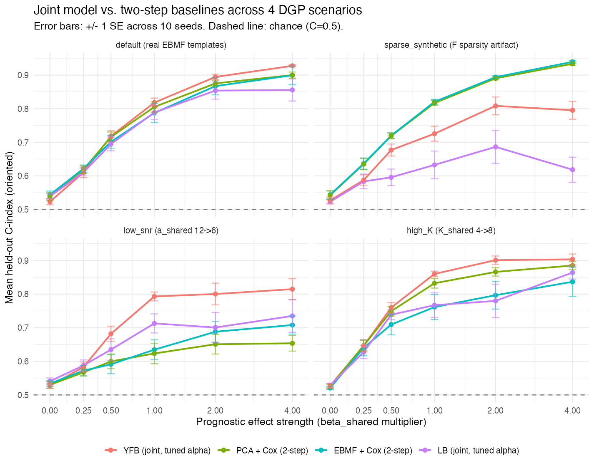

# July 15, 2026

```{r setup}
library(knitr); library(dplyr)
BM  <- "../../../results/benchmark_sim/outputs"
MCS <- "../../../results/multi_cohort_sim/outputs"
rd  <- function(p) if (file.exists(p)) read.csv(p, stringsAsFactors = FALSE) else NULL

desurv <- rd(file.path(BM, "desurv_comparison", "desurv_comparison_results.csv"))
ext_ci <- rd(file.path(BM, "desurv_comparison", "external_cindex_ci.csv"))
mc     <- rd(file.path(MCS, "multicohort_sim_results.csv"))
rec_mean <- if (!is.null(desurv)) round(mean(desurv$c_index[desurv$model == "D4"]), 3) else 0.627
```

Recommended model is unchanged since the 6/18 meeting: **YFB** ($\eta = (YF)\hat\beta$),
DeSurv-aligned gene selection, $K=7$ latent programs, no cohort indicator. Nothing new to decide
on model choice this cycle; the work below is corrections and stress-tests of that same model.

## Method updates

Two things changed under the hood, neither of which changes which model we recommend:

- **Objective cleanup.** Dropped the redundant $\lambda$ mixing weight between the genomics and
  survival halves of the objective. $\alpha$ already does that job, so $\lambda$ had no remaining function.
  For YFB this had **no effect on the fitted model**: its genomics loadings ($L$) and its survival
  coefficients ($\beta$) don't share a coordinate that needs rebalancing, so there was nothing for
  $\lambda$ to actually trade off. Separately, this cleanup caught a **train/test preprocessing
  bug**: external cohorts were being rank-transformed while the training set was per-platform
  z-standardized (the two are supposed to match). Fixing it moved the headline C-index from an
  earlier 0.636 to **`r rec_mean`**, a correction rather than a regression.
- **Optional per-study baseline hazard.** Added a `strata(study)` option to the Cox partial
  likelihood, so each cohort can have its own baseline hazard instead of sharing one. Tested it and
  found it performance-neutral (0.6267 to 0.6263), so it's available but left off by default.

## Results updates

**How many of the 7 factors actually matter for survival?** Cross-validation still picks $K=7$,
but only **2 of those 7 have a nonzero survival coefficient** ($K_{\text{eff}}=2$). Two different
ways of checking this, warm-starting a smaller fit from the converged $K=7$ solution and a joint
search over $K$ and $\alpha$ together, both land back on $K_{\text{eff}}=2$. $K=7$ stays the
default because it's the one you get from a single fit with no extra steps; $K=4$ or $K=5$ get you
statistically the same performance but need a warm-start procedure to reach it.

**Does the joint model actually need the survival coupling, or would factorizing first and fitting
Cox after work just as well?** Note this is a different knob from the $\alpha$ weighting in the
Method updates above. $\alpha$ balances the genomics and survival terms *in the objective we fit*.
Here, instead, we control the *data-generating process*: in simulation, the true survival
coefficients used to generate each patient's survival time (not anything estimated by either model)
are scaled by a multiplicative factor, run from 0 (no true prognostic effect) up to a realistic
magnitude, and at each setting we compare the joint model against a two-step (factorize, then Cox)
baseline:

```{r sweep-fig, fig.cap="Held-out C-index as the true simulated survival coefficients are scaled up from 0. At a scaling factor of 0 there is no real prognostic signal to detect; as the factor increases, the joint model's advantage over the two-step baseline widens."}

```

At a scaling factor of 0 (no true survival coefficients), joint and two-step are indistinguishable
(both near chance, as they should be, since there's nothing to detect). As the scaling factor increases,
the joint model's C-index increasingly exceeds the two-step baseline's, in 3 of 4 simulation designs we tried. The fourth design (loadings that
are exactly sparse and symmetric across factors) reverses this, but that's a known factor-collapse
failure mode in that specific design, not evidence against survival-coupling in general.

**Shared vs. cohort-specific prognostic factors**, using the same simulation framework, varying how much of
the true survival signal is shared across cohorts vs. specific to one:

```{r mc-table}
if (!is.null(mc)) {
  lab <- c(all_shared = "All prognostic factors shared across cohorts",
           hybrid = "Some shared, some cohort-specific",
           nothing_shared = "No shared prognostic factors")
  rows <- lapply(names(lab), function(s) data.frame(
    Scenario = lab[[s]],
    `Joint (YFB)` = round(mean(mc$c_index[mc$scenario == s & mc$arm == "YFB_base"]), 3),
    `Two-step (EBMF + Cox)` = round(mean(mc$c_index[mc$scenario == s & mc$arm == "EBMF"]), 3),
    check.names = FALSE))
  knitr::kable(do.call(rbind, rows), row.names = FALSE,
                caption = "Held-out C-index by cross-cohort factor structure (mean of 5 seeds).")
}
```

When nothing is shared, the two approaches tie, as expected, since there's no cross-cohort structure
for the joint model to exploit. In the realistic middle case (some factors shared, some not), the
joint model wins, and more through **stability** than raw accuracy: the two-step baseline collapses
outright on 2 of 5 seeds, which lowers its mean; the joint model stays stable across all 5 and also
correctly sorts which factors are shared vs. cohort-specific.

**Real data.** Same recommended model, evaluated on 5 held-out PDAC cohorts it never saw during
training:

```{r ext-table}
if (!is.null(ext_ci)) {
  d4 <- ext_ci %>% filter(model == "YFB (recommended)") %>% arrange(desc(c_index)) %>%
    mutate(`95% CI` = sprintf("(%.3f, %.3f)", ci_lo, ci_hi)) %>%
    select(cohort, c_index, `95% CI`)
  names(d4)[1:2] <- c("Held-out cohort", "C-index")
  knitr::kable(d4, row.names = FALSE, digits = 3,
                caption = sprintf("External validation, bootstrap 95%% CI (mean = %.3f).", rec_mean))
}
```

4 of 5 cohorts clear chance (CI lower bound above 0.5). Moffitt (microarray) does not (CI
0.467–0.625). We'd flagged this qualitatively before; this is the first time it's quantified.
Against the two-step baseline on the same 5 cohorts, a paired bootstrap gives the joint model a
significant edge pooled across all cohorts: **+0.042 (95% CI 0.013–0.071)**. Looking cohort by
cohort, only the largest one (Puleo, $n=288$) reaches significance on its own. The other four all
point the same direction but don't have the sample size to confirm it individually.

**Biological identity of the 2 survival-active programs.** Confirmed by five independent methods
(gene-set enrichment, PurIST subtype correlation, external hazard ratios, DeSurv gene-list overlap):

```{r bio-fig, fig.cap="Enrichment of the two survival-active programs against curated PDAC gene sets."}
knitr::include_graphics("../figs/2026-07-15_pathway_enrichment_dotplot.png")
```

Program 7 is the adverse one (basal-like / squamous / MET-EGFR-driven); Program 3 is protective
(classical / differentiated-epithelial). This is the subtype-survival axis the field already
expects for PDAC, which is reassuring rather than novel; it tells us the model recovered something
real, not that we've found something new.

## Relevance of new findings

The corrected 0.627 and the $K_{\text{eff}}=2$ result both point the same direction: the model is
doing something narrower than originally proposed, and the numbers hold up across several
independent checks, not just the one fit we ran. SBMF is best described as a **Bayesian
counterpart to DeSurv**: same modeling setup and scoring, our version adds shrinkage priors,
posterior uncertainty, and a per-gene noise model. This is not a claim that we already beat DeSurv
directly. A matched, same-protocol comparison against DeSurv is the natural next step to make that
claim, one way or the other.

## Open items to address

- Factor-stability across random seeds hasn't been characterized yet: do we get the same 2 active
  programs if we refit from a different starting point?
- The alternative parameterization (LB, $\eta = L\hat\beta$) still shows the factor-collapse
  sensitivity the recommended YFB model does not. Worth understanding why, even though it's not
  the model we're recommending.
- A spike-and-slab prior on $\beta$ collapses under cross-validation; we're keeping the normal
  prior, which is the right call for now but worth a sentence of justification if asked.
- Backlog, not yet started: automated commit review, literature database (RAG), HPC workflow
  support, and a review of how DeSurv constructs its own simulations (to make sure a future
  head-to-head is apples-to-apples).

## Deep dive

- Full write-up with all figures and the per-item disposition of 6/18 feedback:
  [`ssbmf_progress_report_07_15_26`](../../../reports/ssbmf_progress_report_07_15_26.html)
- Pathway enrichment methodology and all five confirmation methods in detail:
  [`pathway_enrichment_report_07_15_26`](../../../reports/pathway_enrichment_report_07_15_26.html)
