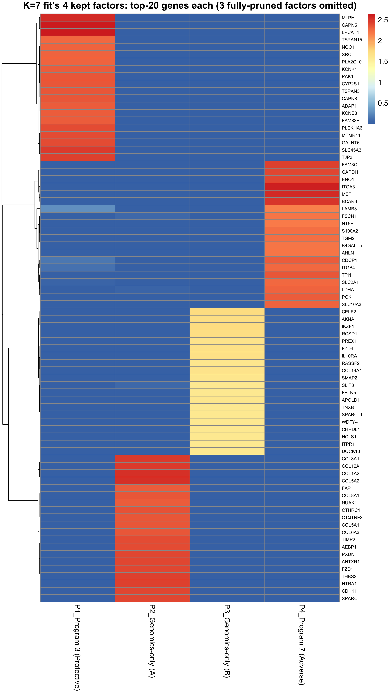
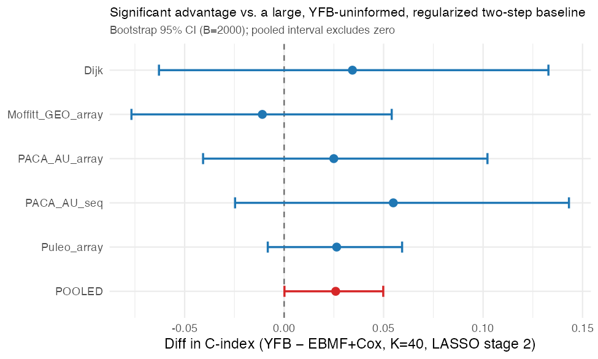
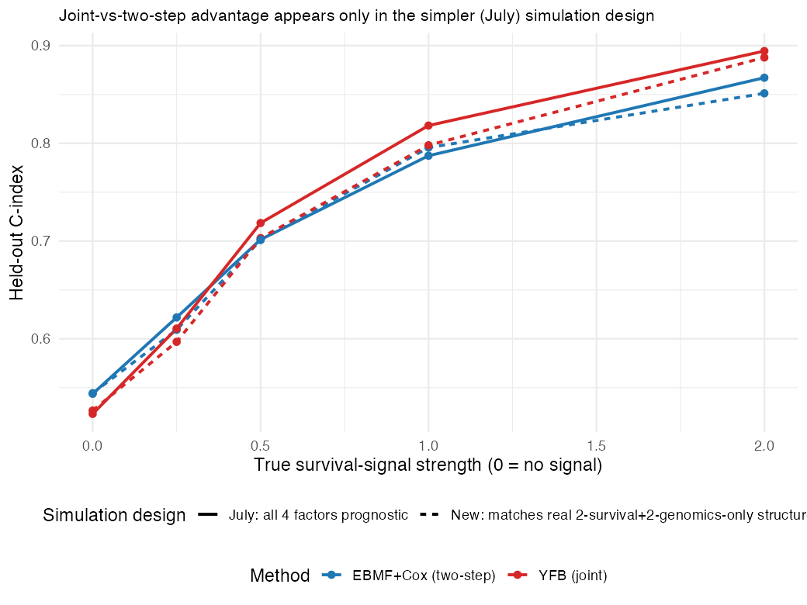

# August 21, 2026

## Summary {.unnumbered}

**Model specification (§2).** The full YFB model is written out: both
likelihoods, the priors on each latent variable, the variational posteriors, and the ELBO the CAVI
updates maximize. All four update formulas ($\beta$, $L$, $F$, $\tau$) are provided as well.

**$K$ selection now uses ARD pruning plus ELBO, not cross-validated C-index (§3.1).**

- Fitting at $K_{\text{init}} \in \{5,\dots,20\}$ gives a stable **2 survival-active factors for
  every $K \ge 7$**; added capacity goes entirely to dead factors, which is ARD working as intended
  (see the sweep table in §3.1).
- $K=5$/$K=6$ have the best ELBO but generalize far worse (C=0.596 vs. 0.627). ELBO ranks candidate
  $K$'s, but any $K$ that fails externally is excluded first.
- **$K=7$ (2 survival-active + 2 genomics-only = 4 kept factors) is confirmed**, with $K=9$ as a
  near-tied alternative. The $K=5$ vs. $K=7$ gap is significant pooled across cohorts (§3.3).
- The fit is stable across starting points: 15 restarts per $K$ all reach the same best-ELBO
  solution, which closes the factor-stability question left open on 8/3.

**The joint model outperforms an independent two-step baseline (§3.5).** Against a baseline model
($K$=40 never informed by YFB, LASSO at stage 2), YFB's advantage is **+0.026, 95% CI
[0.0002, 0.0498]** pooled across the 5 external cohorts, and it outperforms in all 6
configurations tested. A simulation reproduces the expected external C-index curve (equivalence at
zero signal, YFB ahead as signal grows).

**Open discussion item:** the selection procedure over-counts survival-active factors in simulation
(§3.2). 41 of 45 fits found more than the true number, caused by small spurious survival
coefficients attaching to real-but-non-prognostic programs. A relative-magnitude threshold fixes it
in simulation but must not be applied to the real data, where it would discard Program 3 despite
independent external confirmation. Needs a decision on how to handle this for future datasets.

**Factor biology (§2.5).** Programs 3 and 7 were characterized in the July 15 cycle, where five
independent methods agreed on Program 7 as adverse/basal-like and Program 3 as
protective/classical. Those results may be sufficient as they stand. The open question is process:
that work was self-directed rather than group-directed, so the approach is worth confirming before
the labels carry into the manuscript. Top-20 gene lists for both programs are included here for
direct inspection, with the gene-weight heatmap for all 4 kept factors in §3.4.

**Logistics.** Finalize committee (Lin, Liu, Rashid, Hudgens, Van Deinse); prelim targeted for
end of Fall 2026; 8/27 lab meeting slides in progress.

**Questions**

- selection of starting K value prior to pruning (tested a range and currently settled on 7)

---

## Recent Updates

The 8/3 entry closed two open questions about the two survival-active gene programs (Program 7,
adverse; Program 3, protective): they reproduce in a fully unsupervised fit (not an artifact of the
survival term), and they independently match DeSurv's published basal-like/classical tumor axes.
Focus then shifted toward the manuscript and toward a list of action items from that meeting. This
section tracks each of those items, both the ones closed this cycle and the ones still open.

### Completed

- **Bootstrap C-index confidence intervals + paired significance test** (2026-07-16): wrote the
  bootstrap-CI code and used it to compare the recommended model against a two-step
  (unsupervised-factorization-then-Cox) baseline, finding a significant advantage. **Re-examined
  this cycle (§3.5):** that specific baseline had its own weaknesses (unregularized stage 2, an
  unmatched $K$), so it was checked against a properly-built independent baseline instead. The
  advantage holds up.
- **Consolidated progress notebook** (this book): one chapter per advisor meeting, backfilled
  April 29 through August 3 and pushed 2026-08-03.
- **Model specification write-up**: the 8/3 notes' top immediate item ("write out current model
  form, pseudo-algorithm and major update steps") is §2 of this chapter, below.
- **How $K=7$ was chosen, and whether that answer is trustworthy** (2026-08-19/20, this cycle;
  §3 below): $K=7$ was originally chosen by cross-validated held-out C-index, which uses the
  survival outcome to pick model structure. This was the ARD-vs-cross-validation comparison raised
  at the last meeting. Re-derived it instead from model fit alone (ELBO), cross-checked against
  external validity, and separately stress-tested the procedure in a simulation where the true
  number of factors is known. See §3.
- **Factor stability across random seeds** (8/3 open item). Refitting each $K \in \{5,\dots,10\}$
  from 15 different starting points (1 SVD initialization + 14 random) converged to the same
  best-ELBO solution every time, at every $K$; random restarts never beat the SVD initialization.
  The 2 survival-active programs are therefore not an artifact of one lucky starting point.

### Items to address

- **Consistency of the 5 non-survival-active factors across the external cohorts.** Programs 3 and 7
  have been checked thoroughly (pathway enrichment, subtype correlation, DeSurv overlap, cross-cohort
  hazard ratios); the other factors in the $K=7$ fit have not had the equivalent check.
- **Aligning on the factor-biology work** (§2.5). This was pursued independently rather than at the
  group's direction, so the approach needs review even though the existing results may turn out to
  be sufficient.
- Slides/figures for the 8/27 lab meeting progress update, prepared separately from this chapter.
- **Finalize committee:** Dr. Lin, Dr. Liu, Dr. Rashid, Dr. Hudgens, Dr. Van Deinse (Social Work).
- **Schedule prelim for end of Fall 2026.**

### Ongoing (no change expected each cycle)

- Weekly recurring meetings and a written update each time (this book).
- Daily pushes to the model repository and the separate manuscript repository.
- The cohort-membership indicator (`cohort_id`) absorbs genomic platform offsets only; it never
  carries survival information, and is off by default in the recommended configuration below.

---

## Model Specification: YFB

Current recommended model: **Cox-on-YF** (`code/fit_cox_on_yf.R`), $\eta = (YF)\beta$, referred to
here as **YFB**.

### Generative model

**Genomics model.** The observed expression matrix is a low-rank product plus feature-specific
Gaussian noise:
$$
Y = L F^\top + E, \qquad E_{ij} \sim \mathcal{N}\!\left(0, \tau_j^{-1}\right)
$$

- $Y$ is $n \times p$ (patients $\times$ genes), column-centered.
- $L$ ($n\times K$) is the patient-loading matrix: how strongly patient $i$ expresses gene
  program $k$.
- $F$ ($p \times K$) is the factor matrix: which genes, and how strongly, make up program $k$.
- $\tau_j$ is gene $j$'s noise precision (inverse variance). Each gene is allowed its own
  noise level.

**Projection onto observed expression.** Rather than scoring survival risk from the latent,
uncertain loadings $L$, YFB projects the *observed* data directly onto the fitted programs:
$$
Z\!F = Y \tilde F, \qquad \tilde F_{\cdot k} = \frac{F_{\cdot k}}{\lVert F_{\cdot k} \rVert_2}
$$

- $\tilde F$ is $F$ with each program's gene-weight column rescaled to unit $L_2$ norm.
- $Z\!F$ ($n \times K$) is each patient's projection score onto each program: a direct function of
  the data $Y$ and the fitted $F$, not a latent variable with its own posterior uncertainty.
- The rescaling is necessary: without it, $\lVert Z\!F_{\cdot k}\rVert \sim O(\sqrt{np})$ grows
  with the size of the data, and the survival coefficients get driven toward zero by scale alone (not because there's no real signal).

**Survival model (Cox proportional hazards).** Patient risk is a linear combination of the
projection scores:
$$
\eta_i = (Z\!F)_{i\cdot}\,\tilde\beta, \qquad h(t_i \mid \eta_i) = h_0(t)\exp(\eta_i)
$$

- $\eta_i$ is patient $i$'s linear predictor (log relative risk).
- $\tilde\beta$ ($K \times 1$) is the survival coefficient vector: how prognostic each program is.
- $h_0(t)$ is an unspecified baseline hazard (standard Cox); it cancels out of the partial
  likelihood and is never estimated.
- $\beta$ acts on $Z\!F$ (data $\times$ fitted $F$), not on $L$: $L$ does not appear in the
  survival likelihood at all under YFB. This is the key structural difference from the LB
  parameterization ($\eta = L\beta$), where $L$ carries both roles.

### The full model: likelihood, priors, and posteriors

This is the complete probabilistic model the update steps below are derived from: the two
likelihoods, the priors on each latent variable, and the objective (the ELBO) that CAVI actually
maximizes. Full derivation: `derivations/cox_on_YF/ELBO/ELBO_YF_derivation.pdf`.

**Priors.** Each latent variable is given an Empirical Bayes prior. A family is chosen and the
specific shape within that family is estimated from the data itself:
$$
l_{ik} \overset{\text{iid}}{\sim} g_L \in \mathcal{G}_L, \qquad
f_{jk} \overset{\text{iid}}{\sim} g_F \in \mathcal{G}_F, \qquad
\tilde\beta_k \overset{\text{iid}}{\sim} g_{\tilde\beta} \in \mathcal{G}_{\tilde\beta}
$$

- $g_L$ and $g_F$: `point_exponential`, a one-sided (non-negative) sparse family, estimated via
  Empirical Bayes Normal Means (EBNM). Loadings and gene weights can be zero or positive, never
  negative.
- $g_{\tilde\beta}$: `normal` in the recommended configuration, a ridge-like shrinkage prior with
  no exact point mass at zero. A `point_normal` (spike-and-slab) alternative exists in the code but
  collapses $\tilde\beta$ to 0 for every $K$ under cross-validation (5/28 entry); `normal`
  is the prior actually used to produce every result in this notebook.
- $\tau_j$ has no prior in this model; it is fit by constrained maximum likelihood (Step 2 below),
  not a full variational treatment, so it contributes no KL term to the objective below.

**Full joint likelihood.** $t = (t_1,\ldots,t_n)$ are the observed survival/censoring times and
$\delta = (\delta_1,\ldots,\delta_n) \in \{0,1\}^n$ the event indicators ($\delta_i=1$: event
observed; $\delta_i=0$: censored). Together these two vectors are the survival outcome. Conditional
on the latent variables, the genomics data and the survival outcome are independent:
$$
P(Y, t, \delta \mid L, F, \tilde\beta, \tau) =
\underbrace{P(Y \mid L, F, \tau)}_{\text{genomics}} \;\times\;
\underbrace{P(t, \delta \mid Y, F, \tilde\beta)}_{\text{survival}}
$$
$P(Y \mid L, F, \tau)$ is the Gaussian genomics likelihood implied by the genomics model above
(product over $i,j$ of $\mathcal{N}(y_{ij};\,\mathbf{l}_i^\top\mathbf{f}_j,\,\tau_j^{-1})$).
$P(t, \delta \mid Y, F, \tilde\beta)$ is the Cox partial likelihood, a function of the linear
predictor $\eta_i = (Z\!F)_{i\cdot}\tilde\beta$ from the survival model above. The survival term
conditions on $F$ and the *observed* $Y$ (through $Z\!F$), not on $L$. This is exactly what
removes $L$ from the survival side of the model under YFB.

**Posteriors.** $q(L)$, $q(F)$, and $q(\tilde\beta)$ are the variational **posteriors**: CAVI's
best-fitting approximation to the true, intractable posterior $P(L, F, \tilde\beta \mid Y, t,
\delta)$, under a mean-field assumption that they factorize independently:
$q(L, F, \tilde\beta) = q(L)\,q(F)\,q(\tilde\beta)$, each further factorized coordinate-by-coordinate
($l_{ik}$, $f_{jk}$, $\tilde\beta_k$ each get their own independent posterior). They are **not** the
priors $g_L, g_F, g_{\tilde\beta}$ above: the prior is the population-level shape estimated once per
update from all the data; the posterior is the individual belief about one specific $l_{ik}$ (or
$f_{jk}$, $\tilde\beta_k$) after seeing the data, given that prior. Each posterior's mean
$\mathbb{E}_q[\cdot]$ (written $\bar l_{ik}$, $\bar f_{jk}$, $\bar\beta_k$ below) and second moment
$\mathbb{E}_q[\cdot^2]$ are both tracked, since they differ whenever there's posterior
uncertainty. This distinction matters for the $\tau$ update (Step 2) and for the error-in-variables
correction in the survival term.

**The variational objective (ELBO).** CAVI maximizes the Evidence Lower Bound, written $\mathcal{L}$
here (script L, not to be confused with the loading matrix $L$):
$$
\mathcal{L} = \mathbb{E}_q\big[\log P(Y \mid L, F, \tau)\big]
  + \mathbb{E}_q\big[\log P(t, \delta \mid Y, F, \tilde\beta)\big]
  - \mathrm{KL}\big[q(L)\,\|\,g_L\big]
  - \mathrm{KL}\big[q(F)\,\|\,g_F\big]
  - \mathrm{KL}\big[q(\tilde\beta)\,\|\,g_{\tilde\beta}\big]
$$
The first two terms, $\mathbb{E}_q[\log P(Y\mid L,F,\tau)]$ and
$\mathbb{E}_q[\log P(t,\delta\mid Y,F,\tilde\beta)]$, are the two log-likelihoods from above, each
averaged over the current posteriors: how well the model fits the data. Each
$\mathrm{KL}[q(\cdot)\,\|\,g] = \mathbb{E}_q\!\left[\log\frac{q(\cdot)}{g(\cdot)}\right]$ is the
Kullback–Leibler divergence between a posterior and its prior; it penalizes posteriors that drift
too far from the prior, which is what produces shrinkage. The survival log-likelihood term is not
conjugate to a Normal prior, so it's handled by a second-order Taylor expansion around the current
linear predictor $\hat\eta$ (a local Gaussian approximation) before the EBNM updates below can be
applied.

Inference is Coordinate Ascent Variational Inference (CAVI): each coordinate posterior above is
updated in turn, holding the others fixed, which turns each update into an Empirical Bayes Normal
Means (EBNM) problem: solve for the prior and posterior moments given a pseudo-observation $x$ and
its standard error $s$. The exception is $\tau$, which has a closed form.

### Update steps (one outer CAVI iteration)

Each step below computes one of the coordinate posteriors defined above ($q(\tilde\beta_k)$,
$q(l_{\cdot k})$, $q(f_{\cdot k})$), given the current pseudo-data from every other coordinate.

**What $A$ and $B$ are.** Every EBNM update below follows the same pattern: collect a precision
$A$ (how much information the data carries about this one coordinate; larger $A$ means a more
confident estimate) and a numerator $B$ (a precision-weighted sum of the residual, or pseudo-data,
relevant to that coordinate). The pair $(A,B)$ converts into a pseudo-observation $x = B/A$ with
standard error $s = 1/\sqrt{A}$. That $(x,s)$ pair, together with the coordinate's prior family, is
what's actually handed to the EBNM solver, which returns the fitted prior and the posterior mean and
second moment. This structure is identical for $\beta$, $L$, and $F$ below; only what goes into $A$
and $B$ changes. All three formulas were checked line-by-line against their source derivations
(`derivations/cox_on_YF/`) and match exactly.

**Step 0: Working response.** Recompute $\tilde F$, $Z\!F = Y\tilde F$, and $\eta = Z\!F\,\tilde\beta$;
run one step of the Cox Newton–Raphson (Taylor) expansion at $\eta$ to get the score $u$, diagonal
Hessian weight $w$, and working response $z = \eta + u/w$.

**Step 1: For each factor $k = 1, \dots, K$ (Gauss–Seidel: $\beta_k \to l_k \to f_k$, in order):**

1. **$q(\beta_k)$, survival coefficient.** Covariate is $Z\!F_{\cdot k}$, observed (no posterior
   variance term):
   $$
   A_k = \alpha \sum_i w_i\, Z\!F_{ik}^2, \qquad
   B_k = \alpha \sum_i w_i\, z^{-k}_i\, Z\!F_{ik}
   $$
   $$
   \left(\bar\beta_k,\ \overline{\beta_k^2}\right) \leftarrow
   \mathrm{EBNM}\!\left(x=\tfrac{B_k}{A_k},\ s=\tfrac{1}{\sqrt{A_k}}\right)
   $$
   where $z^{-k}_i = z_i - \sum_{k'\ne k} Z\!F_{ik'}\bar\beta_{k'}$ is the working response with
   factor $k$'s own contribution removed, and $\alpha \in [0,1]$ (default $0.5$) is the
   genomics/survival mixing weight. $\alpha$ cancels in $x_k = B_k/A_k$ (the EBNM pseudo-observation
   is $\alpha$-independent) but not in $s_k = 1/\sqrt{A_k}$, so it still controls how strongly
   $\beta_k$ is shrunk. Prior family: `normal` (see the priors note above; `point_normal` is
   available but collapses to $\beta=0$ under cross-validation). *(Derivation:
   `derivations/cox_on_YF/qBeta/qBeta_YF_derivation.pdf`)*

2. **$q(l_{\cdot k})$, patient loadings, pure genomics.** $L$ carries no survival term under YFB:
   $$
   A_{ik} = \sum_j \tau_j\, \bar f_{jk}^2, \qquad
   B_{ik} = \sum_j \tau_j\, R^{-k}_{ij}\, \bar f_{jk}
   $$
   $$
   \left(\bar l_{ik},\ \overline{l_{ik}^2}\right) \leftarrow
   \mathrm{EBNM}\!\left(x=\tfrac{B_{ik}}{A_{ik}},\ s=\tfrac{1}{\sqrt{A_{ik}}}\right)
   $$
   where $R^{-k} = Y - \bar L\bar F^\top + \bar l_{\cdot k}\bar f_{\cdot k}^\top$ is the genomics
   residual with factor $k$ added back in. Prior family: `point_exponential` (one-sided, non-negative
   weights, no "depletion" side). *(Derivation:
   `derivations/cox_on_YF/qL_unsupervised/qL_unsupervised_derivation.pdf`)*

3. **$q(f_{\cdot k})$, gene-program weights.** Pure genomics at the default survival-mixing weight
   $\alpha_F = 0$ (a dual-source form exists for $\alpha_F > 0$, unused in the recommended
   configuration; see `derivations/cox_on_YF/qF_supervised/qF_supervised_derivation.pdf` for the
   general case):
   $$
   A_{jk} = \tau_j \sum_i \overline{l_{ik}^2}, \qquad
   B_{jk} = \tau_j \sum_i R^{-k}_{ij}\, \bar l_{ik}
   $$
   $$
   \left(\bar f_{jk},\ \overline{f_{jk}^2}\right) \leftarrow
   \mathrm{EBNM}\!\left(x=\tfrac{B_{jk}}{A_{jk}},\ s=\tfrac{1}{\sqrt{A_{jk}}}\right)
   $$

**Dual-source $F$ was tested, not left unused.** Ran a 16-configuration experiment letting
survival term inform gene-program loadings (analogous to DeSurv's joint $W$) and found no benefit and
some harm at higher weights, so we kept the simpler genomics-only $F$, with survival entering only
through $\beta$ on $Z\!F = Y\tilde F$. [Full method & results: DECISIONS.md, 2026-08-20 entries]

**Step 2: $q(\tau)$, closed form, no EBNM.**
$$
\bar R^2_{ij} = \left(Y - \bar L\bar F^\top\right)^2_{ij} +
\sum_{k=1}^{K}\left[\overline{l_{ik}^2}\,\overline{f_{jk}^2} - \bar l_{ik}^2 \bar f_{jk}^2\right], \qquad
\hat\tau_j = \frac{n}{\sum_i \bar R^2_{ij}}
$$
The bracketed term is the posterior-variance correction; it prevents $\tau$ from being systematically
overestimated by ignoring uncertainty in $L$ and $F$.

**Step 3: Prediction.**
$$
\widehat{\eta}_{\text{test}} = \left(Y_{\text{test}}\, \tilde F_{\text{train}}\right)\tilde\beta
$$

**Step 4: Sign correction.** After convergence, if training concordance of
$\widehat\eta = Z\!F\,\tilde\beta$ is below 0.5, flip $\tilde\beta \to -\tilde\beta$ (equivalent to
$1 - C_{\text{train}}$).

*A second scalar, $\lambda$, once multiplied the survival-side precision terms in the $L$ update
separately from $\alpha$; retired 2026-07-12 as redundant with $\alpha$ and removed from the code
(DECISIONS.md).*

### Gene selection

- Rank genes per training cohort (TCGA-PAAD, CPTAC) by a combined mean expression + variance rank (similar to DeSurv approach), computed before normalization.
- Keep the top 3,000 genes by that rank, per cohort.
- Intersect the two cohorts' gene sets: 2,064 genes survive (vs. 2,000 under a variance-only rank).
- Standardize per platform ($z$-score) after intersection, before fitting. This step is required as 10 of 12 non-per-platform preprocessing variants collapsed to $\beta = 0$.

### Factor composition ($K=7$)

$K_{\text{eff}}=2$ of the 7 fitted gene programs carry non-negligible survival weight:
$|\bar{\tilde\beta}_k| > 0.001$ (`beta_thresh` in `classify_factors()`, matching
`config/globals.yml`'s `k_selection$beta_threshold`). The other 5 fall below that threshold and
split into genomics-only (per-factor variance explained $\text{PVE}_k > 1\%$) and dead
($\text{PVE}_k \le 1\%$, nothing retained).

Do we need to tune these quantities?: (1) survival coefficient threshold, (2) PVE threshold

Two separate decisions are involved here, and the table below only makes one of them:

1. **How many gene programs should the model fit ($K$)?** First proposed on 5/28 via
   cross-validated external C-index, but that justification is superseded this cycle (§3.1):
   ARD pruning within a large-$K$ fit, combined with model fit (ELBO) across candidate $K$'s,
   using external C-index only as a floor to rule out a $K$ that fits training data best but
   generalizes worse, not as the primary selection criterion. That updated procedure re-confirms
   $K=7$ on its own terms. The table below takes this current, ARD/ELBO-validated $K=7$ fit as
   given; it does not revisit the choice of $K$ itself.
2. **Of those 7 fitted programs, which are actually prognostic, which are real biology with no
   survival link, and which are noise the model discarded?** This is what the table answers, using
   this cycle's new `classify_factors()` method (§3.1): 2 programs land in the first bucket
   (survival-active), 2 in the second (genomics-only), 3 in the third (dead).

§3.1 below is where decision 1 is actually re-derived; this table only carries out decision 2 on
the result.

Top genes within a program are ranked by $|\bar f_{jk}|$ (equivalently raw $\bar f_{jk}$: the
`point_exponential` prior gives one-sided, non-negative weights).

| Program | Survival-active | Direction$^\dagger$ | Note |
|---|---|---|---|
| 7 | Yes | Adverse | HR>1 in 5/5 external cohorts |
| 3 | Yes | Protective | HR<1 in 5/5 external cohorts |
| 2 of 5 remaining | No | n/a | Real gene-expression programs, not tied to survival; see §3.1 (cross-cohort consistency check still open, §1) |
| 3 of 5 remaining | No | n/a | Fully pruned by the model (see §3.1); not a "program" to characterize |

$^\dagger$ Direction is read from the *marginal* survival association of each program's projection
score (Cox on $Z\!F_{\cdot k}$ alone), not the joint model's $\tilde\beta$ sign. The two disagree for
these two programs specifically ($\hat{\tilde\beta}_7 = -0.041$, $\hat{\tilde\beta}_3 = +0.011$), a
suppression effect among correlated programs in the joint fit. The marginal convention is the one
used for all adverse/protective labeling.

**Top 20 genes, by loading weight, for each survival-active program**, read directly to
sanity-check by eye whether the composition of each program looks coherent (full source with
weights: `results/benchmark_sim/outputs/pathway_enrichment/K7_kept_factors_top_genes.csv`):

- **Program 7 (adverse):** ITGA3, MET, BCAR3, FAM3C, GAPDH, ENO1, TPI1, CDCP1, PGK1, SLC16A3, LDHA,
  ITGB4, SLC2A1, S100A2, TGM2, B4GALT5, FSCN1, ANLN, NT5E, LAMB3
- **Program 3 (protective):** CAPN5, LPCAT4, MLPH, SLC45A3, TJP3, PLEKHA6, MTMR11, GALNT6, TSPAN3,
  CAPN8, CYP2S1, PAK1, KCNE3, FAM83E, KCNK1, ADAP1, SRC, PLA2G10, NQO1, TSPAN15

**Reading the lists directly:**

- Program 7's list includes several glycolysis/hypoxia genes (GAPDH, ENO1, TPI1, PGK1, LDHA,
  SLC16A3, SLC2A1) alongside genes reported elsewhere as basal-like PDAC markers (MET, ITGB4,
  LAMB3, FSCN1, S100A2). This is a pattern, not a diagnosis.
- Program 3's list doesn't jump out the way Program 7's does; it needs the formal methods rather
  than a read-off.
- The 2 genomics-only programs: no gene list or biological characterization attempted yet (§3.4
  flags pulling their gene lists as a follow-up).

**Factor biology: work already done, and where it stands.** Programs 3 and 7 have been characterized
in some depth (July 15 cycle): gene-set enrichment via fgsea/ORA against curated PDAC gene sets,
correlation with PurIST classical/basal subtype scores, overlap with DeSurv's published gene
programs, and consistency of the hazard-ratio direction across the 5 external cohorts. Five
independent methods agreed: Program 7 is adverse and basal-like/squamous, Program 3 is protective
and classical/differentiated-epithelial. Those results may well be sufficient as they stand.

The caveat is process, not evidence. This line of investigation was pursued on our own initiative
rather than at the group's direction, and the specific methods were chosen for availability rather
than from a deliberate review of what the question needs. Worth a conversation to confirm the
approach is the right one before the biological labels get carried into the manuscript. Existing
results:

- Full methodology and all five confirmation methods:
  [`pathway_enrichment_report_07_15_26`](../../../reports/pathway_enrichment_report_07_15_26.html)
- Enrichment dotplot, subtype-correlation and DeSurv-overlap figures, and per-program tables:
  `results/benchmark_sim/outputs/pathway_enrichment/`

---

## Choosing $K$: CV for external C-index vs. K-selection from model ELBO

Two questions behind "$K=7$, $K_{\text{eff}}=2$": how $K=7$ was chosen, and whether that procedure
reliably finds the right number of programs. Plan: `docs/plans/ssbmf_factor_classification_k_selection_08_13_2026.md`.
Exact numbers: DECISIONS.md (2026-08-19, 2026-08-20).

### $K$ selection by ARD pruning and ELBO

**Method.** The shrinkage prior on $\tilde\beta$ prunes unneeded factors within a single large-$K$
fit (Automatic Relevance Determination, ARD): give the model more programs than it needs and it
drives the useless ones' survival coefficients to zero on its own, without consulting the survival
outcome to pick $K$. Fit YFB on the D4 training data at $K_{\text{init}} \in \{5,\dots,20\}$,
classify every factor in each fit, and record each fit's ELBO and external C-index.

**Three-way factor classification.** The previous active/shrunk split lumped two different things
together: a program can be useless for survival and still be a real, distinct gene-expression
program. Splitting "shrunk" gives three categories:

- **survival-active**: $|\bar{\tilde\beta}_k| > 0.001$
- **genomics-only**: not survival-active, but $\text{PVE}_k > 1\%$
- **dead**: neither; fully pruned

| $K_{\text{init}}$ | Survival-active | Genomics-only | Dead | Total kept | Mean external C |
|---:|---:|---:|---:|---:|---:|
| 5 | 3 | 1 | 1 | 4 | 0.596 |
| 6 | 3 | 1 | 2 | 4 | 0.597 |
| **7** | **2** | **2** | **3** | **4** | **0.6267** |
| 8 | 2 | 2 | 4 | 4 | 0.6256 |
| 9 | 2 | 3 | 4 | 5 | 0.6271 |
| 10 | 2 | 3 | 5 | 5 | 0.6279 |
| 15 | 2 | 3 | 10 | 5 | 0.6270 |
| 20 | 2 | 3 | 15 | 5 | 0.6274 |

**Findings.**

- Survival-active count is stable at 2 for all $K_{\text{init}} \ge 7$. Added capacity beyond that
  goes entirely to dead factors (3→15), which is ARD working as intended.
- **The fit is stable across starting points.** At every $K \in \{5,\dots,10\}$, all 15 restarts
  (1 SVD initialization + 14 random) converged to the same best-ELBO solution, and random restarts
  never beat SVD initialization at any $K$. This closes the factor-stability-across-seeds question
  left open on 8/3.
- $K=5$/$K=6$ have the *best* ELBO of the grid (−808,404 / −812,248 vs. −810,540 at $K=7$), and per
  the previous point this is not a bad-initialization artifact. But they generalize far
  worse (C=0.596–0.597 vs. 0.626–0.628 for every $K \ge 7$). Their apparent 3rd survival-active
  factor does not transfer to new cohorts.
- Among $K \in \{7,\dots,10\}$ (all externally indistinguishable), $K=7$ (−810,540) and $K=9$
  (−810,421) are tied on ELBO: a 0.015% difference, against 3,000–5,500-unit gaps to $K=8$/$K=10$.
- ELBO gets monotonically worse past $K \approx 10$ ($K=15$: −826,682; $K=20$: −847,800) while
  finding no new structure.

**Decision.** Rank candidate $K$'s by ELBO, but exclude any $K$ that fails on the external cohorts
first. A bad external result means whatever the model is fitting internally isn't generalizable
structure, so it shouldn't win on training-fit score alone. That excludes $K=5$/$K=6$. Of the
remaining tie, **$K=7$ (2 survival-active + 2 genomics-only)** is kept as the simpler model; $K=9$
(2 + 3) is recorded as a legitimate near-tied alternative. "Start as large as possible" is not
supported here; there is a real sweet spot around 7–10.

### Simulation check: the procedure over-counts survival-active factors

**Method.** Real data has no ground truth, so the procedure was tested on simulated data with a
known answer: a known number of survival-linked programs shared across two simulated cohorts, plus
a known number private to one cohort (real gene-expression structure, zero true survival effect by
construction).

**Findings.**

- The procedure **over-counted** survival-active factors: 41 of 45 fits found more than the true
  number, none found fewer.
- Cause: the model correctly recovers the cohort-specific programs' gene content, then attaches a
  small, spurious survival coefficient to some of them. The $|\bar{\tilde\beta}_k| > 0.001$
  threshold only separates "exactly zero" from "not zero," so these clear it.
- Adding an explicit cohort-membership adjustment did not reliably fix it.
- A relative threshold does work in simulation: with one true survival-linked program, the real one
  was the single largest $|\bar{\tilde\beta}|$ in all 5 seeds, with every spurious factor below 62%
  of that max. `rel_thresh = 0.65` separates them cleanly, and is now available as an optional
  setting in `classify_factors()`.

**This threshold is not applied to the real data.** Program 3 sits at ~0.28 of Program 7's
coefficient, the same low-ratio pattern the simulation flags as spurious. But Program 3 is
independently confirmed real by external validation (protective HR in 5/5 held-out cohorts, §2.5).
The simulated spurious factors never had that check available, because their true effect was zero by
construction. Applying `rel_thresh` mechanically here would discard a program already known to be
real.

**Open item for discussion.** The selection procedure can misattribute survival signal to a
real-but-unrelated program when no external cohort is available to check against. This matters most
for future datasets and new simulations, before their own validation exists. Options: an explicit
platform/cohort adjustment, the relative-coefficient threshold above, or requiring some form of
external confirmation before trusting a newly-found survival-active factor. Worth the group's input
before settling on one.

### Significance of the $K=5$ vs. $K=7$ gap

C=0.596 ($K=5$) vs. C=0.627 ($K=7$). No single external cohort shows a significant difference on its
own ($n=52$–$288$ each), but pooled across all 5 ($n=616$, 414 events) the gap is significant:
$-0.031$, 95% CI $[-0.060, -0.002]$ (bootstrap). Pooled-significant but not
significant cohort-by-cohort is the same pattern seen in the July two-step comparison (§1), expected
for these cohort sizes and not unusual.

### Gene composition of the kept programs

Top-20 genes by loading weight for each of $K=7$'s 4 kept factors, using the same style of figure as
the July 15 pathway-enrichment report's gene-weight heatmap, scoped to just these 4 (the other 3,
fully pruned, are omitted):

```{r k7-genes-fig, fig.cap="Top-20 genes per factor for the 4 kept programs. Color = raw gene weight (point-exponential prior, so all weights are non-negative); each block of genes is essentially specific to one program."}

```

The structure is block-diagonal: each program's top genes carry near-zero weight in the other 3,
including the 2 genomics-only programs. Whatever biology those 2 represent is distinct from Programs
3/7 and from each other. Neither has been run through the pathway-enrichment pipeline used on
Programs 3/7 (§2.5); this is an open follow-up. Full gene lists with weights:
`results/benchmark_sim/outputs/pathway_enrichment/K7_kept_factors_top_genes.csv`.

### Joint model vs. two-step baseline

**Question.** Does YFB (joint fitting) outperform factorizing first (EBMF) and fitting Cox on the
recovered factors after? Expected shape of the answer: equivalent when there is no real survival
signal, with a growing joint-model advantage as signal strengthens.

**Two ways to build the baseline unfairly**, both of which weaken the two-step method:

1. **Matching $K$ to the joint model's answer** hands the two-step method information an independent
   analysis would never have. But simply picking something large instead (the original $K=20$
   comparison) is not automatically fairer either.
2. **An unregularized second-stage Cox model** overfits badly with many factors and limited events.
   Confirmed directly: training concordance *rose* with $K$ (0.671→0.731, $K$=7→40) while external
   concordance *fell* (0.623→0.578). A penalized (LASSO) Cox is also the more faithful
   implementation, since a two-step analysis is supposed to decide *which* factors are prognostic,
   not assign every factor a nonzero coefficient.

**Final design.** A large $K$ value that the two-step method wasn't "told" ($K$=20/$K$=40), with regularization at
stage 2 instead of plain Cox, independent of the joint model's own results.

```{r k7-real-ci-fig, fig.cap="Bootstrapped difference in external C-index (YFB minus the independent two-step baseline: K=40, never informed by YFB, LASSO stage 2). The pooled interval excludes zero."}

```

**Real-data findings.**

- The joint model's advantage is significant pooled across the 5 external cohorts: **+0.026, 95% CI
  [0.0002, 0.0498]**. Ahead in 4 of 5 cohorts individually, none significant alone at these sample
  sizes.
- Joint model wins numerically in all 6 configurations tested (unregularized or LASSO $\times$
  $K$=7/20/40).
- The gap is significant against both independent baselines ($K$=20 and $K$=40+LASSO) and drops to
  inconclusive only when the two-step method is handed YFB's own $K$, which is unfair in the
  opposite direction, not neutral.

Simulation is the only way to test the zero-signal condition, since real data cannot provide it:

```{r k7-signal-fig, fig.cap="Held-out C-index vs. true survival-signal strength, in simulation, using the same two-step design (K=20, never informed by YFB, LASSO stage 2)."}

```

**Simulation findings.**

- Near-equivalence at zero/low signal, as expected, since there is no survival information for the
  joint coupling to exploit.
- YFB numerically ahead at the highest signal strength tested, matching the real-data direction.
- **Caveat:** with only 10 replicates, no single signal strength reaches significance on its own
  (all CIs cross zero). This is a compute limit, not a reversal. The real-data result ($n=616$) is
  the decisive evidence, and the simulation corroborates it qualitatively.

**Conclusion.** The joint model's advantage over an independent, properly built two-step baseline is
real, and largest when the two-step method has to choose its own model complexity rather than being
handed the answer.
