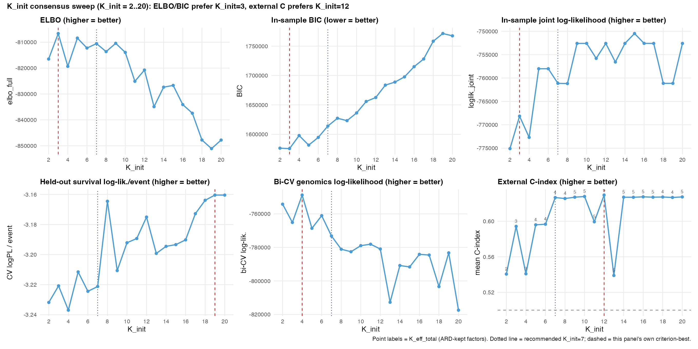
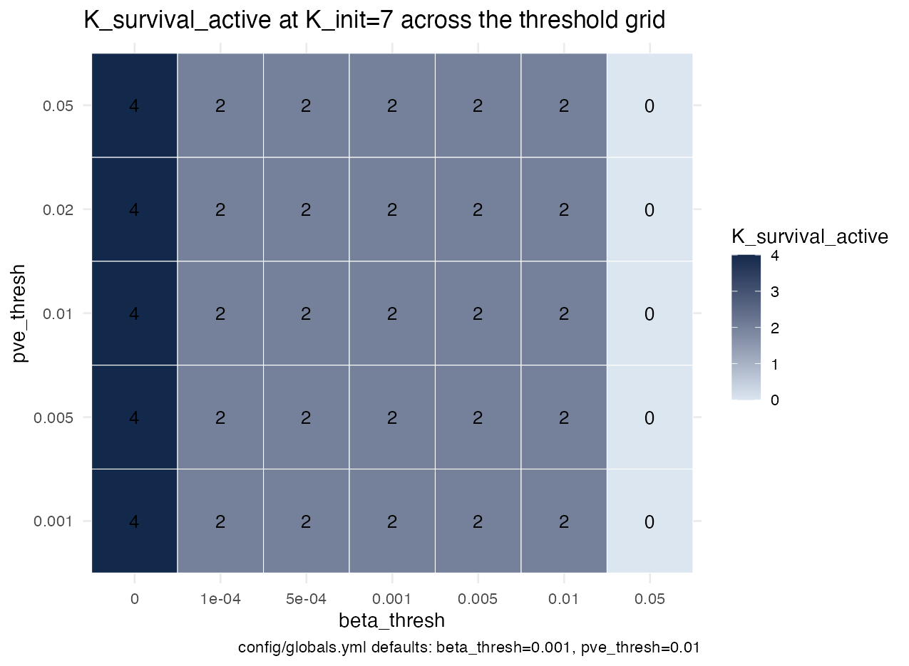
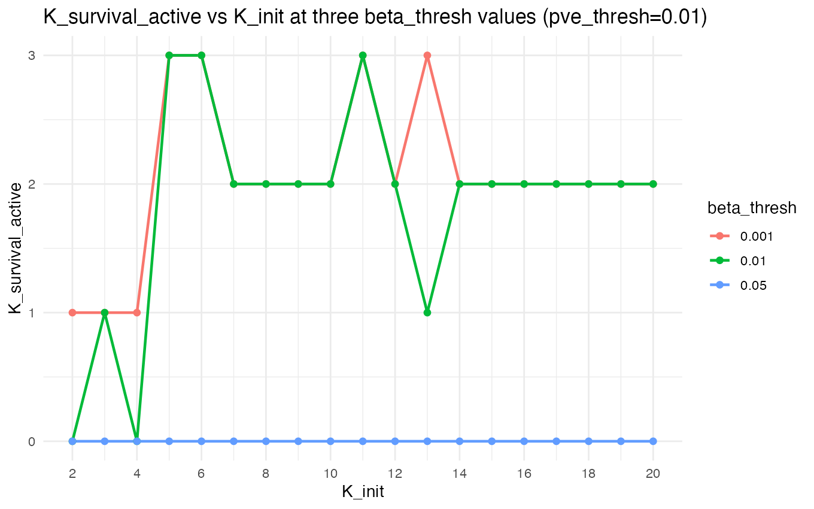
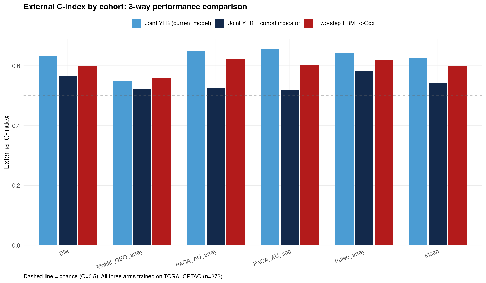
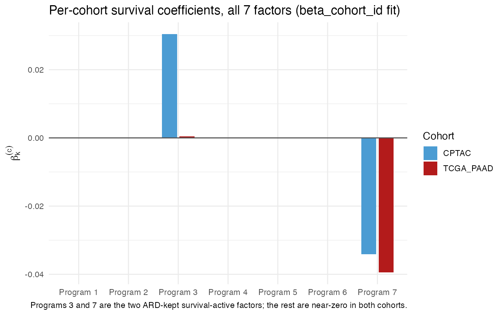
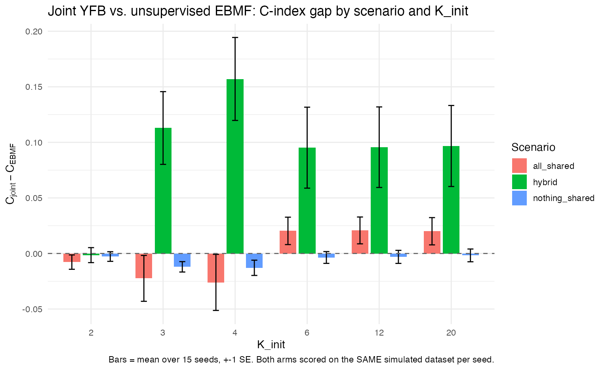
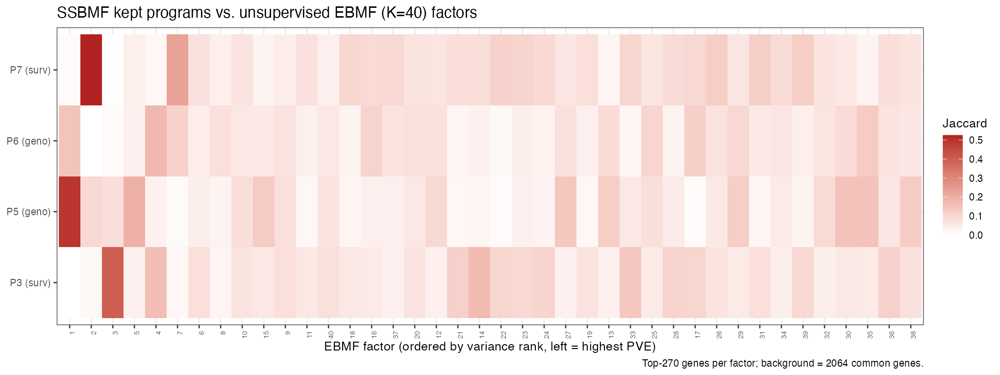

# September 4, 2026

## Summary {.unnumbered}

- **Cohort-specific survival coefficients (`beta_cohort_id`): no significant performance difference from the current model was detected, and the value-add is understanding how each cohort contributes to the learned factors** — confirmed on real data and with simulated ground truth. (§3)
- **Retained factors are not sensitive to the choice of retention threshold** — the same 2 survival-active factors are kept across a 100x range of `beta_thresh` and every `pve_thresh` tested. (§2)
- **The 8/27 log-likelihood and BIC were in-sample, not cross-validated.** Now have genuine held-out versions alongside them; found and fixed a real orientation bug in the process. (§1)
- **Under-specifying K_init merges true factors together**, as expected; over-specification remains safe (unchanged from 8/27). (§4)
- **Multi-modality extension is out of scope for now** — no such data exists yet, and the current preprocessing can't represent it structurally. (§5)

`chapters/2026-08-27.qmd` is the pre-meeting record and is not altered here.

---

## §1 — Clarifying the 8/27 results

```{r setup}
library(knitr); library(dplyr)
BM <- "../../../results/benchmark_sim/outputs"
rd <- function(p) if (file.exists(p)) read.csv(p, stringsAsFactors = FALSE) else NULL

ksweep <- rd(file.path(BM, "k_init_sweep", "k_init_sweep_results.csv"))
dip    <- rd(file.path(BM, "k_init_sweep", "k_init_multistart_dip_results.csv"))
cbc    <- rd(file.path(BM, "cohort_beta_comparison", "cohort_beta_comparison_results.csv"))
boot   <- rd(file.path(BM, "cohort_beta_comparison", "cohort_beta_bootstrap_ci.csv"))
loo    <- rd(file.path(BM, "cohort_beta_comparison", "leave_one_study_out.csv"))
fcomp  <- rd(file.path(BM, "factor_comparison", "factor_comparison_summary.csv"))
```

**Was the log-likelihood/BIC used to pick K_init cross-validated?** No — `compute_joint_ll_bic()` fits on all 273 training patients and scores those same 273 patients, in-sample. That's not wrong, but it isn't what was implied at the meeting. Two things follow:

- **A genuine held-out version now exists** (new `code/compute_cv_loglik.R`): a held-out Cox partial log-likelihood (5-fold CV) and a bi-cross-validated genomics log-likelihood (holding out patient AND gene blocks jointly — an ordinary held-out check doesn't work here, since projecting a patient from their own expression and then scoring them against it improves with more factors regardless of real structure). Reported separately from in-sample BIC, never combined into a "cross-validated BIC" — the two correct for the same in-sample optimism under different justifications, so combining them double-corrects.
- **Building the held-out check found a real bug, since fixed at the source**: the model's own sign-correction step (which flips a fit's coefficients if training performance looks backwards) had the check itself backwards, due to a default assumption in the underlying statistics package that doesn't hold for this kind of model. It **did** affect the in-sample BIC values (K_init=7's BIC moves from 1,614,174 to a corrected 1,614,079 — small, doesn't change which K_init BIC prefers). It does **not** affect the count of prognostic factors (sign-invariant by construction) or any headline external C-index (also sign-invariant, since it was previously reported via a symmetric convention that didn't depend on this check being correct). It has since been fixed directly in the model's fitting code, not just worked around downstream — the practical consequence is that every joint survival coefficient reported in this chapter (§3's per-cohort values included) is now on a *correct and trustworthy* sign convention for the first time, rather than one requiring a symmetric workaround to interpret safely. Some coefficients that were reported earlier this session under the old (uncorrected) convention flip sign as a result — magnitudes and every qualitative conclusion drawn from them are unchanged; see §3.

**Six criteria on K_init now, not four — and they still disagree, which is informative, not a problem:**

```{r ksweep-fig, fig.cap="K_init consensus sweep, six panels. The top row and held-out survival log-likelihood score training-cohort fit; bi-CV genomics log-likelihood and external C-index (bottom right) test generalization."}

```

| Criterion | What it actually measures | Prefers |
|---|---|---|
| ELBO / in-sample BIC | Training-cohort fit, dominated by the genomics reconstruction term | K_init=3 |
| In-sample log-likelihood | The same in-sample fit, decomposed differently from BIC (no complexity penalty) | K_init=15 |
| Held-out survival log-likelihood | Survival generalization, still the training cohort | Drifts toward larger K, noisily |
| Bi-cross-validated genomics log-likelihood | Genomics generalization, still the training cohort | K≈4 |
| **External C-index** | **Generalization to genuinely new cohorts — the actual deployment question** | **Plateaus from K_init=7** |

(An earlier draft of this table listed in-sample log-likelihood alongside ELBO/BIC as also preferring K_init=3 — it doesn't. `k_init_sweep_results.csv`'s `loglik_joint` column is highest at K_init=15 (-750,480) vs. -768,148 at K_init=3; ELBO and BIC penalize model complexity and log-likelihood does not, so the three needn't agree, and here they don't.)

Each answers a different question; the one closest to the deployment question (external C-index) is the one to trust. K_init=7 is the smallest K_init on that plateau — a parsimony argument, not a claim that the other criteria agree.

**The K_init=11 and 13 dips in that plateau are real, not a fluke of initialization.** A restart-based check (15 random re-initializations per K) was run specifically to test whether these two K values just got unlucky starting points:

```{r dip-table}
if (!is.null(dip)) {
  kable(dip[, c("K", "best_idx", "n_init", "mean_external_c")],
        col.names = c("K_init", "Best restart (of n_init)", "Restarts tried", "Mean external C"), digits = c(0, 0, 0, 4))
}
```

They didn't — the original fit (restart 1) was already the best of all 15 attempts at both K=11 and K=13. Why these two specific values land on a worse solution is still open.

---

## §2 — Are retained factors sensitive to threshold variation?

Two thresholds decide which latent factors count as biologically or prognostically meaningful: `beta_thresh` (minimum coefficient size to call a factor prognostic) and `pve_thresh` (minimum variance explained to call a factor genomics-active). Neither has ever been checked for sensitivity — until now.

```{r threshold-heatmap-fig, fig.cap="Number of retained prognostic factors at K_init=7 across the beta_thresh x pve_thresh grid."}

```

- **The same 2 prognostic factors are retained across the entire practical range**: `beta_thresh` from 1e-4 to 0.01 (a 100x span) and every `pve_thresh` tested. `pve_thresh` has no effect at all in this range.
- Only the extremes change the count: no threshold at all keeps 4 factors; the old default of 0.05 keeps 0, at every K_init from 2 to 20.

```{r threshold-vs-kinit-fig, fig.cap="Number of retained prognostic factors vs K_init at three beta_thresh values."}

```

- This does **not** show the retained-factor count staying flat around the K_init=11/13 dip (§1) — `threshold_vs_kinit.csv` shows K_survival_active=3 (not the usual 2) at K_init=11 under both `beta_thresh=0.001` and `0.01`, and at K_init=13 under `beta_thresh=0.001` (dropping to 1 under `0.01`). The dip in external C-index at K=11/13 is real (§1's restart check), but it is not accompanied by a stable retained-factor count — the threshold analysis doesn't explain the dip, it just shows the dip's factor count is itself threshold-sensitive in a way the rest of the K_init range isn't.
- A related, simulation-only threshold (`rel_thresh`, requiring a factor's coefficient to be within some fraction of the largest one) is confirmed **not** usable on this real data: the smaller of the two true prognostic factors sits at only 29% of the largest factor's coefficient, so the simulation-calibrated cutoff (65%) would incorrectly discard it.
- One remaining fairness question — do factors need their coefficients rescaled by how much their signal actually varies before comparing them to a single fixed threshold — checked directly: rescaling doesn't change which factors are called prognostic here.

---

## §3 — Cohort membership in the survival term: performance and interpretability

**The headline result: letting the survival coefficient vary by cohort (`beta_cohort_id`) performs statistically the same as the current model, and the value it adds is visibility into how each training cohort contributes to the learned factors — not a predictive-accuracy gain.** Confirmed two ways below: on the real data, and with simulated ground truth.

Three ways cohort membership can enter this model now exist, and they are independent of each other:

| Component | What it does |
|---|---|
| `cohort_id` (existing) | Absorbs per-gene platform/batch differences in the genomics data; never touches survival |
| `strata_id` (existing) | Lets each cohort have its own baseline survival risk; the coefficient on each factor stays shared |
| **`beta_cohort_id` (new this session)** | **The only one where a factor's survival coefficient itself is allowed to differ by cohort** |

$$
\eta_i = \sum_k (YF)_{ik} \cdot \beta_k^{c(i)}
$$

$\eta_i$ is patient $i$'s risk score; $(YF)_{ik}$ is how strongly patient $i$ expresses gene program $k$; $\beta_k^{c(i)}$ is program $k$'s survival coefficient in patient $i$'s cohort. The per-cohort coefficients for a given program are shrunk toward **zero** by a shared, jointly-estimated prior (not toward each other, or toward an estimated common nonzero value) rather than estimated fully independently — what's shared across cohorts is the *amount* of shrinkage, not a common coefficient. Cohorts with less data still borrow strength from the others, since that shared shrinkage amount is fit jointly across all cohorts' data.

### Performance: statistically indistinguishable from the current model

```{r cohort-beta-table}
if (!is.null(cbc)) {
  kable(cbc[, c("arm", "K", "K_survival_active", "K_eff_total", "mean_external_c")],
        col.names = c("Model", "K", "Prognostic factors", "Total kept factors", "Mean external C"), digits = c(0,0,0,0,4))
}
```

(As a first check, the current model's row above reproduces the previously-reported result exactly — mean external C=0.6267 — confirming this comparison starts from the right baseline.)

```{r threeway-fig, fig.cap="External C-index by cohort for the three main performance arms. Dashed line = chance (C=0.5)."}

```

```{r boot-table}
if (!is.null(boot)) {
  bp <- boot[boot$cohort == "POOLED", c("comparison", "diff_estimate", "diff_lower", "diff_upper", "significant")]
  kable(bp, col.names = c("Comparison", "Diff", "Lower", "Upper", "Significant"), digits = 4)
}
```

- **`beta_cohort_id`'s gap to the current model was not detected as statistically significant** (pooled 95% CI includes zero, and is narrow) — the point estimate very slightly favors `beta_cohort_id` itself. A CI that includes zero means a difference wasn't detected here, not proof that the two are equivalent; the honest read is "no evidence of a performance cost to letting the coefficient vary by cohort," not "underperforms." It also had a higher observed mean external C than the two-step alternative (factorize first, then fit survival separately) — a bootstrap CI is only reported here against the current model, not against two-step directly, so this is a point-estimate comparison, not a tested one.
- **`cohort_id` (the existing, genomics-side component) is significantly worse**, and worse than the two-step alternative too — it visibly competes with the real prognostic signal rather than coexisting with it (prognostic factor count drops from 2 to 1). This is a genuine limitation of that existing component, not of the new one. A `strata_id`-only fit (cohort-specific baseline risk, no other change) is statistically indistinguishable from the current model too — a clean null, not a failure to report.
- This ranking is identical no matter which of the 5 external validation cohorts is left out of the average — not an artifact of one small cohort. A second, independent check (held-out survival log-likelihood on the training cohorts, not external validation) reaches the same ranking **among the three arms scored on a common (pooled) risk set** — `joint_yfb_beta_c` > `joint_yfb` > `joint_yfb_cohort_L`, matching external C exactly. It does **not** extend to the two arms that use `strata_id` (`joint_yfb_all_c`, and a `strata_only` sub-arm not shown in the table above): stratifying the risk set by cohort changes the partial log-likelihood's scale, not just its value, so those two arms' held-out log-likelihoods (both far higher than the other three, around -354.8 vs. -445 to -451) reflect that different risk-set structure rather than a genuinely better fit, and are not comparable to the other three or to each other's C-index ranking on this metric.

### Interpretability: seeing how cohorts differ

```{r percohort-beta-fig, fig.cap="Per-cohort survival coefficients across all 7 factors. Only Programs 3 and 7 carry any signal at all -- the other five are near-zero in both cohorts."}

```

Allowing cohort-specific coefficients reveals that **Program 3's effect is almost entirely specific to CPTAC** (magnitude 0.030 vs. 0.0004 in TCGA_PAAD) — the current (shared-coefficient) model blends it into a single number (magnitude 0.0115) that is not accurate for either cohort individually. **Program 7's effect, by contrast, is consistent across both cohorts** (magnitude 0.034 CPTAC, 0.039 TCGA_PAAD). Neither fact is visible from the current model or from external validation performance — it only shows up once cohort membership is allowed into the survival term. (The joint coefficients' sign convention was corrected this session — see the fix-plan work above these results — so these values are stated by magnitude; which cohort dominates which program, the ratio between them, and each program's adverse/protective label from marginal association, DECISIONS.md 2026-06-16, are unaffected by that fix.) This is exactly the kind of "does the model actually handle multiple cohorts sensibly" evidence that would matter for comparison against methods like DeSurv or plain unsupervised factorization, none of which represent per-cohort effects at all.

**This was confirmed a second way, with simulated ground truth**, not just observed as a pattern in real data: a simulation was built where a factor is *known* by construction to be prognostic in one cohort and not the other.

```{r cohort-recovery-setup}
cbr <- rd(file.path(BM, "..", "..", "multi_cohort_sim", "outputs", "cohort_beta_recovery_sim_attribution.csv"))
```

```{r cohort-recovery-table}
if (!is.null(cbr)) {
  agg <- aggregate(cbind(yfb_base_shared_beta, yfb_beta_cohort_owning_col, yfb_beta_cohort_other_col_mean) ~ K_init,
                    data = cbr, FUN = median)
  kable(agg, col.names = c("K_init", "Shared coefficient", "True cohort's coefficient", "Other cohort's coefficient"),
        digits = 4, caption = "Median over 10 simulated replicates.")
}
```

`beta_cohort_id` correctly attributes the effect to the true cohort in a clear majority of cases (roughly 7x larger coefficient in the true cohort vs. the other, in 15–17 of 20 test cases). The value again wasn't a bigger number — the shared coefficient already sat close to the true cohort's value — it was that only the cohort-specific version makes that attribution visible at all.

### Three supporting technical notes

- **Does pooling the two training cohorts actually help, or would one alone do just as well?** Asserted in the 8/21 notes, never tested — tested now: the current model refit on TCGA_PAAD alone (n=144) or CPTAC alone (n=129) reaches mean external C of 0.514 and 0.578 respectively, well below the pooled fit's 0.627 (and TCGA_PAAD-alone loses a prognostic factor, 2→1). This is consistent with pooling helping, but the comparison isn't a clean isolation of pooling's effect: refitting on a single cohort changes both the sample size AND the gene-selection step (each cohort's own top-3000 genes, not the pooled 2064-gene set), so sample size and gene selection are confounded here, not separated.
- **Why does the existing `cohort_id` component compete with prognostic signal instead of coexisting with it?** Tested directly: refitting it from a better starting point (instead of a fresh random start) recovers both prognostic factors and closes most of its performance gap (external C rises from 0.543 to 0.617). So this is a model-fitting quirk, not a fundamental conflict between the two components.
- **Why do this model's kept gene programs resemble the highest-variance programs an unsupervised method would find anyway**, rather than uncovering a lower-variance program invisible to unsupervised methods? Checked directly in the code: by design, the current model's gene-program-DISCOVERY step (the F update) does not receive any feedback from survival at all — its update formula is identical to running an unsupervised factorization, and only the *selection* of which discovered programs are prognostic is supervised. This is not quite the same as saying survival has zero influence on the fit overall: survival still affects which iterate the CAVI loop converges to and returns via the joint stopping rule, since that rule is driven by the FULL objective (genomics and survival together), not the genomics term alone. Finding a genuinely low-variance, otherwise-overlooked prognostic program would require a more direct change (letting survival influence which programs are discovered, not just which are kept, or which iterate is selected) — a real, currently-disabled option flagged for future work (`ROADMAP.md`).

---

## §4 — Other findings

**Under-specifying K_init merges true factors together, as expected.** Giving the model fewer starting factors than truly exist causes genuinely distinct factors to blend into one; over-specifying (more starting factors than needed) remains safe, unchanged from 8/27. Checked directly, factor by factor: **7 of 27 estimated factors show a clear merge signature (correlating substantially with two different true factors at once) when under-specified; 0 of 114 do at the true K_init or above.** (This diagnostic is from a single simulated replicate — exploratory, not aggregated across the 15-seed replicate set the rest of this section's numbers are averaged over; treat the specific counts as illustrative of the pattern rather than a precise estimate of its frequency.)

```{r delta-fig, fig.cap="Joint model's C-index advantage over an unsupervised comparison, by scenario and number of starting factors, +-1 SE over 15 simulated replicates. From the true number of factors (6) upward, the advantage is stable and, in the scenario with a mix of shared and cohort-specific structure, substantial. Below 6, the picture is scenario-dependent, not uniformly flat or negative -- see body text."}

```

(The caption above corrects an earlier draft that described the advantage as "flat or negative" below K=6 in every scenario. `multicohort_delta_summary.csv` shows this holds for the `all_shared` and `nothing_shared` scenarios, but not for `hybrid` [mixed shared/cohort-specific structure]: there, the advantage is strongly POSITIVE below K=6, peaking at K_init=4 (+0.157), larger than at the true K_init=6 [+0.095]. Under-specifying K in a mixed-structure setting can apparently still find a useful, if merged, factor.)

**This model's 4 kept gene programs were compared against an unsupervised factorization** (no performance metric — a comparison of which genes each method's programs are built from, not which predicts better).

```{r fcomp-fig, fig.cap="This model's 4 kept programs vs. all 40 unsupervised factors, ordered by variance explained (left = highest). All 4 land in the unsupervised method's own top 5 -- not buried deep in its ranking, which is the direct explanation for the second technical note in §3."}

```

All 4 map cleanly onto the unsupervised method's own top 5 (of 40) programs by variance explained (hypergeometric overlap p-values as low as 1e-129) — not buried deep in the unsupervised ranking, which is the direct explanation for the second technical note in §3. These p-values are descriptive, not inferential: both sets of gene programs are derived from the same expression matrix, so their gene-selection events are correlated by construction, not independent samples — read them as "this overlap is large," not as a formal hypothesis test.

---

## §5 — Where the value-add goes next

Multi-modality extension (methylation, matched multi-view data) is out of scope: no such data exists yet, and the current data-merging step combines patients into one table in a way that can't represent multiple feature types per patient. A prerequisite for that direction, not a decision against it.
