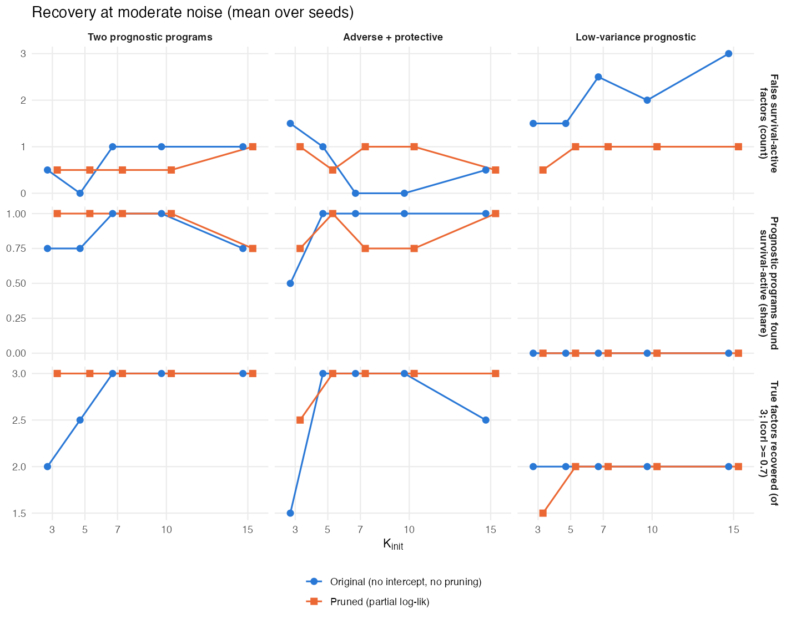

# October 2, 2026

## Executive summary {.unnumbered}

::: {.callout-tip appearance="simple"}
**In one line:** with a new fitting framework, the multimodal model chooses its own number of factors in simulation. On real data, at the pre-specified rank, it matches our established single-modality model: C = 0.685 on the same 50 ICGC donors, from one training cohort. The real-data result depends strongly on the starting rank, methylation has not yet added predictive value, and survival barely affects which factors are retained.
:::

**Progress since 9/18**

1. **Choosing K works in simulation.** Full sweep: 486 fits; 3 scenarios × 2 noise levels × K_init = 3–15 × 3 seeds.
   - Spare factors survived for two reasons: unbounded per-feature precisions and a missing intercept.
   - With the fix, the final number of factors stays at 3.0–3.7 for every K_init ≥ 4 at moderate noise. The original fit kept every starting factor.
   - The pruned fit recovers essentially all true factors, converges in every run (against 7–37%), and has slightly higher held-out C.
   - At high noise its held-out C is far better: 0.79–0.81 against about 0.70. (§2)
2. **First real-data results.** Trained on TCGA (144 patients); validated on ICGC primary PDAC (50 donors, 30 deaths).
   - The new framework reaches C = 0.685 (95% CI 0.579–0.779) on expression + methylation and 0.676 on expression alone.
   - Our recommended single-modality model scores 0.685 on the same donors. It was trained on TCGA + CPTAC.
   - Weaker comparators reach 0.42–0.53.
   - **Methylation adds +0.01, within the noise.**
   - **The result depends on the starting rank.** Across K_init = 3, 4, 5, 7, 10 and 15, C is 0.557, 0.574, 0.500, 0.685, 0.650 and 0.547. At K_init = 5 no factor is survival-active; at 15, eleven are, and C falls. (§4)
3. **The selected programs are recognizable PDAC biology.**
   - The axes found are basal-like vs classical, normal vs activated stroma, exocrine, and immune.
   - The one survival-active program is the basal-like axis (ICGC HR 1.99 per SD, p = 0.0003). It matches single-modality Program 7.
   - Methylation enters mainly an immune program and a methylation-only program, neither prognostic. (§4)
4. **The single-modality results now include held-out Kaplan–Meier curves.**
   - In all five external cohorts the low-risk third has the best survival; log-rank p < 0.05 in three.
   - The adverse and protective programs keep their direction (pooled p < 0.0001 and 0.004). (§5)
5. **Infrastructure.** A tested TCGA/ICGC loader, signed loading priors, a 5× faster compiled sweep, single-modality fitting, and a 22-page prelim proposal draft.

**Open problems and discussion points**

- **Survival barely influences which factors are kept.** On real data it changes the evidence for any factor by less than 3 nats, against 10⁴–10⁵ for reconstruction. This may also be why a low-variance prognostic program is missed in simulation. It is the multimodal form of the single-modality α_F question. How should survival be made to affect factor retention? (§4, §7)
- **Pruning removed no factors on real data** at any starting rank tried (3–15), so the starting rank fixes the final rank and the result varies with it. The evidence supports many molecular factors. Choosing the rank on real data is the most important open problem. (§4)
- **What methylation contributes.** Most factors use one modality. Should CpGs be screened relative to genes, for example promoter CpGs of the selected genes, instead of the 10k most variable? (§3, §4)

Terms used below:

- **YFB:** the supervised factor model with survival predictor η = (YF)β.
- **Two-step:** unsupervised empirical-Bayes matrix factorization (EBMF), then a Cox model on the factor scores.
- **Survival-active:** |E β_k| / SD(β_k) ≥ 1.96.
- **Nullcheck:** the test that removes a factor if the evidence lower bound (ELBO) does not fall without it.

---

## §1 — The multimodal model

This section restates the model for readers who have not seen the derivation.

- **Base updates:** `derivations/multimodal_YFB/multimodal_YFB_derivation.pdf`.
- **Added since 9/18:** the intercept, signed priors, ELBO and pruning. These are documented in `DECISIONS.md` (2026-10-01) and `code/fit_multimodal_yfb.R`, and will be added to the derivation.

**Data.** For $n$ matched patients, $Y_1\in\mathbb R^{n\times p_1}$ is gene expression, $Y_2\in\mathbb R^{n\times p_2}$ is DNA methylation, and $(t_i,\delta_i)$ is survival.

**Reconstruction.** The scores are shared across modalities. Each modality has its own loadings and baseline:

$$
Y_m = \mathbf 1\mu_m^\top + L F_m^\top + E_m,\qquad E_{mij}\sim N(0,\tau_{mj}^{-1}),\qquad m=1,2.
$$

- $L\ge0$ ($n\times K$, shared): how active program $k$ is in patient $i$.
- $F_m$ ($p_m\times K$, one per modality): how far each gene or CpG moves from its baseline $\mu_{mj}$ when the program is active. A program can be active in one modality and absent in the other.
- $\mu_m$ is a per-feature intercept, re-estimated every sweep. Each feature has its own residual precision $\tau_{mj}$ (maximum likelihood, not regularized).

**Survival.** A Cox model with linear predictor

$$
\boldsymbol\eta = (Y_1F_1+Y_2F_2)\,\beta,\qquad Z_{ik}=\sum_m\sum_j y_{mij}f_{mjk}.
$$

- $Z$ projects a patient's measurements onto the loadings. A new patient's risk therefore needs only their data and the fitted $F$ and $\beta$.
- Survival enters the $F$ and $\beta$ updates but not the $L$ update.
- A constant shift in $\eta$ does not change the Cox partial likelihood, so the intercept leaves the survival model unchanged.

**Priors.** Every hyperparameter is fit by empirical Bayes.

- **Scores:** $l_{ik}\sim(1-\pi_{L_k})\delta_0+\pi_{L_k}\operatorname{Exp}(r_{L_k})$.
- **Loadings:** the family is chosen per modality: point-exponential, point-Laplace $(1-\pi)\delta_0+\pi\tfrac{\lambda}{2}e^{-\lambda|f|}$, or Normal. Its parameters are fit separately for each modality–program pair.
- **Survival coefficients:** $\beta_k\sim N(0,s^2_{\beta_k})$, with $s^2_{\beta_k}$ estimated as $\max(0,x_k^2-1/A_k)$. A program whose survival signal is weak ($z<1$) therefore gets $\beta_k=0$ exactly. This is why many programs show $\beta=0$ below.

**Fitting.** Coordinate-ascent variational inference, with a Cox working approximation refreshed every outer sweep.

- **No tempering weights.** Reconstruction and survival enter the $F$ update as a plain sum.
- **Scale.** Each program's scale is not identified, so it is rescaled after its update to $\mathrm{sd}(Z_{\cdot k})=1$.
- **Attenuation.** The $\beta$ update uses $E[Z^2]$, which includes the variance of the loadings. This corrects for the attenuation that comes from treating estimated scores as fixed.

## §2 — Choosing K in the multimodal model

### Why spare factors survived

In September the number of "active" factors tracked $K_{\mathrm{init}}$. Three things explain this.

1. **Unbounded per-feature precisions.** $\tau_{mj}=n/E\lVert y_{mj}-Lf_{mj}\rVert^2$ is unregularized maximum likelihood. Without an intercept, a spare factor can load on a single feature and fit it exactly, which sends that feature's $\tau$ to infinity. In simulation it reached about $10^{16}$, against true values of at most 2.6. Adding the intercept removed this degeneracy at moderate signal-to-noise; $\tau$ itself is still unregularized.
2. **No intercept.** On uncentered data (log2 expression, methylation beta-values), nonnegative factors absorb the per-feature means. Centering the data alone does not help, because nonnegative scores cannot produce zero-mean columns.
3. **The September simulations were too noisy to test this.** Each true factor explained about 0.7% of the variance, below the 1% "active" cutoff. The 5–9 active factors seen then were fitting noise in the high-variance features.

### The parsimony framework

These options are added to `fit_multimodal_yfb()`; the defaults keep the original behavior.

| Component | What it does |
|---|---|
| Intercept $\mu_m$ | Absorbs feature means. $F$ then describes deviations from baseline. |
| Point-Laplace prior on $F$ | Signed, sparse loadings around the baseline. |
| Marginal-likelihood prior fits (`ebnm`) | A whole program's prior can shrink to the point mass at zero. |
| Nullcheck pruning | When the sweep loop ends, remove the factor whose removal does not lower the ELBO, refit from the rest, and repeat. |

**The ELBO** compared by the nullcheck is

$$
\text{ELBO} = E_q\log p(Y\mid L,F,\mu,\tau) + \log PL(E[\eta]) - \sum \mathrm{KL}(q\Vert g).
$$

- $\log PL(E[\eta])$ is the Breslow partial log-likelihood at the posterior-mean predictor.
- Each KL term comes from the EBNM identity $\mathrm{KL}=E_q\log N(x;\theta,s^2)-\log p(x)$.
- The nullcheck runs when the loop ends, whether it converged or reached the sweep cap.
- It removes one factor at a time and holds the other factors' moments fixed; only $\mu$ and $\tau$ are re-estimated. This is a conservative test.

**How factors are classified.**

- *Reconstruction-active:* share of variance explained (PVE) ≥ 1%.
- *Survival-active:* $|E\beta_k|/\mathrm{SD}\beta_k\ge1.96$.
- A factor can be both, either, or neither. The nullcheck does not require a retained factor to be either kind; for example, the real-data fit at $K_{\mathrm{init}}=10$ kept one factor that was neither.

**Other precision models, tested and not adopted.**

- One $\tau$ per modality removes the degeneracy but mis-weights heteroscedastic features. Nothing was pruned, and C fell to 0.65.
- An empirical-Bayes Gamma prior on $\tau$ learns a heavy tail, so $\tau$ still reached about $10^{17}$.

### Simulation sweep

**Design.**

- Data: true $K=3$, $n=120$, 50 + 50 features.
- Starting ranks: $K_{\mathrm{init}}=3,\dots,10,15$.
- Scenarios: three. Noise levels: two.
  - Moderate: each true factor explains about 10% of variance.
  - The original September design: each true factor explains under 1%.
- Seeds: three per setting.
- Variants: the original fit, the pruned fit, and the pruned fit with a variance-corrected survival term. All three are fit to identical data.
- Fits: 486, with no errors.

**Moderate noise** (means over $K_{\mathrm{init}}=3,\dots,10,15$ and seeds):

| Scenario | Variant | Final $K$ ($K_{\mathrm{init}}\ge4$) | True factors recovered (of 3) | Prognostic recall | False survival-active | Held-out C | Converged |
|---|---|---|---|---|---|---|---|
| Two prognostic programs | original | = $K_{\mathrm{init}}$ | 2.74 | 0.93 | 0.82 | 0.781 | 7% |
| | **pruned** | **3.0–3.7** | **3.00** | 0.87 | **0.67** | **0.798** | **100%** |
| Adverse + protective | original | = $K_{\mathrm{init}}$ | 2.78 | 0.89 | 0.70 | 0.786 | 37% |
| | **pruned** | **3.0–3.3** | **2.96** | 0.87 | **0.59** | **0.794** | **100%** |
| Low-variance prognostic | original | = $K_{\mathrm{init}}$ | 2.00 | 0 | 2.22 | 0.625 | 19% |
| | **pruned** | 2.3–2.7 | 1.96 | 0 | 1.26 | 0.625 | **100%** |

**Original noise** (true factors under 1% of variance):

| Scenario | Variant | Final $K$ | True factors recovered | Prognostic recall | False survival-active | Held-out C |
|---|---|---|---|---|---|---|
| Two prognostic programs | original | = $K_{\mathrm{init}}$ | 0.11 | 0.06 | 2.85 | 0.695 |
| | **pruned** | 1.0–2.3 | **1.19** | **0.59** | **0.44** | **0.789** |
| Adverse + protective | original | = $K_{\mathrm{init}}$ | 0.59 | 0.30 | 1.41 | 0.703 |
| | **pruned** | 1.0–2.7 | **1.33** | **0.67** | **0.52** | **0.799** |
| Low-variance prognostic | original | = $K_{\mathrm{init}}$ | 0.15 | 0 | 2.63 | 0.693 |
| | **pruned** | 1.0–3.3 | **0.93** | **0.52** | **1.15** | **0.805** |

What the sweep shows:

- **$K$ no longer follows $K_{\mathrm{init}}$.** At moderate noise the pruned fit returns 3.0–3.7 factors for every $K_{\mathrm{init}}\ge4$ when every program carries variance. With a low-variance program it returns 2.3–2.7. With true factors under 1% of variance it returns fewer than 3. This is the honest answer when factors can barely be distinguished from noise.
- **Better recovery and prediction where the original fit struggles.** At moderate noise the pruned fit recovers essentially all true factors. Its held-out C is slightly higher, its false survival-active factors are fewer, and it converges in every run, against 7–37% for the original. Prognostic recall is similar, 0.87 against 0.89–0.93. At high noise the gains are large: held-out C 0.79–0.81 against about 0.70, and prognostic recall 0.52–0.67 against 0–0.30.
- **The low-variance prognostic program is still missed at moderate noise by both methods.** It is recovered in about half the fits at high noise. Why this differs by noise level is not yet understood.
- **The variance-corrected survival term made no difference** to any summary, so the plug-in partial log-likelihood is kept.
- **False survival-active factors remain** at 0.4–0.7 per fit in the informative scenarios.
- **Runtime.** Pruned fits were also faster: median 59 s against 119 s, because they converge.

## §3 — Real data: matched TCGA and ICGC expression + methylation

`code/load_multiomics_data.R` builds the cohorts from the files Yusha shared. Tests check that patient IDs agree across expression, methylation and survival.

| Cohort | Role | Patients | Events | Notes |
|---|---|---|---|---|
| TCGA-PAAD | training | 144 | 75 | 6 of 150 dropped (missing or non-positive time) |
| ICGC primary PDAC | external validation | 50 | 30 | primary tumors with PDAC histology; all 50 are in the PACA-AU RNA-seq cohort |
| ICGC, all donors | sensitivity | 67 | 40 | adds 10 IPMN with invasion, 4 adenosquamous, 2 acinar, 1 signet ring |

**Preprocessing**

- **Expression.** TCGA is log2(TMM-CPM + 1) as provided. ICGC is provided unlogged, so log2(x + 1) is applied. ICGC donor DO33168 has two RNA samples, which are averaged in the source object.
- **Methylation.**
  - Beta-values on the 305,352 CpGs that pass both cohorts' sex-chromosome filters, matched by probe name.
  - KNN imputation, done within each cohort, fills missing values (0.07% in TCGA).
- **Survival.**
  - TCGA: from the PDAC_data survival table.
  - ICGC: from `info.expr`, one row per donor. It agrees exactly with the PACA-AU RNA-seq survival table.
- **Screening (TCGA only).** 3,000 genes by the DeSurv combined mean + variance rank, and the 10,000 most variable CpGs.

**Methylation scale.** Across the 10,000 screened CpGs:

| Scale | Median \|skewness\| | CpGs with \|skewness\| > 1 | Median excess kurtosis | Shapiro–Wilk rejects |
|---|---|---|---|---|
| beta-value | 0.43 | 13% | −0.73 | 92% |
| asin(2·beta − 1) | 0.33 | 6.6% | −0.70 | 82% |

- The arcsine transform halves the share of strongly skewed CpGs, but neither scale is Gaussian. Both are flatter than Normal, which fits bimodal methylation.
- With the intercept and signed priors, either scale can now be used. The fits below use beta-values.

::: {.callout-note}
## Discussion point: feature selection for two modalities

The screening uses DeSurv's single-modality gene rule and a variance rule for CpGs. Three questions are open:

- **How many CpGs relative to genes?** We keep 10k CpGs and 3k genes. Without per-modality weights, methylation can dominate the reconstruction likelihood.
- **Variance-based or survival-aware screening?**
- **CpGs screened separately, or mapped to the selected genes** (for example, promoter CpGs)?
:::

## §4 — First real-data fits: TCGA → ICGC

### External discrimination

All multimodal and two-step fits below use $K_{\mathrm{init}}=7$, the same TCGA patients and the same screened features. The recommended single-modality model was trained on TCGA + CPTAC with its own preprocessing; its scores on these donors come from the published validation run.

| Model | Data | ICGC primary PDAC (n = 50) | ICGC all donors (n = 67) | TCGA (training) |
|---|---|---|---|---|
| **New framework** | expression + methylation | **0.685** (0.579–0.779) | 0.639 (0.547–0.734) | 0.638 |
| **New framework** | expression only | **0.676** (0.569–0.770) | 0.653 | 0.644 |
| **Recommended single-modality model** (TCGA + CPTAC, per-platform z-std) | expression | **0.685** (0.576–0.785) | — | — |
| Original multimodal fit (no intercept or pruning) | expression + methylation | 0.453 (0.319–0.599) | 0.442 | 0.597 |
| Single-modality fitter on TCGA, raw log2, 100-iteration cap (not converged) | expression | 0.491 (0.364–0.633) | 0.480 (0.369–0.581) | 0.594 |
| Two-step EBMF → Cox | expression only | 0.525 (0.399–0.651) | 0.527 | 0.670 |
| Two-step EBMF → Cox | expression + methylation | 0.424 (0.286–0.567) | 0.418 (0.310–0.531) | 0.579 |

External C with 95% bootstrap CIs. The risk orientation is fixed from the training fit.

What the comparison shows:

- **Parity with the established model.** Trained on TCGA alone, the new framework matches our recommended single-modality model on exactly the same 50 donors (0.685 vs 0.685). The intervals overlap almost completely.
- **The framework fixed the old multimodal fit.** The original multimodal fit (0.453) and the weaker in-run comparators (0.42–0.53) are well below it.
- **Methylation adds +0.01**, far inside the uncertainty for 50 donors.
- **Stacking methylation hurts the two-step model,** from 0.525 to 0.424.

| Starting rank $K_{\mathrm{init}}$ (expression + methylation) | 3 | 4 | 5 | 7 | 10 | 15 |
|---|---|---|---|---|---|---|
| Factors kept (none pruned) | 3 | 4 | 5 | 7 | 10 | 15 |
| Survival-active | 0 | 1 | **0** | 1 | 3 | **11** |
| Converged within 500 sweeps | yes (398) | yes (465) | no | no | no | no |
| ICGC primary C | 0.557 (0.420–0.699) | 0.574 (0.428–0.714) | **0.500** (constant risk) | 0.685 (0.579–0.779) | 0.650 (0.529–0.763) | 0.547 (0.408–0.676) |

**The real-data result depends strongly on the starting rank.**

- At $K_{\mathrm{init}}=5$ no factor is survival-active. Every $\beta_k$ is shrunk to exactly zero, so the risk score is constant and C = 0.5.
- At $K_{\mathrm{init}}=7$, chosen in advance to match the single-modality model, the only survival-active factor is the basal-like one.
- At $K_{\mathrm{init}}=10$ there are three survival-active factors, including one matching Program 3 ($\lvert r\rvert=0.68$).
- At $K_{\mathrm{init}}=15$ eleven of fifteen factors are survival-active and external C falls to 0.547. With many unpruned factors the model finds survival associations that do not hold out of sample.
- The 0.685 at $K_{\mathrm{init}}=7$ is the best of the starting ranks, not a typical value. Ranks 6, 8 and 9 are still running.

Because pruning removes nothing on real data, the starting rank effectively *is* the final rank. Unlike in simulation, it is not yet chosen by the model. This is the most important open problem for the real-data application.

**Caveats.**

- **Small validation set.** 50 donors and 30 deaths give wide intervals.
- **Convergence.** The $K_{\mathrm{init}}=7$ and 10 fits, and the expression-only fit, stopped at the 500-sweep cap.
  - The risk score had stabilized: the largest relative change in $\eta$ was $3.6\times10^{-4}$ at $K_{\mathrm{init}}=7$.
  - The reconstruction criterion, the largest entry-wise change in $LF_m^\top$ relative to its largest entry, was still about 1.5%.
  - A stopping rule based on the ELBO or the mean change is the planned fix.

### What the programs are

Expression + methylation fit, $K_{\mathrm{init}}=7$.

- **Methylation share:** each program's fraction of the total fitted methylation signal, $\lVert L_k\rVert^2\lVert F_{2k}\rVert^2$. Counting "nonzero" CpGs depends on an arbitrary threshold under the point-Laplace prior, so shares are used instead.
- **Hazard ratios:** marginal, per within-cohort SD of each program's projection. There are 14 unadjusted tests, so the table is descriptive.
- **Source:** `results/multimodal_real/characterize_programs.R`, which writes `real_program_table_K07.csv`.

| # | Program (top genes) | Methylation share | PVE | Survival-active | HR in TCGA ($p$) | HR in ICGC ($p$) |
|---|---|---|---|---|---|---|
| 4 | **Basal-like vs classical**: up *KRT5, KRT6A, KRT17, S100A2, MUC16*; down *CLDN18, REG4, LYZ* | 4.5% | 3.6% | **yes** | **1.34 (0.006)** | **1.99 (0.0003)** |
| 5 | **Normal vs activated stroma**: up *ADH1B, C7, CHRDL1*; down *COL11A1, MMP11, MSLN* | 1.2% | 2.6% | no | 0.75 (0.04) | 0.83 (0.46) |
| 1 | **Classical / gastric epithelial**: up *REG4, TFF1, CLDN18, CEACAM5*; down stromal genes | 4.8% | 12.8% | no | 1.07 (0.58) | 0.79 (0.30) |
| 2 | **Immune / lymphoid**: up *CCL19, CCL21, PTPRC, LTB, SELL* | **20.9%** | 4.3% | no | 0.85 (0.17) | 0.87 (0.54) |
| 3 | Mixed: up *MIF, TNFRSF6B*; down *IL6ST, NCOA2* | 0.3% | 16.7% | no | 1.00 (0.98) | 1.48 (0.05) |
| 6 | **Exocrine / acinar**: up *CTRB2, CPB1, PNLIP, CELA3A, PRSS1* | 9.3% | 16.0% | no | 0.92 (0.53) | 1.17 (0.37) |
| 7 | **Methylation only** (no expression loadings) | **58.9%** | 4.6% | no | 1.11 (0.36) | 0.87 (0.44) |

**Known PDAC biology is recovered:**

- basal-like vs classical tumor;
- normal vs activated stroma;
- exocrine contamination;
- immune infiltration.

The one survival-active program is the basal-like vs classical axis, and it is prognostic out of sample (ICGC HR 1.99 per SD, $p=0.0003$). It corresponds to single-modality Program 7 ($\lvert r\rvert=0.68$ over 1,781 shared genes). Factor 1 (classical/gastric, 12.8% of variance) corresponds to single-modality Program 3 ($\lvert r\rvert=0.79$), although here it is not survival-active. Every expression-loading factor has a counterpart in Yusha's unsupervised `tcga_flash_K14` fit ($\lvert r\rvert$ 0.60–0.87).

**What methylation contributes.**

- **Most expression programs barely change when methylation is added.** Matched loadings between the two fits correlate at $\lvert r\rvert$ 0.79–0.91 for four of the six expression-loading programs, including the survival-active program at 0.88. The immune (0.67) and stromal (0.52) programs match less well, so methylation does shift the immune and stromal structure somewhat.
- **Most of the methylation signal goes to two non-prognostic programs.** The methylation-only program carries 59% and the immune program 21%. The immune share plausibly reflects immune-cell content. The exocrine program carries 9%.
- **The prognostic basal-like program carries 4.5%.**

At the current screening (the 10,000 most variable CpGs), methylation therefore appears to record mainly cell composition. CpG screening tied to the selected genes, such as promoter CpGs, is the natural next test.

### Why nothing was pruned at $K_{\mathrm{init}}=7$

The nullcheck asks, for each factor, how much the ELBO would fall without it, with the other factors held fixed:

| Factor | Program | Reconstruction loss if removed | Survival loss | KL saved |
|---|---|---|---|---|
| 1 | classical | −100,137 | 0.0 | +22,602 |
| 2 | immune | −132,648 | 0.0 | +16,504 |
| 3 | mixed | −54,407 | 0.0 | +9,351 |
| 4 | basal-like (survival-active) | −74,714 | −2.9 | +20,323 |
| 5 | stroma | −39,226 | −0.8 | +14,310 |
| 6 | exocrine | −92,923 | 0.0 | +18,227 |
| 7 | methylation-only | −301,982 | 0.0 | +28,895 |

- **The data support all seven factors.** With 144 × 13,000 values, each factor gains far more in reconstruction than it costs in KL. This is consistent with the unsupervised flash fit, which keeps 14 factors on expression alone. Whether pruning starts at larger $K_{\mathrm{init}}$ is an open question; at $K_{\mathrm{init}}=10$ it still removed nothing.
- **Survival is negligible in the ELBO at this scale.**
  - It changes the evidence for any factor by under 3 nats, against $10^4$–$10^5$ for reconstruction.
  - The partial likelihood has terms for 75 events, against about 1.9 million reconstruction terms.
  - Survival therefore cannot affect which factors are kept. Our leading hypothesis is that the same imbalance explains why the simulated low-variance prognostic program is lost, but no experiment has isolated it yet. It is the same imbalance that the single-modality α/α_F weights were introduced for.

## §5 — Single-modality results: held-out survival stratification

The recommended single-modality fit (YFB, $K_{\mathrm{init}}=7$, trained on TCGA-PAAD + CPTAC) retains four programs:

| Program | Role | Character | Example genes |
|---|---|---|---|
| Program 7 | Survival-associated (adverse) | Basal-like / glycolytic | *MET*, *ITGA3*, *ENO1*, *LDHA* |
| Program 3 | Survival-associated (protective) | Classical / epithelial | *MLPH*, *CAPN5*, *TSPAN15* |
| Stromal program | Expression only | Stromal | collagens, *FAP*, *SPARC* |
| Immune / quiescent stroma | Expression only | Immune and quiescent stroma | *IKZF1*, *IL10RA*, *SPARCL1* |

**External discrimination.** Mean external C across five held-out cohorts is 0.627. Against two-step baselines (EBMF, then Cox):

| Two-step baseline | Mean external C | YFB minus two-step, pooled (95% CI) |
|---|---|---|
| K = 40 chosen independently, LASSO Cox stage (the fairest) | 0.601 | **+0.026 (0.0002 to 0.050)**; YFB ahead in 4 of 5 cohorts, none individually significant |
| K = 7 matched to YFB, unpenalized Cox | 0.623 | +0.011 (−0.013 to 0.033), not significant |
| K = 20, unpenalized Cox (earlier comparison) | 0.581 | +0.042 (0.013 to 0.071) |

- With $\alpha_F=0$, survival does not enter the single-modality factorization. The difference from the two-step pipeline therefore lies in the priors, the rank and the shrunk survival stage, not in supervised discovery of programs (§6).
- The fair comparisons are recorded in `DECISIONS.md` (2026-08-20).

**Survival stratification in held-out cohorts.** In every cohort the low-risk third has the best survival. The other curves do not always separate: in Puleo the low and middle thirds overlap, and in Moffitt and PACA-AU array the middle and high thirds overlap.

| Cohort | Log-rank $p$ |
|---|---|
| Puleo | $<0.0001$ |
| Dijk | 0.0005 |
| PACA-AU RNA-seq | 0.021 |
| PACA-AU array | 0.075 |
| Moffitt | 0.17 (also the lowest C, 0.549) |

**Both survival-associated programs keep their direction out of sample.** Pooled over the 616 held-out patients, with log-rank tests stratified by cohort:

- High Program 7 activity: worst survival ($p<0.0001$).
- High Program 3 activity: best survival ($p=0.004$).

::: {.callout-important}
## How the reported C-indices are oriented

- **The problem.** The script behind the external C table chose each risk score's direction separately in every validation cohort, using that cohort's outcomes. The 9/4 review flagged this convention as circular.
- **The numbers stand.** The saved fit predates the 9/4 sign fix, so its $\eta$ is a good-prognosis score: the training fit puts $\beta_7=-0.040$ on the adverse program and $\beta_3=+0.012$ on the protective one. One global orientation, risk $=-\eta$, follows from those training coefficients. It reproduces every reported C (0.634, 0.549, 0.648, 0.657, 0.645).
- **Going forward.** The reporting script now uses fixed orientations, and its rerun reproduces both tables exactly. A model that fails in a cohort will show C < 0.5 rather than being flipped.
:::

## §6 — Single-modality YFB: $Z_F$, and the α_F question

### The projection score $Z_F$

The β derivation (`derivations/cox_on_YF/qBeta/qBeta_YF_derivation.pdf`) now defines

$$
Z_F = Y\,E[F],\qquad (z_F)_{ik}=\sum_j y_{ij}E[f_{jk}].
$$

- **What it is.** Patient $i$'s expression profile projected onto program $k$'s loadings. The subscript says the score is built from $F$, not $L$.
- **How it differs from $L$.** $L$ appears only in the reconstruction. $Z_F$ appears only in the Cox predictor.
- **Normalization in the code.** The loading columns are normalized before projecting, $\hat Z_F = YE[F]D^{-1}$. This changes only the units of $\tilde\beta$.
- **No attenuation correction.** Within an iteration $\hat Z_F$ is held fixed, so the single-modality β update has no second-moment correction. The multimodal model has one (§1).

### α and α_F

**What the weights do.**

- α = 0.5 tempers the Cox term in the β update. It changes only β's posterior width.
- α_F = 0 keeps survival out of the F update, so F is the same as in unsupervised EBMF.

**The consequence.** The model keeps programs that explain a lot of expression variance and are also prognostic. It cannot find a low-variance prognostic program, which is the advantage of supervision that the literature review argues for. The goal is to remove the weights, not to tune them.

**Why α_F was set to 0.** In early versions, survival in the F update started a feedback loop between F and L that ended in collapse. Under current preprocessing that no longer happens, but α_F > 0 also did not improve C:

| α_F | 0 | 0.1 | 0.3 | 0.5 |
|---|---|---|---|---|
| Mean external C | 0.6267 | 0.6268 | 0.6263 | 0.607 |

| # | Candidate | Mechanism | Changes the model? |
|---|---|---|---|
| 1 | Factor rescaling with α = α_F = 1 (plain sum) | Pins each factor's scale, which removes the freedom behind the F-grows/L-shrinks loop. The multimodal model already runs this way. | No |
| 2 | Warm start from the α_F = 0 fit | Avoids the initialization imbalance, where β ≈ 0 and survival has nothing to start from | No |
| 3 | Increase α_F gradually from 0 to 1 | Optimization device only; the final objective is the plain sum | No |
| 4 | Reorder the updates | Limits how far each step can move the coupled L–F–β system | No |
| 5 | α as a likelihood power with a stated rule | Tempered posterior | Yes (fallback) |

**Test design, fixed in advance.**

- **Simulation.** Plant a low-variance prognostic program. Success means recovering its loading ($\lvert r\rvert\ge0.7$) and finding it survival-active more often than the α_F = 0 fit does, without losing the high-variance programs.
- **Real data.** Pooled-bootstrap ΔC against 0.627.
- **If supervision doesn't change F,** we report that, and the prelim framing is limited accordingly.

**An implementation note.** With survival in the F update, every feature is coupled through $Z=YF$. An exact coordinate step then has to update one feature at a time, which is slow. The multimodal model already works this way. A block update over a whole column, with the coupling bounded by a diagonal term, keeps each step improving the objective and restores single-modality speed.

## §7 — Open items and next steps

**Multimodal model**

- Finish the full simulation sweep (§2) and the real-data $K_{\mathrm{init}}$ sweep (§4).
- **Make survival affect which factors are retained.** At realistic $p$ the ELBO is dominated by reconstruction (§4). Options:
  - per-modality likelihood weights;
  - survival-aware feature screening;
  - a separate retention rule for survival-active factors.

  This is the multimodal version of the α_F question, and a candidate route to recovering low-variance prognostic programs.
- Reduce false survival-active factors and survival-only duplicates (§2).
- Change the stopping rule to the ELBO or the mean change, with $\eta$ stability still required. Run the nullcheck only on converged fits.
- Find which part of the framework is responsible for the real-data result: intercept, signed loadings or pruning.
- Test whether methylation can add predictive value: CpG screening tied to the selected genes, survival-aware screening, larger matched cohorts.

**Feature selection and modality balance.** Settle these together (§3 discussion point).

**Runtime**

- Done: the loading sweep is now compiled code, 5× faster on real data, with identical results.
- Remaining: `ebnm` prior refits take about half the time.
- Still needed: the full 305k-CpG fit on Longleaf, and the block update.

**Single modality.** Run the α/α_F experiments (§6).

**Prelim.** The proposal chapter draft is in `paper/prelim/project3-ssbmf.qmd` (22 pp). The independent reviews of it and of this chapter are in `docs/reviews/`.
