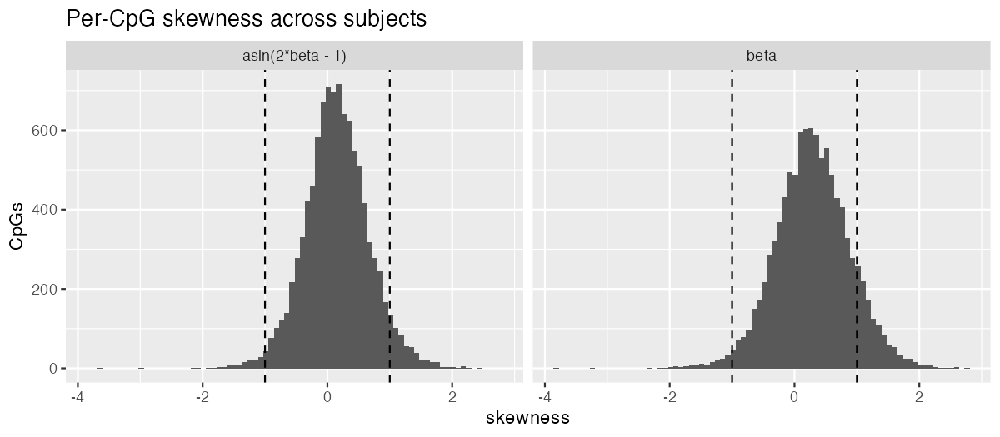
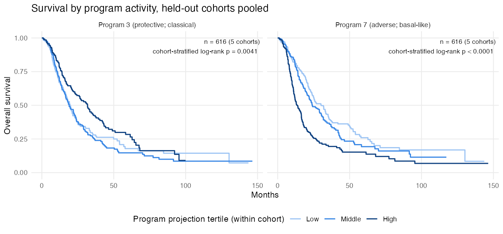

# October 2, 2026

## Summary {.unnumbered}

- **The multimodal model now chooses its own number of factors.** The model could not prune spare factors, and we found two reasons why. The first is that unregularized per-feature precisions let a spare factor fit one feature exactly. The second is that the model had no intercept. We fixed both with an intercept, point-Laplace loadings, marginal-likelihood prior fits and evidence-based factor pruning. In a replicated simulation sweep the pruned fit returns about the true $K=3$ for every $K_{\mathrm{init}}$ from 3 to 15, where the original fit kept all $K_{\mathrm{init}}$ factors. Prognostic programs that carry variance are recovered with the correct signs. A low-variance prognostic program is still missed. (§2)
- **First real-data result.** The joint multimodal model was trained on TCGA expression + methylation and evaluated on ICGC. External C is 0.685 (95% CI 0.579–0.779), against 0.491 for expression-only YFB and 0.424 for the two-step model. The intervals are wide and overlap. The survival-active factor corresponds to single-modality Program 7.
- **Two discussion points from the real data.** The ELBO is dominated by reconstruction at 13,000 features, so survival cannot affect which factors are kept. The factors found are mostly modality-specific. Feature selection for two modalities is still open. (§3, §4)
- **The single-modality results now include held-out Kaplan–Meier evidence.** In the five held-out cohorts the frozen model stratifies survival, and its adverse and protective programs keep their direction. We also checked how the reported C-indices were oriented: the numbers stand. (§5)
- **The single-modality α_F question has candidate solutions and a test design.** The projection score $Z_F$ is now defined in the derivation. (§6)

---

## §1 — The multimodal model

This section restates the model for readers who have not seen the derivation. Every update equation is in `derivations/multimodal_YFB/multimodal_YFB_derivation.pdf`.

**Data.** For $n$ matched patients, $Y_1\in\mathbb R^{n\times p_1}$ is gene expression, $Y_2\in\mathbb R^{n\times p_2}$ is DNA methylation, and $(t_i,\delta_i)$ is survival.

**Reconstruction.** The scores are shared across modalities. Each modality has its own loadings and baseline:

$$
Y_m = \mathbf 1\mu_m^\top + L F_m^\top + E_m,\qquad E_{mij}\sim N(0,\tau_{mj}^{-1}),\qquad m=1,2.
$$

- $L\ge0$ ($n\times K$, shared): how active program $k$ is in patient $i$.
- $F_m$ ($p_m\times K$, one per modality): how far each gene or CpG moves from its baseline $\mu_{mj}$ when the program is active. A program can be active in one modality and absent in the other.
- $\mu_m$ is a per-feature intercept, re-estimated every sweep. Each feature has its own residual precision $\tau_{mj}$.
- More cohorts would add rows of $L$ (patients). More modalities add rows of $F$ (features), each block with its own prior.

**Survival.** A Cox model with linear predictor

$$
\boldsymbol\eta = (Y_1F_1+Y_2F_2)\,\beta,\qquad Z_{ik}=\sum_m\sum_j y_{mij}f_{mjk}.
$$

- $Z$ projects a patient's measurements onto the loadings. A new patient's risk therefore needs only their data and the fitted $F$ and $\beta$, not an estimate of their $L$.
- Survival enters the $F$ and $\beta$ updates but not the $L$ update.
- A constant shift in $\eta$ does not change the Cox partial likelihood, so the intercept leaves the survival model unchanged.

**Priors.** Every hyperparameter is fit by empirical Bayes.

- Scores: $l_{ik}\sim(1-\pi_{L_k})\delta_0+\pi_{L_k}\operatorname{Exp}(r_{L_k})$.
- Loadings: $f_{mjk}\sim g_{F_{mk}}$, a separate prior for each modality–program pair. The family is chosen per modality: point-exponential, point-Laplace $(1-\pi)\delta_0+\pi\tfrac{\lambda}{2}e^{-\lambda|f|}$, or Normal.
- Survival coefficients: $\beta_k\sim N(0,s^2_{\beta_k})$.

**Fitting.** Coordinate-ascent variational inference, with a Cox working approximation refreshed every outer sweep.

- There are no tempering weights: reconstruction and survival enter the $F$ update as a plain sum.
- The scale of each program is not identified. To fix it, each program is rescaled after its update so that $\mathrm{sd}(Z_{\cdot k})=1$.
- The $\beta$ update uses $E[Z^2]$, which includes the variance of the loadings. This corrects the attenuation that comes from treating estimated scores as fixed.

## §2 — Choosing K in the multimodal model

### Why spare factors survived

In September the number of "active" factors tracked $K_{\mathrm{init}}$. Three things explain this.

1. **Unbounded per-feature precisions.** $\tau_{mj}=n/E\lVert y_{mj}-Lf_{mj}\rVert^2$ is unregularized maximum likelihood. A spare factor can load on a single feature and fit it exactly, which sends that feature's $\tau$ to infinity. In simulation this reached about $10^{16}$, against true values of at most 2.6. The likelihood gain is unbounded, so the factor is never worth removing.
2. **No intercept.** On uncentered data (log2 expression, β methylation), nonnegative factors absorb the per-feature means. Centering the data alone does not help, because nonnegative scores cannot produce zero-mean columns.
3. **The September simulations were too noisy to test this.** Each true factor explained about 0.7% of the variance, so the 1% "active" cutoff could not count even the true factors. The 5–9 active factors we saw were fitting noise in the high-variance features.

### The parsimony framework

These options are added to `fit_multimodal_yfb()`. The defaults keep the original behavior.

| Component | What it does |
|---|---|
| Intercept $\mu_m$ | Absorbs feature means. $F$ then describes deviations from baseline. |
| Point-Laplace prior on $F$ | Signed, sparse loadings around the baseline. |
| Marginal-likelihood prior fits (`ebnm`) | A whole program's prior can shrink to the point mass at zero. |
| Evidence-based pruning | After convergence, remove the factor whose removal does not lower the ELBO, refit, and repeat. |

**The ELBO.** The pruning rule compares

$$
\text{ELBO} = E_q\log p(Y\mid L,F,\mu,\tau) + \log PL(E[\eta]) - \sum \mathrm{KL}(q\Vert g),
$$

- $\log PL(E[\eta])$ is the Breslow partial log-likelihood, evaluated at the posterior-mean predictor.
- Each KL term comes from the EBNM identity $\mathrm{KL}=E_q\log N(x;\theta,s^2)-\log p(x)$.
- Every candidate factor set has its own intercept and $\tau$ re-estimated.

**How factors are classified.** A factor that survives pruning either explains molecular variance, explains survival ($|E\beta_k|/\mathrm{SD}\beta_k\ge1.96$), or both. A survival-only factor stays if its gain in partial log-likelihood is larger than its KL cost.

**Single-seed evidence.** Moderate noise, true $K=3$, $n=120$, 50 + 50 features:

| Scenario | $K_{\mathrm{init}}$ | Final $K$ | True factors recovered ($\lvert r\rvert$) | Prognostic programs survival-active | Held-out C |
|---|---|---|---|---|---|
| Two prognostic programs | 5 | 3 | 1.00, 0.99, 0.99 | 2 of 2 | 0.805 |
| Two prognostic programs | 12 | 3 | 1.00, 1.00, 0.99 | 2 of 2 | 0.805 |
| Adverse + protective | 5 | 3 | 1.00, 1.00, 0.99 | 2 of 2, correct signs | 0.808 |
| Adverse + protective | 12 | 5 | 1.00, 1.00, 0.99 | 2 of 2 (+2 survival-only duplicates) | 0.790 |
| Low-variance prognostic | 5 or 12 | 3 | 1.00, 1.00, **0.47** | partially | 0.728 |

**What doesn't work yet.**

- **Low-variance prognostic program.** It is found only as a survival-only factor whose loadings match the truth partially ($\lvert r\rvert=0.47$). Survival is partly credited to the high-variance programs.
- **Duplicates at large $K_{\mathrm{init}}$.** The fit can keep a reconstruction factor and a survival-only copy of the same program.
- **The other precision models.** One $\tau$ per modality removes the degeneracy but mis-weights heteroscedastic features (no pruning; C fell to 0.65). An empirical-Bayes Gamma prior on $\tau$ learns a heavy tail, so $\tau$ still reached about $10^{17}$.

### Replicated sweep (preliminary: 2 seeds)

**Design.** The original fit and the pruned fit were run on identical simulated data:

- $K_{\mathrm{init}}=3,5,7,10,15$;
- three scenarios;
- moderate noise;
- two seeds per setting, 60 fits in all, with no errors.

The full sweep (both noise levels, $K_{\mathrm{init}}=3,\dots,10,15$, three seeds) is still running.

| Scenario | Final $K$, original ($K_{\mathrm{init}}$ = 3 / 5 / 7 / 10 / 15) | Final $K$, pruned | True factors recovered, pruned | Prognostic programs survival-active, pruned | Held-out C, pruned |
|---|---|---|---|---|---|
| Two prognostic programs | 3 / 5 / 7 / 10 / 15 | 3 / 3 / 3 / 3 / 3.5 | 3 of 3 at every $K_{\mathrm{init}}$ | 100% (75% at 15) | 0.787–0.788 |
| Adverse + protective | 3 / 5 / 7 / 10 / 15 | 2.5 / 3 / 3.5 / 3.5 / 3 | 3 of 3 from $K_{\mathrm{init}}\ge5$ | 75–100% | 0.783–0.795 |
| Low-variance prognostic | 3 / 5 / 7 / 10 / 15 | 2 / 2.5 / 2.5 / 2.5 / 2.5 | 2 of 3 (the low-variance program is missed) | 0% | 0.61 |

What the sweep shows:

- **$K$ no longer follows $K_{\mathrm{init}}$.** With pruning, the final number of factors stays near the truth from $K_{\mathrm{init}}=3$ to 15. The pruned fits also converged in every run; the original fit converged in 0–50% of runs.
- **Variance-carrying prognostic programs are recovered with the right signs.** In the two scenarios where the prognostic programs carry variance, the fit recovers them and assigns survival to them with the correct sign.
- **The low-variance prognostic program is lost by both methods,** and the survival association is credited to the wrong factor (one false survival-active factor). This is the main limitation; see §4 for why.
- **Minor issues.** At $K_{\mathrm{init}}=3$ a true factor is sometimes pruned. At large $K_{\mathrm{init}}$ a survival-only duplicate of a prognostic program sometimes survives.

## §3 — Real data: matched TCGA and ICGC expression + methylation

`code/load_multiomics_data.R` builds the cohorts from the files Yusha shared. Tests check that patient IDs agree across expression, methylation and survival.

| Cohort | Role | Patients | Events | Notes |
|---|---|---|---|---|
| TCGA-PAAD | training | 144 | 75 | 6 of 150 dropped (missing or non-positive time) |
| ICGC primary PDAC | external validation | 50 | 30 | primary tumors with PDAC histology |
| ICGC, all donors | sensitivity | 67 | 40 | adds 10 IPMN with invasion, 4 adenosquamous, 2 acinar, 1 signet ring |

**Preprocessing**

- **Expression.** TCGA is log2(TMM-CPM + 1) as provided. ICGC is provided unlogged, so log2(x + 1) is applied. ICGC donor DO33168 has two RNA samples, which are averaged in the source object.
- **Methylation.** β-values on the 305,352 CpGs that pass both cohorts' sex-chromosome filters, matched by probe name. KNN imputation fills the 0.07% of TCGA values that are missing, done within each cohort.
- **Survival.**
  - TCGA comes from the PDAC_data survival table.
  - ICGC comes from `info.expr`, collapsed to one row per donor. It agrees exactly with the PACA_AU_seq table; an earlier "11 of 80 disagree" was an artifact of comparing NA with NA.
- **Screening, on TCGA only.** 3,000 genes by the DeSurv combined mean + variance rank, and the 10,000 most variable CpGs.

**Methylation scale.** Across the 10,000 screened CpGs:

| Scale | Median \|skewness\| | CpGs with \|skewness\| > 1 | Median excess kurtosis | Shapiro–Wilk rejects |
|---|---|---|---|---|
| β | 0.43 | 13% | −0.73 | 92% |
| asin(2β − 1) | 0.34 | 6.6% | −0.70 | 82% |

- The arcsine transform halves the share of strongly skewed CpGs, but neither scale is Gaussian. Both are flatter than Normal, which fits bimodal methylation.
- With the intercept and signed priors, either scale can now be used. The first fits use β-values.

::: {.callout-note}
## Discussion point: feature selection for two modalities

The screening uses DeSurv's single-modality gene rule and a variance rule for CpGs. Three questions are open:

- **How many CpGs relative to genes?** We keep 10k CpGs and 3k genes, so methylation has more than three times as many features. Without per-modality weights it can dominate the reconstruction likelihood.
- **Variance-based or survival-aware screening?**
- **CpGs screened separately, or mapped to the selected genes** (for example, promoter CpGs)?
:::

## §4 — First real-data fits: TCGA → ICGC

**First completed fit: pruned framework, $K_{\mathrm{init}}=7$.** The other starting ranks are still running.

| External C (95% bootstrap CI; orientation fixed from training) | ICGC primary PDAC (n = 50) | ICGC all donors (n = 67) | TCGA (training) |
|---|---|---|---|
| **Joint multimodal (expression + methylation)** | **0.685** (0.579–0.779) | **0.639** (0.547–0.734) | 0.638 |
| Expression-only YFB, same genes | 0.491 (0.364–0.633) | 0.480 (0.369–0.581) | 0.594 |
| Two-step EBMF → Cox, stacked modalities | 0.424 (0.286–0.567) | 0.418 (0.310–0.531) | 0.579 |

**The programs match the single-modality ones.**
- The joint fit's one survival-active factor (adverse direction) corresponds to single-modality **Program 7** ($\lvert r\rvert=0.68$ over 1,781 shared genes).
- Its largest expression factor corresponds to **Program 3** ($\lvert r\rvert=0.79$), although here it is not survival-active.
- Every factor has a counterpart in Yusha's unsupervised `tcga_flash_K14` fit ($\lvert r\rvert$ 0.60–0.87).

**Caveats.**
- **Small validation set.** With 50 donors and 30 deaths the intervals are wide, and the joint model's interval overlaps the expression-only model's.
- **Weak baselines.** Both baselines fall below 0.5 on ICGC, so part of the gap reflects their failure to transfer.
- **Not formally converged.** The fit stopped at the 500-sweep cap. The risk score had stabilized (largest relative change in $\eta$ $3.6\times10^{-4}$), but the largest per-feature reconstruction change stayed around 1%. That maximum over 13,000 features is being held up by a few slowly moving features. Stopping on the ELBO or a mean change is the planned fix.

**Why nothing was pruned at $K_{\mathrm{init}}=7$.** The nullcheck asks, for each factor, how much the ELBO would fall without it:

| Factor | Loads on | Reconstruction loss if removed | Survival loss | KL saved |
|---|---|---|---|---|
| 1 | expression | −100,137 | 0.0 | +22,602 |
| 2 | expression and methylation | −132,648 | 0.0 | +16,504 |
| 3 | expression | −54,407 | 0.0 | +9,352 |
| 4 (survival-active) | expression | −74,714 | −2.9 | +20,323 |
| 5 | expression | −39,226 | −0.8 | +14,310 |
| 6 | expression | −92,923 | 0.0 | +18,227 |
| 7 | methylation | −301,982 | 0.0 | +28,895 |

The table answers the question, and it raises two discussion points.

- **The data support all seven factors.** With 144 × 13,000 values, each factor gains far more in reconstruction than it costs in KL. This is consistent with the unsupervised flash fit, which keeps 14 factors on expression alone. Pruning should start removing factors only at larger $K_{\mathrm{init}}$, which the sweep will show.
- **Survival is negligible in the ELBO at this scale.** It contributes under 3 nats to any factor, against $10^4$–$10^5$ for reconstruction. There are 144 partial-likelihood terms against about 1.9 million reconstruction terms. Survival therefore cannot affect which factors are kept, and this is also why the simulated low-variance prognostic program is lost. It is the same scale imbalance that the single-modality α/α_F weights were introduced for.
- **The factors are mostly modality-specific.** Only factor 2 loads on both modalities. Factor 7 is methylation-only and the others are expression-only. The shared-score model allows shared programs but does not require them. Whether shared expression–methylation programs should be expected, and whether CpGs should be screened relative to the selected genes (§3), are questions for discussion.

- **Arms.** All arms use the same training patients and screened features:
  - joint multimodal YFB (the pruned framework);
  - expression-only YFB on the same genes;
  - two-step EBMF → Cox on the stacked modalities.
  - Also included as a reference: the original multimodal fit at $K=7$.
- **Starting ranks.** $K_{\mathrm{init}}=3,\dots,10,15$, matching the single-modality K sweep.
- **Metric.** Harrell's C, with the risk orientation fixed from training, and a 1,000-sample bootstrap 95% CI. Reported for the ICGC primary-PDAC set and the all-donor sensitivity set.
- **Factors.** Retained programs classified by role. Expression loadings are compared with the single-modality programs (P3 protective, P7 adverse, and the stromal and immune programs) and with Yusha's `tcga_flash_K14`.

[TABLE + FIGURES: `real_sweep_summary.csv`, `real_sweep_factor_roles.png`, `real_sweep_cindex.png`, `real_factor_comparison.csv`]

## §5 — Single-modality results: held-out survival stratification

The recommended single-modality fit (YFB, K_init = 7, trained on TCGA-PAAD + CPTAC) retains four programs:

| Program | Role | Character | Example genes |
|---|---|---|---|
| Program 7 | Survival-associated (adverse) | Basal-like / glycolytic | *MET*, *ITGA3*, *ENO1*, *LDHA* |
| Program 3 | Survival-associated (protective) | Classical / epithelial | *MLPH*, *CAPN5*, *TSPAN15* |
| Stromal program | Expression only | Stromal | collagens, *FAP*, *SPARC* |
| Immune program | Expression only | Immune | *IKZF1*, *IL10RA* |

Its mean external C across five held-out cohorts is 0.627, against 0.581 for the two-step baseline. It is higher in every cohort, although only Puleo's paired difference is individually significant. The pooled difference is $\Delta C=0.042$ (95% CI 0.013 to 0.071).

**The frozen model separates survival in every held-out cohort.**
- Separation is clearest in Puleo (largest cohort, log-rank $p<0.0001$) and Dijk ($p=0.0005$).
- It is weakest in Moffitt ($p=0.17$; C = 0.549).

**Both survival-associated programs keep their direction out of sample.** Pooled over the 616 held-out patients, with log-rank tests stratified by cohort:
- High Program 7 activity: worst survival ($p<0.0001$).
- High Program 3 activity: best survival ($p=0.004$).

::: {.callout-important}
## How the reported C-indices are oriented

- **The problem.** The script that produced the external C table chose each risk score's direction separately in every validation cohort, using that cohort's outcomes. The 9/4 review flagged this convention as circular.
- **Why the numbers don't change.** The saved fit predates the 9/4 sign fix, so its $\eta$ is a good-prognosis score in all five cohorts. A single global flip, risk $=-\eta$, chosen before seeing any validation outcome, reproduces every reported C (0.634, 0.549, 0.648, 0.657, 0.645).
- **Going forward.** Orientation is fixed from training only. A model that fails in a cohort will show C < 0.5 rather than being flipped. The reporting script now uses these frozen orientations, and its rerun reproduces the C-index and paired-difference tables exactly.
:::

## §6 — Single-modality YFB: $Z_F$, and the α_F question

### The projection score $Z_F$

The β derivation (`derivations/cox_on_YF/qBeta/qBeta_YF_derivation.pdf`) now defines

$$
Z_F = Y\,E[F],\qquad (z_F)_{ik}=\sum_j y_{ij}E[f_{jk}].
$$

- **What it is.** Patient $i$'s expression profile projected onto program $k$'s loadings. The subscript says the score is built from $F$, not $L$.
- **How it differs from $L$.** $L$ appears only in the reconstruction. $Z_F$ appears only in the Cox predictor.
- **Normalization in the code.** The loading columns are normalized before projecting, $\hat Z_F = YE[F]D^{-1}$. This changes only the units of $\tilde\beta$.
- **No attenuation correction.** Within an iteration $\hat Z_F$ is held fixed, so the single-modality β update has no second-moment correction. The multimodal model has one (§1).

### α and α_F

- **What the weights do.**
  - α = 0.5 tempers the Cox term in the β update. It changes only β's posterior width.
  - α_F = 0 keeps survival out of the F update, so F is the same as in unsupervised EBMF.
- **The consequence.** The model keeps programs that explain a lot of expression variance and are also prognostic. It cannot find a low-variance prognostic program, which is the advantage of supervision that the literature review argues for.
- **Why α_F was set to 0.** In early versions, survival in the F update started a feedback loop between F and L that ended in collapse. Under current preprocessing that no longer happens, but α_F > 0 also did not improve C: α_F = 0, 0.1, 0.3 and 0.5 gave mean external C of 0.6267, 0.6268, 0.6263 and 0.607.

| # | Candidate | Mechanism | Changes the model? |
|---|---|---|---|
| 1 | Factor rescaling with α = α_F = 1 (plain sum) | Pins each factor's scale, which removes the freedom behind the F-grows/L-shrinks loop. The multimodal model already runs this way. | No |
| 2 | Warm start from the α_F = 0 fit | Avoids the initialization imbalance, where β ≈ 0 and survival has nothing to start from | No |
| 3 | Increase α_F gradually from 0 to 1 | Optimization device only; the final objective is the plain sum | No |
| 4 | Reorder the updates | Limits how far each step can move the coupled L–F–β system | No |
| 5 | α as a likelihood power with a stated rule | Tempered posterior | Yes (fallback) |

**Test design, fixed in advance.**
- **Simulation.** Plant a low-variance prognostic program. Success means recovering its loading ($\lvert r\rvert\ge0.7$) and finding it survival-active more often than the α_F = 0 fit does, without losing the high-variance programs.
- **Real data.** Pooled-bootstrap ΔC against 0.627.
- **If supervision doesn't change F,** we report that, and the prelim framing is limited accordingly.

**An implementation note.** With survival in the F update, every feature is coupled through $Z=YF$. An exact coordinate step then has to update one feature at a time, which is slow. The multimodal model already works this way. A block update over a whole column, with the coupling bounded by a diagonal term, keeps each step improving the objective and restores single-modality speed. Both models will need this.

## §7 — Open items and next steps

- **Multimodal model.**
  - Finish the full simulation sweep (§2) and the real-data $K_{\mathrm{init}}$ sweep (§4).
  - Fix the survival-only duplicates.
  - **Give survival a voice in factor selection.** At realistic $p$ the ELBO is dominated by reconstruction (§4). The options are:
    - per-modality likelihood weights;
    - survival-aware feature screening;
    - a separate retention rule for survival-active factors.
    This is the multimodal version of the α_F question, and the route to recovering low-variance prognostic programs.
  - Change the stopping rule to the ELBO or a mean change, with $\eta$ stability still required.
- **Feature selection and modality balance.** Settle these together (§3 discussion point).
- **Runtime.**
  - Done: the loading sweep is now compiled code, 5× faster on real data, with identical results.
  - Remaining: `ebnm` prior refits take about half the time.
  - Still needed: the full 305k-CpG fit on Longleaf, and the block update.
- **Single modality.** Run the α/α_F experiments (§6). 
- **Prelim.** The proposal chapter draft is in `paper/prelim/project3-ssbmf.qmd` (21 pp). Its multimodal results are pending.
