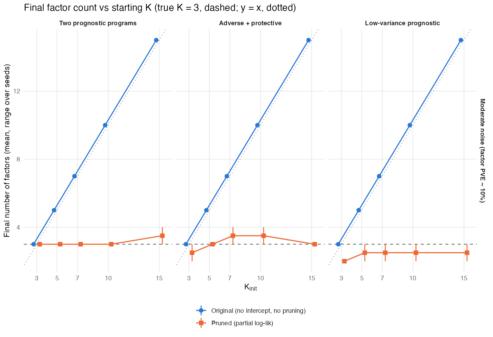
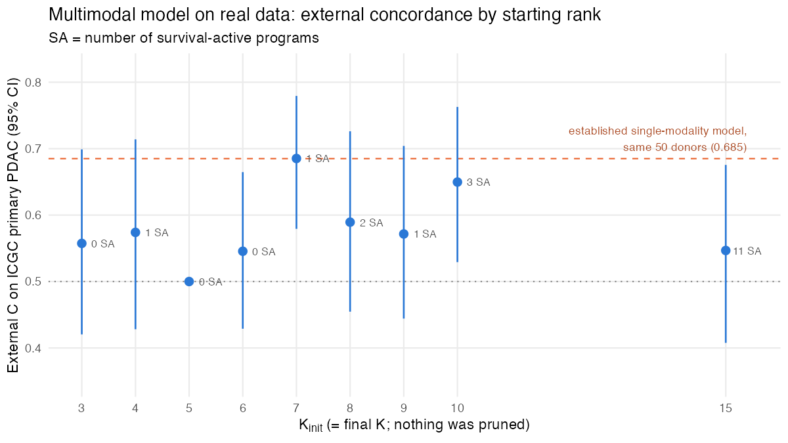
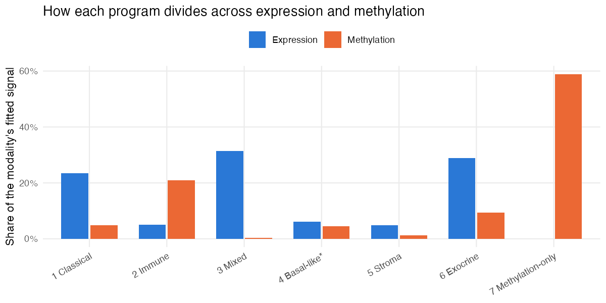
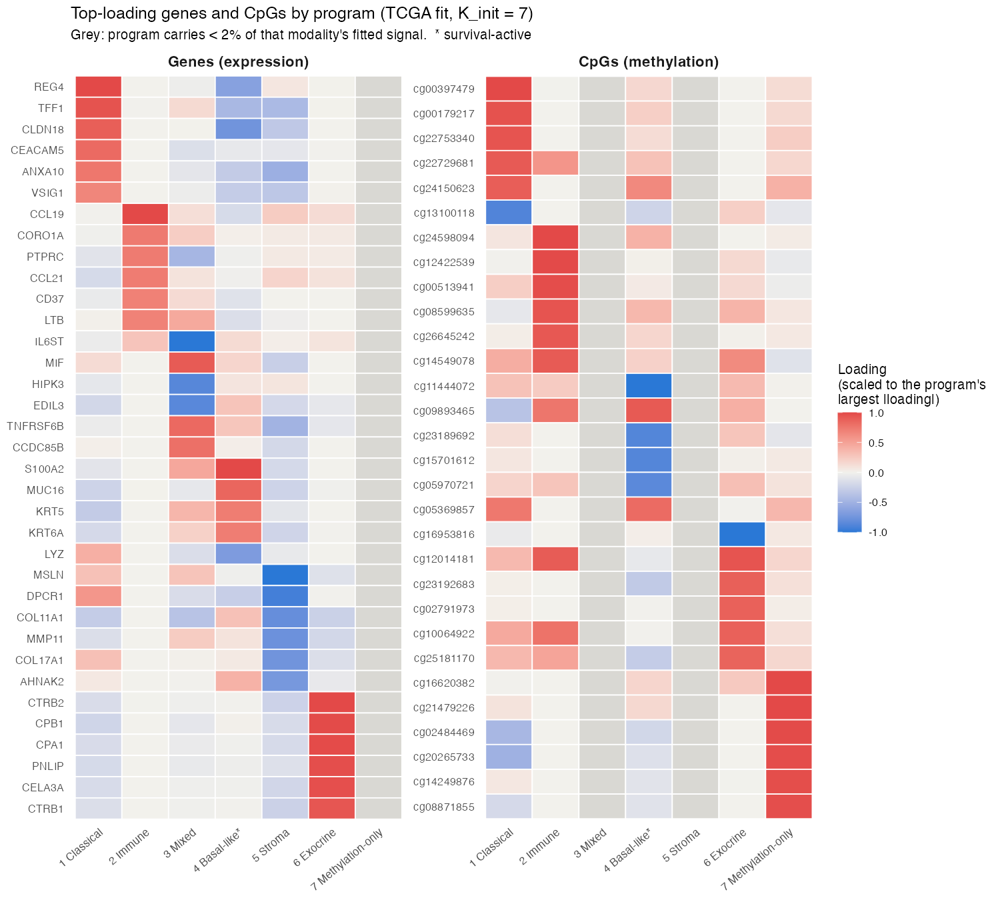

# October 2, 2026

## Executive summary {.unnumbered}

**Progress since 9/18**

1. **The multimodal model now picks its own number of programs in simulation.**
   - Two fixes made this work: a per-feature intercept, and evidence-based pruning of unneeded programs.
   - From any starting rank (3–15), it returns about the true 3 programs, recovers them, and converges every time. The September version kept every starting program.
2. **First real-data results** (train on TCGA, n = 144; validate on ICGC primary PDAC, n = 50, 30 deaths).
   - At the pre-specified starting rank (7) it matches our single-modality model on the same donors: C = 0.685 vs 0.685.
   - Across other starting ranks C is lower (median 0.57).
3. **The programs it finds are known PDAC biology:** basal-like vs classical, normal vs activated stroma, immune and exocrine.
   - The one prognostic program is the basal-like axis (ICGC HR 1.99 per SD, p = 0.0003), the same signal as single-modality Program 7.
4. **Methylation does not yet add prediction** (+0.01 in C). It mainly adds an immune program and a methylation-only program, neither prognostic.
5. **Single-modality results checked and extended.**
   - Held-out Kaplan–Meier curves: risk groups separate in 3 of 5 external cohorts (log-rank p < 0.05).
   - Against the fairest two-step baseline the gain is small: +0.026 in C.

**Open problems**

- **On real data, nothing gets pruned**, so the starting rank fixes the number of programs and the results depend on it. With 13,000 molecular features against 75 deaths, survival has almost no influence on which programs are kept.
- **A prognostic program that explains little variance is still missed** in simulation. This is the same issue as α_F in the single-modality model.

**For discussion**

1. **Give survival and each modality explicit weights** so that survival influences which programs are kept. There are two ratios to set: methylation vs expression, and survival vs molecular data. Start from default weights, then check sensitivity on a small grid?
2. **Choose CpGs linked to the selected genes** (e.g. promoter CpGs) instead of the 10,000 most variable. Would that let methylation add information?
3. **Is matching the single-modality model a useful result for the prelim**, or do we need a gain before presenting the multimodal model?

---

## The model works as designed in simulation

The code passes 531 tests. Key updates match the `ebnm` package and independent closed-form checks.

In simulation (486 fits with a known truth of 3 programs) the recommended fit — **intercept + signed loadings + empirical-Bayes priors + evidence-based pruning** — returns about 3 programs from any starting rank. The September version kept them all:

| Moderate noise | September version | Recommended fit |
|---|---|---|
| True programs recovered (of 3) | 2.74–2.78 | **2.96–3.00** |
| Held-out C | 0.78 | **0.80** |
| Fits converged | 7–37% | **100%** |

The one failure is a prognostic program that explains little variance: neither version finds it.

## On real data it matches the single-modality model but does not beat it

At the pre-specified starting rank (7) the multimodal model matches our established single-modality model on the same 50 ICGC donors. Away from that rank it does worse. Nothing is pruned on real data, so the starting rank also sets the final number of programs.

| ICGC primary PDAC (n = 50) | C (95% CI) |
|---|---|
| Single-modality model (trained on TCGA + CPTAC) | 0.685 (0.58–0.79) |
| Multimodal, expression + methylation (TCGA) | 0.685 (0.58–0.78) |
| Multimodal, expression only (TCGA) | 0.676 (0.57–0.77) |
| September multimodal version (TCGA) | 0.453 (0.32–0.60) |

## Methylation adds structure, not prediction

Adding methylation changes C by +0.01. Most of the methylation signal goes to a methylation-only program (59%) and to an immune program (21%). Neither program is prognostic. The prognostic basal-like program is almost entirely expression.

Our reading is that the 10,000 most variable CpGs mostly track cell composition, especially immune content. Choosing CpGs tied to the selected genes is the next test.

---

# Supporting results {.unnumbered}

## A. Why spare programs used to survive, and the fix

- **Exact fits to single features.** Without an intercept, a spare program could fit one feature exactly. That gave it an unbounded likelihood gain, so it was never removed. The intercept fixed this.
- **Absorbing baseline levels.** Nonnegative programs absorbed each feature's mean level. With the intercept, loadings now measure deviation from baseline and can take either sign.
- **The September simulations could not show the problem.** Each true program explained under 1% of variance.
- **How pruning works.** A program is removed if the model's evidence (ELBO) is no lower without it. Then the model is refit and the check repeated.

## B. Simulation results, all scenarios

Means over starting ranks 3–15 and 3 seeds. Each cell is September version / recommended fit.

| Noise | Scenario | Programs recovered (of 3) | Prognostic programs found | False prognostic programs | Held-out C |
|---|---|---|---|---|---|
| moderate | two prognostic | 2.74 / **3.00** | 0.93 / 0.87 | 0.82 / **0.67** | 0.78 / **0.80** |
| moderate | adverse + protective | 2.78 / **2.96** | 0.89 / 0.87 | 0.70 / **0.59** | 0.79 / 0.79 |
| moderate | low-variance prognostic | 2.00 / 1.96 | 0 / 0 | 2.22 / **1.26** | 0.63 / 0.63 |
| high | two prognostic | 0.11 / **1.19** | 0.06 / **0.59** | 2.85 / **0.44** | 0.70 / **0.79** |
| high | adverse + protective | 0.59 / **1.33** | 0.30 / **0.67** | 1.41 / **0.52** | 0.70 / **0.80** |
| high | low-variance prognostic | 0.15 / **0.93** | 0 / **0.52** | 2.63 / **1.15** | 0.69 / **0.81** |

- "Prognostic programs found" is the share of true prognostic programs found, with the correct sign.
- The recommended fits converged in every run and ran about twice as fast.

A variant that adds a variance correction to the survival term gave identical results, so it is not used.

## C. Real data: all starting ranks

| Starting rank | 3 | 4 | 5 | 6 | 7 | 8 | 9 | 10 | 15 |
|---|---|---|---|---|---|---|---|---|---|
| Prognostic programs | 0 | 1 | 0 | 0 | 1 | 2 | 1 | 3 | 11 |
| ICGC primary C | 0.56 | 0.57 | 0.50 | 0.55 | **0.69** | 0.59 | 0.57 | 0.65 | 0.55 |

- At rank 5 no program is prognostic, so every patient gets the same risk score (C = 0.50).
- At rank 15, eleven programs look prognostic but C falls. Those associations do not hold in new data.
- Most fits stopped at the 500-iteration cap. Their risk scores had stabilized; the overall fit had not.

## D. Why nothing is pruned on real data

Change in the model's evidence if each program were removed, starting rank 7:

| Program | Molecular fit lost | Survival fit lost | Complexity saved |
|---|---|---|---|
| Classical | −100,137 | 0.0 | +22,602 |
| Immune | −132,648 | 0.0 | +16,504 |
| Mixed | −54,407 | 0.0 | +9,351 |
| **Basal-like (prognostic)** | −74,714 | **−2.9** | +20,323 |
| Stroma | −39,226 | −0.8 | +14,310 |
| Exocrine | −92,923 | 0.0 | +18,227 |
| Methylation-only | −301,982 | 0.0 | +28,895 |

- Every program is strongly supported by the molecular data.
- Survival barely moves the evidence: 75 deaths against about 1.9 million molecular values. This is the case for adding weights (discussion item 1).

## E. The programs found (TCGA, starting rank 7)

| Program | Top genes | Methylation share | Prognostic | HR in ICGC (p) |
|---|---|---|---|---|
| **Basal-like vs classical** | *KRT5, KRT6A, KRT17, S100A2*; vs *CLDN18, REG4* | 4.5% | **yes** | **1.99 (0.0003)** |
| Normal vs activated stroma | *ADH1B, C7*; vs *COL11A1, MMP11* | 1.2% | no | 0.83 (0.46) |
| Classical / gastric | *REG4, TFF1, CLDN18, CEACAM5* | 4.8% | no | 0.79 (0.30) |
| Immune | *CCL19, CCL21, PTPRC, LTB* | 20.9% | no | 0.87 (0.54) |
| Exocrine / acinar | *CTRB2, CPB1, PNLIP, PRSS1* | 9.3% | no | 1.17 (0.37) |
| Mixed | *MIF, TNFRSF6B* | 0.3% | no | 1.48 (0.05) |
| Methylation-only | — | 58.9% | no | 0.87 (0.44) |

- **Agreement with other fits.** The basal-like program matches single-modality Program 7 (r = 0.68). The classical program matches Program 3 (r = 0.79), though here it is not prognostic.
- **Hazard ratios** are per SD of each program's score. They are unadjusted and descriptive.

## F. All real-data comparisons (starting rank 7)

| Model | Data | ICGC primary | ICGC all donors (n = 67) |
|---|---|---|---|
| Multimodal | expression + methylation | 0.685 | 0.639 |
| Multimodal | expression only | 0.676 | 0.653 |
| September multimodal version | expression + methylation | 0.453 | 0.442 |
| Two-step (factorize, then Cox) | expression only | 0.525 | 0.527 |
| Two-step | expression + methylation | 0.424 | 0.418 |

The single-modality model scores 0.685 on the same ICGC primary donors. It was trained on TCGA + CPTAC.

## G. Single-modality model: held-out survival curves

The low-risk third has the best survival in every cohort. The log-rank test is significant in Puleo (p < 0.0001), Dijk (0.0005) and PACA-AU RNA-seq (0.021), but not in PACA-AU array (0.075) or Moffitt (0.17).

High Program 7 activity predicts worse survival (p < 0.0001) and high Program 3 activity better survival (p = 0.004).

## H. Single-modality model vs two-step baselines

| Two-step baseline | Mean external C | Gain of the single-modality model (95% CI) |
|---|---|---|
| Independently chosen K = 40, LASSO Cox (fairest) | 0.601 | +0.026 (0.000 to 0.050) |
| K matched to the model (7) | 0.623 | +0.011 (−0.013 to 0.033) |
| K = 20, unpenalized Cox (reported earlier) | 0.581 | +0.042 |

- The two approaches perform similarly. With α_F = 0, survival does not shape the single-modality programs, so the model's small advantage comes from its priors and shrinkage, not from supervised discovery.
- **Orientation.** Risk-score direction is now fixed from the training fit. The reported C-indices are unchanged.

## I. Data and preprocessing

- **Cohorts.**
  - TCGA: 144 patients, 75 deaths (training).
  - ICGC primary PDAC: 50 donors, 30 deaths (validation).
  - ICGC all donors: 67 donors, 40 deaths (sensitivity analysis).
- **Features.**
  - Expression: log2 scale; 3,000 genes chosen by the DeSurv rule.
  - Methylation: beta-values; 10,000 most variable CpGs.
  - All features chosen on TCGA only.
  - Missing CpG values (0.07%) imputed by k-nearest neighbors within each cohort.
- **Methylation scale.** Neither the beta scale nor the arcsine transform is close to Gaussian. The arcsine transform halves the share of strongly skewed CpGs.

## J. Single-modality α_F: options to test

- **The problem.** α_F = 0 keeps survival out of the program loadings, so only high-variance programs are found. The aim is to remove the weight, not to tune it.
- **Options:**
  - rescale programs as in the multimodal model, so the plain sum is stable;
  - warm-start from the α_F = 0 fit;
  - phase survival in gradually;
  - change the update order.
- **Test.** Can the model recover a planted low-variance prognostic program in simulation?
