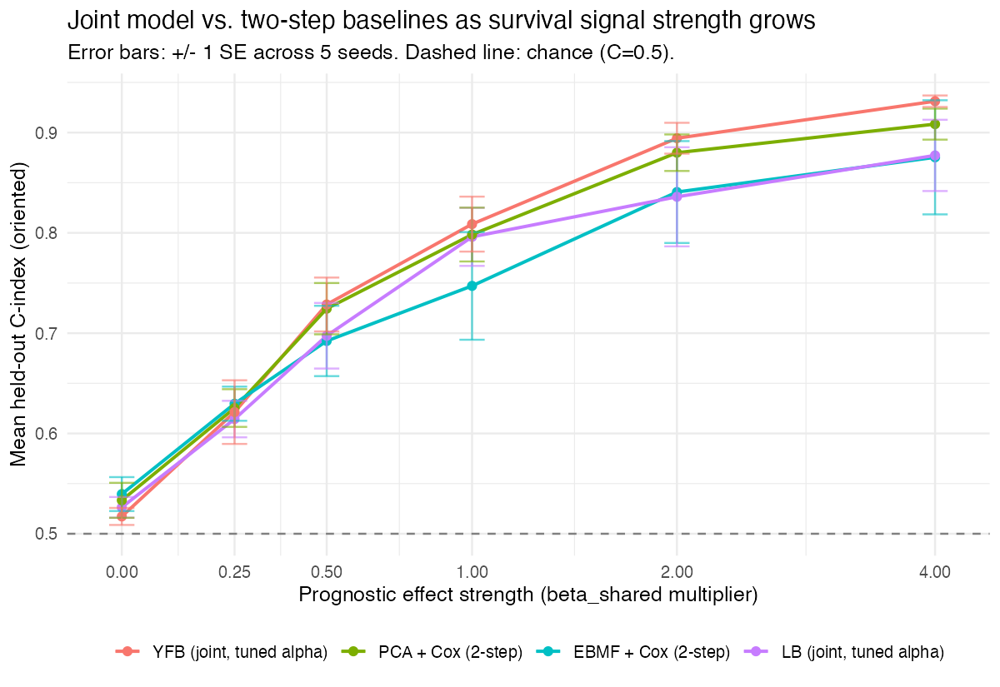
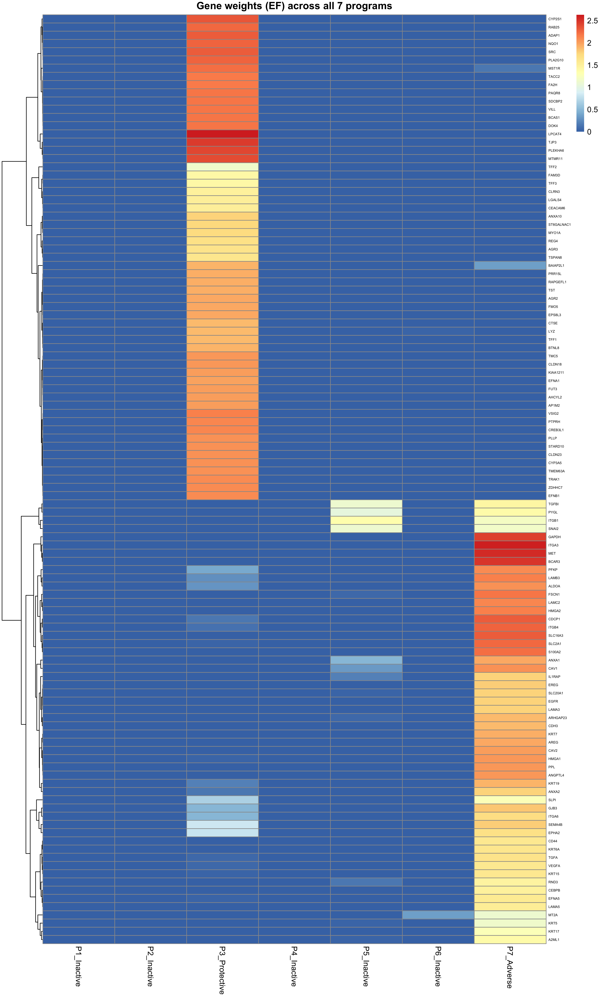

```{r setup}
library(knitr); library(dplyr)
DS   <- "../../results/benchmark_sim/outputs/desurv_comparison/desurv_comparison_results.csv"
MC   <- "../../results/multi_cohort_sim/outputs/multicohort_sim_results.csv"
CI   <- "../../results/benchmark_sim/outputs/desurv_comparison/external_cindex_ci.csv"
DIFF <- "../../results/benchmark_sim/outputs/desurv_comparison/external_paired_diff_ci.csv"
OVERLAP <- "../../results/benchmark_sim/outputs/pathway_enrichment/T4_sbmf_desurv_overlap.csv"
rd  <- function(p) if (file.exists(p)) read.csv(p, stringsAsFactors = FALSE) else NULL
desurv <- rd(DS); mc <- rd(MC); ext_ci <- rd(CI); ext_diff <- rd(DIFF); overlap <- rd(OVERLAP)
rec_mean <- if (!is.null(desurv)) round(mean(desurv$c_index[desurv$model == "D4"]), 3) else 0.627
```

## Summary

- **Selected model:** **YFB** ($\eta = (YF)\hat\beta$), with DeSurv-aligned gene
  selection, $K=7$ latent programs, and no cohort indicator.
- **Selected factors:** the model uses **2 of its 7 programs** for survival
  prediction ($K_{\text{eff}}=2$) — matching DeSurv's own ~1 prognostic factor, and
  robust across independent checks, not a tuning artifact.
- **Performance:** **mean external C-index = `r rec_mean` across 5 held-out PDAC
  cohorts**, significantly more concordant than a two-step baseline when pooled
  across cohorts (+0.042, 95% CI 0.013–0.071).
- **Other key findings:** the joint model's advantage over a two-step
  (factorize-then-Cox) baseline widens as survival signal strength increases; the
  two survival-active programs are biologically distinct and correspond to the
  established PDAC adverse (basal-like) / protective (classical) subtype axis,
  confirmed by five independent methods.

## Recent Progress

- **Objective put on a principled footing.** The genomics/survival scale imbalance
  the lab flagged was addressed; the redundant $\lambda$ mixing parameter was retired
  ($\alpha$ already plays its role). Honest finding: for YFB this gave **no
  performance change** — its genomics half and survival half never share a
  coordinate needing rebalancing. A separate train/test preprocessing bug (external
  cohorts were rank-transformed while training was per-platform z-standardized — the
  reverse) was fixed; **this fix alone** explains the headline moving from 0.636 to
  **`r rec_mean`** (a correction, not a regression).
- **Why 7 factors when DeSurv used 3?** Cross-validation genuinely selects $K=7$,
  but only **2 factors are survival-active** ($K_{\text{eff}}=2$, defined as
  $|\hat\beta_k|$ exceeding a fixed threshold of 0.001) — matching DeSurv's own
  ~1 prognostic factor. Two independent optimization strategies
  (warm-start from a higher-$K$ fit, and a joint $(K,\alpha)$ Bayesian-optimization
  search) both land on $K_{\text{eff}}=2$, and a deflation-initialization test
  analytically ruled out initialization as the cause of an earlier ambiguity;
  $K\in\{4,5,7,8\}$ are statistically indistinguishable (spread 0.0015). $K=7$ is
  kept only for one-step reproducibility; $K=4/K=5$ are validated equivalents.
- **Study-specific baseline hazard.** Implemented the requested `+ strata(study)`
  as an optional stratified Cox partial likelihood. Performance-neutral
  (0.6267 → 0.6263), so available but off by default.
- **Biological interpretation of the two active programs.** Complete, and confirmed
  by five independent methods.

## Validation across simulated and real data

**Simulation — joint model vs. a two-step (factorize-then-Cox) baseline**
(re-confirmed under the corrected model this cycle):

- *Turn survival signal up from zero:* at zero signal, joint $\approx$ two-step
  (both near chance); as signal grows, the joint model pulls ahead and the gap
  widens, in 3 of 4 data-generating designs. One artificial design (exactly-sparse,
  symmetric factor loadings) reverses this — traced to a specific, understood
  factor-collapse failure mode, not a survival-coupling defect.

```{r sweep-fig, fig.align="center", out.width="70%", fig.cap="Each of the 4 panels is a different simulation design (default = realistic factor-loading templates; sparse\\_synthetic = an artificial exact-sparse stress test; low\\_snr = weakened shared genomic signal; high\\_K = more shared latent factors) -- the panels are not different models. Within every panel, the x-axis is prognostic effect strength and the 4 colored lines are the models being compared: YFB (recommended, joint) and LB (the other joint variant) against two two-step baselines, PCA+Cox and EBMF+Cox. YFB pulls ahead of both two-step baselines as signal strength increases in 3 of 4 panels, with the gap widening through the highest signal level tested; the one reversal (sparse\\_synthetic) is the known factor-collapse artifact noted above, not a general failure of the joint approach."}

```

- *Shared vs. study-specific factors:*

```{r mc-table}
if (!is.null(mc)) {
  lab <- c(all_shared="All factors shared", hybrid="Hybrid (some shared, some specific)",
           nothing_shared="No shared prognostic factors")
  rows <- lapply(names(lab), function(s) data.frame(
    Scenario = lab[[s]],
    `Joint (YFB)` = round(mean(mc$c_index[mc$scenario==s & mc$arm=="YFB_base"]),3),
    `Two-step (EBMF+Cox)` = round(mean(mc$c_index[mc$scenario==s & mc$arm=="EBMF"]),3),
    check.names = FALSE))
  knitr::kable(do.call(rbind, rows), row.names = FALSE, booktabs = TRUE,
               caption = "Held-out C-index by cross-cohort factor structure (5 seeds).")
}
```

  When no shared prognostic signal exists, joint and two-step are equivalent; in the
  realistic hybrid case (only some factors prognostic) the joint model leads — as
  much through **stability** as accuracy: the unsupervised two-step baseline
  collapses on 2 of 5 seeds (dragging its mean to 0.717), while the joint model is
  stable across all seeds (mean 0.815) and classifies each factor as shared vs.
  study-specific with perfect accuracy.

\newpage

**Real data — 5 held-out PDAC cohorts** (RNA-seq, microarray, proteomics):

```{r ext-table}
if (!is.null(ext_ci)) {
  d4 <- ext_ci %>% filter(model == "YFB (recommended)") %>% arrange(desc(c_index)) %>%
    mutate(`95% CI` = sprintf("(%.3f, %.3f)", ci_lo, ci_hi)) %>%
    select(cohort, c_index, `95% CI`)
  names(d4)[1:2] <- c("Held-out cohort", "External C-index")
  knitr::kable(d4, row.names = FALSE, booktabs = TRUE, digits = 3,
               caption = sprintf("External validation with 95%% bootstrap CI (mean = %.3f).", rec_mean))
}
```

Four of five cohorts clear chance with their CI lower bound above 0.5; **Moffitt
microarray does not** (CI 0.467–0.625), confirming quantitatively what was previously
only a qualitative flag. **Against a two-step (unsupervised EBMF then Cox) baseline
on the same patients, a paired bootstrap finds the recommended model significantly
more concordant when pooled across all 5 cohorts: +0.042 (95% CI 0.013–0.071).**
Individually only the largest cohort (Puleo, $n=288$) reaches significance alone; the
other four all favor the recommended model but are underpowered on their own.
Per-platform z-standardization is essential — most non-per-platform preprocessing
collapses the survival coefficients to zero.

*Bootstrap method:* both the per-cohort CIs above and the paired comparison use
patient-level bootstrap resampling within each cohort (2000 replicates, percentile
CI). The paired comparison resamples patients once per replicate and scores both
models on that identical draw, preserving the correlation between their errors on
shared patients — a more powerful (and correct) test than comparing two
independently-computed CIs. The 5 per-cohort differences are then combined via a
fixed-effect, inverse-variance-weighted pooled estimate.

## Biology of the two active programs

An **adverse** program (basal-like / squamous / MET-EGFR-driven) and a **protective**
program (classical / differentiated-epithelial) — the established PDAC
subtype-survival axis. Confirmed by five independent methods: gene-set enrichment,
PurIST (Purity Independent Subtyping of Tumors; Rashid et al. 2020) subtype
concordance ($\rho=\pm0.58$), external-cohort hazard ratios (adverse HR>1 in 5/5
cohorts, protective HR<1 in 5/5), and direct gene-list overlap with DeSurv's
published programs.

**Methods for the five checks above:**

- **Gene-set enrichment** — `fgsea`, ranked by each program's posterior mean gene
  weight (the model's own $E[F]$ column, no re-ranking), tested against MSigDB
  Hallmark/Reactome/KEGG/GO:BP plus a custom PDAC gene-set collection (Moffitt
  basal/classical, Bailey 2016, DeSurv D1–D3); ORA on the top 50/100/150-weighted
  genes serves as a confirmatory cross-check. The figure below pools the
  `fgsea`-defined **leading-edge genes** (the genes actually driving each set's
  enrichment score, up to 20 per set) across every significant set
  ($\text{padj}<0.10$) for Programs 3 and 7; heatmap rows are hierarchically
  clustered (Euclidean distance, complete linkage) on their weight profile across
  all 7 programs, columns are fixed in program order, and color is the raw
  posterior mean weight.
- **PurIST concordance** — Spearman correlation between each patient's posterior
  mean program loading and their PurIST basal-likelihood probability (TCGA-PAAD,
  the only cohort with PurIST calls available).
- **External-cohort hazard ratios** — a univariate Cox model, per cohort, of a
  leading-edge gene-signature score (mean per-gene z-score across that program's
  leading-edge genes) against overall survival.
- **DeSurv gene overlap** — hypergeometric test and Jaccard index between each
  program's top-270-weighted genes and DeSurv's published per-factor gene lists.

```{r bio-fig, fig.align="center", out.width="65%", fig.cap="Gene weights across all 7 programs, for the union of each active program's leading-edge genes: a clean block-diagonal structure -- Program 3's and Program 7's genes carry weight almost exclusively in their own column, and the other 5 programs carry essentially none. This visually confirms the two active programs are biologically distinct, non-overlapping gene sets, consistent with the PurIST concordance, external-cohort hazard-ratio, and DeSurv gene-overlap evidence above."}

```

**New this cycle — the same 2 programs also emerge fully unsupervised.** Correlating the
unsupervised EBMF fit already used for the two-step baseline (§"Validation," same gene
universe/order as this model) against Programs 3 and 7: EBMF's own factor 1 tracks Program 3
(r=-0.72) and factor 2 tracks Program 7 (r=+0.69), each clearly the best match for its program
among all 20 EBMF factors. This 2-program structure is real, unsupervised signal in the data — not
something the survival term invents. SBMF is best understood as a supervised re-weighting of
EBMF's own factor structure, which is consistent with framing it as a variation on EBMF rather than
a wholly separate model class.

## Comparison against DeSurv

- **Factor count:** SBMF's CV-selected $K=7$ collapses to $K_{\text{eff}}=2$
  survival-active programs — closely matching DeSurv's own ~1 prognostic factor,
  via two independent confirmation strategies (see Recent Progress above).
- **Gene selection overlap:** Program 7 (Adverse) overlaps DeSurv's basal-like-tumor
  factor at Jaccard `r if (!is.null(overlap)) round(overlap$jaccard[overlap$program==7 & overlap$desurv_factor=="DeSurv_D3_BasalLikeTumor"], 2) else 0.18`
  (hypergeometric $p\approx3\times10^{-16}$); Program 3 (Protective) overlaps
  DeSurv's classical-tumor factor at Jaccard
  `r if (!is.null(overlap)) round(overlap$jaccard[overlap$program==3 & overlap$desurv_factor=="DeSurv_D1_ClassicalTumor"], 2) else 0.13`
  ($p\approx1\times10^{-7}$). Despite different model classes (empirical-Bayes
  factorization + Cox vs. DeSurv's own framework), both methods converge on the same
  underlying tumor biology — that convergence, not a performance ranking, is the
  meaningful point of comparison here.

\newpage

## Key next steps

1. Characterize factor-stability across random seeds/initializations for the
   recommended YFB fit (not yet done).
2. Run a matched, same-protocol head-to-head against DeSurv (same data, same
   scoring), building on the gene-overlap comparison above.
3. Shift focus to manuscript writing (introduction and background/literature
   research) — the companion manuscript repository is already scaffolded with an
   intro draft and populated reference library; the next step is to continue and
   expand that draft.
