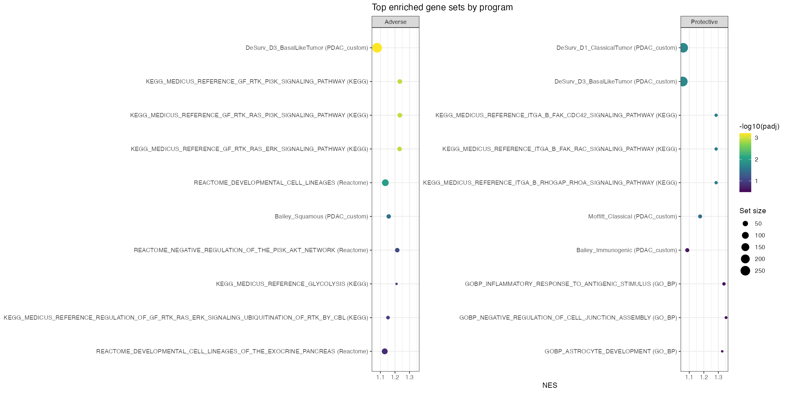

```{r setup}
library(knitr)
OUT <- "../../results/benchmark_sim/outputs/pathway_enrichment"
read_csv_safe <- function(f) {
  p <- file.path(OUT, f)
  if (file.exists(p)) read.csv(p, stringsAsFactors = FALSE) else NULL
}
t5 <- read_csv_safe("T5_enrichment_kept.csv")
t2 <- read_csv_safe("T2_top_genes.csv")
t3 <- read_csv_safe("T3_concordance_stats.csv")
t4 <- read_csv_safe("T4_sbmf_desurv_overlap.csv")
c1 <- read_csv_safe("C1_all_programs_summary.csv")
c2 <- read_csv_safe("C2_external_cohort_robustness.csv")

fmt_p <- function(p) ifelse(is.na(p), "--",
                     ifelse(p < 1e-15, "< 1e-15", formatC(p, format = "e", digits = 1)))
prog_name <- c("3" = "Program 3", "5" = "Program 5", "6" = "Program 6", "7" = "Program 7")
short_set <- function(s) {
  s <- gsub("^(HALLMARK|GOBP|REACTOME|KEGG_MEDICUS_REFERENCE)_", "", s)
  s <- gsub("_", " ", s)
  substr(s, 1, 58)
}
```

## 1. What changed since the July report, and why

The July 15 report characterized the two **survival-active** gene programs of the
recommended D4 fit (Program 3, protective; Program 7, adverse). Its conclusions on those
two programs are unchanged here, and for a specific reason: **the underlying fit is the
same fit.** The $K$-selection procedure was reworked in the 8/19–8/20 cycle from
cross-validated external C-index to ARD pruning plus ELBO comparison, but that procedure
*re-confirmed* $K=7$ on the same D4 configuration rather than producing a different model
(DECISIONS.md 2026-08-19). Programs 3 and 7 are still the only two programs carrying a
non-negligible survival coefficient.

What did change is the **classification of the other five programs.** The July analysis
treated them as a single undifferentiated "Inactive" bucket. The three-way classification
introduced with `classify_factors()` splits that bucket:

| Class | Criterion | Programs |
|---|---|---|
| survival-active | $\lvert\bar{\tilde\beta}_k\rvert > 0.001$ | 3, 7 |
| genomics-only | not survival-active, but $\text{PVE}_k > 1\%$ | **5, 6** |
| dead | neither; fully pruned by ARD | 1, 2, 4 |

Programs 5 and 6 are therefore real gene-expression programs, not noise, and the retained
set is four factors rather than two. They were never characterized. In fact their
enrichment had already been *computed* under the old convention and then discarded at the
reporting step, because every output table was filtered to the two survival-active
programs. Program 6 had 40 significant gene sets and Program 5 had 12, all silently
dropped.

This report extends every analysis in the July report to the four retained programs. The
practical question it answers: **are the two genomics-only programs interpretable
biology, and does their presence change how the model should be described?**

### Direction convention (unchanged)

Adverse/protective labels come from the *marginal* survival association of each program's
projection score (Cox on $Z\!F_{\cdot k}$ alone), not from the joint model's
$\tilde\beta$ sign. For Programs 3 and 7 the two disagree
($\hat{\tilde\beta}_7 = -0.041$, $\hat{\tilde\beta}_3 = +0.011$), a suppression effect
between correlated programs in the joint fit. The marginal convention is used throughout
(DECISIONS.md 2026-06-16). The genomics-only programs have $\bar{\tilde\beta}_k \approx 0$
by definition and carry no direction label.

## 2. Methods

Unchanged from the July report except for scope. Gene weights are the posterior means
$\bar f_{jk}$ from the D4 fit (2,064 genes $\times$ 7 programs); the `point_exponential`
prior makes them non-negative, so $\lvert\bar f_{jk}\rvert = \bar f_{jk}$ and programs are
ranked by raw weight.

- **fgsea** (primary): genes ranked by weight within a program, run against Hallmark,
  Reactome, KEGG, GO-BP, and a custom PDAC collection (Moffitt/Bailey subtype signatures
  plus DeSurv's three published factor gene lists). Significance at $\text{padj} < 0.10$
  (Benjamini–Hochberg within program $\times$ collection), `seed = 1`.
- **ORA** (sensitivity): hypergeometric over-representation on the top $N$ genes,
  $N \in \{50, 100, 150\}$, background = the 2,064-gene selected universe.
- **Subtype concordance:** Spearman correlation and Kruskal–Wallis test of each program's
  patient loadings against the PurIST classical/basal score in TCGA-PAAD ($n=144$).
- **DeSurv overlap:** Jaccard index and hypergeometric $p$ against each of DeSurv's three
  published factors, top 270 genes per program, restricted to the shared background.
- **External cohort robustness:** each program's headline leading-edge signature scored in
  each of the 5 held-out cohorts, then a univariate Cox fit per cohort. For Programs 3 and
  7 this is confirmatory. **For Programs 5 and 6 it is a negative control** (see §5).

## 3. Enrichment across the four retained programs

```{r c1-table}
if (!is.null(c1)) {
  d <- c1[, c("program", "label", "program_class", "n_coherent_hits")]
  names(d) <- c("Program", "Label", "Class", "Sig. sets (padj<0.10)")
  kable(d, booktabs = TRUE, row.names = FALSE,
        caption = "Significant gene sets per program, all 7 programs. The two programs previously labeled 'Inactive' with the most enrichment (5 and 6) are exactly the two now classified genomics-only; the three dead programs return zero sets, as expected.")
}
```

The three dead programs return **zero** significant sets, while both genomics-only
programs return many. That is a useful internal consistency check on the classification:
the PVE-based split between "genomics-only" and "dead" was made without reference to gene
sets, yet it lands exactly on the programs that have coherent pathway signal.

```{r t5-top-sets}
if (!is.null(t5)) {
  rows <- do.call(rbind, lapply(c(3, 5, 6, 7), function(k) {
    s <- t5[t5$program == k, ]
    if (!nrow(s)) return(NULL)
    s <- s[order(s$padj), ][seq_len(min(6, nrow(s))), ]
    data.frame(Program = prog_name[[as.character(k)]], Class = s$program_class,
               Collection = s$collection, Set = short_set(s$set),
               NES = sprintf("%.2f", s$NES), padj = fmt_p(s$padj))
  }))
  kable(rows, booktabs = TRUE, row.names = FALSE,
        caption = "Top 6 gene sets per retained program by adjusted p-value (fgsea). Full table: T5_enrichment_kept.csv.")
}
```



### What the two genomics-only programs look like

The top-weighted genes are unusually easy to interpret for both:

```{r t2-genes}
if (!is.null(t2)) {
  rows <- do.call(rbind, lapply(c(5, 6), function(k) {
    g <- t2[t2$program == k, ]
    g <- g[order(g$rank), ]
    data.frame(Program = prog_name[[as.character(k)]],
               `Top 20 genes by weight` = paste(head(g$gene, 20), collapse = ", "),
               check.names = FALSE)
  }))
  kable(rows, booktabs = TRUE, row.names = FALSE,
        caption = "Top 20 genes by posterior mean weight for the two genomics-only programs.")
}
```

**Program 5 reads as desmoplastic stroma / cancer-associated fibroblast.** Seven collagen
genes appear in the top 20 (COL1A2, COL3A1, COL5A1, COL5A2, COL6A3, COL8A1, COL12A1),
alongside SPARC, THBS2, TIMP2, CTHRC1, CDH11, AEBP1, and **FAP**, the canonical
fibroblast-activation marker. Its enrichment agrees: Hallmark
epithelial-mesenchymal transition is the top set, followed by DeSurv's StromalImmune
factor and Reactome extracellular matrix organization, then cell adhesion and
tube/vessel development.

**Program 6 reads as immune infiltrate, with a vascular component.** The top genes are
predominantly lymphoid (IKZF1, AKNA, IL10RA, HCLS1, DOCK10, WDFY4, CELF2, RCSD1, PREX1)
mixed with vascular and basement-membrane genes (FBLN5, SLIT3, SPARCL1, APOLD1, COL14A1,
TNXB, CHRDL1). Its enrichment is correspondingly immune-dominated: cell activation,
lymphocyte activation, B-cell activation, and positive regulation of cell-cell adhesion.

Neither reading is a formal claim. Both are what the gene lists and enrichment tables directly
show, and both are consistent across two independent methods (fgsea ranking and
the DeSurv overlap in §6). See §7 for the standing caveat about methodology.

## 4. Subtype concordance

```{r t3-table}
if (!is.null(t3)) {
  d <- t3
  d$Program <- prog_name[as.character(d$program)]
  out <- data.frame(Program = d$Program, Label = d$label,
                    `Spearman rho` = sprintf("%+.3f", d$spearman_rho),
                    `Spearman p` = fmt_p(d$spearman_p),
                    `Kruskal p` = fmt_p(d$kruskal_p),
                    check.names = FALSE)
  kable(out, booktabs = TRUE, row.names = FALSE,
        caption = "Concordance of program loadings with the PurIST basal/classical axis, TCGA-PAAD (n=144). Positive rho = basal-leaning.")
}
```

The two survival-active programs sit at opposite ends of the subtype axis, strongly and
symmetrically (Program 3 $\rho = -0.575$, Program 7 $\rho = +0.582$). This is the
subtype-survival axis the PDAC literature already describes, and it is the July report's
central result.

The genomics-only programs behave differently, and consistently with a stromal/immune
reading. **Program 6 is essentially orthogonal to the subtype axis**
($\rho = -0.026$, $p = 0.75$), which is what an immune-infiltrate program should look
like: tumor-cell subtype and immune content are separate axes of variation.
**Program 5 shows a weak basal lean** ($\rho = +0.299$, $p = 2.8\times10^{-4}$), which is
also expected, since basal-like PDAC tumors are the more stroma-rich ones. Note Program
6's significant Kruskal–Wallis test alongside its null Spearman: the relationship with
subtype *groups* is non-monotonic, so it is not captured by a rank correlation.

## 5. External cohort robustness (negative control for the genomics-only pair)

Each program's headline leading-edge signature is scored in each held-out cohort, then fit
in a univariate Cox model. For Programs 3 and 7, replicating the hazard-ratio direction
across independent cohorts is evidence their prognostic signal is real rather than a
training-set artifact. For Programs 5 and 6 the logic runs the other way: they carry no
survival coefficient in the joint fit, so a null result *supports* the genomics-only label,
and a consistently significant one would mean the label understates them.

```{r c2-table}
if (!is.null(c2) && nrow(c2)) {
  d <- c2[order(c2$program, c2$cohort), ]
  out <- data.frame(
    Program = prog_name[as.character(d$program)], Label = d$label,
    Signature = short_set(d$set), Cohort = d$cohort, n = d$n,
    HR = sprintf("%.2f", d$HR), p = fmt_p(d$p),
    check.names = FALSE)
  kable(out, booktabs = TRUE, row.names = FALSE,
        caption = "Univariate Cox HR for each program's headline (lowest-padj) signature, per held-out cohort. Note the Signature column for Program 6.")
} else {
  cat("_C2_external_cohort_robustness.csv not available; this section requires the local real-data cohorts (`PDAC_DATA_ROOT`)._\n")
}
```

**Programs 3 and 7 replicate.** Program 3's signature is protective in all 5 cohorts
(HR 0.42--0.88, 3 of 5 significant); Program 7's is adverse in all 5 (HR 1.30--2.40, 2 of 5
significant). Consistent direction across every cohort, with significance where sample size
allows.

**The negative control as first run is confounded for Program 6, and the confound is
instructive.** The runner defines a program's headline signature as its single lowest-padj
enriched set. For Program 6 that set is `DeSurv_D1_ClassicalTumor`, the *same* gene list
that serves as Program 3's signature. Scoring it measures the classical-tumor axis's
prognostic value, not whether Program 6 carries survival signal, and it came back
protective-leaning (HR < 1 in 4 of 5 cohorts, 2 significant). Read naively, that looks like
evidence against the genomics-only label. It is really just the classical signature
reappearing.

**Re-running the control on each program's own pathway character removes the confound.**
Excluding the PDAC_custom collection (DeSurv's three published factor lists, the known
subtype/prognostic axes) and taking each genomics-only program's top remaining set gives
EMT for Program 5 and `GOBP_CELL_ACTIVATION` for Program 6:

```{r c4-table}
c4 <- read_csv_safe("C4_genomics_only_negative_control.csv")
if (!is.null(c4) && nrow(c4)) {
  d <- c4[order(c4$program, c4$cohort), ]
  out <- data.frame(
    Program = prog_name[as.character(d$program)],
    Signature = short_set(d$set), Cohort = d$cohort, n = d$n,
    HR = sprintf("%.2f", d$HR), p = fmt_p(d$p),
    check.names = FALSE)
  kable(out, booktabs = TRUE, row.names = FALSE,
        caption = "Corrected negative control: each genomics-only program scored on its own top enriched set, excluding DeSurv's subtype gene lists.")
  for (k in sort(unique(d$program))) {
    s <- d[d$program == k, ]
    cat(sprintf("\n- Program %d: %d/%d cohorts significant at p<0.05; HR range %.2f--%.2f; %d/%d with HR>1.\n",
                k, sum(s$p < 0.05), nrow(s), min(s$HR), max(s$HR), sum(s$HR > 1), nrow(s)))
  }
} else {
  cat("_C4_genomics_only_negative_control.csv not available (requires `PDAC_DATA_ROOT`)._\n")
}
```

Program 6's immune signature is null: **0 of 5 cohorts significant**, HR straddling 1 in
both directions (0.53--1.39). The entire apparent protective effect in the first table was
the borrowed classical-tumor gene list. Program 5's EMT signature is also essentially null,
with 1 of 5 cohorts significant (Dijk, HR 1.50) and directions mixed across the rest. No
consistent prognostic effect.

**The negative control passes for both genomics-only programs**, which is the
label-confirming result. It also carries a methodological lesson worth keeping: "lowest
padj" is a poor definition of a program's headline signature when the gene-set universe
includes signatures that are themselves prognostic axes. Any future factor added to the
retained set should be scored on its own distinctive pathway character, not on whichever
set happens to rank first.

## 6. Overlap with DeSurv's published factors

```{r t4-table}
if (!is.null(t4)) {
  d <- t4
  d$desurv <- sub("DeSurv_D[0-9]_", "", d$desurv_factor)
  d <- d[order(d$program, -d$jaccard), ]
  out <- data.frame(Program = prog_name[as.character(d$program)], Label = d$label,
                    `DeSurv factor` = d$desurv,
                    Jaccard = sprintf("%.3f", d$jaccard),
                    `Hypergeometric p` = fmt_p(d$hyper_p),
                    check.names = FALSE)
  kable(out, booktabs = TRUE, row.names = FALSE,
        caption = "Gene-list overlap with DeSurv's three published factors (top 270 genes per program).")
}
```

This is the most informative single result in the report. Each of our four retained
programs maps onto exactly one of DeSurv's three factors:

- Program 3 $\rightarrow$ **ClassicalTumor** (J = 0.133, $p \approx 1\times10^{-7}$)
- Program 7 $\rightarrow$ **BasalLikeTumor** (J = 0.178, $p \approx 3\times10^{-16}$)
- Program 5 $\rightarrow$ **StromalImmune**, and only StromalImmune (J = 0.179,
  $p \approx 9\times10^{-17}$; the other two DeSurv factors give $p = 1.0$)
- Program 6 $\rightarrow$ **StromalImmune** (J = 0.166, $p \approx 7\times10^{-14}$),
  with a secondary ClassicalTumor overlap (J = 0.109, $p \approx 3\times10^{-4}$)

So the four-factor retained set recovers DeSurv's full three-factor structure, with
DeSurv's single combined StromalImmune factor split across two of our programs. Given the
gene content in §3, that split is along stroma (Program 5, collagen/CAF) versus immune
(Program 6, lymphoid) lines.

This reframes what the model is doing. Under the old two-program description, the model
found the tumor-intrinsic prognostic axis and discarded everything else. In fact it also
recovers the tumor microenvironment as structure, resolved at finer grain than the
published comparison, and correctly assigns it no prognostic weight of its own once the
basal/classical axis is accounted for. That is a more complete and more defensible account
of the fit, and it also explains *why* the genomics-only programs exist: stromal and
immune content drive a large share of bulk expression variance in PDAC, so a factorization
must represent them, but they are not the prognostic axis in this model.


## 7. Conclusions and standing caveat

1. The July report's findings on Programs 3 and 7 stand unchanged. The same fit, the same
   two survival-active programs, the same adverse/basal and protective/classical
   identification, now supported by the same five methods.
2. The two genomics-only programs are interpretable, not residual noise. Program 5 reads
   as desmoplastic stroma / CAF, Program 6 as immune infiltrate with a vascular
   component. Their enrichment, gene content, subtype behavior, and DeSurv overlap all
   agree.
3. The retained set recovers DeSurv's full three-factor structure, splitting DeSurv's
   combined StromalImmune factor into separate stromal and immune programs.
4. The three dead programs return zero enriched sets, independently corroborating the
   PVE-based genomics-only/dead split.
5. Both genomics-only programs pass the external-cohort negative control once scored on
   their own pathway character rather than on a borrowed tumor-subtype signature (§5).
   Getting this right required correcting a confound in how a program's "headline"
   signature is chosen; the uncorrected version made Program 6 look prognostic when it is
   not.

**Caveat on methodology, not on evidence.** This line of investigation was pursued on our
own initiative rather than at the group's direction, and the specific methods here
(fgsea/ORA against these collections, PurIST concordance, DeSurv overlap, per-cohort
hazard ratios) were chosen for availability rather than from a deliberate review of what
the question requires. The results above are internally consistent and mutually
corroborating, and may well be sufficient as they stand. Confirming that the approach is
the right one is worth doing before these biological labels are carried into the
manuscript.

Open follow-up, unchanged from the 8/21 chapter: the cross-cohort *consistency* of the two
genomics-only programs has not been tested the way Programs 3 and 7 have. §5 is a
prognostic negative control, not a test of whether the same stromal and immune programs
reappear when the model is refit on other cohorts.
