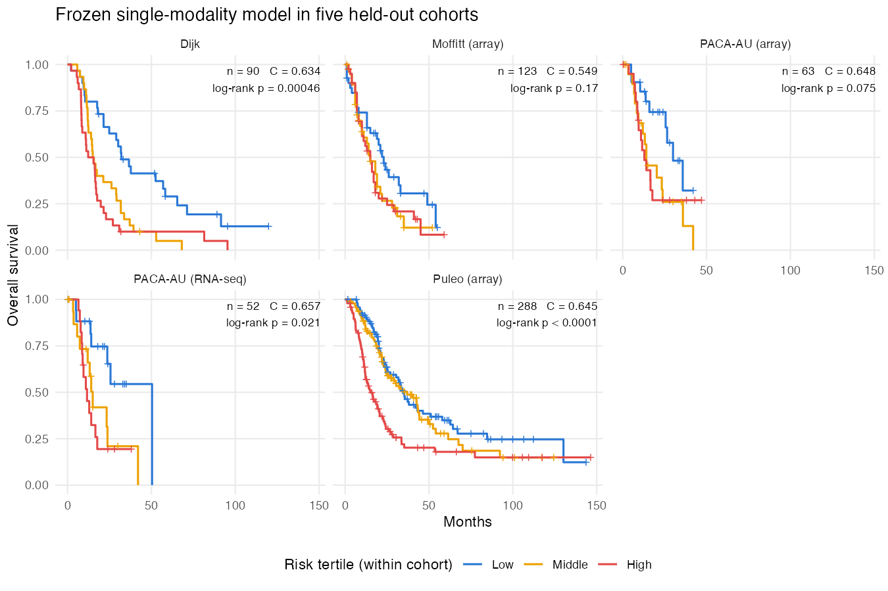
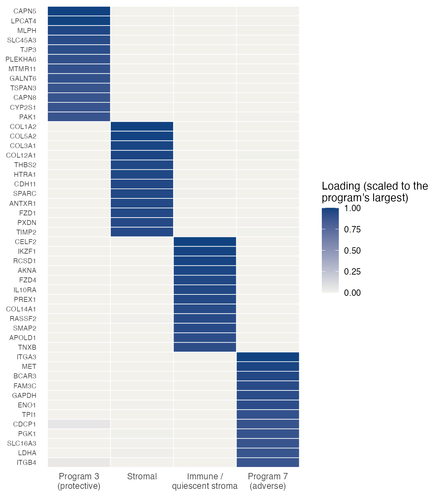
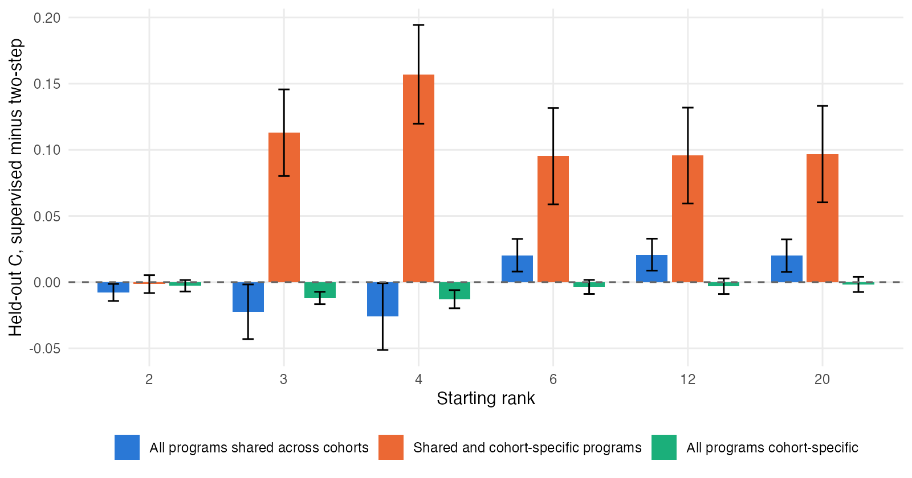
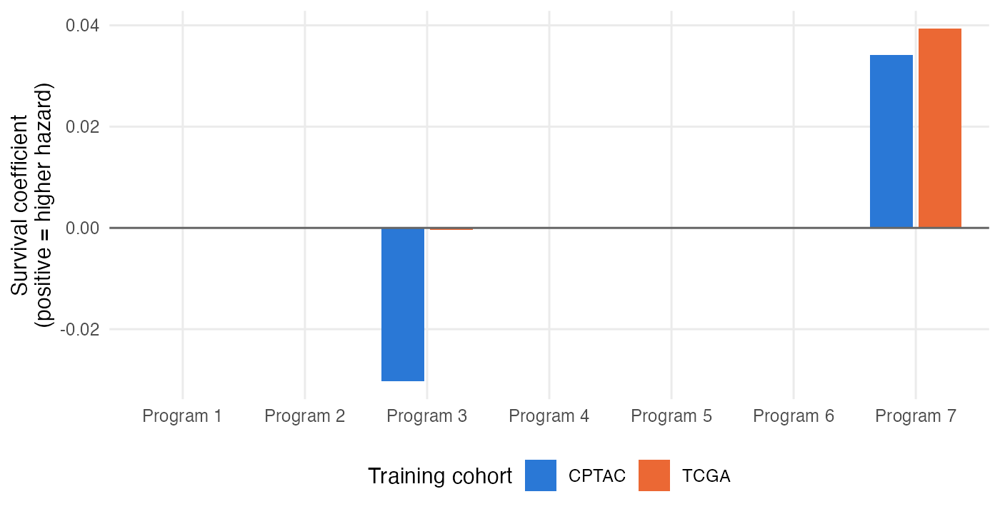
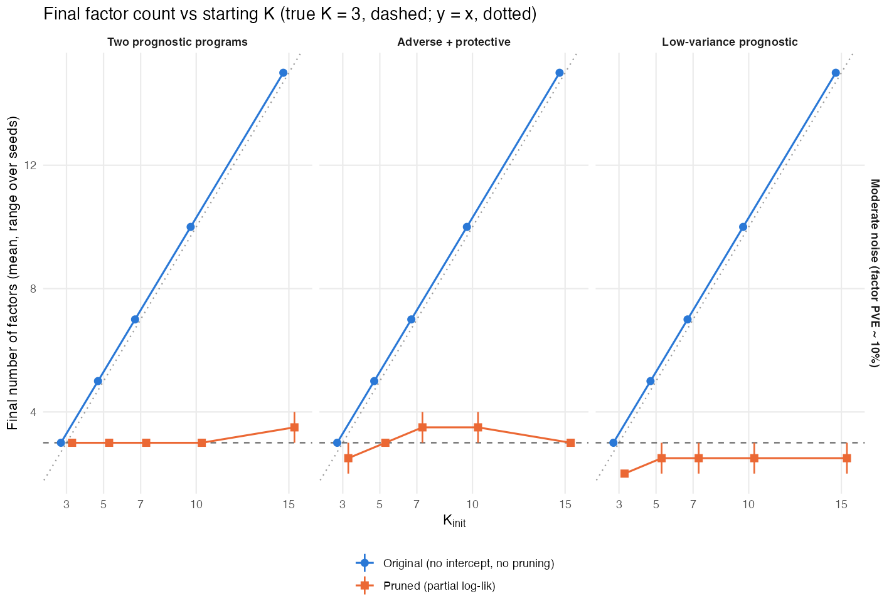

<!--
Project 3 prelim proposal chapter -- the ONLY editable source. A generated copy
will go to bios-dissertation/prelim/project-proposals/project3-ssbmf/draft/
(Project 2 pattern; see docs/plans/Prelim_Proposal_Plan_10_1_26.md). The sync
tools are not installed yet.

Status (2026-10-01): first full draft of the structure.

- Single-modality text reports established results (PROJECT_STATUS.qmd, DECISIONS.md).
- Multimodal results are marked [PENDING] until the 10/2 sweeps are reviewed.
- Claims about supervision changing F are scoped to the alpha_F = 0 model
  (bios-dissertation/ROADMAP.md, Project 3 to-do).
- Author list and affiliations: [TO CONFIRM].
-->

# Introduction

## Prognostic gene expression programs in pancreatic cancer

Pancreatic ductal adenocarcinoma (PDAC) has a five-year survival below 15%, and outcomes vary widely among patients diagnosed at the same stage [@SEER2026].

- **Transcriptional subtypes.** Bulk transcriptomic studies have repeatedly identified subtypes with different prognoses, notably a classical tumor program and a basal-like program with worse survival [@Collisson2011; @Moffitt2015; @Bailey2016; @Raphael2017]. These subtypes underlie single-sample classifiers now used in clinical research [@Rashid2020].
- **Programs, not discrete classes.** Each patient's tumor expresses several such programs, made up of tumor, stromal and immune components, in different proportions. Matrix factorization represents this directly: an expression matrix is approximated by patient-level program scores multiplied by gene-level program loadings [@Brunet2004; @Kotliar2019].

## The two-step pipeline and its limitations

The usual analysis has two steps: factorize the expression data without using outcomes, then regress survival on the estimated program scores. Section 1.3 of the literature review sets out two limitations of this sequence, summarized here without repeating that discussion.

- **Discovery ignores survival.** A program that explains little expression variance but strongly predicts survival may never be found.
- **Uncertainty is discarded.** Estimated scores are treated as fixed covariates, which attenuates their survival coefficients [@Prentice1982; @Carroll2006].

Supervised alternatives exist:

- supervised principal components [@Bair2004];
- penalized Cox regression on genes [@Tibshirani1997; @Simon2011];
- partial least squares Cox regression [@Nygard2008];
- DeSurv, which fits a non-negative factorization and a Cox model jointly [@Young2026] and is the closest predecessor of this work.

DeSurv's coefficients are penalized point estimates, and its rank and supervision strength are tuned by cross-validated concordance outside the fitted model.

## Contributions

This chapter develops survival-supervised Bayesian matrix factorization (SSBMF). It combines empirical-Bayes matrix factorization [@Wang2021; @Willwerscheid2025] with a Cox proportional hazards model [@Cox1972; @Cox1975], fit jointly by coordinate-ascent variational inference [@Blei2017]. The contributions are:

1. **A joint model whose risk score needs no fitted patient-level parameters.** The Cox predictor uses each patient's expression projected onto the program loadings, $\eta = (YF)\beta$. A new patient's risk is therefore computed from their measurements alone. Posterior uncertainty in the survival coefficients is estimated within the model.
2. **Choosing the number of programs from one over-specified fit.** Empirical-Bayes shrinkage, combined with a consensus over ELBO, BIC, cross-validated likelihood and concordance, reduces an over-specified $K_{\mathrm{init}}$ to an effective number of programs $K_{\mathrm{eff}}$. This separates programs that explain expression variance from programs associated with survival.
3. **External validation** in five held-out PDAC cohorts across RNA-seq, microarray and proteomic platforms, with comparisons to a two-step factorization-then-Cox baseline and to DeSurv.
4. **A multimodal extension** for matched gene expression and DNA methylation. Patient program scores are shared across modalities, while each modality has its own loadings and loading prior. A parsimony framework (intercept, marginal-likelihood prior fits and evidence-based factor pruning) selects the factors explaining molecular variation and those explaining survival without cross-validating $K$.

Section 2 presents both models and the simulation and data designs, Section 3 the results, and Section 4 a discussion. The multimodal work is in progress; Section 4.3 states what remains.

# Methods

## Single-modality model

**Reconstruction.** For $n$ patients and $p$ genes, with log-scale expression standardized per platform,

$$
Y = LF^\top + E,\qquad E_{ij}\sim N(0,\tau_j^{-1}).
$$

- $L\in\mathbb R^{n\times K}$ holds patient program scores.
- $F\in\mathbb R^{p\times K}$ holds gene loadings.
- Each entry of $L$ and $F$ has a point-exponential prior. The prior's mixing proportion and rate are estimated by empirical Bayes for each program [@Willwerscheid2025].

**Survival.** A Cox model with Breslow handling of ties [@Breslow1974] and linear predictor

$$
\eta_i=\sum_k (\hat z_F)_{ik}\,\tilde\beta_k,\qquad \hat Z_F = Y\,E[F]\,D^{-1},\quad D=\operatorname{diag}\lVert E[f_k]\rVert ,
$$

where $\hat Z_F$ is each patient's expression projected onto the unit-normalized loading vectors. The normalization only sets the units of $\tilde\beta$.

- The survival coefficients have Normal priors, $\tilde\beta_k\sim N(0,s^2_{\beta_k})$, with variances estimated by empirical Bayes.
- Within each iteration the projection $\hat Z_F$ is held at its current value. The single-modality $\tilde\beta$ update therefore has no second-moment correction for uncertainty in $F$ (literature review Section 1.3.3). The multimodal model adds one (Section 2.2).

**Fitting.** Coordinate-ascent variational inference, using a second-order (Taylor) approximation of the Cox partial likelihood that is refreshed every iteration.

- Two weights are applied. A weight $\alpha=0.5$ tempers the Cox term in the $\tilde\beta$ update, and a weight $\alpha_F=0$ keeps the Cox term out of the $F$ update.
- With $\alpha_F=0$, survival informs the coefficients but not the loadings. The programs found are therefore those that explain expression variance and are also associated with survival.
- Removing these weights is part of the remaining work (Section 4.4).

**Choosing $K$.**

- $K_{\mathrm{init}}$ is chosen by a consensus of the ELBO, BIC, bi-cross-validated genomic log-likelihood and cross-validated concordance, followed by a one-standard-error rule.
- Programs in the over-specified fit are then classified as survival-active (posterior mean $|\tilde\beta_k|$ above a threshold), genomics-only (explaining at least 1% of variance), or inactive.

**Cohorts.** Optional extensions allow a cohort-specific genomic offset, a stratified baseline hazard, and cohort-specific survival coefficients $\tilde\beta_k^{(c)}$ shrunk toward a common value.

## Multimodal model

**Reconstruction.** For matched expression $Y_1$ and methylation $Y_2$ on the same $n$ patients,

$$
Y_m = \mathbf 1\mu_m^\top + L F_m^\top + E_m,\qquad E_{mij}\sim N(0,\tau_{mj}^{-1}),\qquad m=1,2,
$$

- $L\ge 0$ holds shared program activity.
- $F_m$ holds the loadings for modality $m$, describing how strongly each gene or CpG deviates from the baseline $\mu_m$ when the program is active.
- Each modality–program pair has its own loading prior, chosen from point-exponential, point-Laplace or Normal. A sparser prior can then be estimated for the much larger CpG set.
- Cohorts and modalities enter the model differently. Additional cohorts add rows of $L$ (patients). Additional modalities add rows of $F$ (features), each block with its own prior.

**Survival.** A Cox model with linear predictor

$$
\boldsymbol\eta=(Y_1F_1+Y_2F_2)\,\beta,\qquad \beta_k\sim N(0,s^2_{\beta_k}),
$$

The $\beta$ update uses the projection's posterior second moment, $E[Z_{ik}^2]=\bar Z_{ik}^2+\sum_{m,j}y_{mij}^2\operatorname{Var}(f_{mjk})$, rather than its plug-in square. This propagates loading uncertainty into the survival coefficients, which is the correction for attenuation motivated in literature review Section 1.3.3.

The model uses no tempering weights: the reconstruction and survival terms enter every loading update as a plain sum.

- **Identifiability.** Multiplying a program's scores by $a_k$, dividing its loadings by $a_k$ and multiplying $\beta_k$ by $a_k$ leaves the model unchanged. The fitter therefore rescales each program after its update so that its projection has unit standard deviation.
- **Full derivation.** All update equations are in the project derivation document. [CROSS-REFERENCE: appendix or supplement]

**Parsimony framework.**

1. Each modality–program prior is fit by maximizing the marginal likelihood (`ebnm`). This lets an entire program shrink to the point mass at zero.
2. After convergence, a factor is removed if the evidence lower bound does not fall without it. The bound is the expected reconstruction log-likelihood, plus the Cox partial log-likelihood at the posterior-mean predictor, minus the Kullback–Leibler divergence of each posterior from its prior. The fit is then restarted from the remaining factors, and this repeats until no factor can be removed.
3. Feature precisions $\tau_{mj}$ are estimated per feature, and the intercept $\mu_m$ is re-estimated every iteration.

Without the intercept, uncentered data let spare non-negative factors absorb feature means, so they were never removed (Section 3.5).

## Simulation designs

**Single modality.** Multi-cohort simulations with shared and cohort-specific programs. These test recovery of prognostic programs and their cohort attribution, the effect of under- and over-specifying $K_{\mathrm{init}}$, and false-positive survival-active programs. [CROSS-REFERENCE: simulation design table]

**Multimodal.** Matched expression and methylation blocks with $K=3$ true programs and Weibull proportional-hazards survival generated from the joint predictor. Three scenarios set the prognostic structure:

- two prognostic programs ($\beta=(0.7,0.35,0)$);
- one adverse and one protective program ($\beta=(0.7,-0.7,0)$);
- a single low-variance prognostic program (score scale 0.15, $\beta_3=1.1$).

Two noise levels:

- each true program explains about 10% of the variance;
- each true program explains under 1%.

The sweep covers $K_{\mathrm{init}}=3,\dots,10$ and $15$, with three seeds per setting.

## Data and preprocessing

**Single-modality application.**

- Training: TCGA-PAAD and CPTAC.
- External validation: five held-out cohorts (Dijk, Moffitt GEO array, PACA-AU array, PACA-AU RNA-seq, Puleo array).
- Preprocessing: log transformation where needed, per-platform standardization, and the DeSurv gene-selection rule (top 3,000 genes per cohort by combined mean and variance rank, intersected across cohorts) [@Young2026].

**Multimodal application.**

- Training: TCGA-PAAD, 144 patients (75 deaths).
- Validation: ICGC PACA-AU. The main set is 50 primary-tumor PDAC donors (30 deaths). A sensitivity set adds intraductal papillary mucinous neoplasm with invasion and other histologies, for 67 donors (40 deaths).
- Expression: log2-normalized.
- Methylation: $\beta$-values on the 305,352 CpGs passing both cohorts' sex-chromosome filters, with $k$-nearest-neighbor imputation of the 0.07% missing values within each cohort.
- Screening is done on the training cohort only: 3,000 genes by the DeSurv rule and the 10,000 most variable CpGs.

## Evaluation

- **Discrimination:** Harrell's concordance [@Harrell1982] in held-out cohorts, with percentile bootstrap intervals. Differences between models use a pooled, cohort-weighted bootstrap.
- **Orientation:** the direction of each risk score is fixed once, before any validation outcome is seen. Choosing it separately in each validation cohort would force every concordance to be at least 0.5 and inflate the results. A model that fails in a cohort can therefore show a concordance below 0.5.
- **Factor recovery** (simulation): absolute correlation between true and estimated loadings, with a match counted at $|r|\ge0.7$.
- **Prognostic recovery** (simulation): the share of true prognostic programs whose matched factor is survival-active with the correct sign, and the number of false survival-active factors.

# Results

## Joint fitting improves external discrimination over a two-step pipeline in five held-out cohorts

The recommended single-modality configuration was trained on TCGA-PAAD and CPTAC with $K_{\mathrm{init}}=7$. Its mean external concordance across the five held-out cohorts was 0.627, against 0.581 for an unsupervised factorization followed by Cox regression on the same genes (@tbl-external). The joint model's concordance was higher in every cohort. Taken one cohort at a time, the paired-bootstrap interval for the difference excludes zero only in Puleo, the largest cohort. Pooled across the five cohorts, the improvement is $\Delta C=0.042$ (95% CI 0.013 to 0.071), using a fixed-effect, inverse-variance pooling. Concordance in this range is comparable to that reported for DeSurv in its validation cohorts [@Young2026].

| Validation cohort | $n$ | Joint YFB | Two-step EBMF → Cox |
|---|---|---|---|
| Dijk | 90 | 0.635 (0.555, 0.708) | 0.592 (0.516, 0.671) |
| Moffitt GEO array | 123 | 0.549 (0.467, 0.625) | 0.541 (0.462, 0.613) |
| PACA-AU array | 63 | 0.648 (0.553, 0.747) | 0.597 (0.500, 0.695) |
| PACA-AU RNA-seq | 52 | 0.657 (0.544, 0.772) | 0.573 (0.464, 0.687) |
| Puleo array | 288 | 0.645 (0.599, 0.688) | 0.602 (0.556, 0.646) |
| **Mean** |  | **0.627** | **0.581** |

: External concordance (95% bootstrap interval) of the single-modality model and the two-step baseline. {#tbl-external}

The frozen model also separates patients by survival in each held-out cohort (@fig-km-risk). The patients in the top third of predicted risk had shorter survival than those in the bottom third. The separation was clearest in Puleo, the largest cohort (log-rank $p<0.0001$), and in Dijk ($p=0.0005$) and weakest in the Moffitt array cohort ($p=0.17$), which also had the lowest concordance.

{#fig-km-risk width=95%}

## An over-specified fit retains two survival-associated programs and two expression programs

From $K_{\mathrm{init}}=7$, four programs were retained: two survival-active and two that explain expression variance only (@fig-programs). The other three were shrunk to zero.

- **Program 7** is associated with worse survival. It is enriched for MET, ITGA3 and glycolytic genes, consistent with the basal-like program.
- **Program 3** is associated with better survival. It is enriched for epithelial (classical) genes.
- **Expression-only programs.** One is stromal (collagens, *FAP*, *SPARC*, *CTHRC1*) and one is immune (*IKZF1*, *IL10RA*, *HCLS1*). Each explains expression variance without a survival association.
- **Direction.** The adverse or protective direction is read from the marginal survival association of each program's projection, because the joint coefficients' signs can reverse when correlated programs are fit together.

{#fig-programs width=70%}

Both survival-active programs keep their direction in data the model never saw (@fig-km-programs). Across the 616 patients in the five held-out cohorts:

- patients in the top third of Program 7 activity had the shortest survival (cohort-stratified log-rank $p<0.0001$);
- patients in the top third of Program 3 activity had the longest ($p=0.004$).

{#fig-km-programs width=95%}

## Under-specifying the starting rank merges true programs; over-specifying does not

In simulation, starting with fewer factors than truth ($K_{\mathrm{init}}=2$–4) produced estimated factors that each correlated strongly with two true programs: 7 of 27 estimated factors were merges. Starting at or above truth ($K_{\mathrm{init}}=6$, 12, 20) produced no merges (0 of 114).

The concordance gain from joint fitting also depends on $K_{\mathrm{init}}$ (@fig-delta-c). In the scenario where shared and cohort-specific programs coexist (hybrid), the joint model's held-out concordance exceeded the two-step model's at every $K_{\mathrm{init}}\ge3$. The gain was largest at $K_{\mathrm{init}}=4$ (0.16) and stable at about 0.10 from $K_{\mathrm{init}}=6$ upward. In the scenario where all programs are shared, the joint model was ahead only from $K_{\mathrm{init}}=6$ upward, and below that it was slightly behind. With no shared programs, the two models were within about 0.01 of each other. Together these results support over-specifying $K_{\mathrm{init}}$ and then shrinking.

{#fig-delta-c width=85%}

## The protective program's survival association is concentrated in one training cohort

With cohort-specific survival coefficients, the adverse program's association was present in both training cohorts, while the protective program's association came mainly from CPTAC (@fig-percohort). In a ground-truth simulation, the model attributed the effect to the correct cohort in 15–17 of 20 settings. With larger cohorts, effects should be shared across cohorts. Apparent cohort-specific effects of this size are therefore interpreted cautiously, as possibly reflecting small samples.

{#fig-percohort width=85%}

\FloatBarrier

## With evidence-based pruning, the multimodal model's rank no longer depends on the starting rank

Without the parsimony framework, the number of factors retained by the multimodal model equalled $K_{\mathrm{init}}$. Two causes were identified:

1. Unregularized per-feature precisions let a spare factor fit a single feature exactly, which made the likelihood unbounded.
2. Without an intercept, spare non-negative factors absorbed feature means.

With the framework, the final number of factors stays near the true value for every starting rank from 3 to 15 (@fig-mm-pruning). Before this, the final count tracked the starting rank exactly. Where the prognostic programs also explain molecular variation, the pruned fits:

- recovered all three true programs ($\lvert r\rvert\ge0.7$) from $K_{\mathrm{init}}\ge5$;
- identified the prognostic programs as survival-active with the correct sign in 75–100% of fits;
- converged in every run.

A prognostic program that explains little variation was not recovered by either the original or the pruned fit. [Preliminary: 2 seeds per setting at moderate noise; the full sweep is in progress.]

{#fig-mm-pruning width=95%}

\FloatBarrier

## In a first external validation, adding methylation improves discrimination over expression-only and two-step models

The pruned model was trained on TCGA expression and methylation (144 patients). On 50 ICGC primary PDAC donors its external concordance was 0.685 (95% CI 0.579 to 0.779). On the same features, expression-only YFB reached 0.491 and the two-step model 0.424 (@tbl-mm-external). Its survival-active factor corresponded to the adverse single-modality program ($\lvert r\rvert=0.68$ on shared genes).

| Model | ICGC primary PDAC ($n=50$) | ICGC all donors ($n=67$) |
|---|---|---|
| Joint multimodal | 0.685 (0.579, 0.779) | 0.639 (0.547, 0.734) |
| Expression-only YFB | 0.491 (0.364, 0.633) | 0.480 (0.369, 0.581) |
| Two-step EBMF → Cox | 0.424 (0.286, 0.567) | 0.418 (0.310, 0.531) |

: External concordance (95% bootstrap interval) of models trained on TCGA, $K_{\mathrm{init}}=7$. {#tbl-mm-external}

These results come with caveats:

- **The intervals are wide and overlap** with only 30 deaths in the validation set.
- **The baselines are weak here.** Both fail to transfer to ICGC.
- **Convergence.** The fit had a stable risk score but had not met the formal convergence criterion.

[PENDING: remaining starting ranks.]

# Discussion

## Implications of findings

- **Single modality.** Fitting the factorization and the Cox model together gave better external discrimination than factorizing first, consistently across cohorts and platforms. It also produced interpretable adverse and protective programs consistent with established PDAC subtypes.
- **Choosing $K$.** A single over-specified fit, followed by shrinkage, avoided both merged programs and a cross-validated search over $K$.
- **Multimodal model.** The same aim depends on modelling choices that matter less with one modality: a baseline intercept, regularized feature precisions, and evidence-based removal of factors.

## Limitations

- **Supervision of the loadings.** In the single-modality model, survival informs the coefficients but not the loadings ($\alpha_F=0$). The discovery advantage described in Section 1.2 has therefore not been demonstrated. The programs found are high-variance programs that are also prognostic.
- **Partial likelihood in the evidence bound.** The bound used for pruning plugs in the posterior-mean predictor rather than taking the expectation of the partial likelihood. It can therefore overstate the survival contribution of a factor.
- **Survival has little influence on which factors are kept.** With 144 patients and 13,000 molecular features, reconstruction terms outnumber partial-likelihood terms by more than 10,000 to one. In the TCGA fit, survival changed the evidence for any factor by less than 3 nats, against $10^4$–$10^5$ for reconstruction. Factor selection is therefore driven by molecular variation. This explains why low-variance prognostic programs are not recovered, and it is the multimodal form of the single-modality $\alpha_F$ question.
- **Matched multi-omic cohorts are small.** The validation set has 50–67 donors, and ICGC includes mixed histologies.
- **Unsettled preprocessing choices.** Feature screening for two modalities, and the methylation scale ($\beta$-values versus a variance-stabilizing transformation), are not yet settled.

## Future directions and continuing work

- **This project is in progress.** The multimodal model's replicated simulation study and its first real-data application are being completed.
- **Supervision of the loadings.** Candidate ways to let survival inform them without a tuning weight:
  - factor rescaling (already used in the multimodal model);
  - warm starts;
  - gradually increasing the survival weight during fitting;
  - reordering the updates.

  The planned test is recovery of a low-variance prognostic program in simulation.
- **Further extensions:**
  - a factor-level shrinkage prior on $K$ [@BhattacharyaDunson2011; @GriffithsGhahramani2011];
  - joint modelling of multiple cohorts and modalities together;
  - the full 305,352-CpG fit on the computing cluster;
  - preparation of the manuscript for journal submission.

# References {.unnumbered}

::: {#refs}
:::
