```{r setup}
#| include: false
library(kableExtra)
library(dplyr)

# ── Path definitions (relative to presentation/) ──
figures_root <- "../../results/figures"
tables_root  <- "../../results/tables"

ALL_DATASETS <- c("TCGA_PAAD", "CPTAC", "Dijk",
                  "Moffitt_GEO_array", "PACA_AU_array",
                  "PACA_AU_seq", "Puleo_array")

PLATFORM_MAP <- c(
  TCGA_PAAD         = "RNA-seq",
  CPTAC             = "Proteomics",
  Dijk              = "RNA-seq",
  Moffitt_GEO_array = "Microarray",
  PACA_AU_array     = "Microarray",
  PACA_AU_seq       = "RNA-seq",
  Puleo_array       = "Microarray"
)

PLATFORM_DESC <- c(
  "RNA-seq"      = "mRNA sequencing (transcript counts)",
  "Proteomics"   = "Mass spectrometry (protein abundance)",
  "Microarray"   = "Hybridisation arrays (gene expression)"
)

# ── Read cross-dataset tables ──
cross <- read.csv(file.path(tables_root, "PDAC_cross_dataset",
                            "cross_dataset_summary.csv"))
cross7 <- cross[cross$Dataset != "PDAC_pooled_rnaseq", ]

pc <- read.csv(file.path(tables_root, "PDAC_cross_dataset",
                         "prior_comparison.csv"),
               stringsAsFactors = FALSE)

ks <- read.csv(file.path(tables_root, "PDAC_cross_dataset",
                         "k_selection_summary.csv"),
               stringsAsFactors = FALSE)
```


<!-- ============================================================
     SLIDE 2 — OUTLINE
     ============================================================ -->

## Outline {.smaller}

:::: {.columns}

::: {.column width="50%"}

### Motivation
- The PDAC clinical challenge
- Why supervised factorisation matters

### Methods
- The SBMF model
- Dual-source objective function
- EBNM & adaptive shrinkage
- Factor-wise CAVI inference

:::

::: {.column width="50%"}

### Results
- Synthetic validation
- Seven PDAC cohorts
- Prior × K factorial comparison
- Deep dives: Puleo & TCGA

### Future Directions & Summary

:::

::::

::: {.notes}
Overview of today's talk. About 15 minutes of content, then open for discussion.
I'll start with why we need supervised approaches for PDAC, walk through the
Bayesian model and inference, then present results on 7 independent cohorts.
:::


<!-- ============================================================
     MOTIVATION
     ============================================================ -->

## The PDAC Problem {.smaller}

### Pancreatic Ductal Adenocarcinoma

:::: {.columns}

::: {.column width="55%"}

- **Five-year survival < 12%** — one of the most lethal solid tumours
- Most patients diagnosed at advanced stage with limited treatment options
- **No widely adopted molecular stratification** at diagnosis
- Tumours are a complex mixture of malignant, stromal, and immune cells — gene expression signals are deeply interwoven
- **Goal:** identify *gene expression programs* (GEPs) whose activation levels predict patient survival

:::

::: {.column width="45%"}

::: {.callout-note}
### The Clinical Need
Reliable prognostic signatures could:

- Stratify patients for targeted therapy
- Define subgroups for clinical trial enrollment
- Distinguish molecular features that *describe* tumour heterogeneity from those that *predict* disease course
:::

:::

::::

::: {.notes}
PDAC is the most lethal major solid tumour. Unlike breast cancer where molecular
subtypes dictate treatment, PDAC patients largely receive the same regimen.
If we can identify gene programs that distinguish prognostic subgroups, we can
stratify patients for targeted therapy and clinical trials. The complexity is
that bulk expression mixes signals from tumour, stroma, and immune cells.
:::


## Why Supervised > Unsupervised {.smaller}

### The PCA-Then-Test Gap

:::: {.columns}

::: {.column width="50%"}

**Standard approach:**

1. Apply PCA or NMF to expression data
2. Find axes of greatest expression variance
3. Test for survival association *post hoc*

**The problem:**

- Expression-dominant axes may reflect batch effects or housekeeping genes
- Programs with **modest expression variance** but **strong survival signal** get missed
- Post-hoc testing is statistically conservative

:::

::: {.column width="50%"}

**Supervised approach:**

1. Integrate survival into the factorisation objective *directly*
2. Factors are simultaneously constrained to explain expression **and** predict survival
3. If $\hat{\beta}_k = 0$, factor $k$ explains expression only — the model naturally separates prognostic from non-prognostic structure

::: {.callout-tip}
### Key Insight
A factor explaining 15% of variance might be entirely batch effects. A factor explaining 3% might perfectly separate survivors from non-survivors. PCA prioritises the first and ignores the second.
:::

:::

::::

::: {.notes}
PCA finds axes of greatest expression variance, not greatest clinical relevance.
A survival-supervised approach forces factors to be useful for prediction.
If a factor carries expression signal but no survival information, the model
shrinks its beta to zero — we get the separation for free.
:::


## The Gap & Our Approach {.smaller}

### What Existing Supervised MF Approaches Are Missing

- **Data-adaptive shrinkage priors** — existing methods use fixed penalties; we let the prior learn from the data
- **Automatic K selection** — no need to grid-search the number of factors
- **Uncertainty quantification** — posterior inference gives us credible intervals, not just point estimates

::: {.callout-note}
### SBMF vs. Penalised Supervised Approaches
Penalised approaches (e.g., deSurv from our lab) optimise a weighted objective $(1-\alpha)\mathcal{L}_\text{NMF} + \alpha\mathcal{L}_\text{Cox}$, requiring a tuning parameter $\alpha$ to balance the two terms. **SBMF** instead uses full Bayesian inference:

- The **ELBO** naturally balances genomics and survival — no $\alpha$ needed
- **EBNM** priors adapt their shrinkage to the data
- Posterior second moments ($E[L^2] \neq \bar{L}^2$) prevent overfitting to uncertain loadings
:::

> **SBMF:** Learn gene expression programs and survival associations simultaneously, with the prior learning from the data.

::: {.notes}
This is the only slide where I reference deSurv — Amber's work from our lab.
The key distinction is that SBMF is fully Bayesian: we use the ELBO which
naturally balances both objectives without a tuning alpha, and EBNM priors
that adapt their shrinkage to the data. The posterior second moments are
critical for preventing overfitting when loadings are uncertain.
:::


<!-- ============================================================
     METHODS
     ============================================================ -->

## The SBMF Model {.smaller}

### Joint Genomics + Survival Factorisation

$$Y = LF^\top + E, \quad E_{ij} \sim N(0, \tau_j^{-1})$$

$$h_i(t) = h_0(t)\exp(L_i \cdot \beta)$$

:::: {.columns}

::: {.column width="50%"}

| Quantity | Dimension | Meaning |
|:---------|:---------:|:--------|
| $Y$ | $n \times p$ | Gene expression matrix |
| $L$ | $n \times K$ | Patient activation scores |
| $F$ | $p \times K$ | Gene weights per program |
| $\beta$ | $K \times 1$ | Survival coefficients |
| $\tau_j$ | scalar | Gene-specific precision |

:::

::: {.column width="50%"}

::: {.callout-note}
### The Shared Latent Space
The **same** $L$ drives both:

- Low-rank reconstruction of gene expression ($LF^\top$)
- Cox proportional hazards risk score ($L\beta$)

This forces factors to explain expression variance **and** maximise survival signal simultaneously.
:::

:::

::::

::: {.notes}
The model has two components sharing the latent loadings L. The first equation
is standard matrix factorisation — Y is approximated by L times F-transpose
plus gene-specific noise. The second is a Cox proportional hazards model where
the same patient loadings L, multiplied by survival coefficients beta, give
the log hazard ratio. Each column of F defines a gene expression program.
Each beta_k says whether that program is prognostically relevant.
:::


## Dual-Source Objective Function {.smaller}

### How the Joint Objective Is Constructed

:::: {.columns}

::: {.column width="48%"}

::: {.callout-note}
### Genomics Likelihood
$$\mathcal{L}_\text{genomics} = \sum_{j=1}^{p} \log p(Y_{\cdot j} \mid L, F_j, \tau_j)$$

Gaussian reconstruction error — how well $LF^\top$ approximates $Y$
:::

:::

::: {.column width="4%"}
<!-- spacer -->
:::

::: {.column width="48%"}

::: {.callout-important}
### Survival Likelihood
$$\mathcal{L}_\text{Cox} = \sum_{i:\delta_i=1} \left[ L_i\beta - \log \sum_{j \in \mathcal{R}_i} \exp(L_j\beta) \right]$$

Cox partial log-likelihood — how well $L\beta$ predicts survival
:::

:::

::::

### Combined ELBO

$$\text{ELBO} = \underbrace{E_q[\mathcal{L}_\text{genomics}]}_{\text{expression fit}} + \underbrace{E_q[\mathcal{L}_\text{Cox}]}_{\text{survival fit}} - \underbrace{D_\text{KL}(q \| \pi)}_{\text{prior regularisation}}$$

The ELBO **naturally balances** both objectives — no tuning parameter $\alpha$ required. [The shared $L$]{style="color: #4B9CD3; font-weight: 600;"} appears in both terms.

::: {.notes}
The ELBO is the variational objective we maximise. It decomposes into three
intuitive pieces: how well we reconstruct expression, how well we predict
survival, and a KL penalty that keeps posteriors close to the prior. The
shared L in both likelihood terms is what makes this supervised — the loadings
must serve both masters simultaneously.
:::


## EBNM & Adaptive Shrinkage {.smaller}

### From Penalised Regression to Empirical Bayes

:::: {.columns}

::: {.column width="50%"}

**What you already know:**

- **Ridge/LASSO** shrink coefficients toward zero with a *fixed* penalty $\lambda$
- $\lambda$ controls how aggressively we regularise
- Chosen by cross-validation — one $\lambda$ for all coefficients

**The empirical Bayes step:**

- What if the prior *learned from the data* how much to shrink?
- **EBNM** (Empirical Bayes Normal Means): given noisy observations $x_j = \theta_j + \epsilon_j$, estimate the prior $g(\cdot)$ from the data, then compute posterior $E[\theta_j \mid x_j, \hat{g}]$
- The shrinkage adapts *per factor* and *per gene*

:::

::: {.column width="50%"}

**Two prior families tested:**

- **Point-normal:** spike at zero + Gaussian slab (soft thresholding, similar to ridge)
- **Point-laplace:** spike at zero + Laplace slab (heavier tails, similar to LASSO)

::: {.callout-tip}
### "The Prior Learns From the Data"
Instead of choosing a penalty strength $\lambda$ by cross-validation, EBNM estimates the mixing proportion (how sparse?) and the scale (how large are the non-zero effects?) directly from the observed data. Implemented via the `ebnm` R package (Stephens lab, U. Chicago).
:::

:::

::::

::: {.notes}
Most of you know penalised regression — LASSO, ridge — where lambda controls
shrinkage. The key limitation is that lambda is fixed across all coefficients.
EBNM generalises this: it estimates the prior from the data using empirical
Bayes. The prior has two parts: a spike at zero (for truly zero effects) and
a slab (for non-zero effects). The mixing proportion and slab scale are both
estimated. Point-normal gives soft thresholding; point-laplace gives heavier
tails that preserve larger effects better.
:::


## Inference: Factor-Wise CAVI {.smaller}

### Coordinate Ascent Variational Inference

:::: {.columns}

::: {.column width="55%"}

**Gauss-Seidel update order** (per iteration):

For each factor $k = 1, \ldots, K$:

1. **Update $q(L_k)$** — patient loadings via EBNM
   - Precision: $A_{L,i} = \sum_j \tau_j E[F_{jk}^2] + W_{ii} E[\beta_k^2]$
   - Pseudo-data: $x_i = B_{L,i} / A_{L,i}$, scale: $s_i = 1/\sqrt{A_{L,i}}$

2. **Update $q(F_k)$** — gene weights via EBNM (pure genomics)

3. **Update $q(\beta_k)$** — survival coefficient via EBNM (scalar)

4. Deflate residual $R_k$ before proceeding to $k+1$

:::

::: {.column width="45%"}

**Convergence criteria:**

- $\Delta\bar{L} < 10^{-3}$ **AND** $\Delta\hat{\beta} < 10^{-3}$
- Dual criterion prevents premature stopping

**Automatic K selection:**

- Initialise $K_\text{max} = 10$
- After convergence, prune factors with:
  - PVE < 1% (negligible expression contribution)
  - $|\hat{\beta}| \approx 0$ (no survival signal)
- Remaining factors define $K_\text{eff}$

:::

::::

::: {.notes}
CAVI updates one factor at a time in Gauss-Seidel order — this means each
update sees the most recent values from all other factors. For each factor k,
we update the loadings L, gene weights F, and survival coefficient beta, each
via an EBNM call. The precision A captures how much information we have about
each parameter. The auto-prune starts with 10 factors and lets the data decide
how many to keep based on variance explained and survival relevance.
:::


<!-- ============================================================
     DATA
     ============================================================ -->

## Seven PDAC Cohorts {.smaller}

### Independent Validation Across Three Platforms

```{r cohort-table}
#| tbl-cap: "PDAC cohorts analysed. Top 5,000 most-variable features per dataset, column-centred. Events = observed deaths."

ds_info <- data.frame(
  Dataset   = ALL_DATASETS,
  Platform  = unname(PLATFORM_MAP[ALL_DATASETS]),
  n         = cross7$n[match(ALL_DATASETS, cross7$Dataset)],
  stringsAsFactors = FALSE
)
ds_info$Events    <- round(ds_info$n * (1 - cross7$Censoring_Pct[match(ALL_DATASETS, cross7$Dataset)] / 100))
ds_info$Censoring <- cross7$Censoring_Pct[match(ALL_DATASETS, cross7$Dataset)]

kbl(ds_info,
    col.names = c("Dataset", "Platform", "n", "Events", "Censoring %"),
    booktabs = TRUE, row.names = FALSE) |>
  kable_styling(bootstrap_options = c("striped", "hover"),
                full_width = FALSE, font_size = 28)
```

- **RNA-seq:** mRNA sequencing (transcript counts) — TCGA, Dijk, PACA_AU_seq
- **Microarray:** hybridisation arrays (gene expression probes) — Moffitt, PACA_AU_array, Puleo
- **Proteomics:** mass spectrometry (protein abundance) — CPTAC
- **Why 7 datasets?** Independent validation, robustness across platforms, range of sample sizes ($n = 52$–$288$)

::: {.notes}
We applied the model to 7 independent PDAC cohorts spanning three platforms.
This is important for showing that the method isn't overfitting to one dataset
or one technology. Sample sizes range from 52 (PACA_AU_seq) to 288 (Puleo).
All use the top 5000 most variable features, column-centred to remove the
global mean offset before SVD initialisation.
:::


<!-- ============================================================
     RESULTS
     ============================================================ -->

## Synthetic Validation {.smaller}

### Known Ground Truth Recovery

:::: {.columns}

::: {.column width="50%"}

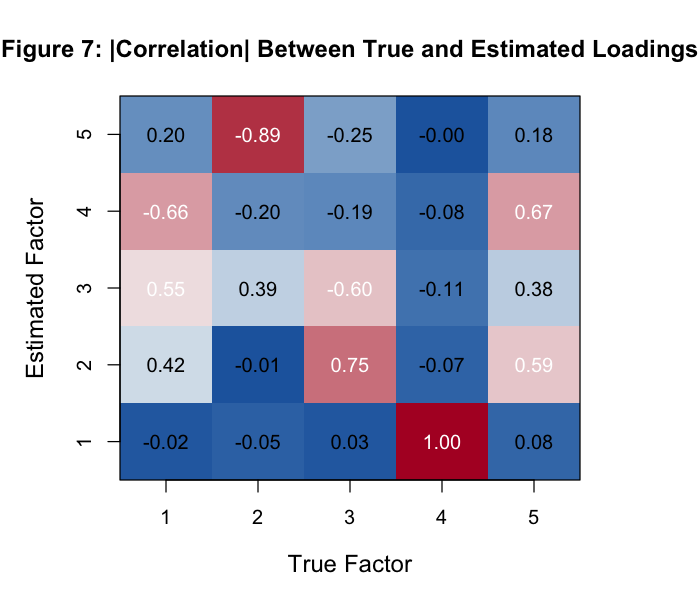{fig-align="center" width="95%"}

:::

::: {.column width="50%"}

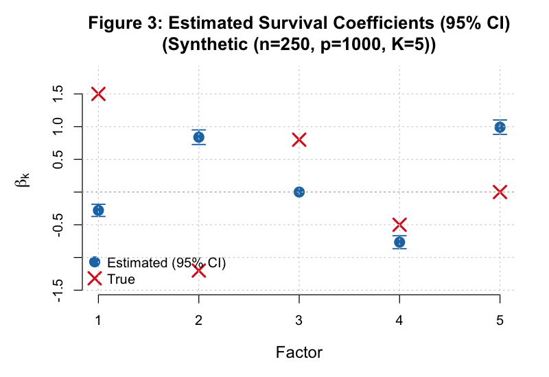{fig-align="center" width="95%"}

:::

::::

- **Simulated:** $n = 200$, $p = 500$, $K_\text{true} = 5$ (3 prognostic + 1 expression-only + 1 null)
- **Factor recovery:** one-to-one correspondence between true and estimated factors (up to permutation)
- **Null factor correctly zeroed:** $\hat{\beta}_5 \to 0$ — model separates prognostic from non-prognostic structure
- **C-index:** Supervised 0.86 vs. PCA 0.83

::: {.notes}
Before moving to real data, we validate on synthetic data with known ground
truth. The correlation matrix shows clear one-to-one correspondence between
true and estimated factors. The beta comparison shows that the model recovers
the correct signs and magnitudes, and critically, the null factor (true beta=0)
is correctly shrunk to zero. This is the EBNM prior doing its job.
:::


## Convergence & Baseline Performance {.smaller}

### All Seven Cohorts Converge

:::: {.columns}

::: {.column width="50%"}

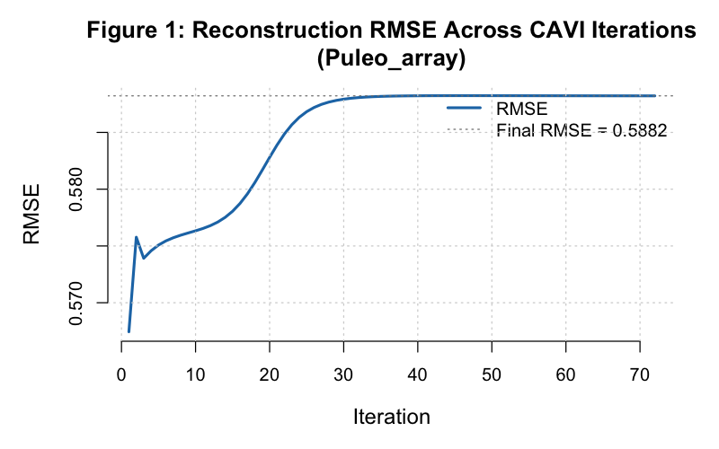{fig-align="center" width="95%"}

:::

::: {.column width="50%"}

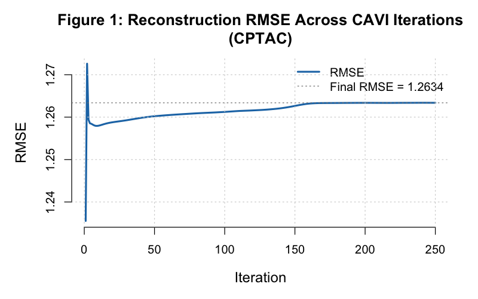{fig-align="center" width="95%"}

:::

::::

- **All 7 cohorts converge** — RMSE descends monotonically in every case
- **Iteration range:** 14 (Moffitt, microarray) to 259 (CPTAC, proteomics)
- Microarray datasets converge fastest; proteomics requires the most iterations (higher platform noise)
- At baseline (point-normal, $K = 5$): supervised C-index $\geq$ PCA in 3/7 cohorts

::: {.notes}
RMSE descends monotonically in every cohort — the CAVI algorithm is reliably
converging. Puleo is the largest cohort and converges in about 70 iterations.
CPTAC proteomics needs 259 iterations, reflecting higher noise in protein
abundance measurements. These baseline results use point-normal prior at K=5,
which we'll see is actually the worst-case configuration.
:::


## Prior × K Factorial: The Central Result {.smaller}

### Hold-Out C-index Across Four Conditions

```{r prior-comparison-table}
pc$PriorCode <- dplyr::recode(pc$Prior,
  "point_normal"          = "PN_K5",
  "point_laplace"         = "PL_K5",
  "point_normal (K_eff)"  = "PN_Keff",
  "point_laplace (K_eff)" = "PL_Keff"
)

pc$C_Test_disp <- ifelse(!pc$Converged,
                         paste0(sprintf("%.3f", pc$C_Test), "*"),
                         sprintf("%.3f", pc$C_Test))

pc_sub <- pc[, c("Dataset", "PriorCode", "K_fit", "C_Test_disp")]

wide_ctest <- reshape(pc_sub[, c("Dataset", "PriorCode", "C_Test_disp")],
                      idvar = "Dataset", timevar = "PriorCode", direction = "wide")
wide_k     <- reshape(pc_sub[, c("Dataset", "PriorCode", "K_fit")],
                      idvar = "Dataset", timevar = "PriorCode", direction = "wide")

pn_k5_ctest <- setNames(
  pc$C_Test[pc$PriorCode == "PN_K5"],
  pc$Dataset[pc$PriorCode == "PN_K5"]
)

strip <- function(x) as.numeric(gsub("\\*", "", x))

disp <- data.frame(
  Dataset        = wide_ctest$Dataset,
  K_Eff          = wide_k$K_fit.PN_Keff,
  C_PN_K5        = wide_ctest$C_Test_disp.PN_K5,
  C_PL_K5        = wide_ctest$C_Test_disp.PL_K5,
  C_PN_Keff      = wide_ctest$C_Test_disp.PN_Keff,
  C_PL_Keff      = wide_ctest$C_Test_disp.PL_Keff,
  stringsAsFactors = FALSE
)
disp <- disp[order(disp$Dataset), ]

kbl(disp,
    col.names = c("Dataset", "K_eff",
                  "PN K=5", "PL K=5",
                  "PN K_eff", "PL K_eff"),
    booktabs = TRUE, row.names = FALSE) |>
  kable_styling(bootstrap_options = c("striped", "hover"),
                full_width = FALSE, font_size = 24) |>
  add_footnote("* = hit 300-iteration limit. PN = point-normal, PL = point-laplace. 80/20 stratified hold-out.",
               notation = "none")
```

::: {.notes}
This is the central results table. Four conditions per dataset: point-normal
or point-laplace prior, at fixed K=5 or data-driven K_eff. Two patterns jump
out: point-normal at K=5 often gives C-index below chance (0.19 for PACA_AU_seq,
0.34 for TCGA) — these are degenerate solutions where beta collapses. And
the K_eff conditions consistently outperform K=5 regardless of prior.
:::


## Prior × K: Scatter Plot {.smaller}

```{r prior-comparison-plot}
#| fig-height: 7
#| fig-width: 14
#| fig-align: center

pc_all <- pc[!is.na(pc$C_Test) & pc$Dataset != "PDAC_pooled_rnaseq", ]

datasets <- sort(unique(pc_all$Dataset))
n_ds     <- length(datasets)
x_pos    <- seq_len(n_ds)

col_pn     <- "#1f77b4";  pch_pn     <- 16
col_pl     <- "#ff7f0e";  pch_pl     <- 17
col_keff   <- "#2ca02c";  pch_keff   <- 15
col_plkeff <- "#9467bd";  pch_plkeff <- 18

all_priors <- c("point_normal", "point_laplace",
                "point_normal (K_eff)", "point_laplace (K_eff)")
offsets <- c("point_normal" = -0.3, "point_laplace" = -0.1,
             "point_normal (K_eff)" = 0.1, "point_laplace (K_eff)" = 0.3)
cols    <- c("point_normal" = col_pn, "point_laplace" = col_pl,
             "point_normal (K_eff)" = col_keff, "point_laplace (K_eff)" = col_plkeff)
pchs    <- c("point_normal" = pch_pn, "point_laplace" = pch_pl,
             "point_normal (K_eff)" = pch_keff, "point_laplace (K_eff)" = pch_plkeff)

par(mar = c(8, 5, 3, 2))
plot(NA, xlim = c(0.5, n_ds + 0.5), ylim = c(0.1, 1.0),
     xaxt = "n", bty = "n",
     xlab = "", ylab = "Hold-out C-index",
     main = "Hold-out C-index: Prior × K Comparison",
     cex.main = 1.4, cex.lab = 1.2, cex.axis = 1.1)

abline(h = 0.5, lty = 2, col = "gray50", lwd = 1.5)

for (i in seq_len(n_ds)) {
  ds <- datasets[i]
  for (prior in all_priors) {
    r <- pc_all[pc_all$Dataset == ds & pc_all$Prior == prior, ]
    if (nrow(r) == 0 || is.na(r$C_Test)) next
    points(i + offsets[prior], r$C_Test,
           pch = pchs[prior], cex = 2.2, col = cols[prior])
    if (!r$Converged)
      text(i + offsets[prior], r$C_Test + 0.035, "*", cex = 1.1, col = cols[prior])
  }
}

axis(1, at = x_pos, labels = gsub("_", "\n", datasets),
     las = 2, cex.axis = 0.9)

legend("topright",
       legend = c("PN K=5", "PL K=5", "PN K_eff", "PL K_eff"),
       col = c(col_pn, col_pl, col_keff, col_plkeff),
       pch = c(pch_pn, pch_pl, pch_keff, pch_plkeff),
       pt.cex = 2, cex = 1.1, bty = "n", ncol = 2)
```

::: {.notes}
The scatter plot makes the pattern visual. Blue circles at the bottom are the
degenerate point-normal K=5 fits. Orange triangles show the improvement from
switching to point-laplace. But the biggest jump is from K=5 to K_eff —
the green and purple points are consistently higher regardless of prior.
:::


## Two Key Findings {.smaller}

### Finding 1: Point-Laplace Wins at K=5

- Point-laplace **outperforms** point-normal in **all 7 cohorts** at $K = 5$
- $\Delta C_\text{test}$ ranges from +0.06 (Moffitt) to +0.70 (PACA\_AU\_seq)
- Point-normal at $K = 5$ converges to **degenerate solutions** in 4/7 cohorts ($C < 0.4$)
- Laplace's heavier tails better capture the continuous, non-zero gene weight structure in real genomics data

### Finding 2: K Selection Dominates Prior Choice

:::: {.columns}

::: {.column width="55%"}

- $K_\text{eff} \in \{8, 9, 10\}$ across all 7 cohorts — **always above** $K = 5$
- **Every** $K_\text{eff}$ condition outperforms its $K = 5$ counterpart
- At $K_\text{eff}$: prior advantage is **mixed** (PN wins 4/7, PL wins 2/7, tie 1/7)
- Three cohorts saturate at $K_\text{max} = 10$, suggesting even more factors may be needed

> **Takeaway:** invest in K selection, not prior tuning.

:::

::: {.column width="45%"}

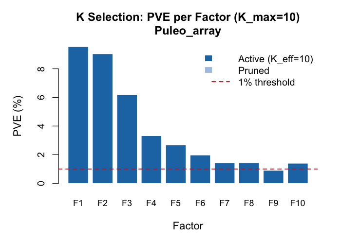{fig-align="center" width="95%"}

:::

::::

::: {.notes}
Two main findings. First, point-laplace is clearly better than point-normal
at K=5. The Gaussian prior over-shrinks in real data. But the second finding
is more important: K selection dominates everything. Once you give the model
enough factors, the prior advantage largely disappears. The scree plot shows
Puleo needing 10 factors — our initial guess of 5 was way too conservative.
Three cohorts actually saturate at our K_max of 10, meaning there may be even
more structure to discover.
:::


## Deep Dive: Puleo Array ($n = 288$) {.smaller}

### The Clearest Factor Structure

:::: {.columns}

::: {.column width="50%"}

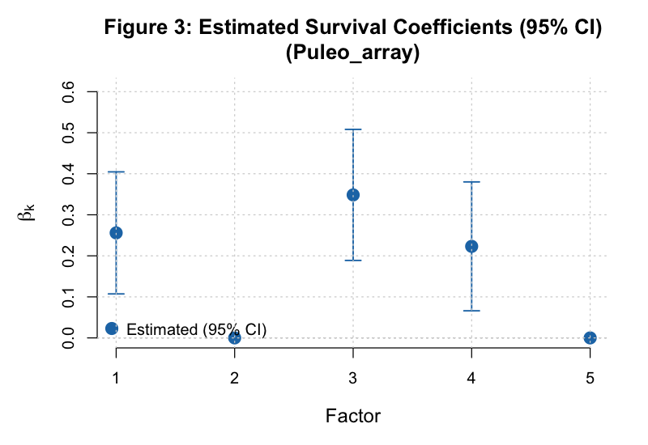{fig-align="center" width="95%"}

:::

::: {.column width="50%"}

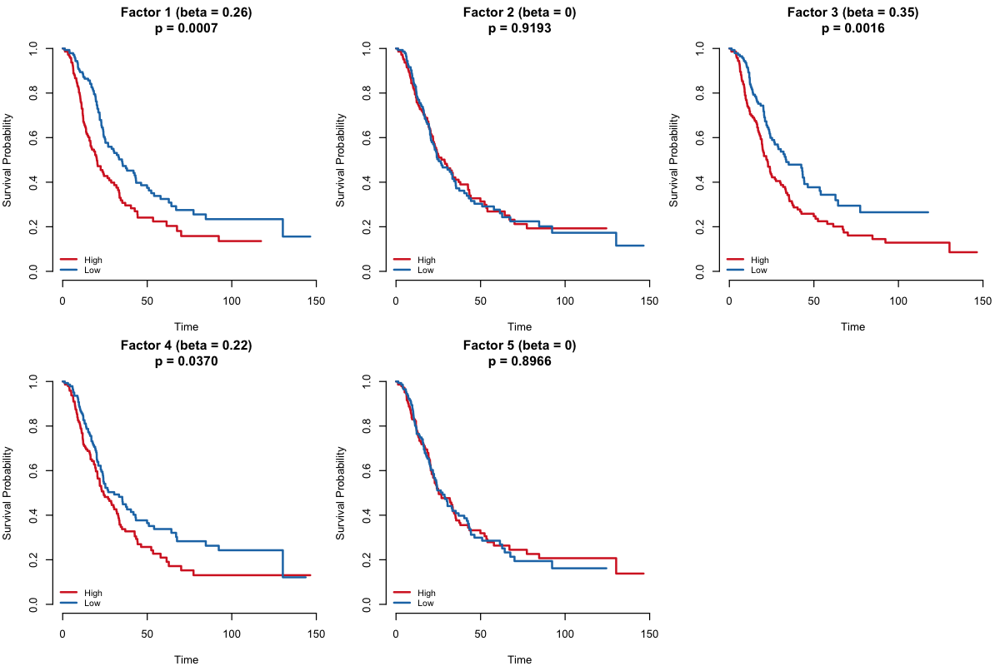{fig-align="center" width="95%"}

:::

::::

- **Factor 2:** highest PVE (9.05%) but $\hat{\beta} = 0$ — expression-dominant, survival-neutral
- **Factors 3, 4, 9:** large $|\hat{\beta}|$ — prognostically informative
- The model **separates prognostic from non-prognostic** structure — PCA would test all factors indiscriminately
- $K_\text{eff} = 10$ via auto-prune (4 more factors than fixed $K = 5$)

::: {.notes}
Puleo is our best exemplar — largest cohort, clearest structure. The beta
barplot shows factor 2 is shrunk to zero despite being the single largest
expression axis. A post-hoc approach would have tested it alongside the
genuinely prognostic factors, diluting statistical power. The KM curves
show clear patient stratification by GEP activation. This is what supervised
factorisation buys you.
:::


## Deep Dive: TCGA_PAAD {.smaller}

### The Most Widely Studied PDAC Cohort

:::: {.columns}

::: {.column width="50%"}

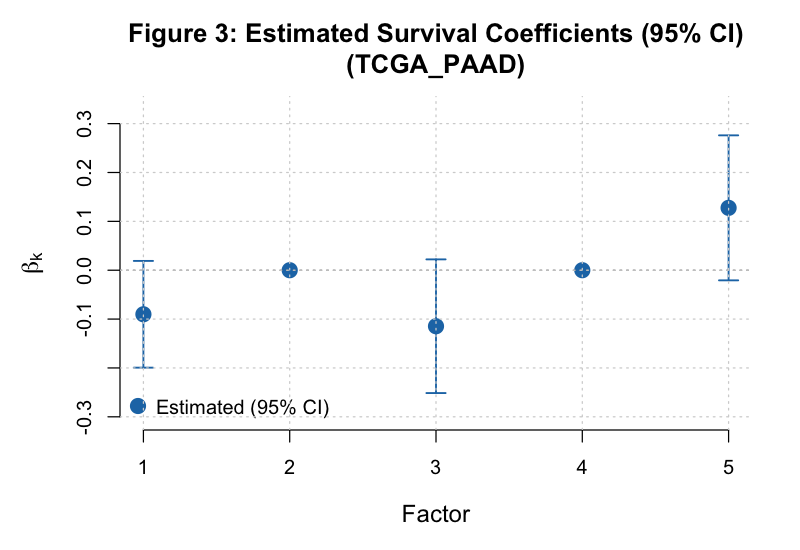{fig-align="center" width="95%"}

:::

::: {.column width="50%"}

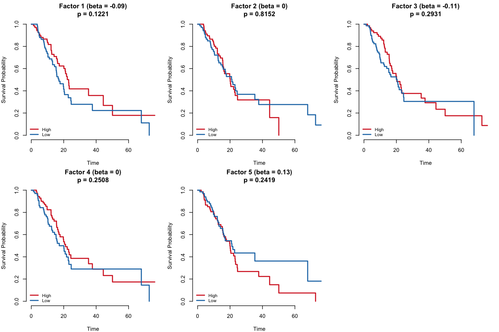{fig-align="center" width="95%"}

:::

::::

- **TCGA_PAAD** ($n = 144$, RNA-seq) — the benchmark PDAC dataset
- $K_\text{eff} = 9$; largest $K_\text{eff}$ improvement: $\Delta C_\text{test} = +0.28$ over $K = 5$ baseline
- Consistent with Puleo: model identifies both prognostic and expression-only GEPs
- Patient stratification visible in Kaplan-Meier curves

::: {.notes}
TCGA is the dataset most people in the room will have heard of. It shows the
same pattern as Puleo: some factors are prognostic, others are expression-only.
The K_eff improvement here is dramatic — going from K=5 to K=9 improves
hold-out C-index by 0.28. This cohort is also where we see the most dramatic
failure of point-normal at K=5 (C-index of 0.34 — below random).
:::


## Hold-Out Prediction {.smaller}

### Generalisation to Unseen Patients

```{r holdout-table}
# Build best-condition hold-out table
pc_best <- pc |>
  filter(Dataset %in% ALL_DATASETS) |>
  group_by(Dataset) |>
  slice_max(C_Test, n = 1, with_ties = FALSE) |>
  ungroup() |>
  select(Dataset, Prior, K_fit, C_Test) |>
  rename(Best_Prior = Prior, Best_K = K_fit, C_Best = C_Test)

# Get PCA baseline from cross7
pca_base <- cross7 |>
  select(Dataset, C_PCA) |>
  filter(Dataset %in% ALL_DATASETS)

holdout_disp <- merge(pca_base, pc_best, by = "Dataset")
holdout_disp$Delta <- round(holdout_disp$C_Best - holdout_disp$C_PCA, 3)
holdout_disp <- holdout_disp[order(holdout_disp$Dataset), ]

kbl(holdout_disp,
    col.names = c("Dataset", "C (PCA)", "Best Condition", "K", "C (SBMF)", "\u0394C"),
    digits = 3, booktabs = TRUE, row.names = FALSE) |>
  kable_styling(bootstrap_options = c("striped", "hover"),
                full_width = FALSE, font_size = 24) |>
  column_spec(6, bold = TRUE)
```

- SBMF **beats PCA baseline on held-out patients in 5/7** cohorts
- Improvements most reliable when test set is large enough ($n_\text{test} \geq 20$)
- **Caveat:** small test sets ($n \leq 15$) produce noisy C-index estimates

::: {.notes}
On held-out data, SBMF generalises better than PCA in 5 of 7 cohorts. The
improvements are most reliable in larger test sets. PACA_AU_seq has only
about 10 test patients — that's too few for a reliable C-index estimate.
The key message is that the model is learning genuine prognostic signal,
not just overfitting to the training data.
:::


<!-- ============================================================
     FUTURE & CLOSING
     ============================================================ -->

## Future Directions & Summary {.smaller}

:::: {.columns}

::: {.column width="50%"}

### Next Steps

1. **Gene set enrichment** — fgsea / Enrichr on top-loaded genes per GEP (MSigDB, KEGG, Reactome)
2. **CV-based K selection** — cross-validated C-index on Longleaf HPC ($K_\text{max} \geq 15$)
3. **Multi-dataset shared factors** — identify GEPs replicating across cohorts
4. **Full ELBO as model selection** — compare models by variational lower bound
5. **Manuscript preparation**

:::

::: {.column width="50%"}

::: {.callout-note}
### Summary
1. **SBMF** jointly learns gene expression programs and survival associations via Bayesian inference
2. **K selection is the dominant lever** — $K_\text{eff} \in \{8, 9, 10\}$ vs. fixed $K = 5$
3. **Point-laplace preferred** when K is constrained
4. **Generalises** to held-out patients across 3 platforms (5/7 cohorts)
5. **Codebase:** 139/139 tests passing, modular architecture
:::

:::

::::

::: {.notes}
The most pressing next step is gene set enrichment to give biological names
to the statistical factors. Second, proper cross-validated K selection on our
HPC cluster with K_max of 15 or higher. Third, finding which GEPs replicate
across independent cohorts would be the strongest biological validation.
To summarise: the method works, converges reliably across platforms, and
the main insight is that getting K right matters more than prior selection.
:::


## Discussion {.centered}

### Thank You

<br>

**Questions, suggestions, and feedback welcome!**

<br>

[Andrew Walther]{style="color: #4B9CD3; font-weight: 600;"} · [ajwalther@unc.edu]{style="color: #13294B;"}

Department of Biostatistics, UNC Gillings School of Global Public Health

::: {.notes}
Open the floor for discussion. Happy to go deeper on any part of the
methods, results, or future plans. I have backup slides with additional
per-cohort results, ELBO traces, and technical details on EBNM.
:::


<!-- ============================================================
     BACKUP SLIDES (uncounted, for Q&A)
     ============================================================ -->

## Pooled RNA-seq Analysis {visibility="uncounted" .smaller}

### Cross-Cohort Validation: TCGA + Dijk + PACA\_AU\_seq

:::: {.columns}

::: {.column width="50%"}

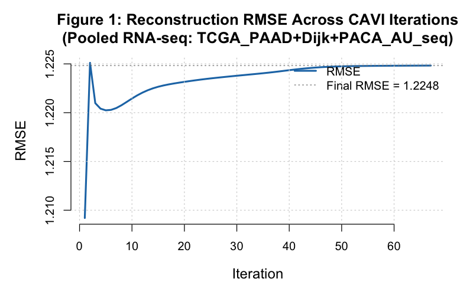{fig-align="center" width="95%"}

:::

::: {.column width="50%"}

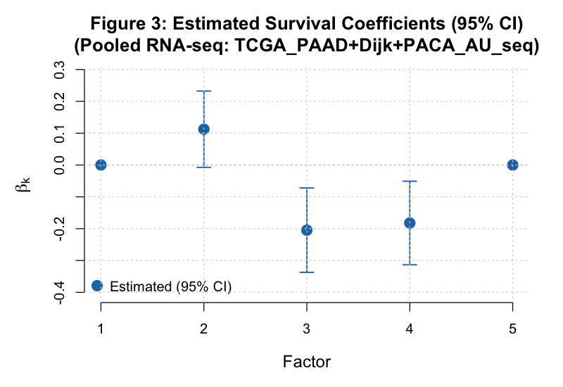{fig-align="center" width="95%"}

:::

::::

- **Pooled:** $n = 286$ patients, 1,573 common genes (intersection across 3 RNA-seq cohorts)
- Converges in 67 iterations
- Tests whether gene programs replicate when patients from different studies are combined


## EBNM Deep Dive {visibility="uncounted" .smaller}

### Empirical Bayes Normal Means — Full Detail

Each CAVI update reduces to an EBNM sub-problem:

$$x_j = \theta_j + \epsilon_j, \quad \epsilon_j \sim N(0, s_j^2)$$

where $x_j = B_j / A_j$ (pseudo-data) and $s_j = 1/\sqrt{A_j}$ (scale).

**EBNM solves:**

$$\hat{g} = \arg\max_{g \in \mathcal{G}} \sum_j \log \int N(x_j; \theta, s_j^2) \, g(\theta) \, d\theta$$

Then computes posterior: $E[\theta_j \mid x_j, \hat{g}]$ and $\text{Var}(\theta_j \mid x_j, \hat{g})$.

**Critical:** Posterior second moments $E[\theta^2] = \text{Var}(\theta) + E[\theta]^2 \neq E[\theta]^2$

This prevents overfitting to uncertain parameter estimates — the error-in-variables correction.


## GEP Heatmap: Puleo Array {visibility="uncounted" .smaller}

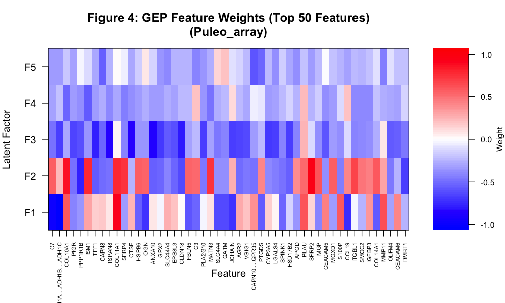{fig-align="center" width="80%"}

Each column is a gene expression program. Distinct patient groups emerge from the loading patterns.


## ELBO Convergence Traces {visibility="uncounted" .smaller}

:::: {.columns}

::: {.column width="50%"}

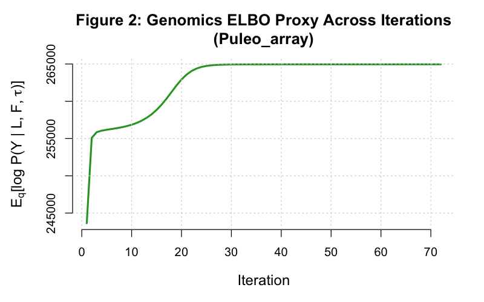{fig-align="center" width="95%"}

:::

::: {.column width="50%"}

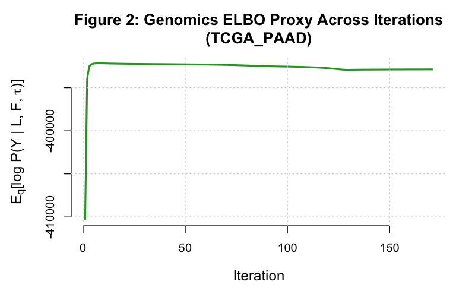{fig-align="center" width="95%"}

:::

::::

ELBO (variational lower bound) increases monotonically, confirming valid CAVI convergence.


## Tau/Precision Distribution {visibility="uncounted" .smaller}

:::: {.columns}

::: {.column width="50%"}

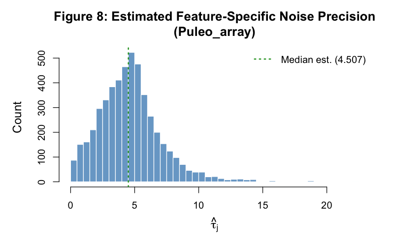{fig-align="center" width="95%"}

:::

::: {.column width="50%"}

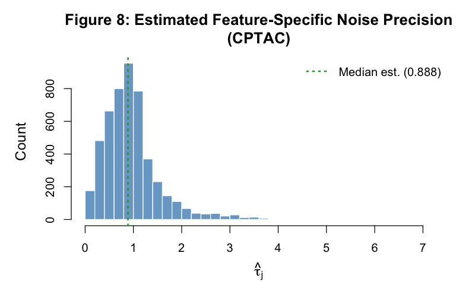{fig-align="center" width="95%"}

:::

::::

Heteroscedastic noise model: each gene has its own precision estimate. Some genes are precisely measured (high $\tau$), others are noisy (low $\tau$).


## Per-Cohort Beta Comparisons {visibility="uncounted" .smaller}

:::: {.columns}

::: {.column width="33%"}

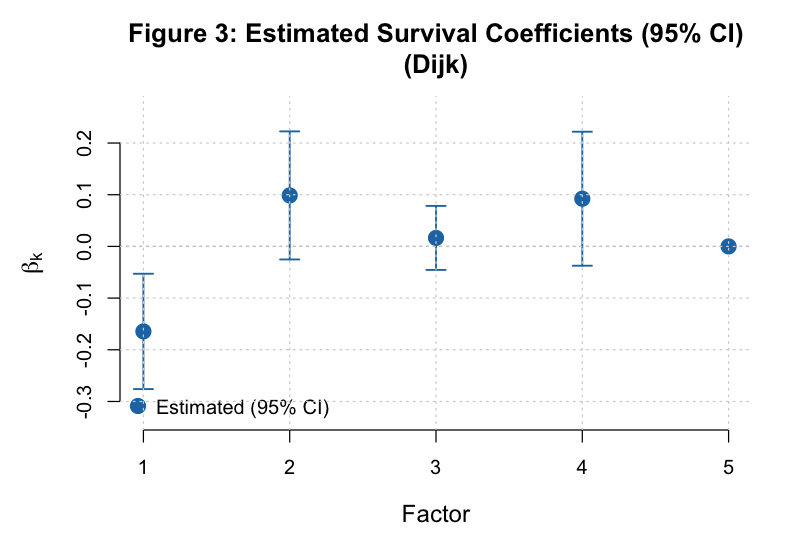{fig-align="center" width="95%"}

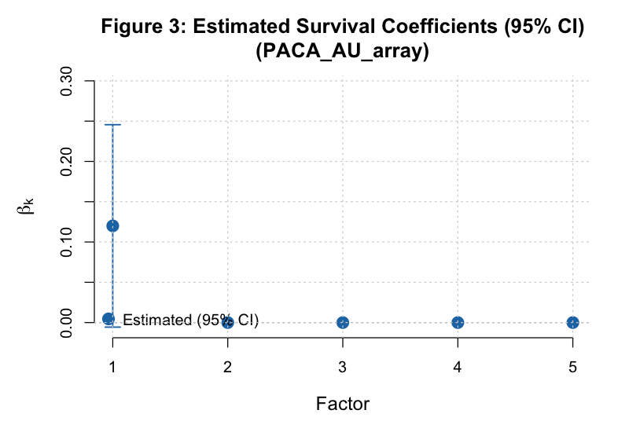{fig-align="center" width="95%"}

:::

::: {.column width="33%"}

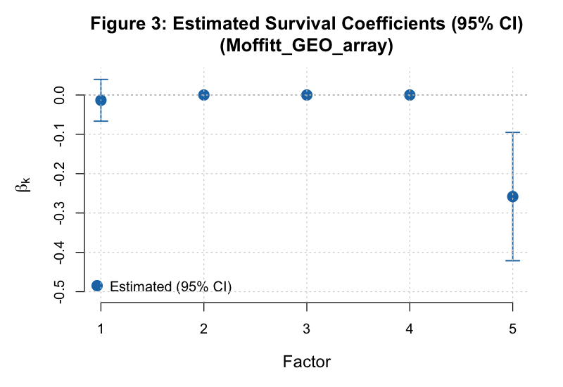{fig-align="center" width="95%"}

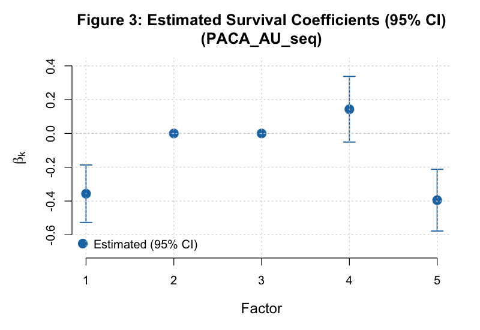{fig-align="center" width="95%"}

:::

::: {.column width="33%"}

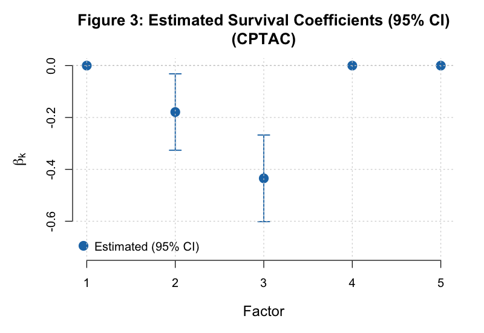{fig-align="center" width="95%"}

:::

::::


## Per-Cohort Kaplan-Meier Curves {visibility="uncounted" .smaller}

:::: {.columns}

::: {.column width="33%"}

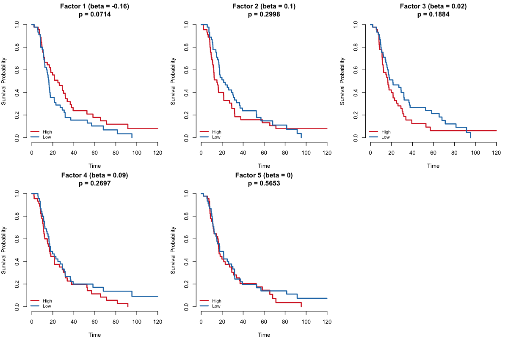{fig-align="center" width="95%"}

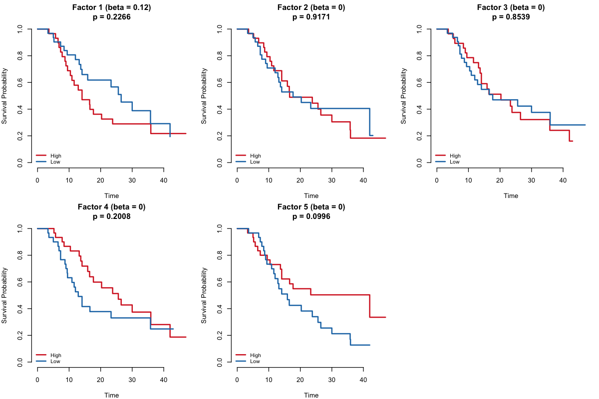{fig-align="center" width="95%"}

:::

::: {.column width="33%"}

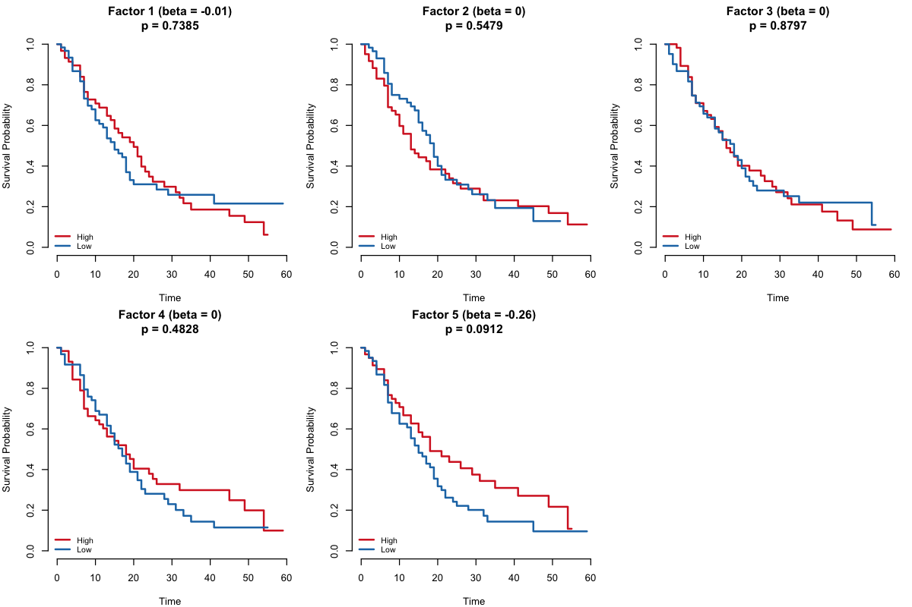{fig-align="center" width="95%"}

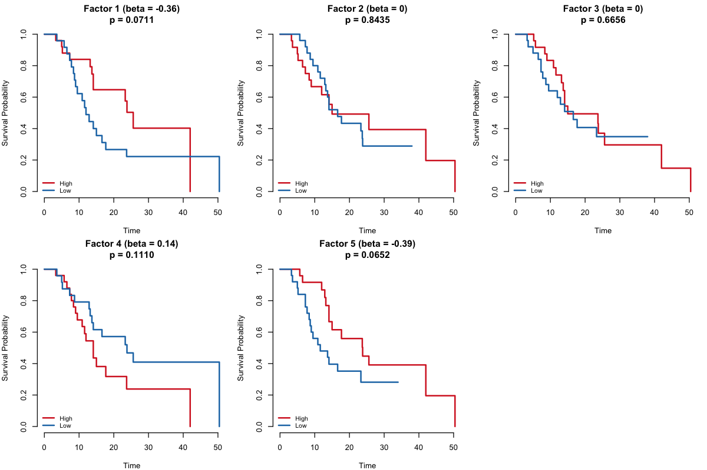{fig-align="center" width="95%"}

:::

::: {.column width="33%"}

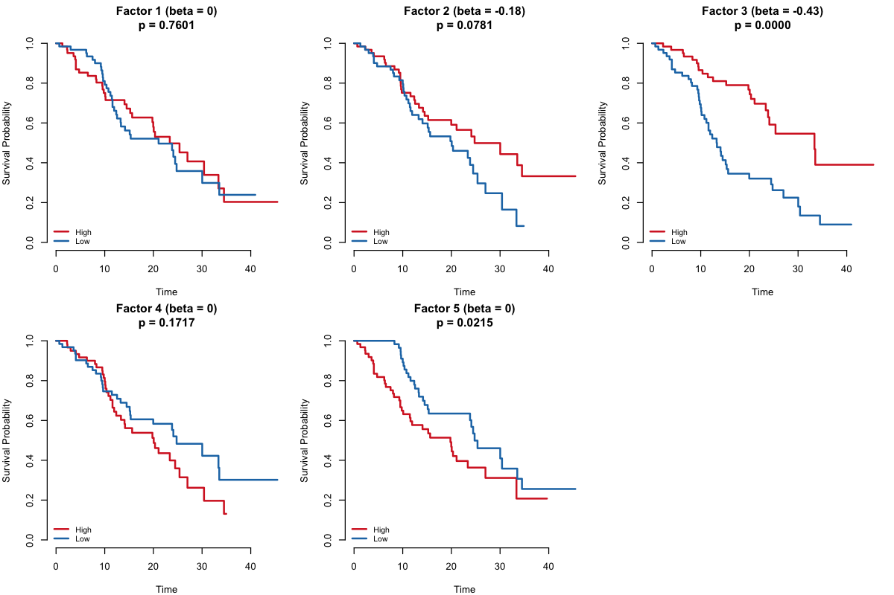{fig-align="center" width="95%"}

:::

::::


## Signal Recovery: Synthetic Detail {visibility="uncounted" .smaller}

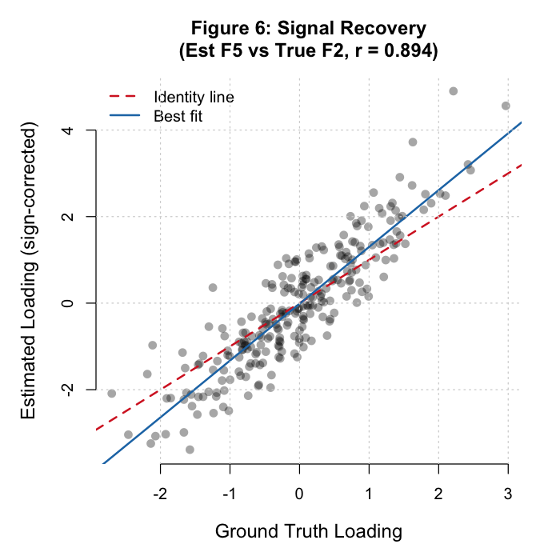{fig-align="center" width="80%"}


## Method Comparison {visibility="uncounted" .smaller}

### SBMF vs. Penalised Supervised MF Approaches

| Feature | Penalised MF (e.g., deSurv) | SBMF (this work) |
|:--------|:---------------------------|:-----------------|
| **Inference** | Penalised optimisation | Full Bayesian (CAVI) |
| **Objective balance** | Tuning parameter $\alpha$ | ELBO — natural balance |
| **Priors** | Fixed penalty $\lambda$ | EBNM — prior learns from data |
| **Uncertainty** | Point estimates only | Posterior moments $(E[\theta], \text{Var}(\theta))$ |
| **K selection** | CV grid search | Auto-prune ($K_\text{eff}$) |
| **Constraints** | Nonnegative (NMF) | Unconstrained (allows negative loadings) |
| **Error-in-variables** | Not addressed | $E[L^2] = \text{Var}(L) + E[L]^2$ correction |
| **Second moments** | N/A | Prevents overfitting to uncertain loadings |
