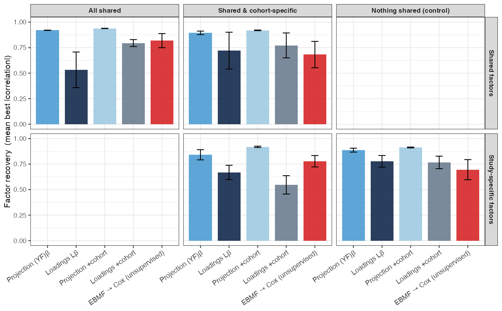
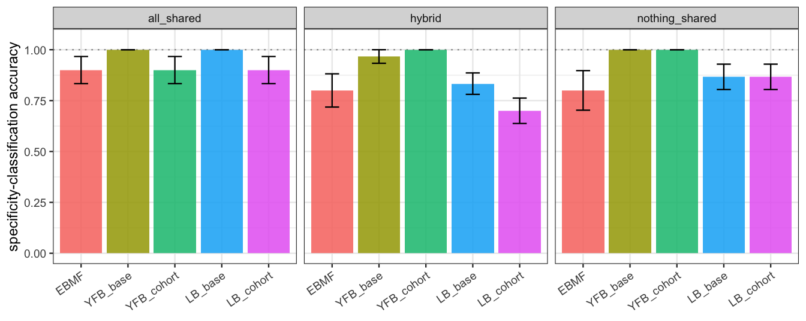
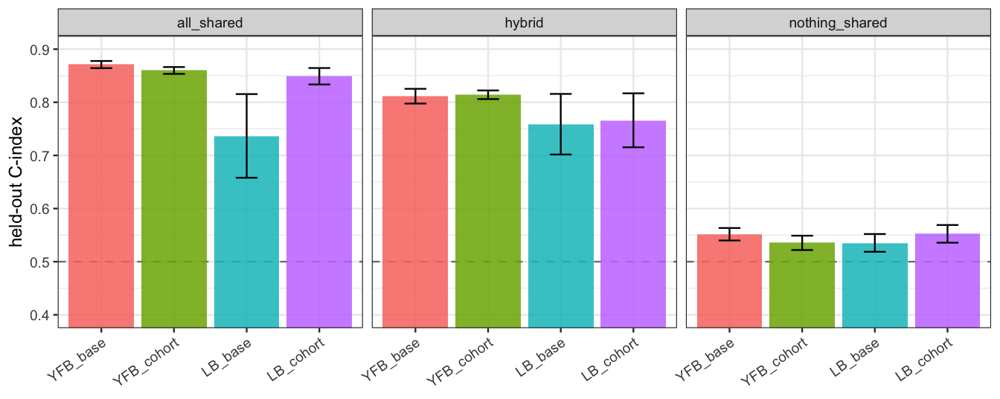
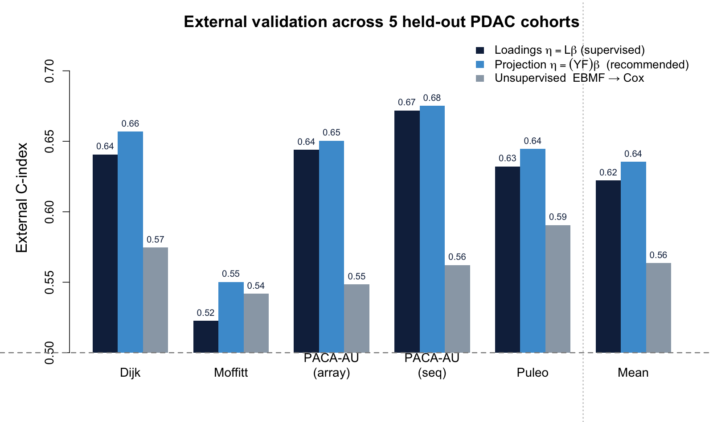
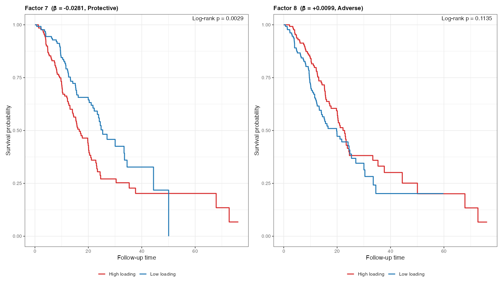
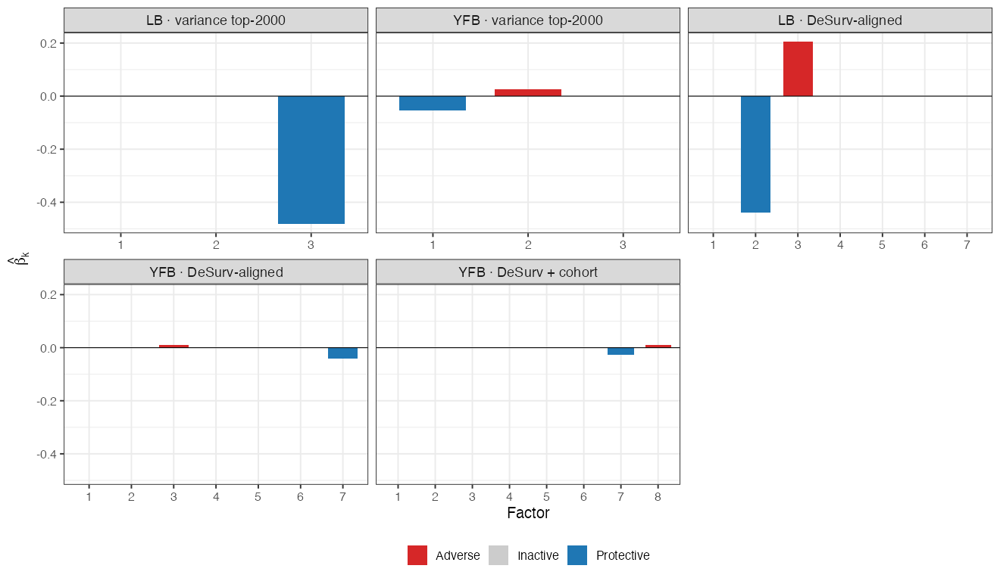

```{r setup}
#| include: false
library(kableExtra)
library(dplyr)

# ── Canonical result sources (paths relative to this .qmd) ──────────────────
desurv_csv <- "../../results/benchmark_sim/outputs/desurv_comparison/desurv_comparison_results.csv"
ebmf_csv   <- "../../results/benchmark_sim/outputs/ebmf_cox_external/ebmf_cox_external_results.csv"
genes_csv  <- "assets/active_factor_genes.csv"

desurv <- read.csv(desurv_csv, stringsAsFactors = FALSE)

# Recommended (projection (YF)β, no cohort indicator) and loadings counterpart.
yfb_real <- desurv[desurv$model == "D4", ]
lb_real  <- desurv[desurv$model == "D3", ]
coh_real <- desurv[desurv$model == "D5", ]
yfb_mean <- mean(yfb_real$c_index)
lb_mean  <- mean(lb_real$c_index)
coh_mean <- mean(coh_real$c_index)
yfb_K    <- yfb_real$K[1];   yfb_keff <- yfb_real$k_eff[1]

ebmf_mean <- if (file.exists(ebmf_csv)) mean(read.csv(ebmf_csv)$c_index) else NA_real_
ebmf_K    <- if (file.exists(ebmf_csv)) read.csv(ebmf_csv)$K[1] else NA_integer_

# Merged-training gene count (rows of EF in the recommended fit = 2064).
N_GENES_TRAIN <- 2064L

# Active-program gene lists (exported by figs/make_factor_figs.R).
af <- if (file.exists(genes_csv)) read.csv(genes_csv, stringsAsFactors = FALSE) else NULL
adverse_row    <- if (!is.null(af)) af[af$direction == "Adverse", ][1, ]    else NULL
protective_row <- if (!is.null(af)) af[af$direction == "Protective", ][1, ] else NULL
```


## Agenda {.smaller .tight-list}

<br>

**Background** &nbsp;·&nbsp; The PDAC prognostic problem · why supervise the factorization

<br>

**Method updates** &nbsp;·&nbsp; The joint model · two linear predictors (Lβ vs (YF)β) · explicit priors & non-parametric baseline hazard · the ELBO & variational family · CAVI updates & convergence · preprocessing · selecting K · the cohort-membership extension

<br>

**Results** &nbsp;·&nbsp; Multi-cohort simulation study · real-data gene programs & survival · external validation on five held-out cohorts

<br>

**Impact & Future Directions**

::: {.notes}
Roadmap for the next ~25 minutes. The methods section directly works through the
feedback from April: explicit priors, the non-parametric baseline hazard,
defining the variational family, the convergence criterion, the preprocessing
fix for p ≫ n, no-leakage normalization, CV-based K selection, and the
risk-direction correction.
:::


# Background {.section-divider}


## Background: PDAC needs molecular prognosis {.dense-cols .tight-list .compact-callout .vcenter}

:::: {.columns}

::: {.column width="55%"}

- **Five-year survival < 12%** — among the most lethal solid tumors
- Most patients diagnosed late; **no widely adopted molecular stratification** at diagnosis
- Bulk expression mixes malignant, stromal, and immune signals — prognostic structure is interwoven and often **low-variance**
- **Goal:** recover *gene expression programs (GEPs)* whose activation predicts survival, and validate them on **independent** cohorts
- A GEP is a coordinated set of genes (a column of $F$) whose patient-level activation (a column of $L$) we test for survival association

:::

::: {.column width="45%"}

::: {.callout-note}
### Why model expression and survival *jointly*?
The common pipeline is **two-step**: run unsupervised factor analysis (PCA / EBMF), then test factors for survival *post hoc*.

- Unsupervised axes track the **largest expression variance** — often batch or housekeeping signal
- A program explaining little variance but strongly prognostic gets **missed**
- **Supervision** steers factors toward survival-relevant structure *during* estimation

A program explaining 15% of variance may be pure batch effect; one explaining 3% may cleanly separate survivors. Supervision prioritizes the second.
:::

:::

::::

::: {.notes}
One background slide. The clinical motivation is unchanged. The methodological
motivation — joint over two-step — is the thread of the whole talk, and I back
it with both a synthetic comparison and a real-data external comparison against
the unsupervised two-step (EBMF → Cox) baseline.
:::


# Methods {.section-divider}


## The model — two coupled components {.smaller .compact-table .tight-list .compact-callout}

<br>

$$\underbrace{Y = LF^\top + E,\quad E_{ij}\sim N(0,\tau_j^{-1})}_{\text{genomics: low-rank} + \text{gene-specific noise}}
\qquad
\underbrace{h_i(t)=h_0(t)\exp(\eta_i)}_{\text{Cox proportional hazards}}$$

:::: {.columns}

::: {.column width="52%"}

| Quantity | Dim | Meaning |
|:--|:--:|:--|
| $Y$ | $n\times p$ | expression matrix |
| $L$ | $n\times K$ | patient program-activation scores |
| $F$ | $p\times K$ | gene weights per program |
| $\beta$ | $K\times 1$ | survival (log-HR) coefficients |
| $\tau_j$ | scalar | gene-specific noise precision |
| $\eta_i$ | scalar | patient log-risk score ($L_i\beta$ or $(Y_iF)\beta$) |

:::

::: {.column width="48%"}

::: {.callout-note}
### Shared loadings couple the two
The **same** latent structure drives low-rank reconstruction of $Y$ **and** the survival risk score. A program is **prognostic only if its $\beta_k \neq 0$**; otherwise it explains expression alone.
:::

::: {.callout-tip}
### Non-parametric baseline hazard
$h_0(t)$ is left **unspecified** — it cancels in the Cox partial likelihood. No Weibull / exponential shape assumption; only proportional hazards.
:::

:::

::::
::: {.notes}
Two equations, one shared latent structure. Every symbol is defined in the table,
including the risk score eta. The baseline hazard is non-parametric — a specific April
question — so h0(t) drops out of the partial likelihood and we make no
parametric shape assumption.
:::


## Two linear predictors: Lβ vs (YF)β {.smaller .dense-cols .tight-list .compact-callout .vcenter}

:::: {.columns}

::: {.column width="50%"}

### Loadings predictor — $\eta = L\beta$
- Risk uses the **learned** patient scores $L$ directly
- Survival shapes $L$ during estimation (fully joint)
- Scoring a **new** patient requires **re-deriving** their $L$ (an OLS projection) — an **approximation** of the trained scores

### Projection predictor — $\eta = (YF)\beta$
- Risk uses the **direct genomic projection** $YF$
- **Exact** out-of-sample scoring: $\eta_\text{new} = (Y_\text{new}F)\beta$ — the *identical* formula at train and test, no train/test score mismatch

:::

::: {.column width="50%"}

**Priors — every block is explicit.** $q(\cdot)$ denotes the **variational (approximate posterior)** for each block, fit by empirical Bayes at every update:

- $q(L_{\cdot k}),\, q(F_{\cdot k})$ — **point-exponential** (non-negative spike-and-slab): $\;g(\theta)=\pi_0\delta_0+(1-\pi_0)\,\text{Exp}(\lambda),\ \theta\ge 0$
- $q(\beta_k)$ — **normal** (Gaussian slab, no spike): $\;g(\beta)=N(0,\sigma^2)$
- $q(\tau_j)$ — **closed-form MLE**: no EBNM, no prior tuning

Sparsity $\pi_0$, scale $\lambda$, and slab variance $\sigma^2$ are all estimated from the data (`ebnm`) at each step.

::: {.callout-tip}
### Why we report both
$(YF)\beta$ gives leakage-free **exact** external scoring → the recommended model; $L\beta$ is the fully-joint reference.
:::

:::

::::
::: {.notes}
The key methods update since April: two linear predictors. Lβ is the original
fully-joint form but needs L re-derived for new patients. (YF)β scores new
patients with the identical formula — no mismatch. Priors are now correct and
explicit: non-negative point-exponential on L and F, a Gaussian (normal) prior
on β, and a closed-form MLE for τ. Note these are NOT point-normal.
:::


## The objective: ELBO & variational family {.smaller .dense-cols .small-math .tight-list}

**Mean-field variational family** — each block factorizes independently:

$$q(L,F,\beta,\tau)=\prod_{k=1}^{K}q(L_{\cdot k})\;\prod_{k=1}^{K}q(F_{\cdot k})\;\prod_{k=1}^{K}q(\beta_k)\;\prod_{j=1}^{p}q(\tau_j)$$

The **ELBO** (evidence lower bound) is the objective CAVI maximizes — a lower bound on the log marginal likelihood. For the recommended **projection** model:

$$\text{ELBO}=\underbrace{E_q[\mathcal{L}_\text{gen}]}_{\text{expression fit}}\;+\;\underbrace{\lambda\,E_q[\mathcal{L}_\text{Cox}]}_{\text{survival fit}}\;-\;\underbrace{\textstyle\sum_\text{blocks}D_\text{KL}\!\left(q\,\|\,\text{prior}\right)}_{\text{prior regularization}}$$

:::: {.columns}

::: {.column width="50%"}

- **Genomics fit** $E_q[\mathcal{L}_\text{gen}]=\sum_j E_q\log p(Y_{\cdot j}\mid L,F_j,\tau_j)$ — Gaussian reconstruction of $Y$ by $LF^\top$
- **Survival fit** $E_q[\mathcal{L}_\text{Cox})]$ — a **2nd-order Taylor** expansion of the Cox partial log-likelihood in $\eta=(YF)\beta$, making the survival term conjugate to the EBNM updates

:::

::: {.column width="50%"}

- **KL term** penalizes each posterior $q$ away from its prior — the adaptive shrinkage
- The **shared $F$** enters both likelihood terms — genomics reconstruction ($Y \approx LF^\top$) and survival risk ($\eta = (YF)\beta$) — that coupling *is* the supervision
- The ELBO **balances** expression and survival automatically — **no tuning parameter $\alpha$** ($\lambda=1$ in the recommended fits)

:::

::::

> **What the ELBO is *for*:** it is the **fitting objective** — CAVI maximizes it, and a fit is declared converged when it stops improving. **It is *not* used to choose the number of programs** — that is done by cross-validated C-index (next: *Selecting K*).

::: {.notes}
The variational family is mean-field and factor-wise, written out at the top — a
direct April request. The ELBO has three pieces: Gaussian genomics
reconstruction, the Cox survival term via a second-order Taylor expansion that
keeps the updates conjugate, and a per-block KL penalty that is the adaptive
shrinkage. I show the survival term for the projection (YF)β model, which is the
recommended one. The shared F in both likelihood terms is the supervision — F
shapes expression reconstruction and the survival risk score simultaneously — and
the ELBO balances the two with no α to tune.
:::


## Inference: factor-wise CAVI {.smaller .dense-cols .tight-list .small-math}

:::: {.columns}

::: {.column width="55%"}

**Coordinate ascent (Gauss–Seidel)** — per outer iteration, for each factor $k$:

$$\beta_k \;\to\; L_{\cdot k} \;\to\; F_{\cdot k}, \qquad \text{then } \tau \text{ once per sweep}$$

- Each update is an **EBNM** sub-problem: pseudo-data $x=B/A$, scale $s=1/\sqrt{A}$, then `ebnm` returns the posterior mean **and** variance
- $L$ has a **dual-source precision** (genomics + survival):
$$A_{L,i}=\underbrace{\textstyle\sum_j \tau_j\,E[F_{jk}^2]}_{\text{expression}}+\underbrace{W_{ii}\,E[\beta_k^2]}_{\text{survival}}$$
where $W_{ii}$ is the patient's Cox working weight
- The empirical-Bayes prior $\hat g$ is **re-estimated every update** → adaptive shrinkage per factor / per gene; deflate the residual after each factor

:::

::: {.column width="45%"}

**Convergence — in plain English.** After a 5-iteration burn-in, stop when the **ELBO stops improving** — its relative change between iterations falls below $10^{-5}$:
$$\frac{\big|\text{ELBO}^{(t)}-\text{ELBO}^{(t-1)}\big|}{\big|\text{ELBO}^{(t-1)}\big|} < 10^{-5}$$

- The ELBO is the **single objective** being maximized, so this directly detects a stationary point of the variational optimization
- Mean absolute changes in $L$ and $\beta$ are tracked alongside as **diagnostics** (both settle below $10^{-3}$ at convergence)

::: {.callout-important}
### Risk-direction sign correction
Cox concordance is invariant to a global sign flip, so an unconstrained fit can land at $C<0.5$. **Fix:** orient each program against the **training** concordance, then apply the *same* orientation at test. (Used to define program activation in the survival results.)
:::

:::

::::
::: {.notes}
CAVI updates one factor at a time in Gauss-Seidel order; each block reduces to an
EBNM call with pseudo-data x=B/A and scale s=1/sqrt(A). The L precision is
dual-source — a genomics piece summing tau times E[F^2], plus a survival piece
W_ii times E[beta^2] — so survival genuinely shapes the loadings. Convergence
requires both L and beta to settle below 1e-3 in MEAN absolute change; averaging
avoids a single oscillating factor blocking the stop. The sign correction orients
each program by training concordance and reuses it at test.
:::


## Preprocessing is crucial: per-platform normalization {.smaller .dense-cols .tight-list .compact-callout}

:::: {.columns}

::: {.column width="54%"}

**The $p\gg n$ scaling problem.** Merging platforms (RNA-seq, microarray, proteomics) leaves each gene on a different scale. The survival precision for program $k$ is
$$A_k=\sum_i w_i\,(YF)_{ik}^2,$$
where $w_i$ = the patient's **Cox working weight** (curvature from the survival Taylor step) and $(YF)_{ik}$ = patient $i$'s **projection score** on program $k$. Without correction, between-platform variance inflates $(YF)$ unevenly, **swamps $A_k$**, and the survival coefficients **collapse to $\beta\to 0$**.

**The fix — normalize *per platform, before merging*:**

1. Log2 transform (RNA-seq only)
2. **Per-cohort gene selection** (combined rank of mean × variance), top-3000 per cohort, then **intersect** → **`r N_GENES_TRAIN` genes** in the merged training matrix
3. **Per-platform z-standardization** (each cohort centered/scaled on its own)
4. Row-bind into the merged training matrix

:::

::: {.column width="46%"}

::: {.callout-important}
### Skip per-platform normalization → β collapses
In an 18-configuration benchmark, **10 of 12** pipelines that do **not** z-standardize per platform before merging drive $\beta\to0$ — for *both* linear predictors.
:::

::: {.callout-tip}
### No leakage
Normalization is fit **within each training cohort, before** any split; held-out cohorts get the *same* per-cohort recipe at scoring time.
:::

:::

::::
::: {.notes}
The single most important practical finding since April. A_k is the survival
precision for program k — a sum over patients of the Cox working weight w_i times
the squared projection score. Define both pieces. Without per-platform
normalization the projection scales blow up across platforms, A_k is dominated by
between-platform variance, and beta collapses. The fix is per-platform
z-standardization before merging, which leaves 2064 genes. 10 of 12 alternatives
collapse. Normalization is fit per training cohort before any split — no leakage.
:::


## Selecting the number of programs: K and K_eff {.smaller .dense-cols .tight-list .compact-callout}

Two distinct filters — the deck keeps them separate:

:::: {.columns}

::: {.column width="50%"}

### 1 · Retained programs $K$ — by cross-validation
- **5-fold CV** on the training data; record the held-out **C-index** at each $K$ in a grid
- **1-SE rule:** pick the smallest $K$ whose mean CV C-index is within one standard error of the best
- **Biological floor $K\ge 3$:** a *programs* comparison needs at least three (aligned with the lab's penalized survival-MF work)
- $\Rightarrow$ recommended preprocessing selects $\mathbf{K=`r yfb_K`}$

:::

::: {.column width="50%"}

### 2 · Survival-active programs $K_\text{eff}$ — by $|\hat\beta|$
- Fit the model at the retained $K=`r yfb_K`$
- A program is **survival-active** if its posterior coefficient clears the activity threshold: $|\hat\beta_k| > 10^{-3}$
- The rest have $\hat\beta_k$ shrunk to $\approx 0$ — they **explain expression only**
- $\Rightarrow$ $\mathbf{K_\text{eff}=`r yfb_keff`}$ of the `r yfb_K` retained programs carry survival signal

:::

::::

::: {.callout-tip}
### Read both numbers together
**$K$** is *how many programs the model keeps* (reconstruction; chosen by CV). **$K_\text{eff}$** is *how many of those are prognostic* (chosen by $|\hat\beta|$). For the recommended model: $K=`r yfb_K`\;\to\;K_\text{eff}=`r yfb_keff`$.
:::

::: {.notes}
This slide answers two questions the audience will have. First, how do we choose
K — by 5-fold cross-validated C-index with the 1-SE rule and a biological floor of
3, giving K=7. Second, what makes a program "active" — its survival coefficient
must exceed 1e-3; only 2 of the 7 do, so K_eff=2. K is reconstruction capacity;
K_eff is the prognostic subset. Always quote both.
:::


## L extension: cohort-membership indicator {.smaller .dense-cols .tight-list .compact-callout .vcenter}

:::: {.columns}

::: {.column width="54%"}

**Idea.** Append corner-point dummy columns (one per non-reference cohort) to $L$, with their survival coefficient **fixed at $\beta_\text{cohort}\equiv 0$**, so survival risk is driven only by the **biological** programs while the dummies absorb platform offsets in the genomics term.

- Updated via a Normal-conjugate step (cohort-row $F$ update)
- The forced dummy consumes **one degree of freedom**, so we select **one additional factor** ($K=`r yfb_K`\to`r yfb_K+1L`$) to keep the same number of biological programs

**When it helps — and when it doesn't**

- At low $K$ with weak normalization, the indicator can rescue platform-confounded fits
- Under **per-platform z-standardization**, the offset is *already* removed — the indicator adds a factor slot for **no benefit**

:::

::: {.column width="46%"}

### Recommendation
With per-platform z-standardization, adding the cohort indicator **moves mean external C-index *down*** from **`r sprintf("%.3f", yfb_mean)`** to **`r sprintf("%.3f", coh_mean)`** (and $K:\,`r yfb_K`\to`r yfb_K+1L`$).

**We therefore recommend *no* cohort indicator** — normalization already absorbs the platform offset.

:::

::::

::: {.notes}
The cohort indicator appends dummy columns to L with beta fixed at zero, so
survival uses only biological programs and the dummies soak up platform offsets.
Because the forced dummy costs a degree of freedom, we add one more factor. It
helps when normalization is weak, but under per-platform z-std the offset is
already gone — it just costs a slot and slightly lowers external C, from 0.636 to
0.614. So the recommendation is to leave it off.
:::


# Results {.section-divider}


## Data — Synthetic Validation & PDAC Cohorts {.smaller .dense-cols .tight-list .compact-table .vcenter}

:::: {.columns}

::: {.column width="50%"}

### Multi-cohort simulation
**EBMF-grounded ground truth**: shared factors (present in all studies) + study-specific factors; **shared factors carry the survival signal**, study-specific do not.

**Scenarios**

- *All Shared Factors* — every program is shared & prognostic
- *All Cohort-Specific Factors* — negative control; no shared signal ($\eta\equiv 0$)
- *Shared & Cohort-Specific Factors* — the realistic mix

**Model Arms**

- EBMF (unsupervised two-step baseline)
- YFB_base · YFB_cohort · LB_base · LB_cohort

:::

::: {.column width="50%"}

### PDAC cohorts — External Validation
- **Train:** TCGA-PAAD + CPTAC ($n\approx 273$, RNA-seq + proteomics)
- **Validate:** 5 fully held-out cohorts, scored by the **exact** projection formula $\eta=(Y_\text{new}F)\beta$

::: {.compact-table}
| Held-out cohort | Platform |
|:--|:--|
| Dijk | RNA-seq |
| Moffitt | Microarray |
| PACA-AU (array) | Microarray |
| PACA-AU (seq) | RNA-seq |
| Puleo | Microarray |
:::

:::

::::

::: {.notes}
Two datasets. The simulation is a completed validation study with full results —
three scenarios (all-shared, the all-cohort-specific negative control, and the
realistic shared-plus-specific mix), five model arms including the unsupervised
EBMF baseline, five seeds each. On real data we train on TCGA + CPTAC and
validate on five fully held-out cohorts spanning microarray and RNA-seq, scored
by the exact projection formula.
:::


## Synthetic Results — Shared & Cohort-Specific Factor Recovery {.smaller .paired-figures .tight-list}

:::: {.columns}

::: {.column width="50%"}

{fig-align="center" width="99%"}

:::

::: {.column width="50%"}

{fig-align="center" width="99%"}

:::

::::

- **Two complementary questions.** Figure 1 asks *how faithfully* each gene program is reconstructed (a correlation); Figure 2 asks whether the model *correctly labels* each program as shared or study-specific (a classification). High recovery with low typing accuracy would mean good programs, wrong structure — so we report both.
- The **projection model** recovers shared factors at $|r|\approx0.90$–$0.92$ and types them with accuracy up to **1.00** — it natively separates shared from study-specific structure, which is *why* the cohort indicator adds little.

::: {.notes}
Two metrics, two questions. Recovery (Figure 1) is a correlation: how well is each
program reconstructed. Specificity accuracy (Figure 2) is a classification: does
the model correctly call each factor shared vs study-specific, using only
per-cohort loading energy. We need both because a model could reconstruct
programs well yet mislabel their structure. The projection model scores high on
both, which is the reason the explicit cohort indicator buys little.
:::


## Synthetic Results — Factor Recovery Heatmap {.smaller .hero-figure .tight-list}

{fig-align="center" width="86%"}

- Shared factors light up across **both** cohort blocks; study-specific factors light up in **one** — the model recovers the intended structure directly from the data.

::: {.notes}
This heatmap makes the recovery concrete. On the left is the true loading matrix
with its block-sparse structure: shared factors active in both cohort blocks,
study-specific factors active in only one. On the right, the estimated loadings
from the projection model reproduce that structure with no indicator columns —
the visual basis for the recovery and specificity numbers on the previous slide.
:::


## Synthetic Results — SSBMF outperforms EBMF+Cox {.smaller .paired-figures .tight-list}

:::: {.columns}

::: {.column width="62%"}

{fig-align="center" width="99%"}

:::

::: {.column width="38%"}

**Hybrid (Shared & Cohort-Specific), mean C-index** (over 5 seeds):

- **Projection $(YF)\beta$: 0.81**
- Loadings $L\beta$: 0.76
- Unsupervised **EBMF → Cox: 0.72**

**Negative control (All Cohort-Specific):** all arms at $\approx 0.54$ — no false prognostic signal manufactured when none exists.

:::

::::

### Takeaway
Joint supervision beats the unsupervised two-step approach on data with known ground truth — and invents no signal when there is none.

::: {.notes}
The headline of the synthetic study. In the realistic hybrid scenario the
supervised projection model reaches 0.81, ahead of the loadings model at 0.76 and
the unsupervised EBMF-then-Cox two-step at 0.72 — averaged over five seeds.
Critically, in the all-cohort-specific control every arm sits at chance, so the
method does not fabricate prognostic signal. That is the clean demonstration that
supervision helps.
:::


## PDAC Cohorts — Prognostic Gene Programs {.smaller .hero-figure .tight-list}

{fig-align="center" width="62%"}

- $K=`r yfb_K`$ programs **retained** (CV + 1-SE, floor $K\ge3$); **$K_\text{eff}=`r yfb_keff`$ survival-active** — Program `r protective_row$factor` (**protective**) and Program `r adverse_row$factor` (**adverse**)
- The *largest* expression program (collagen/ECM/stromal) is **not** survival-active — supervision separates expression-only structure from prognostic structure

::: {.notes}
On real data, the recommended model keeps seven programs by CV, but only two are
survival-active: Program 3 (protective) and Program 7 (adverse). Always quote
K=7 retained, K_eff=2 active. Note the largest expression program — the stromal
collagen block — is NOT survival-active, exactly the separation supervision is
supposed to give you. Weights are non-negative because L and F use a
point-exponential prior.
:::


## PDAC Cohorts — Prognostic Association {.smaller .km-emphasis .tight-list}

:::: {.columns}

::: {.column width="40%"}

The two survival-active programs stratify patients (split at median **projection score $(YF)_k$** — the quantity the model scores on):

- **Adverse — Program `r adverse_row$factor`** (higher activation → shorter survival), log-rank $p=`r formatC(adverse_row$logrank_p, format="g", digits=2)`$
  - top genes: *`r adverse_row$top_genes`*
- **Protective — Program `r protective_row$factor`** (higher activation → longer survival), log-rank $p=`r formatC(protective_row$logrank_p, format="g", digits=2)`$
  - top genes: *`r protective_row$top_genes`*

Proportional-hazards assumption not violated (Schoenfeld test).

:::

::: {.column width="60%"}

{fig-align="center" width="99%"}

:::

::::

::: {.notes}
The two active programs stratify patients into clear survival groups. We split by
the projection score (YF)_k — the quantity the risk model uses, not the raw
loading. Program 7, the adverse program, carries MET, ITGA3, and glycolytic genes
— biologically a classic aggressive signature — and its high-activation group does
worse, p=0.0005. Program 3, protective, carries epithelial differentiation
markers, p=0.008. Directions are read off the curves. Schoenfeld test shows PH
holds. If asked: the joint-model beta sign for program 7 is negative even though
its marginal direction is adverse — a suppression effect among correlated programs;
we label by the empirical survival direction the curve shows.
:::


## PDAC Cohorts — External C-index {.smaller .cindex-figure .tight-list}

{fig-align="center" width="66%"}

```{r ext-headline}
#| results: asis
cat(sprintf(
  "- **Projection (YFB) model mean C = %.3f** · loadings (LB) model %.3f%s, across the five held-out cohorts  \n",
  yfb_mean, lb_mean,
  if (!is.na(ebmf_mean)) sprintf(" · EBMF → Cox %.3f", ebmf_mean) else ""))
cat(sprintf("- The projection-based supervised joint model **outperforms the unsupervised two-step approach across all 5 external PDAC cohorts**, with $K=%d$ (CV + 1-SE, floor $K\\ge3$) $\\to K_\\text{eff}=%d$\n", yfb_K, yfb_keff))
```

::: {.notes}
The real-data analog of the synthetic slide. Same three arms, now scored on five
fully held-out cohorts. The projection model averages 0.636 and beats the
unsupervised EBMF-to-Cox two-step in all five cohorts. I also lean on parsimony
and interpretability — two survival-active programs and exact external scoring,
versus roughly 20 EBMF factors.
:::


## Model Comparison Summary {.smaller .compact-table .tight-list .vcenter}

```{r comparison-table}
build_row <- function(name, linpred, preproc, cohort_ind, K, keff, syn_c, real_c) {
  data.frame(Model = name, `Linear predictor` = linpred, Preprocessing = preproc,
             `Cohort ind.` = cohort_ind, K = K, `K_eff` = keff,
             `Synthetic C` = syn_c, `Real ext. C` = real_c,
             check.names = FALSE, stringsAsFactors = FALSE)
}

ebmf_real_disp <- if (!is.na(ebmf_mean)) sprintf("%.3f", ebmf_mean) else "—"
ebmf_K_disp    <- if (!is.na(ebmf_K)) as.character(ebmf_K) else "~20"

PREP <- "per-platform z-std + survival-ranked gene selection"

cmp <- rbind(
  build_row("Projection (recommended)", "(YF)β", PREP, "no",
            as.character(yfb_K), as.character(yfb_keff), "0.81", sprintf("%.3f", yfb_mean)),
  build_row("Loadings", "Lβ", PREP, "no",
            as.character(lb_real$K[1]), as.character(lb_real$k_eff[1]), "0.76", sprintf("%.3f", lb_mean)),
  build_row("Projection + cohort ind.", "(YF)β", PREP, "yes",
            as.character(coh_real$K[1]), as.character(coh_real$k_eff[1]),
            "0.81", sprintf("%.3f", coh_mean)),
  build_row("Unsupervised two-step", "EBMF → Cox", PREP, "n/a",
            ebmf_K_disp, "n/a", "0.72", ebmf_real_disp)
)

kbl(cmp, booktabs = TRUE, row.names = FALSE, align = c("l","c","l","c","c","c","c","c")) |>
  kable_styling(bootstrap_options = c("striped","hover"), full_width = TRUE, font_size = 22, position = "center") |>
  column_spec(1, width = "13em") |>
  column_spec(3, width = "19em") |>
  row_spec(1, bold = TRUE)
```

<div class="table-note">Synthetic C = mean held-out C-index, hybrid scenario (5 seeds). Real ext. C = mean across 5 held-out PDAC cohorts. **K** = CV + 1-SE selected (biological floor K≥3); **K_eff** = survival-active programs (|β̂| > 1e-3). Gene selection ranks genes by combined mean × variance per cohort.</div>

:::: {.columns}

::: {.column width="68%"}

- **Recommendation:** projection predictor $(YF)\beta$ · per-platform z-standardization · survival-ranked gene selection · **no** cohort indicator
- Wins on both axes — best synthetic **and** real external C-index — with the most **parsimonious, interpretable** survival structure ($K=`r yfb_K`\to K_\text{eff}=`r yfb_keff`$) and **exact** external scoring

:::

::: {.column width="32%"}

::: {.callout-note}
### On gene selection
The combined-rank selection recipe was **motivated by** the lab's penalized survival-MF (DeSurv) preprocessing; here it is applied within the fully Bayesian model.
:::

:::

::::

::: {.notes}
The summary table describes every model by its characteristics — no internal code
names. Projection predictor with per-platform z-std and survival-ranked gene
selection, no cohort indicator, is the recommendation: best on both synthetic and
real, most parsimonious with only two survival-active programs, and exact external
scoring. The gene-selection recipe was motivated by the lab's penalized DeSurv
preprocessing but applied inside the Bayesian model.
:::


## Impact / key findings {.smaller .tight-list}

1. **Joint supervision beats the unsupervised two-step** — by ~0.09 C-index on synthetic data with known truth (0.81 vs 0.72, hybrid), and across **all five** held-out PDAC cohorts on real data.

2. **Preprocessing is decisive** — per-platform z-standardization before merging is the difference between a working model and $\beta\to 0$; **10 of 12** alternatives collapse.

3. **Parsimony with signal** — the recommended model carries just **$K_\text{eff}=`r yfb_keff`$ survival-active programs** (vs ~`r ebmf_K_disp` unsupervised factors) yet matches the field, with **exact, leakage-free external scoring**.

4. **Mean external C-index = `r sprintf("%.3f", yfb_mean)`** across five independent PDAC cohorts — fully Bayesian throughout (adaptive priors, no $\alpha$ tuning, uncertainty-aware).

### Limitations

- **Small external cohorts give noisy estimates** — per-cohort C ranges down to `r sprintf("%.2f", min(yfb_real$c_index))` (Moffitt), near chance
- **Real-data margin over unsupervised EBMF → Cox is modest** (EBMF is already ≈0.63 within-training); the *synthetic* gap (0.81 vs 0.72) is the cleaner demonstration of supervision's value
- The two programs are **statistically** prognostic — **biological annotation (pathway enrichment) is the next step**, not yet done

::: {.notes}
Four takeaways as plain numbered lines, then an honest limitations beat. Small
external cohorts (Moffitt near chance) give noisy C-index; the real-data margin
over EBMF is modest because EBMF is already strong within-training, so I lean on
the cleaner synthetic gap and on parsimony/exact-scoring; and the programs are
statistically prognostic but not yet biologically annotated — that's the pathway
enrichment next step. Supervision helps — clearly on synthetic,
across all five cohorts on real. Preprocessing is decisive. Parsimony with signal:
two active programs, exact external scoring, performance competitive with the
field, all fully Bayesian with adaptive priors and no alpha to tune.
:::


## Future directions & summary {.smaller .future-summary .tight-list}

:::: {.columns}

::: {.column width="50%"}

### Addressed since April
- **CV-based K selection** ✓ — 5-fold CV, 1-SE rule
- **Multi-cohort shared-factor validation** ✓ — completed simulation study

### Next steps
1. **Pathway enrichment** on the two survival-active programs — assign biology to the statistical factors
2. **Manuscript preparation** — methods-primary framing; PDAC as the application

:::

::: {.column width="50%"}

### Summary
1. Joint supervised factorization, two linear predictors; **point-exponential priors on $L,F$, a normal prior on $\beta$**, non-parametric baseline hazard
2. **Preprocessing is crucial** — per-platform normalization prevents the survival precision from being dominated and $\beta$ from collapsing
3. Validated on a completed multi-cohort simulation (hybrid C = 0.81 vs 0.72) **and** five external PDAC cohorts (mean C = `r sprintf("%.3f", yfb_mean)`)
4. **Recommended model**
   - Linear predictor: projection $(YF)\beta$
   - L cohort indicator: No
   - Pre-processing: per-platform z-std
   - Selected $K = `r yfb_K`$ ($K_\text{eff} = `r yfb_keff`$), mean external C = **`r sprintf("%.3f", yfb_mean)`**

:::

::::

::: {.notes}
We addressed two April next-steps directly: CV-based K selection and the
multi-cohort shared-factor study are both complete. Next: pathway enrichment to
name the two active programs biologically, then the manuscript. Summary in four
points — the joint model with the correct priors, the preprocessing fix stated as
crucial for avoiding precision domination and beta collapse, validation on
simulation plus five external cohorts with the numbers, and the recommended
configuration broken out line by line.
:::


## Discussion {.centered}

### Thank You

<br>

**Questions, suggestions, and feedback welcome!**

<br>

[Andrew Walther]{style="color: #4B9CD3; font-weight: 600;"} · [awalther@unc.edu]{style="color: #13294B;"}

Department of Biostatistics, UNC Gillings School of Global Public Health

::: {.notes}
Open the floor. I have appendix slides on the cohort-indicator contrast and on
convergence and the survival-activity magnitudes.
:::


# Appendix {visibility="uncounted" .vcenter}


## Appendix — cohort-indicator contrast {visibility="uncounted" .smaller .paired-figures}

:::: {.columns}

::: {.column width="50%"}

{fig-align="center" width="92%"}

:::

::: {.column width="50%"}

{fig-align="center" width="92%"}

:::

::::

- Adding the indicator under per-platform z-std spends a factor slot ($K:\,`r yfb_K`\to`r yfb_K+1L`$) **without** improving external C-index (`r sprintf("%.3f", yfb_mean)` → `r sprintf("%.3f", coh_mean)`)
- The biological survival-active structure is essentially unchanged — confirming the platform offset is already removed by normalization


## Appendix — convergence & survival-activity magnitudes {visibility="uncounted" .smaller .paired-figures}

:::: {.columns}

::: {.column width="50%"}

{fig-align="center" width="96%"}

:::

::: {.column width="50%"}

{fig-align="center" width="96%"}

:::

::::

- The spike-and-slab / shrinkage behavior is visible: most programs are shrunk below the survival-activity threshold, with only the survival-active ones retained


## Appendix — relation to DeSurv (Young et al., PNAS 2026) {visibility="uncounted" .smaller .dense-cols .tight-list .compact-table}

:::: {.columns}

::: {.column width="48%"}

**Same design & same data — SBMF is the Bayesian counterpart.** Both jointly fit supervised NMF + Cox with **non-negative gene programs**, share the same training set (**TCGA + CPTAC, $n=273$**) and the **same five external PDAC cohorts** (Dijk, Moffitt, PACA-AU array/seq, Puleo; $n=616$), score new patients by **projection** (no retraining), select via **CV C-index + 1-SE**, and use the **combined-rank top-3000-per-cohort** gene selection. Both also find that the **highest-variance program is *not* the most prognostic**.

DeSurv objective: $(1-\alpha)\,\mathcal{L}_\text{NMF} - \alpha\,\mathcal{L}_\text{Cox}$, with the survival gradient on the gene programs $W$.

:::

::: {.column width="52%"}

**What SBMF changes**

| | DeSurv | SBMF |
|:--|:--|:--|
| Estimation | penalized optimization | Bayesian variational (CAVI) |
| Tuned by BO | $k,\;\alpha,\;\lambda$ | **only $K$** ($\alpha,\lambda$ not tuned) |
| Shrinkage | fixed elastic-net | empirical-Bayes priors (learned) |
| Uncertainty | point estimates | posterior mean **+** variance |
| Noise | least-squares | per-gene precision $\tau$; $E[L^2]$ correction |

- **DeSurv:** $k=3,\ \alpha=0.334$; pooled external **HR/SD $=1.50$** (95% CI 1.31–1.72)
- **SBMF (YF)β:** $K=`r yfb_K`\to K_\text{eff}=`r yfb_keff`$; mean external **C $=`r sprintf("%.3f", yfb_mean)`**

:::

::::

**Honest caveat:** the two report different primary metrics (DeSurv: pooled HR/SD; SBMF: mean external C-index) and use slightly different normalization (DeSurv within-subject rank → 1970 genes; SBMF per-platform z-std → 2064). A **matched same-protocol head-to-head is a planned next step** — DeSurv is *not* re-run here.

::: {.notes}
This is the backup for the inevitable "how does this compare to DeSurv?" question.
Be collegial and precise: SBMF is the Bayesian sibling of DeSurv — same supervised
NMF+Cox idea, same training data and the same five external cohorts, same
projection-based scoring and CV+1-SE selection, and SBMF borrowed DeSurv's
combined-rank gene selection. The genuine differences: DeSurv tunes k, alpha, and
lambda by Bayesian optimization; SBMF only selects K and lets the empirical-Bayes
priors learn the shrinkage, with no alpha or lambda to tune, plus posterior
uncertainty and a heteroscedastic noise model. On numbers, DeSurv reports pooled
HR per SD of 1.50; SBMF reports mean external C of 0.636 — different metrics, so a
matched head-to-head on one protocol is the honest next step, not a claim of
superiority today.
:::
