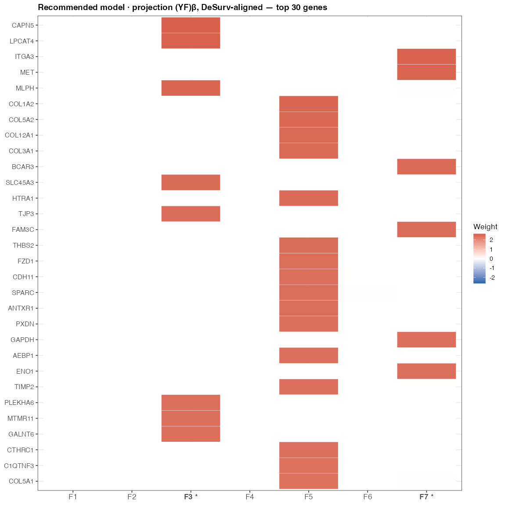
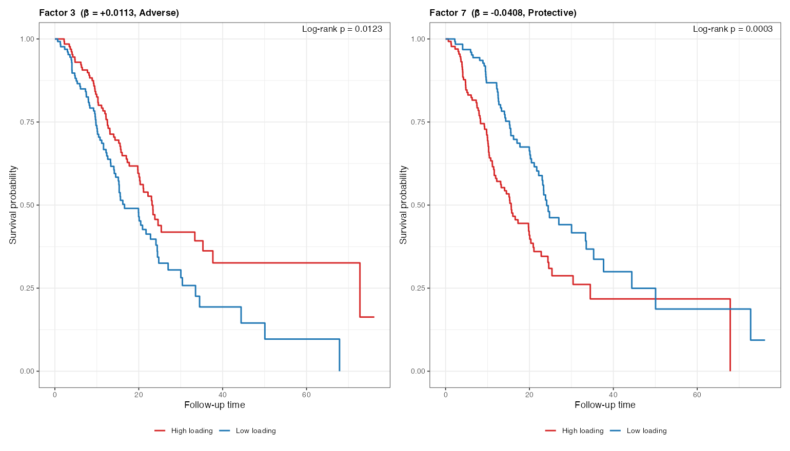
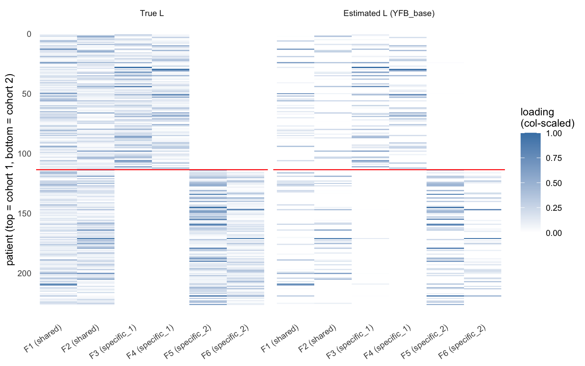
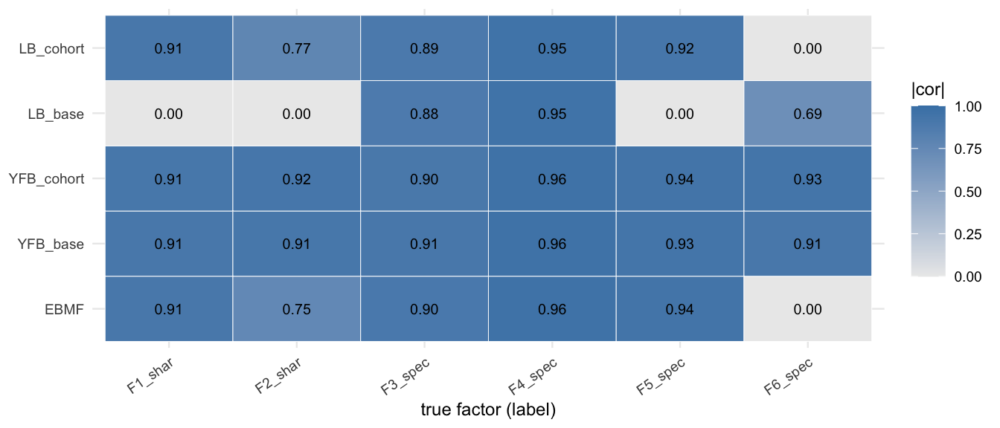
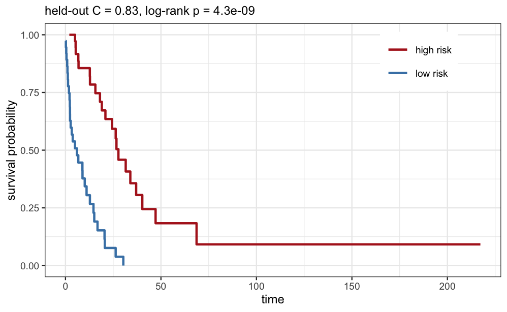

```{r setup}
#| include: false
library(kableExtra)
library(dplyr)

# ── Canonical result sources (paths relative to this .qmd) ──────────────────
desurv_csv <- "../../results/benchmark_sim/outputs/desurv_comparison/desurv_comparison_results.csv"
ebmf_csv   <- "../../results/benchmark_sim/outputs/ebmf_cox_external/ebmf_cox_external_results.csv"
mcs_csv    <- "../../results/multi_cohort_sim/outputs/multicohort_sim_results.csv"

desurv <- read.csv(desurv_csv, stringsAsFactors = FALSE)

# Recommended (YFB DeSurv-aligned, no cohort indicator) and LB counterpart.
yfb_real <- desurv[desurv$model == "D4", ]
lb_real  <- desurv[desurv$model == "D3", ]
yfb_mean <- mean(yfb_real$c_index)
lb_mean  <- mean(lb_real$c_index)
yfb_K    <- yfb_real$K[1];   yfb_keff <- yfb_real$k_eff[1]

# Pretty cohort labels shared across slides.
COHORT_PRETTY <- c(
  Dijk              = "Dijk",
  Moffitt_GEO_array = "Moffitt",
  PACA_AU_array     = "PACA-AU (array)",
  PACA_AU_seq       = "PACA-AU (seq)",
  Puleo_array       = "Puleo"
)
```


## Agenda {.smaller .tight-list}

<br>

**Background** &nbsp;·&nbsp; The PDAC prognostic problem · why supervise the factorization

<br>

**Method updates** &nbsp;·&nbsp; The joint model · two linear predictors (Lβ vs (YF)β) · explicit priors & non-parametric baseline hazard · the ELBO and its variational family · CAVI & convergence · preprocessing · the cohort-membership extension

<br>

**Validation** &nbsp;·&nbsp; Multi-cohort simulation study (completed) · real-data gene programs & survival · external validation on five held-out cohorts

<br>

**Impact & Future Directions**

::: {.notes}
Roadmap for the next ~25 minutes. The methods section directly works through the
feedback from April: explicit priors, the non-parametric baseline hazard,
defining the variational family, the convergence criterion, the preprocessing
fix for p ≫ n, no-leakage normalization, and the risk-direction correction.
:::


## Background: PDAC needs molecular prognosis {.smaller .dense-cols .tight-list .compact-callout}

:::: {.columns}

::: {.column width="55%"}

- **Five-year survival < 12%** — among the most lethal solid tumors
- Most patients diagnosed late; **no widely adopted molecular stratification** at diagnosis
- Bulk expression mixes malignant, stromal, and immune signals — prognostic structure is interwoven and often **low-variance**
- **Goal:** recover *gene expression programs* whose activation predicts survival, and validate them on **independent** cohorts

:::

::: {.column width="45%"}

::: {.callout-note}
### Why model expression and survival *jointly*?
The common pipeline is **two-step**: run unsupervised factor analysis (PCA / EBMF), then test factors for survival *post hoc*.

- Unsupervised axes track the **largest expression variance** — often batch or housekeeping signal
- A program explaining little variance but strongly prognostic gets **missed**
- **Supervision** steers factors toward survival-relevant structure *during* estimation
:::

*We will demonstrate this with results — not assert it.*

:::

::::

::: {.notes}
One background slide. The clinical motivation is unchanged. The methodological
motivation — joint over two-step — is the thread of the whole talk, and I'll
back it with both a synthetic comparison and a real-data external comparison
against the unsupervised two-step (EBMF → Cox) baseline.
:::


## The model — two coupled components {.smaller .compact-table .tight-list .compact-callout}

<br>

$$\underbrace{Y = LF^\top + E,\quad E_{ij}\sim N(0,\tau_j^{-1})}_{\text{genomics: low-rank} + \text{gene-specific noise}}
\qquad
\underbrace{h_i(t)=h_0(t)\exp(\eta_i)}_{\text{Cox proportional hazards}}$$

:::: {.columns}

::: {.column width="52%"}

| Quantity | Dim | Meaning |
|:--|:--:|:--|
| $Y$ | $n\times p$ | expression matrix |
| $L$ | $n\times K$ | patient program-activation scores |
| $F$ | $p\times K$ | gene weights per program |
| $\beta$ | $K\times 1$ | survival (log-HR) coefficients |
| $\tau_j$ | scalar | gene-specific precision |

:::

::: {.column width="48%"}

::: {.callout-note}
### Shared loadings couple the two
The **same** latent structure drives low-rank reconstruction of $Y$ **and** the survival risk score. A program is prognostic only if its $\beta_k \neq 0$; otherwise it explains expression alone.
:::

::: {.callout-tip}
### Non-parametric baseline hazard
$h_0(t)$ is left **unspecified** — it cancels in the Cox partial likelihood. No Weibull/exponential shape assumption; only proportional hazards.
:::

:::

::::
::: {.notes}
Two equations, one shared L. The baseline hazard is non-parametric — this was a
specific April question. We use the Cox partial likelihood, so h0(t) drops out
and we make no parametric shape assumption.
:::


## Two linear predictors: Lβ vs (YF)β {.smaller .dense-cols .tight-list .compact-callout}

:::: {.columns}

::: {.column width="50%"}

### Loadings predictor — $\eta = L\beta$
- Risk uses the **learned** patient scores $L$ directly
- Survival shapes $L$ during estimation (fully joint)
- Out-of-sample scoring requires **re-deriving** $L$ for new patients

### Projection predictor — $\eta = (YF)\beta$
- Risk uses the **direct genomic projection** $YF$
- **Exact** out-of-sample scoring: $\eta_\text{new} = (Y_\text{new}F)\beta$ — the *identical* formula at train and test, no train/test score mismatch

:::

::: {.column width="50%"}

::: {.callout-note}
### Priors — every block is explicit
- $q(L_{\cdot k}),\, q(F_{\cdot k}),\, q(\beta_k)$: **point-normal** (spike-and-slab) — $\;g(\theta)=\pi_0\delta_0+(1-\pi_0)N(0,\sigma^2)$
- Sparsity $\pi_0$ and slab scale $\sigma^2$ estimated by empirical Bayes (`ebnm`) at each step
- $\tau_j$ (gene precision): **closed-form MLE** update — no EBNM, no prior tuning
:::

::: {.callout-tip}
### Why we report both
The projection predictor $(YF)\beta$ gives leakage-free external scoring and is the basis for the recommended model; the loadings predictor $L\beta$ is the fully-joint reference.
:::

:::

::::
::: {.notes}
The key methods update since April: we now carry two linear predictors. Lβ is
the original fully-joint form. (YF)β reformulates the risk as a direct projection
of expression onto gene weights — its advantage is that the exact same formula
scores new patients, so there's no train/test mismatch from re-estimating L.
Priors are explicit: point-normal on L, F, and β; τ is a closed-form MLE.
:::


## Joint objective: the ELBO {.smaller .dense-cols .compact-callout .small-math}

### Variational family (mean-field, factor-wise)

$$q(L,F,\beta,\tau)=\prod_{k=1}^{K}q(L_{\cdot k})\;\prod_{k=1}^{K}q(F_{\cdot k})\;\prod_{k=1}^{K}q(\beta_k)\;\prod_{j=1}^{p}q(\tau_j)$$

:::: {.columns}

::: {.column width="48%"}

::: {.callout-note}
### Genomics term
$$E_q[\mathcal{L}_\text{gen}]=\sum_{j=1}^{p} E_q\log p(Y_{\cdot j}\mid L,F_j,\tau_j)$$
Gaussian reconstruction of $Y$ by $LF^\top$.
:::

:::

::: {.column width="4%"}
:::

::: {.column width="48%"}

::: {.callout-important}
### Survival term
$$E_q[\mathcal{L}_\text{Cox}]\approx \text{2nd-order Taylor of the Cox partial log-likelihood}$$
A local quadratic in $\eta$ makes the Cox term conjugate to the EBNM updates.
:::

:::

::::

### Combined objective

$$\text{ELBO}=\underbrace{E_q[\mathcal{L}_\text{gen}]}_{\text{expression fit}}+\underbrace{\lambda\,E_q[\mathcal{L}_\text{Cox}]}_{\text{survival fit}}-\underbrace{\sum_\text{blocks}D_\text{KL}\!\left(q\,\|\,\pi\right)}_{\text{prior regularization}}$$

The shared $L$ enters **both** likelihood terms — that coupling *is* the supervision. ($\lambda$ rescales the survival term; the recommended fits use $\lambda=1$.)
::: {.notes}
The variational family is mean-field and factor-wise — written out at the top, a
direct April request. The ELBO has three pieces: genomics reconstruction, the
Cox term via a second-order Taylor expansion that keeps the updates conjugate,
and a KL penalty per block. The shared L in both likelihood terms is the
supervision.
:::


## Inference: factor-wise CAVI {.smaller .dense-cols .tight-list .small-math}

:::: {.columns}

::: {.column width="55%"}

**Coordinate ascent (Gauss–Seidel), per iteration, per factor $k$:**

$$\beta_k \;\to\; L_{\cdot k} \;\to\; F_{\cdot k} \;\to\; \tau$$

- Each update is an **EBNM** sub-problem: pseudo-data $x = B/A$, scale $s = 1/\sqrt{A}$
- Empirical-Bayes prior $\hat g$ re-estimated **every** update → adaptive shrinkage per factor / per gene
- Deflate the residual after each factor before moving on

**Convergence criterion (both must hold, after burn-in):**
$$\text{mean}_{i,k}\,|L^{(t)}_{ik}-L^{(t-1)}_{ik}| < 10^{-3}$$
$$\textbf{and}\quad \text{mean}_k\,|\beta^{(t)}_k-\beta^{(t-1)}_k| < 10^{-3}$$

:::

::: {.column width="45%"}

::: {.callout-important}
### Risk-direction sign correction
Cox concordance is invariant to a global sign flip, so an unconstrained fit can land at $C < 0.5$ ("protective" and "adverse" swapped).

**Fix:** orient each prognostic factor against the **training** concordance, then apply the *same* orientation at test. This removed the earlier sub-0.5 external C-indices.
:::

::: {.callout-note}
### Dual criterion, not max
Averaging over all $n\times K$ entries (not the max) prevents oscillating factor-orientation boundaries from blocking convergence; requiring **both** $L$ and $\beta$ to settle ties genomic structure to survival signal.
:::

:::

::::
::: {.notes}
CAVI updates one factor at a time in Gauss-Seidel order; each block reduces to
an EBNM call. Convergence requires both the loadings and the survival
coefficients to settle below 1e-3 in mean absolute change — the dual criterion
ties expression structure to survival signal. The sign correction fixes the
earlier C<0.5 issue: we orient against training concordance and reuse that
orientation at test.
:::


## Preprocessing is load-bearing {.dense-cols .tight-list .compact-callout}

:::: {.columns}

::: {.column width="52%"}

**The p ≫ n scaling problem.** Merging platforms (RNA-seq, microarray, proteomics) leaves each gene on a different scale. Without correction, between-platform variance swamps the within-platform survival precision $A_k=\sum_i w_i (YF)_{ik}^2$ and the survival coefficients **collapse to zero**.

**The fix — normalize *per platform, before merging*:**

1. Log2 transform (RNA-seq only)
2. **Per-cohort gene selection** (combined rank of mean × variance), top-3000 each → intersect
3. **Per-platform z-standardization** (each cohort centered/scaled on its own)
4. Row-bind into the merged training matrix

:::

::: {.column width="48%"}

::: {.callout-important}
### Headline: skip per-platform normalization → β collapses
In an 18-configuration benchmark, **10 of 12** pipelines that do **not** z-standardize per platform before merging drive $\beta\to0$ — for *both* linear predictors.
:::

::: {.callout-tip}
### No leakage
Normalization is fit **within each training cohort, before** any split; held-out cohorts get the *same* per-cohort recipe at scoring time.
:::

:::

::::
::: {.notes}
This is the single most important practical finding since April. The p ≫ n
scaling problem: merging platforms without per-platform normalization lets
between-platform variance dominate the survival precision and beta collapses.
The fix is to z-standardize each cohort before merging. In the 18-config sweep,
10 of 12 non-per-platform configs collapse to beta=0. And normalization is fit
per training cohort before any split, so there's no leakage.
:::


## Extension: cohort-membership indicator {.smaller .dense-cols .tight-list .compact-callout}

:::: {.columns}

::: {.column width="54%"}

**Idea.** Append corner-point dummy columns (one per non-reference cohort) to $L$, with their survival coefficient **fixed at $\beta_\text{cohort}\equiv 0$**, so survival risk is driven only by the **biological** factors while the dummies absorb platform offsets in the genomics term.

- Updated via a Normal conjugate step (cohort-row $F$ update)
- Forcing the dummy in **adds one factor slot** ($K=7 \to 8$)

:::

::: {.column width="46%"}

::: {.callout-note}
### When it helps — and when it doesn't
- At **low K** with weak normalization, the indicator can rescue platform-confounded fits
- Under **per-platform z-standardization**, the offset is *already* removed — the indicator adds a factor slot for **no benefit**
:::

::: {.callout-tip}
### Result on real data
With per-platform z-std, adding the cohort indicator moves mean external C from **`r sprintf("%.3f", yfb_mean)`** to **`r sprintf("%.3f", mean(desurv$c_index[desurv$model=="D5"]))`** (and $K\!:\,7\to8$). We therefore recommend **no** cohort indicator.
:::

:::

::::

::: {.notes}
The cohort indicator is the other extension. It appends dummy columns to L with
beta fixed at zero, so survival uses only biological factors and the dummies
soak up platform offsets in the genomics term. It helps when normalization is
weak, but under per-platform z-std the offset is already gone — it just costs a
factor slot with no gain. So the recommendation is to leave it off.
:::


## Data: synthetic design and real cohorts {.smaller .dense-cols .tight-list .compact-callout}

:::: {.columns}

::: {.column width="50%"}

### Multi-cohort simulation (completed)
- **EBMF-grounded ground truth**: shared factors (present in all studies) + study-specific factors
- **Shared** factors carry the survival signal; study-specific do not
- **3 scenarios** × **5 model arms** × **5 seeds**
  - *all-shared*, *hybrid* (realistic), *nothing-shared* (negative control)
- Lets us measure factor **recovery**, **specificity accuracy**, and **C-index** against known truth

:::

::: {.column width="50%"}

### Real PDAC — external validation design
- **Train:** TCGA-PAAD + CPTAC ($n\approx 273$, RNA-seq + proteomics)
- **Validate:** 5 fully held-out cohorts, scored by the exact projection formula

::: {.compact-table}
| Held-out cohort | Platform |
|:--|:--|
| Dijk | RNA-seq |
| Moffitt | Microarray |
| PACA-AU (array) | Microarray |
| PACA-AU (seq) | RNA-seq |
| Puleo | Microarray |
:::

:::

::::

::: {.notes}
Two datasets. The simulation is now a completed validation study with full
results — three scenarios, five arms, five seeds, with EBMF-grounded ground
truth where only shared factors carry survival signal. The nothing-shared
scenario is a negative control. On real data we train on TCGA + CPTAC and
validate on five fully held-out cohorts spanning microarray and RNA-seq.
:::


## Synthetic results I — factor recovery {.smaller .paired-figures}

:::: {.columns}

::: {.column width="50%"}

{fig-align="center" width="98%"}

:::

::: {.column width="50%"}

{fig-align="center" width="98%"}

:::

::::

- **Shared-factor recovery** for the projection model: **0.92** (all-shared), **0.90** (hybrid) — high fidelity to ground truth
- **Specificity accuracy up to 1.00** — the model natively separates shared from study-specific structure
- This native separation is *why* the cohort-membership indicator adds little: the structure is already recovered

::: {.notes}
First simulation result: the projection model recovers shared factors with
correlation around 0.90-0.92 to the truth, and specificity accuracy reaches
1.00 — it correctly tells shared from study-specific factors. That native
separation is the reason the explicit cohort indicator buys little.
:::


## Synthetic results II — supervised beats two-step {.smaller .paired-figures .tight-list}

:::: {.columns}

::: {.column width="58%"}

{fig-align="center" width="95%"}

:::

::: {.column width="42%"}

**Hybrid (realistic) scenario, mean C-index:**

- **Projection model (YF)β:** **0.81**
- Loadings model Lβ: **0.76**
- Unsupervised **EBMF → Cox:** **0.72**

<br>

**Negative control (nothing-shared):** all arms at **≈ 0.54** — no false prognostic signal manufactured when none exists.

> Joint supervision beats the unsupervised two-step on data with known ground truth.

:::

::::

::: {.notes}
Second simulation result, the headline of the synthetic study: in the realistic
hybrid scenario, the supervised projection model reaches 0.81, ahead of the
loadings model at 0.76 and the unsupervised EBMF-then-Cox two-step at 0.72.
Critically, in the nothing-shared control all arms sit at chance — the method
does not invent prognostic signal. This is the clean demonstration that joint
supervision helps.
:::


## Real data I — prognostic gene programs {.smaller .hero-figure .tight-list}

{fig-align="center" width="84%"}

- Recommended model retains $K = `r yfb_K`$ programs (CV + 1-SE, biological floor $K\ge 3$); **$K_\text{eff} = `r yfb_keff`$ survival-active** ($|\hat\beta|>10^{-3}$)
- One **adverse** program (higher activation → worse survival) and one **protective** program emerge; the remaining programs explain expression only

::: {.notes}
On real data, the recommended model — projection predictor, per-platform z-std,
DeSurv-style gene selection, no cohort indicator — keeps seven programs by
CV with the 1-SE rule and a biological floor, but only two are survival-active.
Always quote both numbers: K=7 total, K_eff=2 active. The heatmap shows the
gene-weight structure; two programs carry the prognostic signal, one adverse,
one protective.
:::


## Real data II — survival stratification {.smaller .km-emphasis .tight-list}

:::: {.columns}

::: {.column width="42%"}

**The two survival-active programs stratify patients:**

- **Adverse** program: high activation → shorter survival
- **Protective** program: high activation → longer survival
- Log-rank separation in held-in patients; proportional-hazards assumption **not violated** (Schoenfeld test)

Always reported together: $K = `r yfb_K`$ (CV + 1-SE, floor $K\ge3$), $K_\text{eff} = `r yfb_keff`$.

:::

::: {.column width="58%"}

{fig-align="center" width="98%"}

:::

::::

::: {.notes}
The same two programs stratify patients into clear survival groups by Kaplan-
Meier — adverse program high means shorter survival, protective the reverse.
The proportional hazards assumption holds by the Schoenfeld test. Again, K=7,
K_eff=2.
:::


## Real data III — external validation, 3-way {.smaller .cindex-figure .tight-list}

{fig-align="center" width="80%"}

```{r ext-headline}
#| results: asis
if (file.exists(ebmf_csv)) {
  e <- read.csv(ebmf_csv, stringsAsFactors = FALSE)
  cat(sprintf(
    "- **Projection model mean C = %.3f** · loadings model %.3f · EBMF → Cox %.3f, across the five held-out cohorts  \n",
    yfb_mean, lb_mean, mean(e$c_index)))
} else {
  cat(sprintf(
    "- **Projection model mean C = %.3f** · loadings model %.3f, across the five held-out cohorts  \n",
    yfb_mean, lb_mean))
}
cat(sprintf("- Real-data analog of the synthetic result: the supervised joint model is competitive-to-better than the unsupervised two-step, with $K=%d$ (CV + 1-SE, floor $K\\ge3$) $\\to K_\\text{eff}=%d$\n", yfb_K, yfb_keff))
```

::: {.notes}
This is the real-data analog of the synthetic slide. Same three arms, now scored
on five fully held-out cohorts. The projection model averages 0.636. Read the
EBMF-to-Cox number off the figure — if the gap is modest, I lean on parsimony
and interpretability (two survival-active programs versus ~20 EBMF factors, and
exact external scoring) rather than overclaiming the C-index margin.
:::


## Model comparison summary {.smaller .compact-table .tight-list .vcenter}

```{r comparison-table}
build_row <- function(name, linpred, preproc, cohort_ind, K, keff, syn_c, real_c) {
  data.frame(Model = name, `Linear predictor` = linpred, Preprocessing = preproc,
             `Cohort ind.` = cohort_ind, K = K, `K_eff` = keff,
             `Synthetic C` = syn_c, `Real ext. C` = real_c,
             check.names = FALSE, stringsAsFactors = FALSE)
}

ebmf_real <- if (file.exists(ebmf_csv)) sprintf("%.3f", mean(read.csv(ebmf_csv)$c_index)) else "—"
ebmf_K    <- if (file.exists(ebmf_csv)) as.character(read.csv(ebmf_csv)$K[1]) else "~20"

cmp <- rbind(
  build_row("Projection (recommended)", "(YF)β", "per-platform z-std + DeSurv selection", "no",
            as.character(yfb_K), as.character(yfb_keff), "0.81", sprintf("%.3f", yfb_mean)),
  build_row("Loadings", "Lβ", "per-platform z-std + DeSurv selection", "no",
            as.character(lb_real$K[1]), as.character(lb_real$k_eff[1]), "0.76", sprintf("%.3f", lb_mean)),
  build_row("Projection + cohort ind.", "(YF)β", "per-platform z-std + DeSurv selection", "yes",
            as.character(desurv$K[desurv$model=="D5"][1]), as.character(desurv$k_eff[desurv$model=="D5"][1]),
            "0.81", sprintf("%.3f", mean(desurv$c_index[desurv$model=="D5"]))),
  build_row("Unsupervised two-step", "EBMF → Cox", "per-platform z-std + DeSurv selection", "n/a",
            ebmf_K, "n/a", "0.72", ebmf_real)
)

kbl(cmp, booktabs = TRUE, row.names = FALSE, align = c("l","c","l","c","c","c","c","c")) |>
  kable_styling(bootstrap_options = c("striped","hover"), full_width = TRUE, font_size = 20, position = "center") |>
  column_spec(1, width = "13em") |>
  column_spec(3, width = "19em") |>
  row_spec(1, bold = TRUE)
```

<div class="table-note">Synthetic C = mean held-out C-index, hybrid scenario (5 seeds). Real ext. C = mean across 5 held-out PDAC cohorts. K reported as CV + 1-SE selected with biological floor K≥3; K_eff = survival-active factors (|β̂| > 1e-3).</div>

- **Recommendation:** projection predictor $(YF)\beta$ · per-platform z-standardization · DeSurv-style gene selection · **no** cohort indicator
- Wins on both axes: best synthetic and real external C-index, and the most **parsimonious, interpretable** survival structure ($K_\text{eff}=`r yfb_keff`$)

::: {.notes}
The summary table describes every model by its characteristics — no internal
code names. Projection predictor with per-platform z-std and DeSurv selection,
no cohort indicator, is the recommendation: best on both synthetic and real, and
the most parsimonious with only two survival-active programs.
:::


## Impact / key findings {.smaller .tight-list .compact-callout}

<br>

::: {.callout-tip}
### What recent work established
1. **Joint supervision beats the unsupervised two-step** — by ~0.09 C-index on synthetic data with known truth, and competitive-to-better on real held-out cohorts.
2. **Preprocessing is decisive** — per-platform z-standardization before merging is the difference between a working model and $\beta\to 0$; 10 of 12 alternatives collapse.
3. **Parsimony with signal** — the recommended model carries just **$K_\text{eff}=`r yfb_keff`$ survival-active programs** (vs ~20 unsupervised factors) yet matches the field, with **exact, leakage-free external scoring**.
:::

- Mean external C-index = **`r sprintf("%.3f", yfb_mean)`** across five independent PDAC cohorts
- Competitive with the lab's penalized DeSurv approach, while remaining fully Bayesian (adaptive priors, no $\alpha$ tuning) and uncertainty-aware

::: {.notes}
Three takeaways. Supervision helps — clearly on synthetic, competitively on
real. Preprocessing is decisive. And we get parsimony with signal: two active
programs, exact external scoring, performance competitive with DeSurv, all in a
fully Bayesian framework with adaptive priors and no alpha to tune.
:::


## Future directions & summary {.smaller .future-summary .tight-list}

:::: {.columns}

::: {.column width="50%"}

### Next steps

1. **Pathway enrichment** on the two survival-active programs (adverse & protective) — assign biology to the statistical factors
2. **Finalize the EBMF / DeSurv head-to-head** on real data under one shared protocol
3. **Manuscript** — methods-primary framing; PDAC as the application

:::

::: {.column width="50%"}

### Summary

1. Joint supervised factorization with two linear predictors; explicit point-normal priors and non-parametric baseline hazard
2. **Per-platform normalization is load-bearing** — the p ≫ n fix
3. Validated on a completed multi-cohort simulation **and** five external PDAC cohorts
4. Recommended model: projection $(YF)\beta$, no cohort indicator, $K=`r yfb_K`\to K_\text{eff}=`r yfb_keff`$, mean external C = **`r sprintf("%.3f", yfb_mean)`**

:::

::::

::: {.notes}
Next: pathway enrichment to name the two active programs biologically; a clean
EBMF/DeSurv head-to-head; then the manuscript. Summary in four points — the
joint model, the preprocessing fix, validation on simulation plus five external
cohorts, and the recommended configuration.
:::


## Discussion {.centered}

### Thank You

<br>

**Questions, suggestions, and feedback welcome!**

<br>

[Andrew Walther]{style="color: #4B9CD3; font-weight: 600;"} · [awalther@unc.edu]{style="color: #13294B;"}

Department of Biostatistics, UNC Gillings School of Global Public Health

::: {.notes}
Open the floor. I have appendix slides on the EBNM/Taylor derivation, the τ
update, the prior table, the preprocessing-collapse table, the cohort-indicator
contrast, and convergence traces.
:::


# Appendix {visibility="uncounted" .vcenter}


## Appendix — EBNM pseudo-data & Cox Taylor step {visibility="uncounted" .smaller .dense-cols .small-math .tight-list}

Each CAVI block reduces to an **Empirical-Bayes Normal-Means** problem.

:::: {.columns}

::: {.column width="50%"}

**Normal-means form**

- Pseudo-data: $x = B/A$
- Scale: $s = 1/\sqrt{A}$
- Model: $x \mid \theta \sim N(\theta, s^2)$, prior $\theta\sim \hat g$
- `ebnm` returns posterior mean **and** variance; the **second moment** $E[\theta^2]=\text{Var}+E[\theta]^2$ is what enters the next update

:::

::: {.column width="50%"}

**Cox term via local quadratic**

- The Cox partial log-likelihood is expanded to **second order** in $\eta$ around the current estimate
- Yields working weights $w_i$ and a working response, so the survival contribution to $A$ and $B$ is **conjugate** to the EBNM update
- Refreshed periodically as $\eta$ moves

:::

::::

The error-in-variables second moment ($E[L^2]\neq \bar L^2$) is what prevents overfitting to uncertain loadings.


## Appendix — τ update (closed-form MLE) {visibility="uncounted" .smaller .tight-list .small-math}

- $\tau_j$ (gene-specific precision) has **no EBNM step** — it is a closed-form coordinate update:
$$\hat\tau_j^{-1}=\frac{1}{n}\sum_{i=1}^n E_q\big[(Y_{ij}-L_iF_j^\top)^2\big]$$
- The expectation expands to a variance-corrected residual:
$$\text{Var-term}=E[L^2]\,E[F^2]^\top - E[L]^2\,E[F]^2{}^\top \;\ge\; 0$$
- Heteroscedastic by design: each gene gets its own precision, down-weighting noisy features rather than treating all genes as equally reliable.


## Appendix — prior & hyperparameter table {visibility="uncounted" .smaller .compact-table .prior-table-large}

| Block | Prior family | Hyperparameters | Estimation |
|:--|:--|:--|:--|
| $L_{\cdot k}$ | point-normal | $\pi_0,\ \sigma^2$ | empirical Bayes (`ebnm`), per update |
| $F_{\cdot k}$ | point-normal | $\pi_0,\ \sigma^2$ | empirical Bayes (`ebnm`), per update |
| $\beta_k$ | point-normal | $\pi_0,\ \sigma^2$ | empirical Bayes (`ebnm`), per update |
| $\tau_j$ | (none) | — | closed-form MLE coordinate update |

- $\pi_0$ = spike weight (sparsity); $\sigma^2$ = slab scale (effect size)
- No user-specified penalty: the prior **learns from the data** at every CAVI iteration
- $\lambda$ (survival-term scale) = 1 in the recommended fits


## Appendix — which preprocessing pipelines collapse {visibility="uncounted" .smaller .compact-table .tight-list}

| Preprocessing | Per-platform z-std before merge? | Outcome |
|:--|:--:|:--|
| **Per-platform z-std + DeSurv selection** | **yes** | **β recovered** (recommended) |
| Per-platform z-std + variance selection | yes | β recovered |
| Joint quantile + rank | no | β recovered (2 of 12 survivors) |
| Joint z-standardization | no | β → 0 |
| Log-transform only | no | β → 0 |
| Joint quantile, no rank | no | β → 0 |

- Across the 18-configuration sweep (5 preprocessing recipes × 2 linear predictors × ± cohort indicator), **10 of 12** non-per-platform configurations collapse to $\beta\to0$ for both predictors
- The lesson: per-platform normalization is not a tuning detail — it is the enabling step


## Appendix — cohort-indicator contrast {visibility="uncounted" .smaller .paired-figures}

:::: {.columns}

::: {.column width="50%"}

{fig-align="center" width="92%"}

:::

::: {.column width="50%"}

{fig-align="center" width="92%"}

:::

::::

- Adding the indicator under per-platform z-std spends a factor slot ($K:\,7\to8$) without improving external C-index (`r sprintf("%.3f", yfb_mean)` → `r sprintf("%.3f", mean(desurv$c_index[desurv$model=="D5"]))`)
- The biological survival-active structure is essentially unchanged — confirming the offset is already removed by normalization


## Appendix — convergence & β estimates {visibility="uncounted" .smaller .paired-figures}

:::: {.columns}

::: {.column width="50%"}

{fig-align="center" width="95%"}

:::

::: {.column width="50%"}

{fig-align="center" width="95%"}

:::

::::

- RMSE stabilizes to a plateau; the dual ΔL & Δβ < 1e-3 criterion governs stopping
- β̂ barplots show the spike-and-slab at work: most programs shrunk to zero, the survival-active ones retained


## Appendix — synthetic factor structure {visibility="uncounted" .smaller .multi-panel}

:::: {.columns}

::: {.column width="33%"}

{fig-align="center" width="98%"}

:::

::: {.column width="33%"}

{fig-align="center" width="98%"}

:::

::: {.column width="33%"}

{fig-align="center" width="98%"}

:::

::::

- Ground-truth recovery: shared factors (survival-bearing) cleanly separated from study-specific factors
- The simulation establishes that the projection model recovers the *intended* latent structure, not merely a good survival metric
