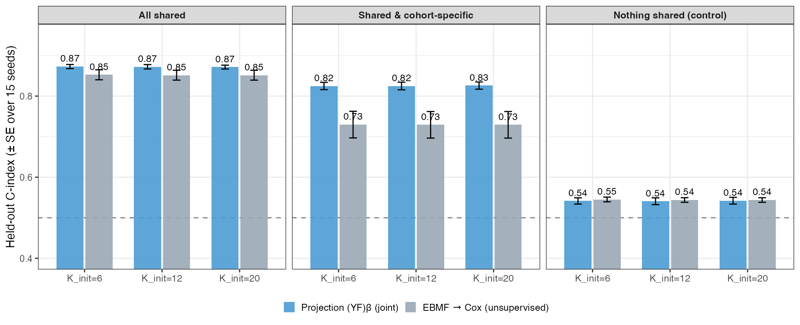
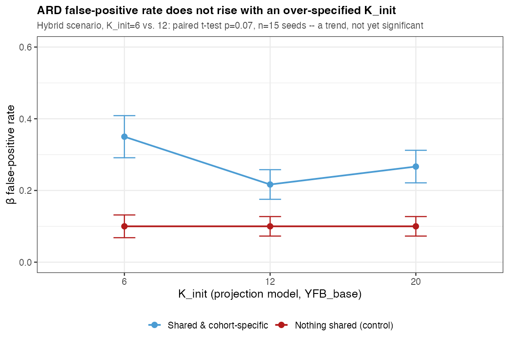
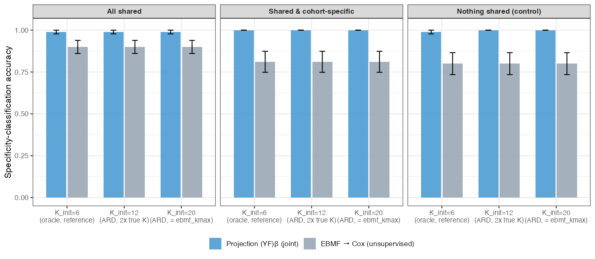
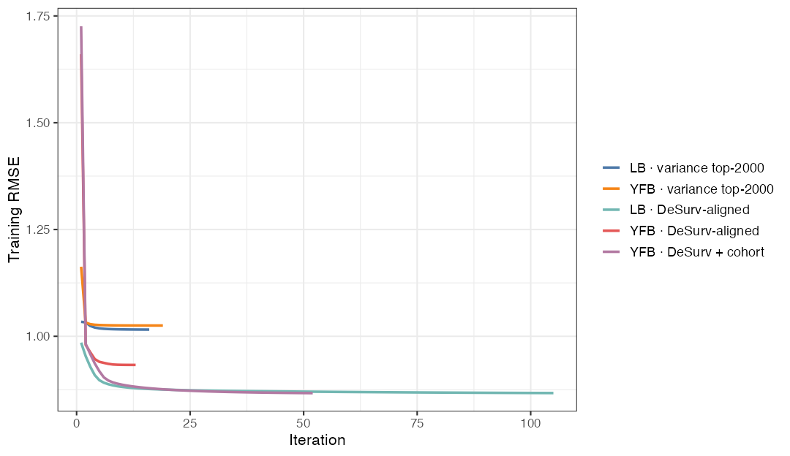
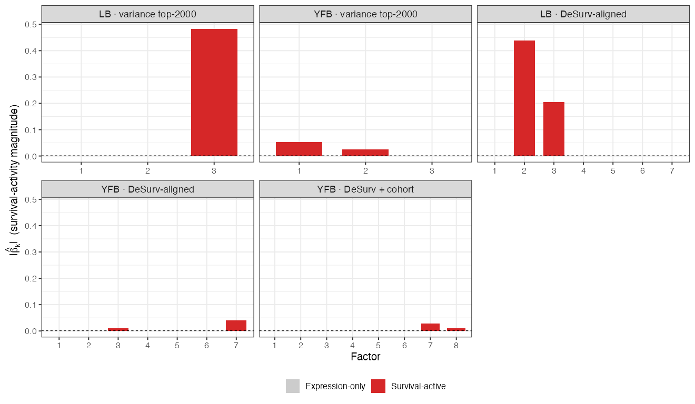

```{r setup}
#| include: false
library(kableExtra)
library(dplyr)

# ── Canonical result sources (paths relative to this .qmd) ──────────────────
desurv_csv  <- "../../results/benchmark_sim/outputs/desurv_comparison/desurv_comparison_results.csv"
ebmf_csv    <- "../../results/benchmark_sim/outputs/ebmf_cox_external/ebmf_cox_external_results.csv"
genes_csv   <- "assets/active_factor_genes.csv"
ksweep_csv  <- "../../results/benchmark_sim/outputs/k_init_sweep/k_init_sweep_results.csv"

desurv <- read.csv(desurv_csv, stringsAsFactors = FALSE)

# Recommended (projection (YF)β, no cohort indicator), the only linear
# predictor presented in this deck. K_init is selected by a consensus of
# ELBO/BIC/log-likelihood/cross-validated external C-index; ARD then
# determines K_eff (the survival-active subset) from that fit.
yfb_real <- desurv[desurv$model == "D4", ]
yfb_mean <- mean(yfb_real$c_index)
yfb_K    <- yfb_real$K[1]

# Two-step baseline: EBMF -> Cox, K=40, LASSO stage 2 -- the fairest
# independent comparison (large, YFB-uninformed K; a regularized stage-2 Cox
# rather than a plain coxph() that overfits at K=40; DECISIONS.md 2026-08-20),
# not the smaller-K/unregularized baseline this deck used in June.
ebmf_reg_csv <- "../../results/benchmark_sim/outputs/ebmf_cox_external/ebmf_cox_regularized_results.csv"
ebmf_reg     <- if (file.exists(ebmf_reg_csv)) read.csv(ebmf_reg_csv, stringsAsFactors = FALSE) else NULL
ebmf_k40     <- if (!is.null(ebmf_reg)) ebmf_reg[ebmf_reg$K == 40, ] else NULL
ebmf_mean    <- if (!is.null(ebmf_k40)) mean(ebmf_k40$c_index) else NA_real_
ebmf_K       <- if (!is.null(ebmf_k40)) 40L else NA_integer_
# k_eff_lasso: how many of the 40 EBMF factors keep a nonzero LASSO
# coefficient after cross-validated lambda selection (run_ebmf_cox_regularized.R).
# Not the same mechanism as ARD (L1 shrinkage vs. an ARD prior), but it answers
# the same question -- does the two-step baseline also select a subset -- so it
# belongs in the comparison table rather than "n/a".
ebmf_keff    <- if (!is.null(ebmf_k40)) ebmf_k40$k_eff_lasso[1] else NA_integer_

# Pooled bootstrap difference (YFB - EBMF k40 LASSO), precomputed by
# figs/make_external_cindex_fig.R (code/concordance_ci.R::bootstrap_concordance_diff_ci,
# B=2000, seed=1) -- reproduces DECISIONS.md 2026-08-20's "+0.026, 95% CI
# [0.0002, 0.0498]" exactly; verified against risk scores directly before
# this figure was built, not taken on faith from the prose.
ci_csv    <- "assets/yfb_vs_ebmf_k40_pooled_ci.csv"
ci_pooled <- if (file.exists(ci_csv)) read.csv(ci_csv, stringsAsFactors = FALSE) else NULL

# Merged-training gene count (rows of EF in the recommended fit = 2064).
N_GENES_TRAIN <- 2064L

# Active-program gene lists (exported by figs/make_factor_figs.R).
af <- if (file.exists(genes_csv)) read.csv(genes_csv, stringsAsFactors = FALSE) else NULL
adverse_row    <- if (!is.null(af)) af[af$direction == "Adverse", ][1, ]    else NULL
protective_row <- if (!is.null(af)) af[af$direction == "Protective", ][1, ] else NULL

# K_init = 2-20 consensus sweep (results/benchmark_sim/run_k_init_sweep.R),
# ARD-classified via classify_factors() at each K_init. yfb_keff below is the
# survival-active count at the recommended K_init=7, from this same sweep.
ksweep <- read.csv(ksweep_csv, stringsAsFactors = FALSE)
k7row  <- ksweep[ksweep$K_init == 7, ]
K_INIT_REC      <- 7L
yfb_keff        <- k7row$K_survival_active[1]
K_GENO_REC      <- k7row$K_genomics_only[1]
K_EFF_TOTAL_REC <- k7row$K_eff_total[1]
K_DEAD_REC      <- k7row$K_dead[1]

elbo_pref_K <- ksweep$K_init[which.max(ksweep$elbo_full)]
bic_pref_K  <- ksweep$K_init[which.min(ksweep$bic)]
c_pref_K    <- ksweep$K_init[which.max(ksweep$mean_external_c)]
```


## Agenda {.smaller .tight-list}

<br>

**Background.** The PDAC prognostic problem, and why to supervise the factorization

<br>

**Method.** The joint model, explicit priors, the ELBO, CAVI inference, preprocessing, and a new two-stage approach to selecting $K$

<br>

**Results.** A synthetic validation of the $K$-selection approach, then real PDAC data: gene programs, survival, and the joint model vs. the unsupervised two-step

<br>

**Impact & Future Directions**

::: {.notes}
Roadmap for the next ~15-20 minutes. K selection works in two stages: a
consensus of ELBO, BIC, log-likelihood, and cross-validated external C-index
picks K_init, and ARD shrinkage then determines which of those factors are
actually survival-active (K_eff). The projection predictor (YF)β is the only
model presented.
:::


# Background {.section-divider}


## Background: PDAC needs molecular prognosis {.dense-cols .tight-list .compact-callout .vcenter}

:::: {.columns}

::: {.column width="55%"}

- **Five-year survival under 12%**, among the most lethal solid tumors
- Most patients diagnosed late; **no widely adopted molecular stratification** at diagnosis
- Bulk expression mixes malignant, stromal, and immune signals, so prognostic structure is interwoven and often **low-variance**
- **Goal:** recover *gene expression programs (GEPs)* whose activation predicts survival, and validate them on **independent** cohorts
- A GEP is a coordinated set of genes (a column of $F$) whose patient-level activation (a column of $L$) we test for survival association

:::

::: {.column width="45%"}

::: {.callout-note}
### Why model expression and survival *jointly*?
The common pipeline is **two-step**: run unsupervised factor analysis (PCA / EBMF), then test factors for survival *post hoc*.

- Unsupervised axes track the **largest expression variance**, often batch or housekeeping signal
- A program explaining little variance but strongly prognostic gets **missed**
- **Supervision** steers factors toward survival-relevant structure *during* estimation

A program explaining 15% of variance may be pure batch effect; one explaining 3% may cleanly separate survivors. Supervision prioritizes the second.
:::

:::

::::

::: {.notes}
One background slide. The clinical motivation is unchanged. The methodological
motivation, joint over two-step, is the thread of the whole talk, and I back
it with both a synthetic comparison and a real-data external comparison against
the unsupervised two-step (EBMF → Cox) baseline.
:::


# Methods {.section-divider}


## The model: two coupled components {.smaller .compact-table .tight-list .compact-callout}

<br>

$$\underbrace{Y = LF^\top + E,\quad E_{ij}\sim N(0,\tau_j^{-1})}_{\text{genomics: low-rank} + \text{gene-specific noise}}
\qquad
\underbrace{h_i(t)=h_0(t)\exp(\eta_i)}_{\text{Cox proportional hazards}}$$

:::: {.columns}

::: {.column width="52%"}

| Quantity | Dim | Meaning |
|:--|:--:|:--|
| $Y$ | $n\times p$ | expression matrix |
| $L$ | $n\times K$ | patient program-activation scores |
| $F$ | $p\times K$ | gene weights per program |
| $\beta$ | $K\times 1$ | survival (log-HR) coefficients |
| $\tau_j$ | scalar | gene-specific noise precision |
| $\eta_i$ | scalar | patient log-risk score, $(Y_iF)\beta$ |

:::

::: {.column width="48%"}

::: {.callout-note}
### Shared $F$ couples the two
The **same** gene-program weights $F$ drive both the low-rank reconstruction of $Y$ **and** the survival risk score $\eta = (YF)\beta$. A program is **prognostic only if its $\beta_k \neq 0$**; otherwise it explains expression alone.
:::

::: {.callout-tip}
### Non-parametric baseline hazard
$h_0(t)$ is left **unspecified**; it cancels in the Cox partial likelihood. No Weibull / exponential shape assumption, only proportional hazards.
:::

:::

::::
::: {.notes}
Two equations, one shared latent structure. Every symbol is defined in the table,
including the risk score eta, which is now always the projection score (YF)β. The
baseline hazard is non-parametric, so h0(t) drops out of the partial likelihood
and we make no parametric shape assumption.
:::


## The model: projection predictor and explicit priors {.smaller .dense-cols .tight-list .compact-callout .vcenter}

:::: {.columns}

::: {.column width="50%"}

### Projection predictor: $\eta = (YF)\beta$
- Risk uses the **direct genomic projection** $YF$, not a re-derived patient score
- **Exact** out-of-sample scoring: $\eta_\text{new} = (Y_\text{new}F)\beta$ is the *identical* formula at train and test, so there is no train/test score mismatch
- $L$ is fit for the genomics reconstruction only; it does not enter the survival likelihood

::: {.callout-tip}
### Why the projection form
Leakage-free **exact** external scoring, with no OLS re-projection step for new patients. This is what makes external validation on held-out cohorts a clean apples-to-apples comparison.
:::

:::

::: {.column width="50%"}

**Priors: every block is explicit.** $q(\cdot)$ denotes the **variational (approximate posterior)** for each block, fit by empirical Bayes at every update:

- $q(L_{\cdot k}),\, q(F_{\cdot k})$: **point-exponential** (non-negative spike-and-slab), $\;g(\theta)=\pi_0\delta_0+(1-\pi_0)\,\text{Exp}(\lambda),\ \theta\ge 0$
- $q(\beta_k)$: **normal** (Gaussian slab, no spike at zero), $\;g(\beta)=N(0,\sigma^2)$
- $q(\tau_j)$: **closed-form MLE**, no EBNM, no prior tuning

Sparsity $\pi_0$, scale $\lambda$, and slab variance $\sigma^2$ are all estimated from the data (`ebnm`) at each step.

::: {.callout-note}
### Why a normal prior on $\beta$, not a spike-and-slab
A spike-and-slab prior forces a hard in/out decision on each factor as part of fitting. A normal prior instead lets $\hat\beta_k$ shrink **continuously** toward zero for a factor with no survival signal, without ever forcing it to exactly zero. That continuous shrinkage is what Automatic Relevance Determination (ARD) means here, and it is the raw material Stage 2 of $K$ selection (two slides ahead) turns into a discrete active/inactive call, by thresholding $|\hat\beta_k|$ after fitting rather than building the threshold into the prior itself.
:::

:::

::::
::: {.notes}
The projection predictor (YF)β scores new patients with the identical formula
used at train time, so there is no mismatch and no re-derivation. Priors are
explicit: non-negative point-exponential on L and F, a Gaussian (normal) prior
on β, and a closed-form MLE for τ. The normal-not-spike-and-slab choice on β is
worth landing clearly here: it gives continuous shrinkage during fitting, and
the hard active/inactive call happens afterward, by thresholding, which is
exactly the ARD mechanism the K-selection slide relies on next.
:::


## The objective: ELBO & variational family {.smaller .dense-cols .small-math .tight-list}

**Mean-field variational family:** each block factorizes independently:

$$q(L,F,\beta,\tau)=\prod_{k=1}^{K}q(L_{\cdot k})\;\prod_{k=1}^{K}q(F_{\cdot k})\;\prod_{k=1}^{K}q(\beta_k)\;\prod_{j=1}^{p}q(\tau_j)$$

The **ELBO** (evidence lower bound) is the objective CAVI maximizes, a lower bound on the log marginal likelihood. For the projection model:

$$\text{ELBO}=\underbrace{E_q[\mathcal{L}_\text{gen}]}_{\text{expression fit}}\;+\;\underbrace{\lambda\,E_q[\mathcal{L}_\text{Cox}]}_{\text{survival fit}}\;-\;\underbrace{\textstyle\sum_\text{blocks}D_\text{KL}\!\left(q\,\|\,\text{prior}\right)}_{\text{prior regularization}}$$

:::: {.columns}

::: {.column width="50%"}

- **Genomics fit** $E_q[\mathcal{L}_\text{gen}]=\sum_j E_q\log p(Y_{\cdot j}\mid L,F_j,\tau_j)$: Gaussian reconstruction of $Y$ by $LF^\top$
- **Survival fit**, the projection predictor written out explicitly:
$$E_q[\mathcal{L}_\text{Cox}] \approx \log PL(\eta_0) - \tfrac12\textstyle\sum_i w_i\sum_k (YF)_{ik}^2\,\text{Var}_q(\beta_k),\quad \eta_0=(YF)\,E_q[\beta]$$
a **2nd-order Taylor** expansion of the Cox partial log-likelihood around $\eta_0$, the point estimate of $(YF)\beta$. Because $YF$ is treated as data (not a random quantity with its own posterior variance) once $F$ is fixed, only $\beta$'s posterior uncertainty survives in the variance term. This is what keeps the survival term conjugate to the EBNM updates.

:::

::: {.column width="50%"}

- **KL term** penalizes each posterior $q$ away from its prior: the adaptive shrinkage
- The **shared $F$** enters both likelihood terms, genomics reconstruction ($Y \approx LF^\top$) and survival risk ($\eta = (YF)\beta$); that coupling *is* the supervision
- The ELBO **balances** expression and survival automatically, with **no tuning parameter $\alpha$** ($\lambda=1$ in the recommended fits)

:::

::::

> **What the ELBO is *for*:** it is the **fitting objective**. CAVI maximizes it, and a fit is declared converged when it stops improving. It is also **one of four criteria**, alongside BIC, log-likelihood, and cross-validated external C-index, used to choose $K_\text{init}$ (next: *Selecting $K$*).

::: {.notes}
The variational family is mean-field and factor-wise. The ELBO has three pieces:
Gaussian genomics reconstruction, the Cox survival term via a second-order Taylor
expansion that keeps the updates conjugate, and a per-block KL penalty that is
the adaptive shrinkage. I'm showing the survival term spelled all the way out
this time, with (YF)beta substituted for eta, so it's explicit rather than
abstract: eta_0 is the point estimate (YF) times E_q[beta], and the variance
term only involves beta's own posterior uncertainty, because YF is fixed data
given the current F, not something with its own posterior spread. The shared F
in both likelihood terms is the supervision. The ELBO is one of the four
K_init-selection criteria alongside BIC, log-likelihood, and cross-validated
external C-index.
:::


## Inference: factor-wise CAVI {.smaller .dense-cols .tight-list .small-math}

:::: {.columns}

::: {.column width="55%"}

**Coordinate ascent (Gauss–Seidel):** per outer iteration, for each factor $k$:

$$\beta_k \;\to\; L_{\cdot k} \;\to\; F_{\cdot k}, \qquad \text{then } \tau \text{ once per sweep}$$

- Each update is an **EBNM** sub-problem: pseudo-data $x=B/A$, scale $s=1/\sqrt{A}$, then `ebnm` returns the posterior mean **and** variance
- $\beta_k$ has precision governed by the projection score's own variance across patients, so a factor with **no survival signal** shrinks $\beta_k \to 0$ on its own: the mechanism ARD relies on
- The empirical-Bayes prior $\hat g$ is **re-estimated every update**, giving adaptive shrinkage per factor and per gene; the residual is deflated after each factor

:::

::: {.column width="45%"}

**Convergence.** After a 5-iteration burn-in, stop when the **ELBO stops improving**: its relative change between iterations falls below $10^{-5}$:
$$\frac{\big|\text{ELBO}^{(t)}-\text{ELBO}^{(t-1)}\big|}{\big|\text{ELBO}^{(t-1)}\big|} < 10^{-5}$$

- The ELBO is the **single objective** being maximized, so this directly detects a stationary point of the variational optimization
- Mean absolute changes in $L$ and $\beta$ are tracked alongside as **diagnostics** (both settle below $10^{-3}$ at convergence)

::: {.callout-important}
### Risk-direction sign correction
Cox concordance is invariant to a global sign flip, so an unconstrained fit can land at $C<0.5$. **Fix:** after convergence, orient $\beta$ against the **training** concordance (flip its sign if $C_\text{train}<0.5$), and carry that same orientation into every downstream use of $\beta$, including test scoring.
:::

:::

::::
::: {.notes}
CAVI updates one factor at a time in Gauss-Seidel order; each block reduces to an
EBNM call with pseudo-data x=B/A and scale s=1/sqrt(A). Convergence requires both
L and beta to settle below 1e-3 in MEAN absolute change; averaging avoids a
single oscillating factor blocking the stop. The sign correction orients beta
by training concordance once, after convergence, and that same orientation
carries through to every later use, including test scoring -- it is not
reapplied at test time separately. If asked whether this is fully resolved:
it's the same design as before, not replaced, and it has one known minor
caveat noted in DECISIONS.md -- the orientation check pools all patients
rather than respecting stratification when strata are used elsewhere in the
model. The effect is documented as negligible. (Separately, the project's old
5-fold cross-validation K-selection function did disable this per fold, since
a per-fold flip would have made C-index comparable across folds meaningless --
but that function isn't part of the current K_init sweep, which fits once per
K_init on the full training set and scores on external cohorts, not folds.)
:::


## Preprocessing is crucial: per-platform normalization {.smaller .dense-cols .tight-list .compact-callout}

:::: {.columns}

::: {.column width="54%"}

**The $p\gg n$ scaling problem.** Merging platforms (RNA-seq, microarray, proteomics) leaves each gene on a different scale. The survival precision for program $k$ is
$$A_k=\sum_i w_i\,(YF)_{ik}^2,$$
where $w_i$ = the patient's **Cox working weight** (curvature from the survival Taylor step) and $(YF)_{ik}$ = patient $i$'s **projection score** on program $k$. Without correction, between-platform variance inflates $(YF)$ unevenly, **swamps $A_k$**, and the survival coefficients **collapse to $\beta\to 0$**.

**The fix: normalize *per platform, before merging*:**

1. Log2 transform (RNA-seq only)
2. **Per-cohort gene selection** (combined rank of mean × variance), top-3000 per cohort, then **intersect** → **`r N_GENES_TRAIN` genes** in the merged training matrix
3. **Per-platform z-standardization** (each cohort centered/scaled on its own)
4. Row-bind into the merged training matrix

:::

::: {.column width="46%"}

::: {.callout-important}
### Skip per-platform normalization → β collapses
In an 18-configuration benchmark, **10 of 12** pipelines that do **not** z-standardize per platform before merging drive $\beta\to0$.
:::

::: {.callout-tip}
### No leakage
Normalization is fit **within each training cohort, before** any split; held-out cohorts get the *same* per-cohort recipe at scoring time.
:::

:::

::::
::: {.notes}
The single most important practical finding since April. A_k is the survival
precision for program k. Without per-platform normalization the projection
scales blow up across platforms, A_k is dominated by between-platform variance,
and beta collapses. The fix is per-platform z-standardization before merging,
which leaves 2064 genes. 10 of 12 alternatives collapse. Normalization is fit
per training cohort before any split, so there is no leakage.
:::


## Selecting the number of programs: a two-stage framework {.smaller .dense-cols .tight-list .compact-callout}

**Stage 1: $K_\text{init}$, by a consensus of four fit/prediction criteria.** Fit at several $K_\text{init}$; compare ELBO, BIC, an ELBO-style joint log-likelihood, and cross-validated external C-index across the grid.

**Stage 2: the active-factor subset, by ARD.** Fit once at the chosen $K_\text{init}$; the normal prior on $\beta$ (previous slide) lets Automatic Relevance Determination shrink unneeded factors' $\beta_k \to 0$ **on its own**, without a second per-K validation loop.

:::: {.columns}

::: {.column width="50%"}

### Stage 1: choosing $K_\text{init}$
- **ELBO**: the fitting objective itself, compared *across* $K_\text{init}$
- **BIC** $= -2\,\text{LL} + \log(n)\cdot\text{df}$, $\text{df}=K_\text{init}\cdot(n+p+1)$, a complexity penalty that is **not** guaranteed to agree with ELBO or external C
- **Log-likelihood**: genomics + survival, an ELBO-style bound (not an exact marginal likelihood)
- **Cross-validated external C-index**: the only *generalization* signal among the four, evaluated on the five held-out cohorts
- These need **not** agree; see *Results* for the full $K_\text{init}=2\text{-}20$ sweep, with each metric's own direction of improvement made explicit

:::

::: {.column width="50%"}

### Stage 2: ARD classification at fixed $K_\text{init}$
Each factor $k$ is classified by `classify_factors()`:

- **survival-active**: $|\hat\beta_k| > 0.001$
- **genomics-only**: not survival-active, but $\text{PVE}_k > 1\%$
- **dead**: neither, fully pruned

::: {.callout-tip}
### Running example: $K_\text{init}=`r K_INIT_REC`$
`r K_INIT_REC` starting factors $\to$ **`r yfb_keff` survival-active** + **`r K_GENO_REC` genomics-only** (`r K_EFF_TOTAL_REC` kept, `r K_DEAD_REC` pruned). Stable across a wide range of $K_\text{init}$; see *Results*.
:::

:::

::::

::: {.notes}
Two stages. Stage 1 picks K_init by a consensus of ELBO, BIC, log-likelihood,
and cross-validated external C-index -- these don't have to agree, and the
Results section shows the full sweep, with each metric's preferred direction
stated explicitly, and where they disagree. Stage 2 is ARD: at a fixed K_init,
the normal prior on beta lets survival-irrelevant factors shrink to beta=0 on
their own, and classify_factors() splits the rest into survival-active
(|beta|>0.001) vs genomics-only (PVE>1%) vs dead. K_init=7 is the running
example throughout: 2 survival-active, 2 genomics-only, 4 kept total, 3
pruned, the same real-data configuration used throughout Results.
:::


# Results {.section-divider}


## Data: Synthetic Validation & PDAC Cohorts {.smaller .dense-cols .tight-list .compact-table .vcenter}

:::: {.columns}

::: {.column width="50%"}

### Multi-cohort simulation
**EBMF-grounded ground truth**: shared factors (present in all studies) plus study-specific factors. **Shared factors carry the survival signal**; study-specific factors do not.

**Scenarios**

- *All Shared Factors*: every program is shared and prognostic
- *All Cohort-Specific Factors*: negative control, no shared signal ($\eta\equiv 0$)
- *Shared & Cohort-Specific Factors*: the realistic mix

**Model Arms**

- Unsupervised two-step (EBMF → Cox)
- The projection-predictor joint model, $K$ selected by over-specified $K_\text{init}$ plus ARD pruning, mirroring the real-data procedure

:::

::: {.column width="50%"}

### PDAC cohorts: External Validation
- **Train:** TCGA-PAAD + CPTAC ($n\approx 273$, RNA-seq + proteomics)
- **Validate:** 5 fully held-out cohorts, scored by the **exact** projection formula $\eta=(Y_\text{new}F)\beta$

::: {.compact-table}
| Held-out cohort | Platform |
|:--|:--|
| Dijk | RNA-seq |
| Moffitt | Microarray |
| PACA-AU (array) | Microarray |
| PACA-AU (seq) | RNA-seq |
| Puleo | Microarray |
:::

:::

::::

::: {.notes}
Two datasets, simulation first, then real PDAC data, in that order for the
rest of Results. The simulation now selects K the same way the real-data
procedure does: an over-specified K_init pruned by ARD, instead of the oracle
true-K used in June, and compares only the joint model against the
unsupervised EBMF-then-Cox baseline. On real data we train on TCGA + CPTAC and
validate on five fully held-out cohorts spanning microarray and RNA-seq,
scored by the exact projection formula.
:::


## Synthetic Results: over-specifying $K_\text{init}$ doesn't hurt performance {.smaller .tight-list}

{fig-align="center" width="92%"}

- **$K_\text{init}=6$** means the model was told the true number of factors directly (an idealized case used only as a reference point, never available on real data); **$K_\text{init}=12/20$** is the over-specified-plus-ARD-pruning procedure actually used
- **C-index (and, in the appendix-detail figure, factor recovery and specificity) are flat across $K_\text{init}=6\to12\to20$** in every scenario: giving the model more starting factors than it needs and trusting ARD to prune costs nothing relative to knowing the true count in advance
- Bars are the mean over 15 seeds (up from 5, for a properly powered comparison); error bars are $\pm$ 1 standard error across those 15 seeds

::: {.notes}
The simulation now uses the real-data K-selection procedure: over-specify
K_init, let ARD prune, instead of June's oracle true-K. K_init=6 is kept only
as a reference point, since on real data we never actually know the true K in
advance. The headline is a clean null result: C-index doesn't move at all
across K_init=6/12/20, in any of the three scenarios, with 15 seeds behind
each bar. Over-specifying K and trusting ARD costs nothing. The paired
recovery and specificity figures, which tell the same flat story, are in the
appendix.
:::


## Synthetic Results: does a larger $K_\text{init}$ create more false alarms? {.smaller .hero-figure .tight-list}

{fig-align="center" width="62%"}

- **The question:** giving the model more factors than it needs gives ARD more non-signal factors it *could* mistakenly call survival-active. Does the false-positive rate actually rise as $K_\text{init}$ grows?
- **The answer, so far: no.** In the realistic scenario the false-positive rate is numerically *lower* at $K_\text{init}=12/20$ than at $K_\text{init}=6$ (0.35 → 0.22 → 0.27), though a paired test between $K_\text{init}=6$ and 12 gives $p=0.07$, so call this a consistent trend, not yet a statistically confirmed one. In the negative-control scenario the rate is flat at 0.10 regardless of $K_\text{init}$.
- Consistent with a separate point raised in discussion: even when a non-signal factor does pick up a small, nonzero coefficient, that coefficient is too small to meaningfully move the risk score

::: {.notes}
This is the one place a genuinely new question could have shown up: does
over-specifying K produce MORE false-positive survival-active calls, since ARD
has more non-signal factors to potentially mis-activate. At 5 seeds it looked
like a clear improvement; at 15 seeds the direction holds in the realistic
scenario but the paired test is p=0.07, not significant, and the negative
control is completely flat. I'm presenting this as what it is, a promising
trend, not a confirmed finding, and tying it back to the point raised after
the last simulation exercise: a small spurious coefficient on a non-signal
factor doesn't meaningfully move the risk score, which is consistent with
false positives here not being large in magnitude even when they occur.
:::


## Joint model vs. two-step as survival signal strength varies {.smaller .hero-figure .tight-list}

![**Figure.** External performance of the joint model vs. the unsupervised two-step (EBMF → Cox) as the simulated survival-signal strength increases. "Strength" is a multiplier on the true survival coefficients used to generate each simulated patient's survival time (values swept: 0, 0.25, 0.5, 1, 2; strength = 1 is this project's standard "realistic-magnitude" setting). At strength = 0 (no true survival signal at all), the joint model matches EBMF: supervision costs nothing when there is nothing to exploit. At strength = 2 (twice the realistic magnitude), the joint model pulls ahead.](../../docs/progress_book/figs/2026-08-21_k7_signal_sweep_comparison.png){fig-align="center" width="66%"}

- **Strength = 0:** joint $\approx$ EBMF-only. The joint model does not fabricate prognostic signal when none exists.
- **Strength = 2:** joint model outperforms the two-step. Supervision helps *only when there is signal to find*, and does not hurt when there isn't.
- With only 10 replicate seeds, no single strength level individually reaches statistical significance; the pattern across the sweep is the evidence, not any one point

::: {.notes}
This single figure carries two points. Strength is a literal multiplier on the
true survival coefficients used to simulate outcomes, swept at 0, 0.25, 0.5,
1, and 2, with 1 being the project's standard realistic magnitude, so strength
2 means twice that. At zero simulated survival signal, the joint model tracks
EBMF almost exactly: no false discovery, no manufactured prognostic signal. As
signal strength increases, the joint model pulls ahead of the two-step
baseline. Together this is the cleanest argument that supervision is a free
option: it costs nothing when uninformative and helps when it isn't. Worth
noting if asked: only 10 seeds, so no individual strength value is
individually significant; it's the trend across the whole sweep that carries
the argument.
:::


## PDAC Cohorts: Prognostic Gene Programs {.smaller .hero-figure .tight-list}

{fig-align="center" width="94%"}

- $K_\text{init}=`r K_INIT_REC`$ (ELBO / BIC / log-likelihood / external-C consensus; see the sweep later) $\to$ **`r yfb_keff` survival-active** + `r K_GENO_REC` genomics-only kept: Program `r protective_row$factor` (**protective**) and Program `r adverse_row$factor` (**adverse**), classified by the sign of each program's fitted Cox coefficient $\hat\beta_k$ (positive $\to$ higher activation, shorter survival, adverse; negative $\to$ longer survival, protective)
- The 2 survival-active programs are characterized by **5 methods**: gene-set enrichment (fgsea, Fast Gene Set Enrichment Analysis, and ORA, Over-Representation Analysis), correlation with the PurIST classical/basal subtype score, hazard-ratio consistency across all 5 external cohorts, and gene-list overlap with the lab's published DeSurv factors
- The 2 genomics-only programs carry **weaker evidence**: their top-weighted genes were characterized by gene-set enrichment (fgsea) and overlap with the lab's published DeSurv factors, the only 2 of the 5 methods that apply without a survival signal — **Program 5** reads as **desmoplastic stroma** (7 collagen genes, SPARC, THBS2, FAP) and **Program 6** as **immune infiltrate** (IKZF1, AKNA, IL10RA, HCLS1); unlike Programs 3/7, their labels have not been tested for reproducibility across cohorts

::: {.notes}
On real data, the recommended fit starts at K_init=7 and ARD keeps 4 programs:
2 survival-active (Program 3 protective, Program 7 adverse) and 2
genomics-only (Program 5 stroma, Program 6 immune infiltrate). The figure
shows only the 4 kept factors, not all 7; the 3 fully-pruned (dead) factors
are omitted since they carry no real gene-program structure. Weights are
non-negative because L and F use a point-exponential prior. On the biological
labels: Programs 3 and 7 rest on five methods, including out-of-sample
hazard-ratio replication across all five external cohorts, which is strong
evidence. Programs 5 and 6 rest on two of those five methods agreeing with
each other (gene-set enrichment and overlap with DeSurv's published factors),
which is suggestive but meaningfully weaker; a formal external-cohort
robustness check for THOSE two programs was run as a negative control
(confirming they carry no survival signal, which they shouldn't) rather than
as positive evidence for the stroma/immune labels themselves. If asked how
confident we are in "desmoplastic stroma" and "immune infiltrate" specifically:
say plainly that this is a preliminary read, not a validated claim, and flag
testing whether the same two programs reappear on other cohorts as a future
action item.
:::


## PDAC Cohorts: Prognostic Association {.smaller .km-emphasis .tight-list}

:::: {.columns}

::: {.column width="40%"}

The two survival-active programs stratify patients (split at median **projection score $(YF)_k$**, the quantity the model scores on):

- **Adverse, Program `r adverse_row$factor`** (higher activation → shorter survival), log-rank $p=`r formatC(adverse_row$logrank_p, format="g", digits=2)`$
  - top genes: *`r adverse_row$top_genes`*
- **Protective, Program `r protective_row$factor`** (higher activation → longer survival), log-rank $p=`r formatC(protective_row$logrank_p, format="g", digits=2)`$
  - top genes: *`r protective_row$top_genes`*

Proportional-hazards assumption not violated (Schoenfeld test).

:::

::: {.column width="60%"}

{fig-align="center" width="99%"}

:::

::::

::: {.notes}
The two active programs stratify patients into clear survival groups, split by
the projection score (YF)_k. Program 7, the adverse program, carries MET, ITGA3,
and glycolytic genes, biologically a classic aggressive signature. Program 3,
protective, carries epithelial differentiation markers. Directions are read off
the curves. Schoenfeld test shows PH holds.
:::


## Choosing $K_\text{init}$: the consensus sweep {.smaller .hero-figure .tight-list}

{fig-align="center" width="82%"}

- **ELBO- and BIC-preferred:** $K_\text{init}=`r elbo_pref_K`$ (both favor the smallest $K_\text{init}$ tested). **External-C-preferred:** $K_\text{init}=`r c_pref_K`$ (favors more capacity). These do **not** agree, and that disagreement is shown here rather than retuned away.
- **Recommendation: $K_\text{init}=`r K_INIT_REC`$.** Survival-active count is stable at `r yfb_keff` across a wide range of $K_\text{init}$; $K_\text{init}=`r K_INIT_REC`$ is externally competitive (on the C-index plateau) and the simplest single-fit path. Full table in the appendix.

::: {.notes}
Here is where the disagreement matters. ELBO and BIC agree with each other,
preferring K_init=3, both favor small K_init: BIC's df penalty, tens of
thousands of units per K_init here, dominates once K_init climbs into double
digits, and ELBO simply peaks early on this training objective. External
C-index prefers K_init=12, but K_init=7 through 20 mostly sit on a plateau
around C~0.627, with two isolated dips at K_init=11 and 13. I want to show the
actual curves and provoke the question of whether a different K_init in that
plateau might be preferable, rather than presenting K_init=7 as the only
defensible choice. K_init=7 is kept as the practical recommendation because
the survival-active count is stable there and it's the simplest single-fit
path.
:::


## Joint model vs. the unsupervised two-step {.smaller .cindex-figure .tight-list}

{fig-align="center" width="66%"}

```{r ext-headline}
#| results: asis
cat(sprintf(
  "- **Projection model mean C = %.3f**%s, across the five held-out cohorts  \n",
  yfb_mean,
  if (!is.na(ebmf_mean)) sprintf(" · unsupervised EBMF → Cox (K=40, LASSO) %.3f", ebmf_mean) else ""))
if (!is.null(ci_pooled)) {
  cat(sprintf("- Pooled bootstrap difference: **+%.3f, 95%% CI [%.4f, %.4f]**, n=%d pooled across cohorts%s\n",
              ci_pooled$diff_estimate, ci_pooled$diff_lower, ci_pooled$diff_upper, ci_pooled$n,
              if (isTRUE(ci_pooled$significant)) ", **significant**" else ""))
}
cat(sprintf("- $K_\\text{init}=%d$ (ELBO / BIC / log-likelihood / external-C consensus) $\\to K_\\text{eff}=%d$ survival-active of %d kept\n", K_INIT_REC, yfb_keff, K_EFF_TOTAL_REC))
```

::: {.notes}
The real-data analog of the synthetic slide. Two arms: the recommended
projection model, and the fairest independent two-step baseline I could
build: EBMF at a large, YFB-uninformed K=40, with a regularized (LASSO)
stage-2 Cox rather than a plain coxph() that overfits at that K. The pooled
bootstrap difference is significant. This is not the only two-step comparison
in the project; other configurations trail YFB by more, some without reaching
significance at this sample size. This is the one built specifically to be
hardest to argue with.
:::


## Model Comparison Summary {.smaller .compact-table .tight-list .vcenter}

```{r comparison-table}
build_row <- function(name, linpred, preproc, K, keff, real_c) {
  data.frame(Model = name, `Linear predictor` = linpred, Preprocessing = preproc,
             K = K, `K_eff` = keff, `Real ext. C` = real_c,
             check.names = FALSE, stringsAsFactors = FALSE)
}

ebmf_real_disp <- if (!is.na(ebmf_mean)) sprintf("%.3f", ebmf_mean) else "n/a"
ebmf_K_disp    <- if (!is.na(ebmf_K)) as.character(ebmf_K) else "n/a"
ebmf_keff_disp <- if (!is.na(ebmf_keff)) paste0(ebmf_keff, "/40 (LASSO)") else "n/a"

PREP <- "Per-platform z-std, survival-ranked genes"

cmp <- rbind(
  build_row("Projection (recommended)", "(YF)β", PREP,
            paste0("K_init=", K_INIT_REC), as.character(yfb_keff), sprintf("%.3f", yfb_mean)),
  build_row("Unsupervised two-step", "EBMF → Cox", PREP,
            ebmf_K_disp, ebmf_keff_disp, ebmf_real_disp)
)

kbl(cmp, booktabs = TRUE, row.names = FALSE, align = c("l","c","l","c","c","c")) |>
  kable_styling(bootstrap_options = c("striped","hover"), full_width = TRUE, font_size = 22, position = "center") |>
  row_spec(1, bold = TRUE)
```

<div class="table-note">Real ext. C = mean across 5 held-out PDAC cohorts. **K_init** = starting factor count, selected by an ELBO / BIC / log-likelihood / external-C consensus (Stage 1); **K_eff** = survival-active programs by ARD, $|\hat\beta| > 10^{-3}$ (Stage 2), for the projection model. For the two-step baseline, **K_eff** is the number of the 40 EBMF factors that keep a nonzero coefficient after LASSO-regularized, cross-validated stage-2 Cox fitting: a different mechanism from ARD (L1 shrinkage vs. an ARD prior on $\beta$), but it answers the same question of how many factors the model actually uses. Gene selection ranks genes by combined mean × variance per cohort.</div>

:::: {.columns}

::: {.column width="68%"}

- **Recommendation:** projection predictor $(YF)\beta$ · per-platform z-standardization · survival-ranked gene selection · **no** cohort indicator
- $K_\text{init}=`r K_INIT_REC`\to K_\text{eff}=`r yfb_keff`$ survival-active (`r K_EFF_TOTAL_REC` kept total), with **exact** external scoring

:::

::: {.column width="32%"}

::: {.callout-note}
### On gene selection
The combined-rank selection recipe was **motivated by** the lab's penalized survival-MF (DeSurv) preprocessing; here it is applied within the fully Bayesian model.
:::

:::

::::

::: {.notes}
Two rows: the recommended projection model against the unsupervised two-step
baseline. Projection predictor with per-platform z-std and survival-ranked gene
selection, K_init=7 selected by consensus, is the recommendation.
:::


## Impact / key findings {.smaller .tight-list}

1. **Joint supervision beats the unsupervised two-step**, and costs nothing when there is no survival signal to exploit (signal-strength sweep).

2. **Preprocessing is decisive.** Per-platform z-standardization before merging is the difference between a working model and $\beta\to 0$; **10 of 12** alternatives collapse.

3. **$K$ selection is a two-stage split.** Cross-validated external C-index, with ELBO, BIC, and log-likelihood, helps pick $K_\text{init}$; ARD shrinkage then determines the survival-active subset ($K_\text{eff}=`r yfb_keff`$) directly from that single over-specified fit, with no separate per-K validation loop needed for $K_\text{eff}$ itself.

4. **Over-specifying $K_\text{init}$ and trusting ARD costs nothing.** Confirmed in simulation (15 seeds): recovery, specificity, and C-index are flat whether the model starts at the true $K$ or 3x over-specified.

5. **Mean external C-index = `r sprintf("%.3f", yfb_mean)`** across five independent PDAC cohorts, fully Bayesian throughout (adaptive priors, no $\alpha$ tuning, uncertainty-aware).

### Limitations

- **It is not obvious which $K_\text{init}$ is best.** BIC and ELBO favor a much smaller $K_\text{init}$ than external C-index does; that disagreement is shown on the sweep slide rather than resolved by picking whichever criterion agrees with us
- **The ARD retention thresholds ($\text{PVE}>1\%$, $|\hat\beta|>0.001$) are not literature-derived.** The $\hat\beta$ cutoff was reverse-engineered from this model's own coefficient scale, not taken from a principled sparse-factor-model source; a literature check and a sensitivity sweep are still open. A fixed threshold on $\hat\beta_k$ also assumes every factor's projection score is on a comparable scale: each factor's loading vector is unit-normalized (removing the dominant scale gap), but that does not guarantee equal projection-score *variance* across factors, which is a further open question
- **Small external cohorts give noisy estimates.** Per-cohort C ranges down to `r sprintf("%.2f", min(yfb_real$c_index))` (Moffitt), near chance
- The 2 survival-active programs are **statistically prognostic and biologically annotated by 5 independent methods** (Program `r adverse_row$factor` basal-like/adverse, Program `r protective_row$factor` classical/protective); the 2 genomics-only programs' labels rest on weaker evidence (2 of those methods, not externally validated) and a matched head-to-head against DeSurv on one protocol both remain open

::: {.notes}
Five takeaways, then a limitations section that names the same open questions
raised on the slides that produced them, not new ones: the K-selection
criteria disagree with each other, and it isn't obvious which K_init is
actually best; small external cohorts give noisy per-cohort estimates; the
ARD thresholds aren't literature-grounded; and the biological annotation is
solid for the two survival-active programs but preliminary for the two
genomics-only ones. On the beta-comparability point specifically, if asked:
each factor's loading vector F_k is unit-normalized before the projection
score is computed, both at train and test time, which removes the dominant
scale gap (raw F_k norms grow like sqrt(p), so without this an unnormalized
factor loading on more genes would mechanically get a larger projection score
regardless of survival relevance). What it does NOT do is guarantee every
factor's projection score has the same variance across patients, since that
still depends on which genes each factor loads on and how correlated they
are. So the fixed |beta_hat|>0.001 threshold is applied on a partially, not
fully, equalized scale. This was implemented for fitting stability, not
explicitly to solve cross-factor comparability, so nobody has checked whether
it's sufficient. Flagged as an open item, not swept under the rug.
:::


## Future directions & summary {.smaller .future-summary .tight-list}

:::: {.columns}

::: {.column width="50%"}

### Current status
- **$K$ selection**: cross-validated external C-index, ELBO, BIC, and log-likelihood inform $K_\text{init}$; ARD shrinkage determines $K_\text{eff}$
- **Gene programs biologically annotated**: the 2 survival-active programs by the 5 methods on the gene-programs slide; the 2 genomics-only programs more tentatively, by 2 of those methods

### Next steps
1. **Multiple cohorts / multiple modalities via indicator columns in $L$**: stack methylation and expression, possibly with modality-specific priors; leave-one-study-out validation; train on A vs. B vs. A+B
2. **Manuscript preparation**: methods-primary framing, PDAC as the application

:::

::: {.column width="50%"}

### Summary
1. Joint supervised factorization via the projection predictor $(YF)\beta$; **point-exponential priors on $L,F$, a normal prior on $\beta$**, non-parametric baseline hazard
2. **Preprocessing is crucial**: per-platform normalization prevents the survival precision from being dominated and $\beta$ from collapsing
3. **$K$ selection: cross-validated external C-index, ELBO, BIC, and log-likelihood inform $K_\text{init}$; ARD shrinkage determines $K_\text{eff}$**, validated on real data (five external PDAC cohorts, mean C = `r sprintf("%.3f", yfb_mean)`) and synthetic data with known ground truth
4. **Recommended model**
   - Linear predictor: projection $(YF)\beta$
   - $L$ cohort indicator: No (candidate direction for multi-cohort/multi-modality extension, above)
   - Pre-processing: per-platform z-std
   - $K_\text{init} = `r K_INIT_REC`$ $\to K_\text{eff} = `r yfb_keff`$, mean external C = **`r sprintf("%.3f", yfb_mean)`**

:::

::::

::: {.notes}
K selection: cross-validated external C-index, ELBO, BIC, and log-likelihood
inform K_init; ARD shrinkage determines K_eff. The two survival-active
programs are solidly annotated; the two genomics-only ones more tentatively
so, worth being upfront about if asked. The forward-looking direction I want
to lead with is extending L with indicator columns for multiple cohorts
and/or multiple modalities: stack methylation and expression, possibly with
modality-specific priors, and validate with leave-one-study-out and
train-on-A-vs-B-vs-A+B comparisons. Then manuscript prep.
:::


## Discussion {.centered}

### Thank You

<br>

**Questions, suggestions, and feedback welcome!**

<br>

[Andrew Walther]{style="color: #4B9CD3; font-weight: 600;"} · [awalther@unc.edu]{style="color: #13294B;"}

Department of Biostatistics, UNC Gillings School of Global Public Health

::: {.notes}
Open the floor. Appendix slides cover convergence diagnostics, survival-activity
magnitudes, and the DeSurv comparison.
:::


# Appendix {visibility="uncounted" .vcenter}


## Appendix: $K_\text{init}$ sweep, full table {visibility="uncounted" .smaller .compact-table .tight-list}

```{r ksweep-table}
ksweep_disp <- ksweep[order(ksweep$K_init),
  c("K_init", "K_survival_active", "K_genomics_only", "K_dead", "K_eff_total",
    "elbo_full", "bic", "loglik_joint", "mean_external_c")]
names(ksweep_disp) <- c("K_init", "Surv-active", "Genomics-only", "Dead", "K_eff (kept)",
                         "ELBO", "BIC", "Log-lik", "External C")
ksweep_disp$ELBO       <- round(ksweep_disp$ELBO)
ksweep_disp$BIC        <- round(ksweep_disp$BIC)
ksweep_disp$`Log-lik`  <- round(ksweep_disp$`Log-lik`)

kbl(ksweep_disp, booktabs = TRUE, row.names = FALSE, align = "c",
    format.args = list(big.mark = ",")) |>
  kable_styling(bootstrap_options = c("striped", "hover"), full_width = TRUE,
                font_size = 20, position = "center") |>
  row_spec(which(ksweep_disp$K_init == K_INIT_REC), bold = TRUE, background = "#EAF3FA")
```

<div class="table-note">Highlighted row = the recommended $K_\text{init}=`r K_INIT_REC`$. External C = mean C-index across the 5 held-out PDAC cohorts. BIC and Log-lik are ELBO-style bounds, not exact marginal-likelihood quantities.</div>

::: {.notes}
The full sweep table, for anyone who wants the actual numbers rather than just
the curves. Note the K_eff (kept) column is not monotone in K_init -- it moves
between 2 and 5 as ARD prunes differently at each starting point, and two rows
(K_init=11, 13) show a visible external-C dip against their neighbors.
:::


## Appendix: simulation detail, factor recovery & specificity {visibility="uncounted" .smaller .paired-figures}

:::: {.columns}

::: {.column width="55%"}

{fig-align="center" width="99%"}

:::

::: {.column width="45%"}

{fig-align="center" width="99%"}

:::

::::

- The same flat-across-$K_\text{init}$ pattern shown by C-index in the main results holds for recovery and specificity too, in every scenario

::: {.notes}
Backup detail for the "over-specifying K_init doesn't hurt" slide, in case
someone wants to see recovery and specificity, not just C-index. Same flat
story across K_init=6/12/20 in every scenario.
:::


## Appendix: convergence & survival-activity magnitudes {visibility="uncounted" .smaller .paired-figures}

:::: {.columns}

::: {.column width="50%"}

{fig-align="center" width="96%"}

:::

::: {.column width="50%"}

{fig-align="center" width="96%"}

:::

::::

- The spike-and-slab / shrinkage behavior is visible: most programs are shrunk below the survival-activity threshold, with only the survival-active ones retained


## Appendix: relation to DeSurv (Young et al., PNAS 2026) {visibility="uncounted" .smaller .dense-cols .tight-list .compact-table}

:::: {.columns}

::: {.column width="48%"}

**Same design and same data: SBMF is the Bayesian counterpart.** Both jointly fit supervised NMF + Cox with **non-negative gene programs**, share the same training set (**TCGA + CPTAC, $n=273$**) and the **same five external PDAC cohorts** (Dijk, Moffitt, PACA-AU array/seq, Puleo; $n=616$), score new patients by **projection** (no retraining), and use the **combined-rank top-3000-per-cohort** gene selection. Both also find that the **highest-variance program is *not* the most prognostic**.

DeSurv objective: $(1-\alpha)\,\mathcal{L}_\text{NMF} - \alpha\,\mathcal{L}_\text{Cox}$, with the survival gradient on the gene programs $W$.

:::

::: {.column width="52%"}

**What SBMF changes**

| | DeSurv | SBMF |
|:--|:--|:--|
| Estimation | penalized optimization | Bayesian variational (CAVI) |
| $K$ selection | Bayesian-optimization over $k,\alpha,\lambda$ jointly | ARD shrinkage + ELBO/BIC/log-likelihood/external-C consensus on $K_\text{init}$ only |
| Shrinkage | fixed elastic-net | empirical-Bayes priors (learned) |
| Uncertainty | point estimates | posterior mean **+** variance |
| Noise | least-squares | per-gene precision $\tau$; $E[L^2]$ correction |

- **DeSurv:** $k=3,\ \alpha=0.334$; pooled external **HR/SD $=1.50$** (95% CI 1.31–1.72)
- **SBMF (YF)β:** $K_\text{init}=`r K_INIT_REC`\to K_\text{eff}=`r yfb_keff`$; mean external **C $=`r sprintf("%.3f", yfb_mean)`**

:::

::::

**Caveat:** the two report different primary metrics (DeSurv: pooled HR/SD; SBMF: mean external C-index) and use slightly different normalization (DeSurv within-subject rank → 1970 genes; SBMF per-platform z-std → 2064). A **matched same-protocol head-to-head is a planned next step**; DeSurv is *not* re-run here.

::: {.notes}
This is the backup for the inevitable "how does this compare to DeSurv?"
question. SBMF is the Bayesian sibling of DeSurv, same supervised NMF+Cox idea,
same training data and the same five external cohorts, same projection-based
scoring, and SBMF borrowed DeSurv's combined-rank gene selection. The genuine
differences: DeSurv tunes k, alpha, and lambda jointly by Bayesian optimization;
SBMF selects K_init by a consensus of fit/prediction metrics and lets ARD prune
within that fit, with empirical-Bayes priors learning the shrinkage and no alpha
or lambda to tune, plus posterior uncertainty and a heteroscedastic noise model.
On numbers, DeSurv reports pooled HR per SD of 1.50; SBMF reports mean external
C of 0.627, different metrics, so a matched head-to-head on one protocol is the
right next step, not a claim of superiority today.
:::


## Appendix: the 5 gene-program validation methods, in detail {visibility="uncounted" .smaller .dense-cols .tight-list .compact-table}

| Method | Implementation | What it tests | Result |
|:--|:--|:--|:--|
| **fgsea** (Fast Gene Set Enrichment Analysis, primary) | Genes ranked by weight within a program; tested against Hallmark, Reactome, KEGG, GO-BP, and a custom PDAC collection (Moffitt/Bailey signatures + DeSurv's 3 published factors). BH-adjusted $p<0.10$. | Do a program's top-weighted genes cluster into known biological pathways, more than chance? | 3 dead programs: zero hits (consistency check). Programs 5/6: many hits — stroma/EMT (5), immune activation (6). |
| **ORA** (Over-Representation Analysis, sensitivity check) | Hypergeometric over-representation on the top $N$ genes ($N\in\{50,100,150\}$) vs. the 2,064-gene background. | Does a simpler, threshold-based test agree with fgsea's ranked approach? | Confirms fgsea's pathway calls — not an artifact of the ranking method. |
| **PurIST subtype concordance** | Spearman correlation + Kruskal–Wallis of each program's patient loadings against the published PurIST classical/basal score, TCGA-PAAD ($n=144$, external, out-of-sample). | Does the program track an independently validated, previously published PDAC subtype axis? | Programs 3/7 at strong opposite ends ($\rho=-0.575$ / $+0.582$) — recovers a known PDAC finding. Program 6 orthogonal ($\rho=-0.026$, $p=0.75$); Program 5 weak basal lean ($\rho=0.299$, $p=2.8\times10^{-4}$). |
| **DeSurv gene-list overlap** | Jaccard index + hypergeometric $p$ against each of DeSurv's 3 published factor gene lists, top 270 genes/program. | Do these programs replicate the lab's own prior published factors? | The 4 kept programs recover DeSurv's 3-factor structure; DeSurv's single combined stromal/immune factor splits into Programs 5 and 6. |
| **External cohort robustness** | Each program's leading-edge signature scored in all 5 held-out cohorts; univariate Cox fit per cohort. | Does the prognostic direction replicate out-of-sample? | Confirmatory for 3/7 (direction replicates across cohorts). Negative control for 5/6 (no survival signal, as expected — not evidence for their labels). |

<div class="table-note">Programs 3 and 7 (survival-active) are supported by all 5 methods, including 2 genuinely out-of-sample checks (PurIST in TCGA-PAAD, hazard-ratio replication across 5 cohorts). Programs 5 and 6 (genomics-only) are supported by only fgsea + DeSurv overlap — plausible readings, not yet tested for cross-cohort reproducibility.</div>

::: {.notes}
Backup detail for Slide 17's "5 methods" claim, in case someone wants the
actual definitions and numbers rather than the one-line summary. fgsea and ORA
are both gene-set enrichment tests (fgsea ranks all genes by weight; ORA just
thresholds to a top-N list as a simpler robustness check on fgsea). PurIST is
an independent, previously published PDAC subtype classifier — using it here
is a genuinely out-of-sample check, not something derived from our own data.
DeSurv overlap checks replication against the lab's own prior published
factors. External cohort robustness is the other genuinely out-of-sample
check: does the prognostic direction hold up in 5 cohorts the model never
trained on. Emphasize the asymmetry: Programs 3/7 have both out-of-sample
checks plus all the internal ones; Programs 5/6 only have the 2 internal
checks, which is exactly why their labels are flagged as preliminary on
Slide 17.
:::
