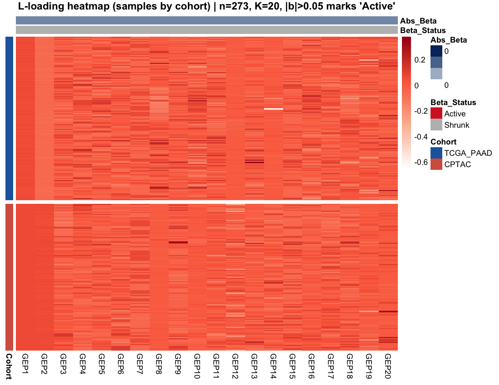
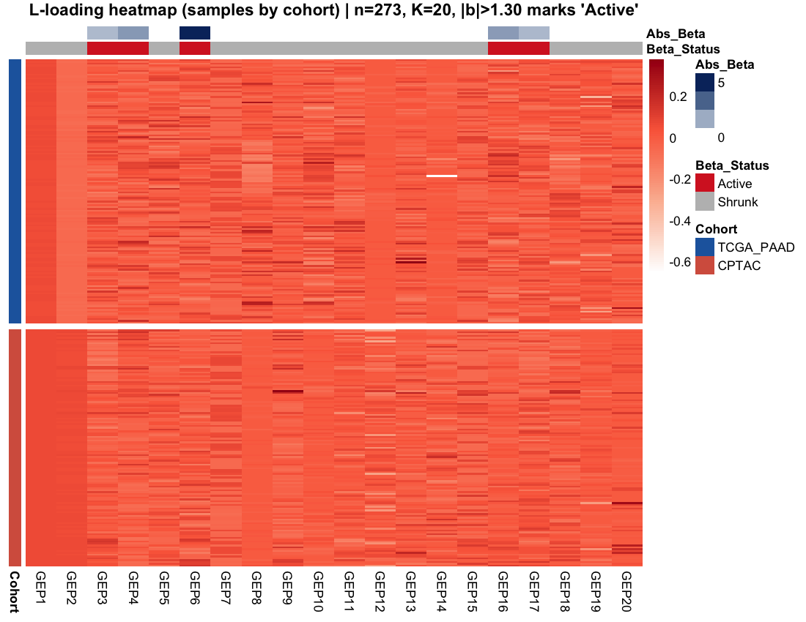
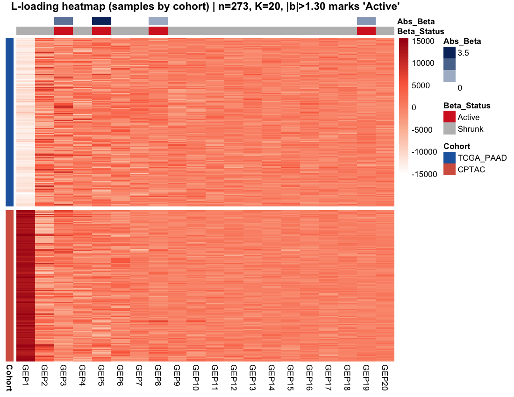

```{r setup}
library(knitr)
library(kableExtra)
```

# Motivation

Training SSBMF on the merged TCGA\_PAAD (RNA-seq) + CPTAC (proteomics) cohort
consistently produces all factor coefficients $\hat{\beta}_k = 0$: no factor
is selected as prognostic under the Bayesian survival objective. Before
debugging the model, a more basic question must be answered:

> **Is the absence of signal a data problem or a model problem?**

Two explanations are plausible:

1. *Data problem.* The RNA-seq vs.\ proteomics platform difference dominates
   all variance in the merged matrix; batch structure consumes the gene-set,
   leaving no detectable survival signal regardless of the analysis method.

2. *Model problem.* Survival signal exists in the data, but SSBMF's objective
   weighting, prior aggressiveness, or CAVI convergence behavior prevents it
   from reaching the $\beta$ coefficients.

This diagnostic distinguishes between the two by running **purely unsupervised
factor analysis** — Empirical Bayes Matrix Factorization (EBMF via `flashier`)
and PCA — on the same merged training matrix used for SSBMF, then asking
whether any resulting factor is univariately associated with survival via a
Cox proportional-hazards model.

# Methods

**Data.** v2-preprocessed merged training matrix: TCGA\_PAAD ($n = 144$) +
CPTAC ($n = 129$), $p = 2{,}000$ genes. Preprocessing: intersect raw gene
universes (17,900 genes), log$_2$(x+1) transform (RNA-seq only), quantile
normalization across all samples jointly, top-2,000 by merged-matrix variance,
per-subject rank transform.

**EBMF.** `flashier::flash()` with per-gene residual variance (`var_type = 2`)
and a greedy add + backfit strategy (`greedy_Kmax = 20`). Loadings extracted
via LDF decomposition with unit-L$_2$-norm columns so all factors are on a
comparable scale.

**PCA.** `prcomp(Y, rank. = 20, center = TRUE)`.

**Survival association.** For each factor $k$, a univariate Cox model
$h(t) = h_0(t)\exp(\ell_k \gamma_k)$ is fit where $\ell_k$ is the
$n$-vector of subject loadings. Reported: log-hazard ratio $\hat\gamma_k$,
hazard ratio (HR), Wald $z$-statistic, $p$-value, and concordance (C-index).
Significance threshold: $p < 0.05$.

# Results

## EBMF

EBMF converged on **20 factors**. Of these, **5 are univariately associated
with overall survival** at $p < 0.05$ (Table 1). The strongest association is
EBMF6 (C-index = 0.63, $p = 3 \times 10^{-6}$), followed by EBMF4 and EBMF16.
EBMF1 has an enormous point estimate (HR $\approx 4 \times 10^{8}$) with
$p = 0.35$ — a signature of a near-collinear batch factor (very large loadings
concentrated in one cohort, unstable Cox fit).

```{r ebmf-table}
df <- read.csv("tables/ebmf_cox_summary.csv")
df$p_value <- formatC(df$p_value, format = "g", digits = 3)
df$HR      <- formatC(df$HR,      format = "g", digits = 4)
df$Significant <- ifelse(df$Significant, "✓", "")

kable(
  df[, c("Factor","coef","HR","z_stat","p_value","c_index","Significant")],
  col.names = c("Factor", "log-HR", "HR", "z", "p-value", "C-index", "p < 0.05"),
  digits    = c(0, 3, 0, 3, 0, 3, 0),
  booktabs  = TRUE,
  caption   = "Univariate Cox results for each EBMF factor (K = 20). Factors
               with p < 0.05 are marked in the final column."
) |>
  row_spec(which(read.csv("tables/ebmf_cox_summary.csv")$Significant),
           bold = TRUE) |>
  kable_styling(font_size = 9, latex_options = "hold_position")
```

The cohort-stratified loading heatmap (Figure 1) shows that EBMF separates
samples along both a strong cohort-collinear axis (consistent with a platform
batch factor) and several axes that mix TCGA and CPTAC samples — the latter
being the factors most likely to carry biological rather than technical signal.

```{r ebmf-heatmap, fig.cap="EBMF loading heatmap. Rows = subjects (sorted by cohort), columns = factors GEP1–GEP20. Row annotation (left) = cohort membership. No column annotation is shown because EBMF is unsupervised (β is not estimated). Factors with the strongest within-cohort structure are likely batch-driven; factors that mix cohorts are candidates for biologically meaningful signal.", out.width="100%"}

```

Figure 2 annotates the same heatmap with Cox significance: the column strip
shows $-\log_{10}(p)$ for each factor, with the active/significant threshold
at $-\log_{10}(0.05) \approx 1.3$.

```{r ebmf-heatmap-cox, fig.cap="EBMF loading heatmap with Cox-significance annotation. Column annotation strip: orange–blue gradient = −log10(p-value) from univariate Cox model; 'Active' (red) = p < 0.05, 'Shrunk' (gray) = p ≥ 0.05.", out.width="100%"}

```

## PCA

PCA finds **4 of 20 components** significantly associated with survival
(Table 2). PC5 is the strongest (C-index = 0.61, $p = 1.5 \times 10^{-4}$).
The concordance between EBMF and PCA ($5/20$ vs.\ $4/20$, overlapping in
significance rank) reinforces that the signal is real rather than an artifact
of the EBMF model structure.

```{r pca-table}
df2 <- read.csv("tables/pca_cox_summary.csv")
df2$p_value <- formatC(df2$p_value, format = "g", digits = 3)
df2$HR      <- formatC(df2$HR,      format = "g", digits = 4)
df2$Significant <- ifelse(df2$Significant, "✓", "")

kable(
  df2[, c("Factor","coef","HR","z_stat","p_value","c_index","Significant")],
  col.names = c("Factor", "log-HR", "HR", "z", "p-value", "C-index", "p < 0.05"),
  digits    = c(0, 3, 0, 3, 0, 3, 0),
  booktabs  = TRUE,
  caption   = "Univariate Cox results for the top 20 PCA components."
) |>
  row_spec(which(read.csv("tables/pca_cox_summary.csv")$Significant),
           bold = TRUE) |>
  kable_styling(font_size = 9, latex_options = "hold_position")
```

```{r pca-heatmap, fig.cap="PCA loading heatmap with Cox-significance annotation. Same layout as Figure 2. Column strip = −log10(p-value); 'Active' = p < 0.05.", out.width="100%"}

```

# Gene Loadings for Survival-Associated EBMF Factors

The five survival-associated EBMF factors (EBMF3, 4, 6, 16, 17) were inspected for their top
gene loadings to characterise the underlying biology. Table 3 lists the top 10 genes by absolute
loading for each significant factor.

```{r top-genes-table}
tg <- read.csv("tables/ebmf_top_genes.csv")
# Show top 10 per factor
tg10 <- do.call(rbind, lapply(split(tg, tg$Factor), function(d) head(d[order(d$Abs_Loading, decreasing=TRUE), ], 10)))
rownames(tg10) <- NULL

kable(
  tg10[, c("Factor","Rank","Gene","Loading")],
  col.names = c("Factor", "Rank", "Gene", "Loading"),
  digits    = c(0, 0, 0, 4),
  booktabs  = TRUE,
  caption   = "Top 10 genes by |loading| for each survival-associated EBMF factor (K = 5 significant factors shown)."
) |>
  kable_styling(font_size = 9, latex_options = "hold_position")
```

Several biologically coherent signals emerge:

- **EBMF3** (HR $>$ 1, $p = 0.031$): Strongly negative loadings on *PTF1A*, *GUCA1C*, *FGL1*,
  *GPHA2*, and *CELP* — exocrine pancreas markers. Higher scores (less exocrine character) associate
  with worse survival, consistent with the known inverse relationship between exocrine differentiation
  and PDAC aggressiveness.

- **EBMF4** (HR $<$ 1, $p = 0.005$): Top genes *FCRL1*, *TCL1A*, *CR2*, *FCER2*, *CNR2* are
  canonical B cell / immune markers. Higher factor scores associate with improved survival — a
  tumour-infiltrating immune signal.

- **EBMF6** (C-index = 0.63, $p = 3 \times 10^{-6}$, strongest factor): Top genes include
  *A2ML1*, *CYP24A1*, *CSTA* — a mix of protease-inhibitor, vitamin-D metabolism, and epithelial
  markers. The mechanism is not immediately interpretable; formal gene-set enrichment analysis
  is warranted.

- **EBMF16 / EBMF17**: Moderate associations ($p \approx 0.025$); top genes are more mixed,
  suggesting these may capture subtype heterogeneity rather than a single pathway.

# Takeaways

The central question is answered: **survival signal exists in the merged v2
data.** Five EBMF factors and four PCA components are univariately associated
with overall survival at $p < 0.05$, with the strongest reaching
C-index $\approx 0.63$ using a single factor's loadings alone. The failure of
SSBMF to assign non-zero $\hat\beta$ to any factor is therefore a **model
problem**, not a data problem.

Two follow-on observations sharpen the diagnosis:

1. **Lambda increase collapses the model.** A concurrent lambda sweep
   ($\lambda \in \{1, 5, 10, 20\}$) found that $\lambda = 5$ (and likely
   higher values) causes the CAVI to degenerate: $\hat{L} \to 0$ as well as
   $\hat\beta \to 0$. Naively amplifying the survival objective overshoots and
   destabilizes the factor-loading updates rather than pulling $\hat\beta$
   away from zero.

2. **A strong batch factor coexists with survival-associated factors.** EBMF1
   has loadings concentrated in one cohort and an unstable Cox estimate — the
   expected signature of an RNA-seq vs.\ proteomics platform factor. The fact
   that *other* factors (EBMF3, 4, 6, 16, 17) simultaneously associate with
   survival suggests the batch and biological signals occupy distinct directions
   in the gene space. The challenge for SSBMF is to correctly weight the
   biological directions under the survival objective without being swamped by
   the larger-variance batch direction.

**Recommended next steps:**

- Investigate the CAVI update for $\mathbf{L}$ to understand why the survival
  gradient pushes $\hat{L}$ to zero rather than refining it toward the
  biologically informative factors identified by EBMF.
- Consider **EBMF-initialized SSBMF**: warm-start $\hat{L}$ and $\hat{F}$ from
  the EBMF solution and only optimize $\hat\beta$ from that fixed point.
  This sidesteps the initialization problem and directly tests whether the
  $\beta$ update is capable of selecting the EBMF-identified survival factors.
- Compare factor loadings between EBMF6/EBMF4 (strongest survival association)
  and the SSBMF GEPs from single-cohort training to understand whether these
  are the same biological programs or orthogonal signals.
