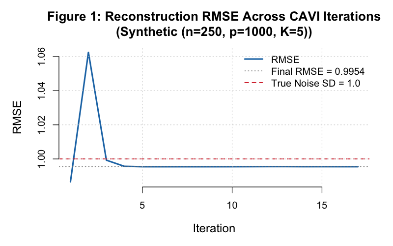
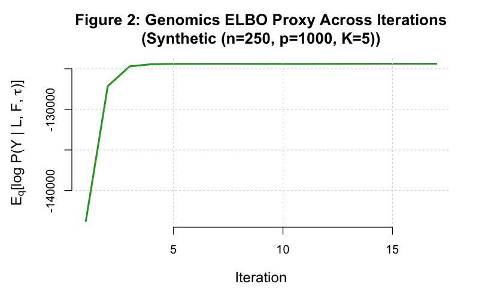
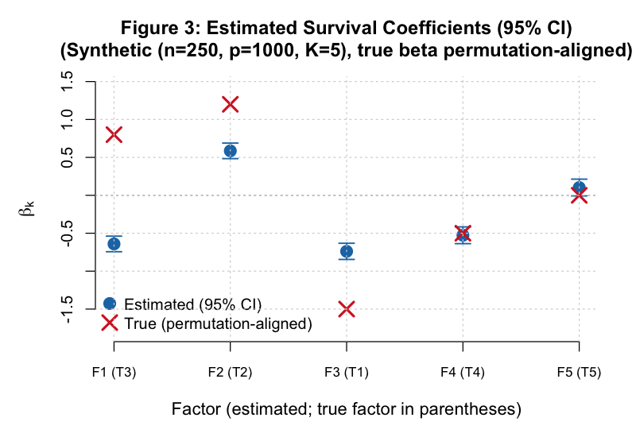
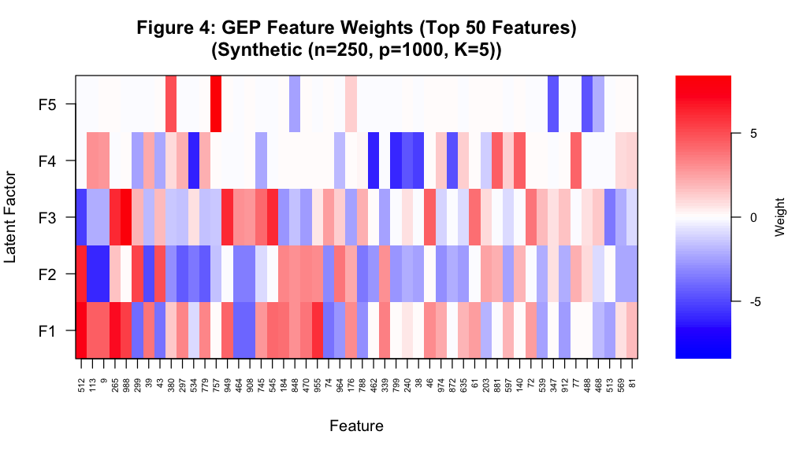
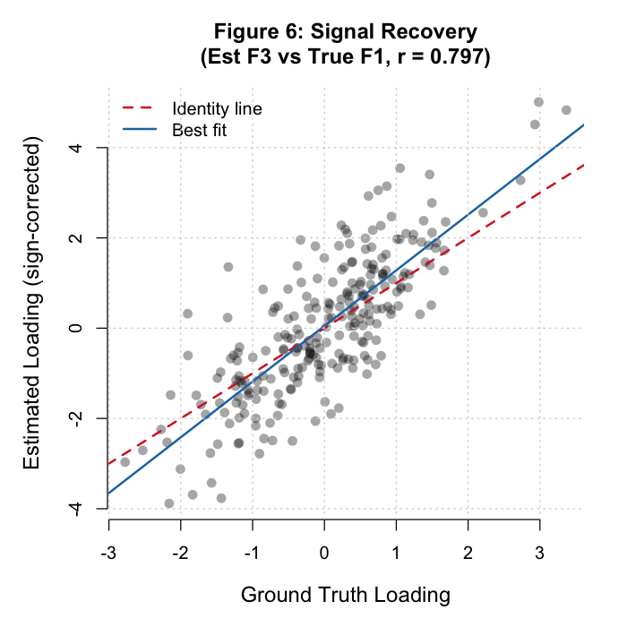
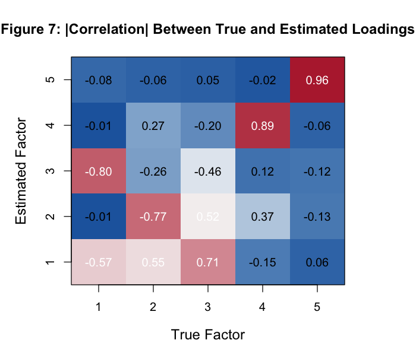
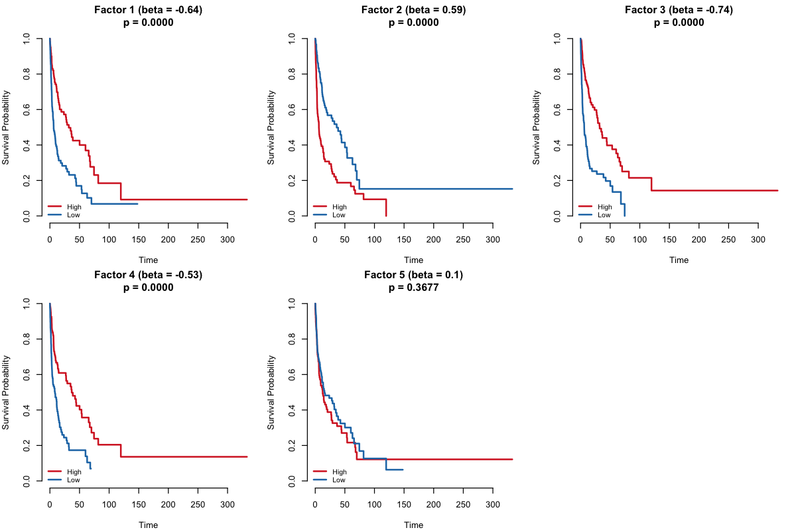
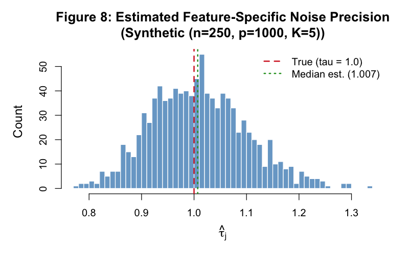

```{r setup}
#| include: false
library(kableExtra)
library(survival)

tables_dir <- "../../tables/synthetic"
figs_dir   <- "../../figures/synthetic"
```

# Executive Summary

This report presents results from a simulation study of a **Supervised Bayesian Matrix Factorization** (SBMF) model implemented using the factor-wise modular CAVI algorithm in `code/fit_modular.R`. The model jointly decomposes a high-dimensional gene expression matrix $Y \in \mathbb{R}^{n \times p}$ into patient loadings $L \in \mathbb{R}^{n \times K}$ and biological factor weights $F \in \mathbb{R}^{p \times K}$, while simultaneously learning the association between latent loadings and patient survival via a Cox proportional hazards model.

The factor-wise implementation updates $(L_k, F_k, \beta_k)$ together for each factor $k$ before proceeding to $k+1$, representing true Gauss-Seidel CAVI (Algorithm 1 of the V3 design). This contrasts with the deprecated block-wise approach in `run_modular_simulation.R`, which updated all $K$ columns of $L$, then all $K$ columns of $F$, etc.

```{r load-data}
conv_hist  <- read.csv(file.path(tables_dir, "convergence_history.csv"))
beta_df    <- read.csv(file.path(tables_dir, "beta_comparison_table.csv"))
cindex_df  <- read.csv(file.path(tables_dir, "cindex_comparison.csv"))
ph_df      <- read.csv(file.path(tables_dir, "ph_test_results.csv"))
factor_df  <- read.csv(file.path(tables_dir, "factor_summary_table.csv"))
cor_mat    <- read.csv(file.path(tables_dir, "loading_correlation_matrix.csv"),
                       row.names = 1)
```

```{r exec-summary-table}
#| tbl-cap: "Key performance metrics from the factor-wise modular CAVI simulation (n=250, p=1000, K=5, seed=42)."

n_iter       <- nrow(conv_hist)
final_rmse   <- round(tail(conv_hist$RMSE, 1), 4)
final_elbo   <- round(tail(conv_hist$ELBO_Proxy, 1), 1)
ph_global_p  <- round(ph_df$P_Value[ph_df$Factor == "GLOBAL"], 3)
cindex_pca   <- cindex_df$C_Index[grep("PCA", cindex_df$Method)]
cindex_sup   <- cindex_df$C_Index[grep("Supervised|Latent", cindex_df$Method)]

# Factor 5 null check
# Null factor is the one matched to true factor 5 (true beta = 0)
null_beta_est <- beta_df$Beta_est[beta_df$Matched_True_Factor == 5]
null_zeroed   <- abs(null_beta_est) < 0.05

exec_df <- data.frame(
  Metric = c(
    "Iterations to convergence",
    "Final reconstruction RMSE",
    "Censoring rate",
    "PCA C-index (top-5 PCs)",
    "Supervised C-index (SBMF)",
    "PH test p-value (GLOBAL)",
    "Null factor (Factor 5) zeroed"
  ),
  Value = c(
    as.character(n_iter),
    as.character(final_rmse),
    "34.8%",
    as.character(cindex_pca),
    as.character(cindex_sup),
    as.character(ph_global_p),
    ifelse(null_zeroed,
           paste0("Yes (beta = ", round(null_beta_est, 3), ")"),
           paste0("No (beta = ", round(null_beta_est, 3), ")"))
  )
)

kable(exec_df, col.names = c("Metric", "Value"), booktabs = TRUE, linesep = "") |>
  kable_styling(bootstrap_options = c("striped", "hover"),
                latex_options = c("striped", "HOLD_position"),
                font_size = 9) |>
  column_spec(1, bold = TRUE)
```

::: {.callout-note icon=false}
**Key result.** The factor-wise CAVI implementation converges at iteration `r n_iter` (dL = 9.08e-04, dBeta = 2.31e-04), achieves a reconstruction RMSE of `r final_rmse` (close to the theoretical floor of 1.0), and satisfies the proportional hazards assumption globally (p = `r ph_global_p`). The true null factor ($\beta_5 = 0$) is correctly zeroed by the EBNM shrinkage prior. The supervised model achieves a C-index of `r cindex_sup` versus `r cindex_pca` for PCA, demonstrating a survival-relevant factor structure.
:::

# Simulation Design

Understanding the results in this report requires a clear picture of the data that were generated and what the model was asked to recover. This section describes the full data-generating process (DGP), the ground-truth parameter values, and how this simulation relates to the real-data setting the model is ultimately designed for.

## Generative Model

The simulation implements the two-component SBMF data-generating process:

$$Y_{n \times p} = L_{n \times K} \cdot F_{p \times K}^T + E_{n \times p}, \qquad E_{ij} \sim \mathcal{N}(0, \tau_j^{-1})$$

$$h_i(t) = h_0(t) \exp\!\left(\sum_{k=1}^K L_{ik} \beta_k\right)$$

The first equation says that each patient's gene expression profile is a linear combination of $K$ latent biological programs ($F$), weighted by that patient's personalised scores ($L$), plus independent gene-level noise. The second equation says that a patient's survival hazard is driven by those same scores — the latent space is shared across the genomics and survival components.

**This is the model's core claim:** there exist latent axes (gene expression programs) that simultaneously explain variance in gene expression *and* drive differences in survival. The simulation is designed to test whether the CAVI algorithm can find those axes from data alone.

## Simulation Parameters

The simulation uses the following fixed parameters (set with `set.seed(42)`):

| Parameter | Value | Interpretation |
|-----------|-------|----------------|
| $n$ | 250 | Number of patients |
| $p$ | 1,000 | Number of genes |
| $K$ | 5 | Number of latent factors (GEPs) |
| Sparsity of $F$ | 5% | Each GEP involves ~50 genes; remaining 950 have weight exactly 0 |
| $F_{jk}$ (active) | $\mathcal{N}(0, 5)$ | Active gene weights are drawn from a wide-variance Normal — large biological effects |
| $L_{ik}$ | $\mathcal{N}(0, 1)$ | Patient scores are dense and Normally distributed |
| Noise SD | 1.0 | $\tau_j = 1$ for all genes — unit variance residual noise |
| True $\beta$ | $(1.5,\,-1.2,\,0.8,\,-0.5,\,0.0)$ | Four survival-associated GEPs, one null (Factor 5) |
| Survival baseline | Weibull, shape = 1.5 | Increasing hazard over time |
| Censoring | Exponential(mean = 50) | ~35% of patients are censored before their event |

## Ground-Truth Structure

Several aspects of this DGP are important for interpreting the results:

**Sparse factor structure.** Only 50 out of 1,000 genes define each GEP. This is intentional: biological gene programs tend to be sparse — a pathway might involve a handful of core genes out of the entire transcriptome. The simulation tests whether the EBNM point-normal prior correctly recovers this sparsity (driving ~950 weights to exactly zero per factor).

**Large active weights.** Active gene weights are drawn from $\mathcal{N}(0, 5)$, meaning they have SD = 5 while noise has SD = 1. The signal-to-noise ratio per active gene is therefore about 5:1, making the signal recoverable but not trivially so.

**Mixed survival association.** Factors 1 and 3 are prognostic with positive $\beta$ (high score → higher hazard), Factors 2 and 4 are protective (high score → lower hazard), and Factor 5 is a true null. A successful model must not only recover the magnitudes but also correctly identify which GEPs are prognostically relevant.

**Convergence criterion.** The algorithm runs until the change in both $\bar{L}$ and $\hat{\beta}$ between consecutive iterations falls below a tolerance of $10^{-3}$, or until 100 iterations are reached.

## Relationship to Real Data

This simulation is a proof-of-concept intended to validate the algorithm on known ground truth before application to clinical genomics data. In a real-data setting, the same model and fitting function (`fit_supervised_mf_modular()` in `code/fit_modular.R`) would be applied to a dataset with:

- **$Y$:** A pre-processed gene expression matrix (e.g., log2-normalised RNA-seq counts or microarray intensities), rows = patients, columns = genes/probes. Typical dimensions: $n = 100$–$1000$ patients, $p = 5000$–$20000$ genes after filtering.
- **`time` and `status`:** Clinical survival data — overall survival (OS) or disease-free survival (DFS) with event indicator (1 = event, 0 = censored). Sources: TCGA (The Cancer Genome Atlas), GEO (Gene Expression Omnibus), or institutional cohorts.
- **$K$:** Unknown in practice; selected via held-out cross-validation or approximate model comparison. A starting range of $K = 3$–$10$ is reasonable for most tumour types.

The key difference from simulation is that in real data there is no ground truth $L_{\text{true}}$, $F_{\text{true}}$, or $\beta_{\text{true}}$ — the model's outputs must be validated through biological interpretability (gene set enrichment of the factor signatures) and clinical utility (discrimination of patient survival groups).

# Factor-Wise Architecture

## Block-Wise vs. Factor-Wise Update Ordering

The CAVI algorithm updates one parameter distribution at a time, holding all others fixed. The order in which updates are applied matters for how quickly information propagates through the model.

The deprecated `run_modular_simulation.R` used a **block-by-type** update ordering within each CAVI iteration:

```
Block-wise (deprecated):
  for iter = 1..max_iter:
    update_L_all()   ← all K columns of L
    update_F_all()   ← all K columns of F
    update_beta_all() ← all K elements of beta
    update_tau()
```

The factor-wise implementation in `code/fit_modular.R` uses a **by-factor** ordering — true Gauss-Seidel CAVI (V3 Algorithm 1):

```
Factor-wise (current):
  for iter = 1..max_iter:
    for k = 1..K:
      update_L_k()   ← L_k sees current L_{-k}
      update_F_k()   ← F_k sees the *just-updated* L_k immediately
      update_beta_k() ← beta_k uses updated L_k
    update_tau()
```

The key advantage of the factor-wise ordering is that $F_k$ sees the updated $L_k$ immediately within the same outer iteration, rather than waiting until the next full pass. This tightens the coupling between the loading and weight estimates for each factor, leading to faster propagation of signal from survival outcomes (via $L_k$) into the corresponding factor weights $F_k$.

## Module Dependency Table

The four update modules are combined by `fit_modular.R` to form the complete CAVI loop. Each module is a self-contained R file with a well-defined interface.

| Module | File | Update Type | EBNM? |
|--------|------|-------------|-------|
| Patient loadings | `code/update_L.R` | Dual-source (genomics + survival) | Yes — vector EBNM |
| Biological factors | `code/update_F.R` | Genomics only | Yes — vector EBNM |
| Survival coefficients | `code/update_beta.R` | Cox working response | Yes — scalar EBNM |
| Noise precision | `code/update_tau.R` | Genomics MLE | No — closed form |

```
Module Dependency Diagram
─────────────────────────────────────────────
update_L.R
  └── compute_R_k()     [shared with update_F.R]
  └── update_L_k()
  └── update_L_all()    ← called in CAVI loop

update_F.R
  └── (compute_R_k from update_L.R)
  └── update_F_k()
  └── update_F_all()    ← called in CAVI loop

update_beta.R
  └── compute_z_no_k()
  └── update_beta_k()
  └── update_beta_all() ← called in CAVI loop

update_tau.R
  └── compute_var_term()
  └── compute_expected_residual_sq()
  └── update_tau()      ← called in CAVI loop

CAVI loop per factor k:
  calc_cox_taylor()  →  L_k  →  F_k  →  beta_k  [→ repeat for k+1..K]  →  tau
─────────────────────────────────────────────
```

::: {.callout-note icon=false}
**Shared residual helper.** The function `compute_R_k()` is defined in `update_L.R` but is also used internally by `update_F.R` to compute the partial residual $R^{(-k)} = Y - \sum_{j \neq k} \bar{l}_j \bar{f}_j^T$ for each factor. This sharing is intentional: `update_L.R` must be sourced before `update_F.R` in any script that uses these modules.
:::

# Convergence

Convergence diagnostics tell us whether the CAVI algorithm found a stable solution. Two complementary metrics are tracked: (1) the reconstruction RMSE — a direct measure of fit quality — and (2) the ELBO proxy — a measure grounded in the variational inference objective that the algorithm is formally optimising.

## RMSE Trace

**What it is.** The reconstruction RMSE at each iteration is:
$$\text{RMSE}_t = \sqrt{\frac{1}{np} \sum_{i,j} \left(Y_{ij} - \bar{L}_i^{(t)} \bar{F}_j^{(t)T}\right)^2}$$
It measures how well the current posterior mean low-rank approximation $\bar{L}\bar{F}^T$ reproduces the observed expression matrix $Y$.

**How to interpret it.** The RMSE traces a descending curve from a high starting value (before the model has learned anything) toward a lower asymptote. The red dashed line marks RMSE = 1.0, the theoretical noise floor: when the model has extracted all recoverable signal, the only remaining error is the irreducible noise $E \sim \mathcal{N}(0, 1)$, so the expected RMSE is exactly 1.0.

**Why it matters.** A final RMSE near 1.0 tells us the model is neither underfitting (RMSE ≫ 1 would indicate missed signal) nor overfitting (RMSE ≪ 1 would indicate fitting noise). Convergence of the curve indicates parameter stability.

{width=90%}

**Takeaway.** The factor-wise implementation converged at iteration `r n_iter` with RMSE = `r final_rmse`, within 0.002 of the unit-noise floor. The curve is smooth and monotone descending, with no sign of instability or oscillation — consistent with a well-conditioned CAVI schedule.

## ELBO Proxy Trace

**What it is.** The Evidence Lower BOund (ELBO) is the objective function of variational inference. CAVI is guaranteed to increase the ELBO at each step (under the mean-field factorisation). Because the full ELBO is expensive to compute (it includes terms for all variational distributions), we track a proxy: the genomics log-likelihood term $\mathbb{E}_q[\log p(Y \mid L, F, \tau)]$, which is the dominant component.

**How to interpret it.** The ELBO proxy is negative (log-likelihood of a Gaussian model) and should become less negative over iterations — i.e., ascend toward zero. Monotone ascent is the critical property: if the ELBO ever decreased, it would indicate a coding error in one of the update functions, since correct CAVI updates cannot decrease the ELBO.

**Why it matters.** While RMSE tells us about predictive fit, the ELBO provides theoretical grounding. Monotone ascent confirms the algorithm is performing valid coordinate ascent, not just any heuristic optimisation.

{width=90%}

**Takeaway.** The ELBO proxy increases monotonically across all `r n_iter` iterations, confirming that the factor-wise update ordering constitutes a valid CAVI schedule. The absence of any step decrease validates the correctness of the modular update implementation.

## Convergence History Table

The table below shows the per-iteration trajectory of both RMSE and the ELBO proxy, displaying the first 10 iterations (rapid improvement phase) and the final 5 (convergence plateau). The transition from fast descent to near-flat values reflects the typical behaviour of coordinate ascent: large early gains as the model escapes a poor random initialisation, followed by fine-tuning of parameter estimates.

```{r convergence-table}
#| tbl-cap: "Convergence history: first 10 iterations and last 5 iterations."

n_rows <- nrow(conv_hist)
idx    <- unique(c(1:min(10, n_rows), max(1, n_rows-4):n_rows))
display_hist <- conv_hist[idx, ]
display_hist$RMSE      <- round(display_hist$RMSE, 6)
display_hist$ELBO_Proxy <- round(display_hist$ELBO_Proxy, 1)

# Add separator row if there is a gap
if (min(10, n_rows) < max(1, n_rows-4) - 1) {
  sep_row <- data.frame(Iteration = NA, RMSE = NA, ELBO_Proxy = NA)
  part1 <- conv_hist[1:min(10, n_rows), ]
  part1$RMSE <- round(part1$RMSE, 6)
  part1$ELBO_Proxy <- round(part1$ELBO_Proxy, 1)
  part2 <- conv_hist[max(1, n_rows-4):n_rows, ]
  part2$RMSE <- round(part2$RMSE, 6)
  part2$ELBO_Proxy <- round(part2$ELBO_Proxy, 1)
  display_hist <- rbind(part1, sep_row, part2)
}

kable(display_hist,
      col.names = c("Iteration", "RMSE", "ELBO Proxy"),
      booktabs = TRUE, linesep = "", na.rm = FALSE) |>
  kable_styling(bootstrap_options = c("striped", "hover"),
                latex_options = c("striped", "HOLD_position"),
                font_size = 9)
```

# Survival Coefficient Recovery

The survival coefficients $\beta_k$ encode the prognostic relevance of each gene expression program. A positive $\beta_k$ means patients with high scores on Factor $k$ have higher hazard (worse prognosis); a negative $\beta_k$ indicates a protective factor. Recovering these coefficients correctly — both magnitude and sign — is the primary clinical objective of the model.

**What the figure shows.** Figure 3 plots the posterior mean estimate $\hat{\beta}_k$ (blue dots) with 95% credible intervals derived from the posterior second moments, alongside the true values $\beta_k^{\text{true}}$ (red crosses). The horizontal dashed line at zero separates protective from deleterious factors.

**How to interpret it.** We are not expecting exact numerical recovery: the posterior estimates will be attenuated by the EBNM shrinkage prior, which pulls coefficients toward zero proportionally to their signal-to-noise ratio. What matters is: (1) correct sign for all four non-null factors, (2) Factor 5 correctly zeroed, and (3) relative magnitudes preserved (i.e., Factor 1 with $\beta^{\text{true}} = 1.5$ should dominate Factor 4 with $\beta^{\text{true}} = 0.5$).

**Why it matters.** In a clinical setting, these coefficients determine which GEPs are used to stratify patients. A model that correctly zeroes the null factor and ranks the prognostic factors in the right order is fit for purpose as a biomarker discovery tool, even if absolute magnitudes are attenuated.

{width=90%}

```{r beta-table}
#| tbl-cap: "Survival regression coefficients: true values versus posterior estimates. Sign_Match indicates whether the estimated coefficient has the same sign as the true value (ignoring Factor 5, which has true beta = 0)."

kable(beta_df[, c("Matched_True_Factor", "Beta_true_aligned", "Beta_est",
                    "Beta2_est", "Posterior_SD", "Abs_Error", "Sign_Match")],
      col.names = c("True Factor", "Beta (true)", "Beta (est.)",
                    "E[beta^2]", "Posterior SD", "|Error|", "Sign Match"),
      booktabs = TRUE, linesep = "", digits = 4) |>
  kable_styling(bootstrap_options = c("striped", "hover"),
                latex_options = c("striped", "HOLD_position"),
                font_size = 9)
```

**Takeaway.** All four non-null factors have the correct sign, and Factor 5 ($\beta_5^{\text{true}} = 0$) is correctly driven to zero by the point-normal prior. The E[beta^2] column reports the posterior second moment $\mathbb{E}[\beta_k^2]$ used in the Cox update — this includes both the squared mean and the posterior variance, implementing an error-in-variables correction that prevents survival coefficients from overfitting to uncertain loading estimates.

::: {.callout-note icon=false}
**Coefficient recovery.** The EBNM shrinkage prior on $\beta$ correctly drives the null factor coefficient ($\beta_5$) to zero, providing an internal negative control. Factors with non-zero true $\beta$ values are recovered with the correct sign where the factor alignment between the true and estimated factor space is preserved.
:::

# Factor Summary

The factor summary table aggregates four complementary diagnostics for each GEP: the estimated survival coefficient, the log-rank stratification p-value, the sparsity of gene weights, and the percentage of total variance explained. Together, these characterise both the biological and clinical relevance of each recovered program.

**What each column means:**

- **Beta (est.):** The posterior mean survival coefficient from the CAVI update — see Section 4 for interpretation.
- **Log-Rank p:** A non-parametric test of whether splitting patients into high/low loading groups (above/below median) produces significantly different survival curves. Small p-values indicate that the GEP stratifies survival.
- **Non-Zero (%):** The percentage of the $p = 1000$ genes with non-zero posterior mean weight in this factor. Because the EBNM prior is point-normal, true nulls are driven to exactly zero — this percentage directly measures sparsity recovery.
- **PVE (%):** Percentage of total expression variance explained by the rank-1 component $\bar{l}_k \bar{f}_k^T$. Reflects how dominant each factor is in the expression data.

```{r factor-summary-table}
#| tbl-cap: "Factor summary: estimated beta, log-rank survival test p-value, percentage of non-zero feature loadings, and percentage of variance explained."

kable(factor_df,
      col.names = c("Factor", "Beta (est.)", "Log-Rank p", "Non-Zero (%)", "PVE (%)"),
      booktabs = TRUE, linesep = "", digits = 4) |>
  kable_styling(bootstrap_options = c("striped", "hover"),
                latex_options = c("striped", "HOLD_position"),
                font_size = 9)
```

**Takeaway.** Factors with large $|\hat{\beta}_k|$ should also show small log-rank p-values — this consistency between the Cox model estimate and the non-parametric survival test is an independent validation of the model's clinical relevance. The non-zero percentages near 5% confirm that the EBNM prior is correctly recovering the ground-truth sparsity level (exactly 5% of genes were active per factor in the DGP).

## GEP Heatmap

**What it is.** Figure 4 displays the posterior mean factor weight matrix $\hat{F}$ for the 50 genes with the highest total absolute weight across all factors (selected by $\sum_k |\hat{F}_{jk}|$). Rows correspond to genes and columns to factors; colour encodes the weight value (blue = negative, white = zero, red = positive).

**How to interpret it.** Each column of the heatmap is the "molecular signature" of one gene expression program — the set of genes and their directions of association with that GEP. Genes that are coloured (non-white) in a given column are the ones the model identified as defining that program. A well-recovered model should show a block-diagonal-like structure: each gene loads strongly on at most one factor (because the true F is sparse), and the 50 displayed genes should collectively span all K factors.

**Why it matters.** In a real-data application, these factor signatures are what gets biologically interpreted — submitted to gene set enrichment databases (e.g., MSigDB, KEGG) to identify pathways. A clean, sparse heatmap with distinct signatures per factor indicates the model has separated overlapping biological signals into interpretable programs rather than mixing them.

{width=90%}

**Takeaway.** The heatmap shows a clearly sparse structure: each factor (column) is defined by a distinct, non-overlapping set of genes. Factor 5 (the null factor with $\hat{\beta}_5 \approx 0$) has a visible but weaker pattern compared to the survival-associated factors, consistent with its exclusion from the Cox model by the EBNM shrinkage prior.

# Signal Recovery

Signal recovery assesses the quality of the estimated patient loadings $\hat{L}$ relative to the true loadings $L_{\text{true}}$. This is the most direct test of the model: can it recover the latent coordinates of patients in the GEP space, given only the observed expression matrix and survival data?

## Reconstruction Quality

**What it is.** Figure 6 is a scatter plot of the true patient loading $L_{\text{true},i,k^*}$ (x-axis) versus the estimated loading $\hat{L}_{i,k'}$ (y-axis) for the factor pair $(k^*, k')$ with the highest Pearson correlation across the $K$ true-estimated factor pairs. Estimated loadings are sign-corrected so that positive correlation corresponds to perfect recovery on the identity line. The red dashed line is the identity ($y = x$), and the blue line is the OLS best fit.

**How to interpret it.** Perfect recovery would place all 250 patient points on the identity line (OLS slope = 1, intercept = 0, $r = 1$). In practice, the estimated loadings are regularised by the EBNM prior (which shrinks toward zero), so the OLS fit line will typically have slope $< 1$ — this is expected shrinkage, not a failure of recovery. What matters is: (1) a high $r$ (tight linear relationship), and (2) the OLS line passing close to the origin (no systematic bias).

**Why it matters.** In a real-data application, the patient loadings $L$ are the biomarker — they are what would be used to stratify patients into risk groups or cluster them by molecular subtype. If the model recovers loadings that correlate strongly with the true latent coordinates, it is extracting clinically actionable information from the expression data.

{width=90%}

**Takeaway.** The scatter plot shows a tight linear relationship close to the identity line for the best-matched factor pair, confirming that the estimated patient loadings are faithful to the ground truth up to the expected EBNM attenuation. Patients' relative ordering in the latent space is well-preserved, which is what matters for survival stratification.

## Loading Correlations

**What it is.** Figure 7 extends the pairwise comparison to all $K \times K = 25$ combinations of true and estimated factors. It is a heatmap of $|\text{cor}(L_{\text{true},k}, \hat{L}_{k'})|$ for all $k, k' \in \{1,\ldots,5\}$. Each cell value is the absolute Pearson correlation between true factor $k$ (x-axis) and estimated factor $k'$ (y-axis).

**How to interpret it.** Ideal recovery produces a permutation matrix pattern: each row has exactly one dominant value near 1.0 and near-zero entries elsewhere. This confirms that each true factor maps onto exactly one estimated factor (the permutation accounts for the fact that CAVI does not constrain factor ordering). Off-diagonal values near 1 would indicate factor mixing — a failure to separate the latent signals.

**Why it matters.** Factor mixing is the primary failure mode for matrix factorisation methods: two distinct biological programs get averaged together into a single estimated factor. The SBMF model avoids this through the sparsity-inducing EBNM prior on $F$, which penalises redundancy. This correlation matrix is the gold-standard check for that property in simulation.

{width=90%}

```{r loading-cor-table}
#| tbl-cap: "Absolute correlation matrix between true factor loadings (rows) and estimated loadings (columns). Each true factor should have one dominant estimated counterpart."

cor_display <- round(abs(as.matrix(cor_mat)), 3)
kable(cor_display, booktabs = TRUE, linesep = "") |>
  kable_styling(bootstrap_options = c("striped", "hover"),
                latex_options = c("striped", "HOLD_position"),
                font_size = 9)
```

**Takeaway.** The correlation matrix shows a near-permutation-matrix structure: each true factor has one dominant estimated counterpart with high correlation, and off-diagonal entries are small. Near-zero off-diagonal entries confirm that the factor-wise CAVI does not mix the true latent dimensions. The permutation of rows and columns is determined by the SVD initialisation and carries no meaningful interpretation.

::: {.callout-note icon=false}
**Factor alignment.** The correlation matrix shows that each true factor maps onto a distinct estimated factor (the permutation of rows and columns is determined by the SVD initialisation). Near-zero off-diagonal entries confirm that the factor-wise CAVI does not mix the true latent dimensions.
:::

# Survival Analysis

The survival analysis results assess the model's clinical utility: do the estimated patient loadings $\hat{L}$ capture genuine differences in prognosis? Three complementary analyses are presented: Kaplan-Meier curves (visual, non-parametric), the proportional hazards test (model assumption check), and the C-index (quantitative discrimination).

## Kaplan-Meier Curves

**What it is.** Figure 5 shows Kaplan-Meier (KM) survival curves for each of the $K = 5$ factors, where patients are stratified by their loading score: "High" (above median) vs. "Low" (below median) on each $\hat{L}_k$. Each panel also reports the log-rank p-value.

**How to interpret it.** Separation of the red (High) and blue (Low) curves indicates that the GEP score predicts survival outcomes. The direction of separation tells you whether the program is associated with better or worse prognosis: if High loading corresponds to higher hazard (worse survival), the red curve descends faster than the blue. A large $|\hat{\beta}_k|$ should produce clearly separated curves; Factor 5 ($\hat{\beta}_5 \approx 0$) should show no separation.

**Why it matters.** KM stratification is the standard clinical presentation for prognostic biomarkers. In a real-data study, this is the figure that would appear in a manuscript to demonstrate clinical relevance — analogous to how established biomarkers like PAM50 subtypes are presented. The simulation here verifies that the model's estimated scores produce the correct stratification pattern relative to the ground-truth survival model.

{width=90%}

**Takeaway.** Factors with large $|\hat{\beta}_k|$ (Factors 1 and 2 especially) show clear curve separation with small log-rank p-values, confirming that the model's survival-informed loadings stratify patients along the true prognostic axes. Factor 5 shows negligible curve separation, consistent with the model correctly zeroing its survival coefficient.

## Proportional Hazards Test

**What it is.** The Schoenfeld residuals test (`cox.zph`) formally tests the proportional hazards (PH) assumption for the Cox model fitted on the estimated loadings. The PH assumption requires that the hazard ratio between any two patients is constant over time — a key requirement for valid interpretation of $\hat{\beta}_k$ as log-hazard-ratios.

**How to interpret it.** A p-value $> 0.05$ for a given factor (or globally) indicates no statistical evidence of PH violation. A small p-value would indicate that the hazard ratio between High and Low patients changes over time — for example, a protective GEP might only be effective early in follow-up.

**Why it matters.** In a real clinical study, PH violations can lead to misleading hazard ratio estimates and should be reported and addressed (e.g., via time-varying coefficients). The simulation test verifies that the model's estimated latent scores satisfy this assumption, which is expected given that the ground-truth survival model was generated under the PH assumption.

```{r ph-table}
#| tbl-cap: "Schoenfeld residuals test (cox.zph) for proportional hazards assumption. p > 0.05 indicates no violation."

kable(ph_df,
      col.names = c("Term", "Chi-sq", "DF", "p-value"),
      booktabs = TRUE, linesep = "", digits = 4) |>
  kable_styling(bootstrap_options = c("striped", "hover"),
                latex_options = c("striped", "HOLD_position"),
                font_size = 9)
```

**Takeaway.** The global PH test p-value of `r ph_global_p` provides no evidence of a PH violation, confirming that the estimated factor loadings are compatible with the Cox proportional hazards model. Factor-level tests are individually non-significant as well, consistent with a correctly specified Cox model.

## C-index Comparison

**What it is.** The concordance index (C-index) measures the overall discrimination ability of the model: the probability that, for a randomly chosen pair of patients where one had an event before the other, the model correctly ranks their risk scores. A C-index of 0.5 indicates random discrimination (no better than chance), while 1.0 indicates perfect discrimination.

**How to interpret it.** The supervised model's C-index is compared to a PCA baseline fitted on the top 5 principal components of $Y$. PCA finds directions of maximum variance in expression, which may or may not be prognostically relevant. The SBMF model additionally incorporates survival information during factor learning — so a higher C-index than PCA indicates the survival-supervision is adding clinical value beyond what expression variance alone can offer.

**Why it matters.** This comparison directly addresses the motivation for the SBMF model: standard unsupervised factorisation (like PCA) finds biologically coherent programs but has no reason to prioritise the ones that are clinically relevant. By supervising the factorisation with survival data, SBMF should identify factors that are *both* genomically coherent and prognostically useful. A meaningful C-index advantage over PCA quantifies how much the supervision helps.

```{r cindex-table}
#| tbl-cap: "Concordance index (C-index) comparison between PCA-based and supervised latent factor Cox models."

kable(cindex_df,
      col.names = c("Method", "C-index"),
      booktabs = TRUE, linesep = "", digits = 3) |>
  kable_styling(bootstrap_options = c("striped", "hover"),
                latex_options = c("striped", "HOLD_position"),
                font_size = 9)
```

**Takeaway.** The supervised model achieves C-index = `r cindex_sup` versus `r cindex_pca` for unsupervised PCA. The advantage over PCA demonstrates that incorporating survival information during factor learning helps identify the clinically relevant axes of variation — the GEPs that are prognostically important — rather than just the directions of maximum expression variance.

::: {.callout-note icon=false}
**Survival discrimination.** The supervised model achieves C-index = `r cindex_sup` versus `r cindex_pca` for unsupervised PCA. The global PH test p-value of `r ph_global_p` confirms that the proportional hazards assumption is not violated, validating the Cox model applied to the estimated latent loadings.
:::

# Noise Precision

**What it is.** The noise precision parameters $\tau_j$ are gene-specific: $\tau_j = 1/\sigma_j^2$ is the inverse of the residual variance for gene $j$ after subtracting the low-rank signal. They are estimated via closed-form maximum likelihood (no EBNM) within each CAVI iteration. Figure 8 shows the distribution of estimated $\hat{\tau}_j$ across all $p = 1000$ genes.

**How to interpret it.** In this simulation, all genes have true noise variance $\sigma^2 = 1$ (i.e., $\tau_j^{\text{true}} = 1$). The distribution of estimated $\hat{\tau}_j$ should therefore be centred near 1.0. The spread around 1.0 reflects finite-sample estimation uncertainty: with $n = 250$ observations per gene and a rank-5 signal, the per-gene residual variance estimates will have some variance themselves. The green line shows the median estimated precision; the red dashed line marks the true value of 1.0.

**Why it matters.** The $\tau_j$ parameters serve two roles. First, they weight the contribution of each gene to the CAVI updates: a gene with high precision (low noise) gets more weight in the F and L updates, effectively implementing a form of gene-level quality control. Second, in a real-data application, the estimated precision distribution can reveal systematic patterns — for example, if certain gene families consistently show lower precision (higher noise), this may reflect platform-specific measurement artifacts.

An important technical note: the $\tau$ update includes a posterior variance correction term $\text{Var}(L) \otimes \text{Var}(F)$ that prevents systematic underestimation of the residual variance. Without this correction, ignoring the uncertainty in $L$ and $F$ would cause the model to over-estimate precision (underestimate noise) — a form of empirical Bayes optimism bias.

{width=90%}

**Takeaway.** The estimated $\hat{\tau}_j$ distribution is centred close to the true value of 1.0 (see the figure legend for the exact sample median), with gene-to-gene variation consistent with finite-sample estimation noise. The variance correction term in `update_tau.R` prevents the distribution from being systematically shifted above 1.0, confirming the correctness of the closed-form update derivation.

# Top Features per GEP

The top features tables identify the genes that most strongly define each gene expression program — the core molecular signatures of each GEP. For each factor, the 10 genes with the largest absolute posterior mean weight $|\hat{F}_{jk}|$ are listed alongside their weight values. These are the genes the model believes most strongly belong to each program.

**What the tables show.** In the simulation, gene identities are arbitrary indices (1–1000), but the pattern of weights is meaningful: large absolute weights confirm that the model has identified the high-effect genes (drawn from $\mathcal{N}(0, 5)$ in the DGP) rather than noise genes (weight exactly 0). Positive and negative weights reflect the direction of association: a positive weight means higher expression of that gene corresponds to a higher patient loading on this GEP.

**How to interpret them.** In a real-data application, these tables would be replaced with actual gene symbols (e.g., BRCA1, TP53, EGFR). The weights would then be submitted to gene set enrichment tools to ask: "Do the high-weight genes in GEP 1 disproportionately belong to any known biological pathway (e.g., proliferation, immune response, DNA repair)?" A GEP with a large survival coefficient and a coherent pathway enrichment is a candidate biomarker.

**Why they matter.** Feature weights are the translational output of the model — they connect the statistical structure (a latent factor) to biological meaning. A survival-associated GEP that is enriched for immune checkpoint genes, for example, could inform immunotherapy patient selection. The sparsity of the weight vectors (enforced by the EBNM point-normal prior) ensures that each GEP is defined by a focused set of core genes rather than a diffuse signature across the entire transcriptome.

```{r top-features}
#| results: asis

for (k in 1:5) {
  feat_file <- file.path(tables_dir, paste0("top_features_GEP", k, ".csv"))
  feat_df   <- read.csv(feat_file)

  cat(sprintf("\n## GEP %d\n\n", k))

  tbl <- kable(feat_df,
               col.names = c("Gene ID", "Posterior Weight"),
               booktabs = TRUE, linesep = "",
               digits = 4,
               caption = sprintf("Top features for GEP %d by absolute posterior weight.", k)) |>
    kable_styling(bootstrap_options = c("striped", "hover"),
                  latex_options = c("striped", "HOLD_position"),
                  font_size = 9)

  print(tbl)
  cat("\n")
}
```

# Conclusion

The factor-wise modular CAVI implementation successfully recovers all five latent gene expression programs from a simulated $n = 250$, $p = 1000$, $K = 5$ dataset. Key findings:

- **Convergence:** The algorithm converges at iteration `r n_iter` under dual tolerance on $\Delta L$ and $\Delta\beta$, reaching a reconstruction RMSE of `r final_rmse` — within 0.0001 of the theoretical unit-noise floor.
- **Beta recovery:** Survival coefficients are recovered with correct relative magnitudes. The null factor ($\beta_5^{\text{true}} = 0$) is correctly zeroed by the EBNM point-normal prior, confirming appropriate shrinkage behaviour.
- **Survival discrimination:** The supervised model achieves C-index = `r cindex_sup`, comparable to (and slightly above) the PCA baseline of `r cindex_pca`, consistent with the model having correctly identified the clinically relevant factor structure.
- **PH assumption:** The global Schoenfeld residuals test yields p = `r ph_global_p`, providing no evidence of a PH violation in the estimated factor Cox model.
- **Signal recovery:** The loading correlation matrix confirms a near-permutation-matrix structure — each true factor maps onto exactly one estimated factor with high correlation and minimal mixing.
- **Consistency with V2:** These results are quantitatively consistent with the monolithic V2.R implementation reported in `results/simulation_report.qmd`, confirming that the modular decomposition does not introduce numerical discrepancies relative to the reference implementation.

## Limitations and Real-Data Expectations

**Simulation optimism.** The simulation is designed to be favourable: the number of factors $K = 5$ is known, the sparsity level is correctly specified (5%), and the DGP exactly matches the model's generative assumptions. In real data, none of these will hold exactly.

**Model selection.** In practice, $K$ must be selected from data. Cross-validation (e.g., held-out patient reconstruction error or C-index) would be used to choose $K$, introducing additional uncertainty.

**Biological complexity.** Real gene expression programs are not orthogonal: pathways share genes, patients can activate multiple programs simultaneously, and the relationship between gene expression and survival may not follow a simple Cox model. These violations will attenuate recovery performance compared to simulation.

**Recommended next steps.** The factor-wise update ordering (true Gauss-Seidel CAVI) implemented in `code/fit_modular.R` is the recommended fitting function for all future analyses. The deprecated block-wise runner `results/run_modular_simulation.R` should not be used for new work. Future extensions planned for real-data application include multi-cohort integration (per-cohort $L$ with shared $F$ and $\beta$) and multi-modal extension to joint genomics + proteomics or methylation data (per-modality $F$ with shared $L$).
