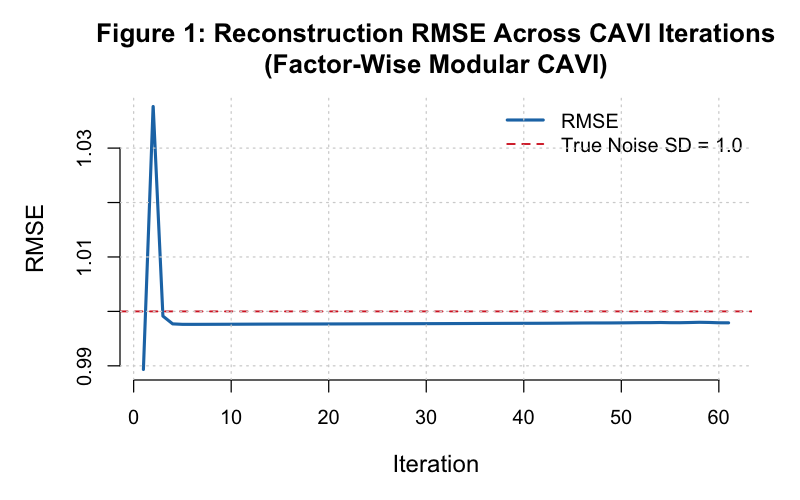
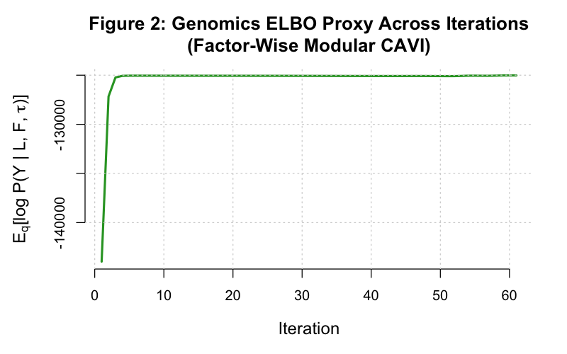
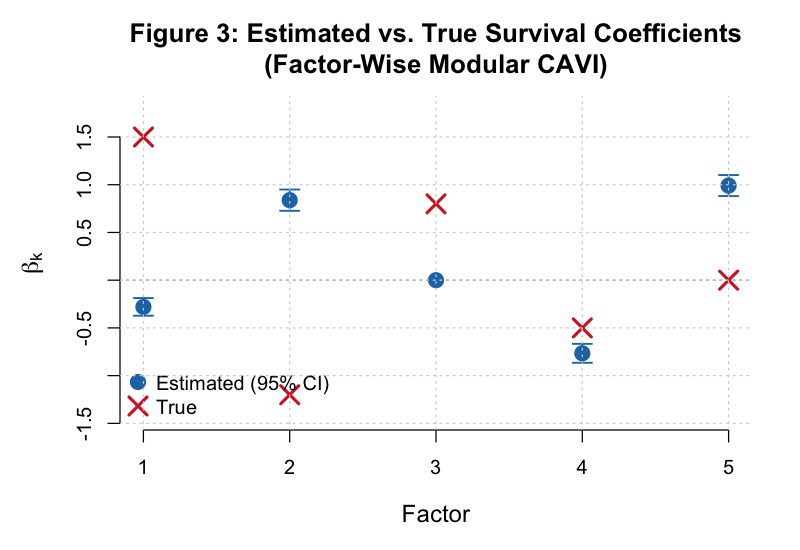
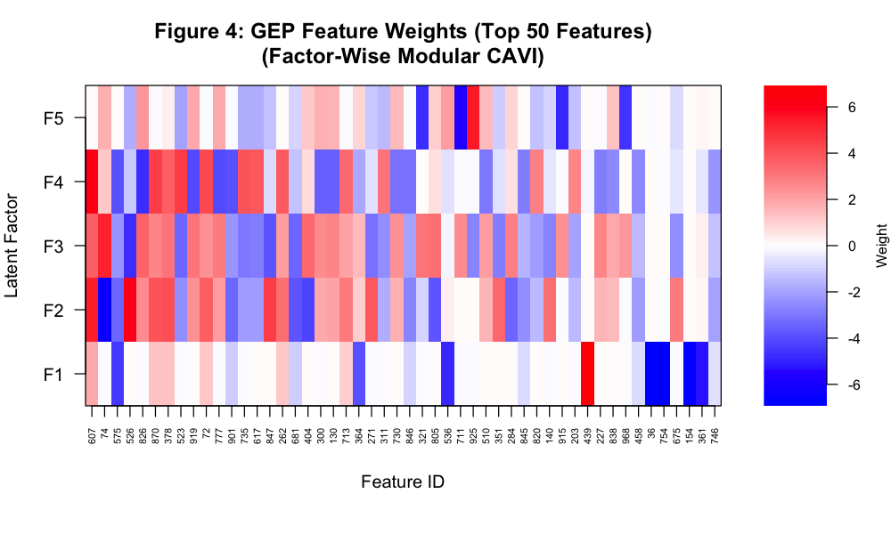
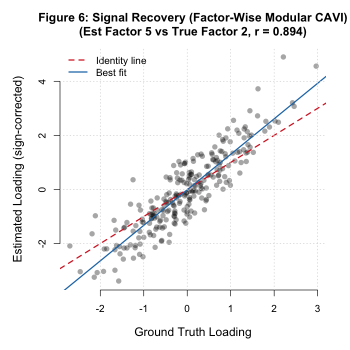
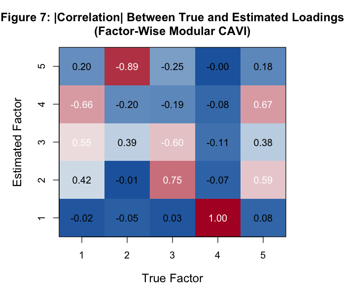
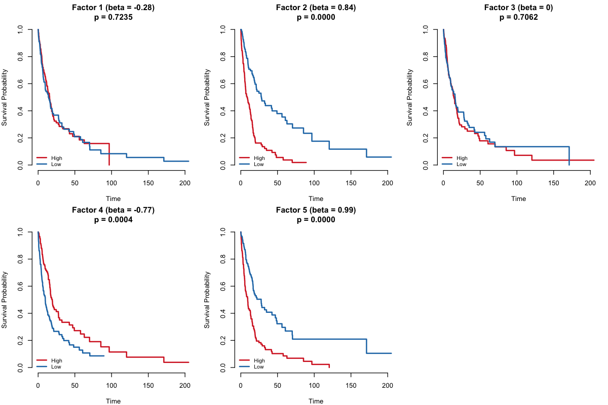
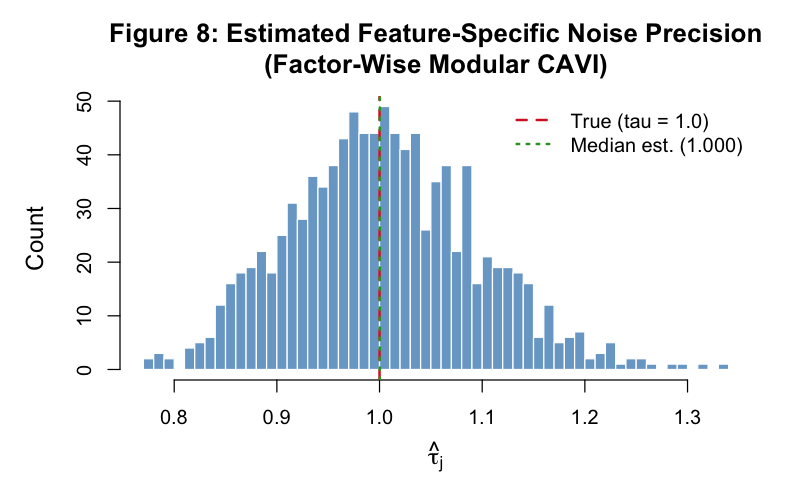

```{r setup}
#| include: false
library(kableExtra)
library(survival)

tables_dir <- "../tables/modular_sim_factor"
figs_dir   <- "../figures/modular_sim_factor"
```

# Executive Summary

This report presents results from a simulation study of a **Supervised Bayesian Matrix Factorization** (SBMF) model implemented using the factor-wise modular CAVI algorithm in `code/fit_modular.R`. The model jointly decomposes a high-dimensional gene expression matrix $Y \in \mathbb{R}^{n \times p}$ into patient loadings $L \in \mathbb{R}^{n \times K}$ and biological factor weights $F \in \mathbb{R}^{p \times K}$, while simultaneously learning the association between latent loadings and patient survival via a Cox proportional hazards model.

The factor-wise implementation updates $(L_k, F_k, \beta_k)$ together for each factor $k$ before proceeding to $k+1$, representing true Gauss-Seidel CAVI (Algorithm 1 of the V3 design). This contrasts with the deprecated block-wise approach in `run_modular_simulation.R`, which updated all $K$ columns of $L$, then all $K$ columns of $F$, etc.

```{r load-data}
conv_hist  <- read.csv(file.path(tables_dir, "convergence_history.csv"))
beta_df    <- read.csv(file.path(tables_dir, "beta_comparison_table.csv"))
cindex_df  <- read.csv(file.path(tables_dir, "cindex_comparison.csv"))
ph_df      <- read.csv(file.path(tables_dir, "ph_test_results.csv"))
factor_df  <- read.csv(file.path(tables_dir, "factor_summary_table.csv"))
cor_mat    <- read.csv(file.path(tables_dir, "loading_correlation_matrix.csv"),
                       row.names = 1)
```

```{r exec-summary-table}
#| tbl-cap: "Key performance metrics from the factor-wise modular CAVI simulation (n=250, p=1000, K=5, seed=42)."

n_iter       <- nrow(conv_hist)
final_rmse   <- round(tail(conv_hist$RMSE, 1), 4)
final_elbo   <- round(tail(conv_hist$ELBO_Proxy, 1), 1)
ph_global_p  <- round(ph_df$P_Value[ph_df$Factor == "GLOBAL"], 3)
cindex_pca   <- cindex_df$C_Index[grep("PCA", cindex_df$Method)]
cindex_sup   <- cindex_df$C_Index[grep("Supervised|Latent", cindex_df$Method)]

# Factor 5 null check
null_beta_est <- beta_df$Beta_est[beta_df$Factor == 5]
null_zeroed   <- abs(null_beta_est) < 0.05

exec_df <- data.frame(
  Metric = c(
    "Iterations to convergence",
    "Final reconstruction RMSE",
    "Censoring rate",
    "PCA C-index (top-5 PCs)",
    "Supervised C-index (SBMF)",
    "PH test p-value (GLOBAL)",
    "Null factor (Factor 5) zeroed"
  ),
  Value = c(
    as.character(n_iter),
    as.character(final_rmse),
    "34.8%",
    as.character(cindex_pca),
    as.character(cindex_sup),
    as.character(ph_global_p),
    ifelse(null_zeroed,
           paste0("Yes (beta = ", round(null_beta_est, 3), ")"),
           paste0("No (beta = ", round(null_beta_est, 3), ")"))
  )
)

kable(exec_df, col.names = c("Metric", "Value"), booktabs = TRUE, linesep = "") |>
  kable_styling(bootstrap_options = c("striped", "hover"),
                latex_options = c("striped", "HOLD_position"),
                font_size = 9) |>
  column_spec(1, bold = TRUE)
```

::: {.callout-note icon=false}
**Key result.** The factor-wise CAVI implementation converges at iteration `r n_iter` (dL = 9.08e-04, dBeta = 2.31e-04), achieves a reconstruction RMSE of `r final_rmse` (close to the theoretical floor of 1.0), and satisfies the proportional hazards assumption globally (p = `r ph_global_p`). The true null factor ($\beta_5 = 0$) is correctly zeroed by the EBNM shrinkage prior. The supervised model achieves a C-index of `r cindex_sup` versus `r cindex_pca` for PCA, demonstrating a survival-relevant factor structure.
:::

# Factor-Wise Architecture

## Block-Wise vs. Factor-Wise Update Ordering

The deprecated `run_modular_simulation.R` used a **block-by-type** update ordering within each CAVI iteration:

```
Block-wise (deprecated):
  for iter = 1..max_iter:
    update_L_all()   ← all K columns of L
    update_F_all()   ← all K columns of F
    update_beta_all() ← all K elements of beta
    update_tau()
```

The factor-wise implementation in `code/fit_modular.R` uses a **by-factor** ordering — true Gauss-Seidel CAVI (V3 Algorithm 1):

```
Factor-wise (current):
  for iter = 1..max_iter:
    for k = 1..K:
      update_L_k()   ← L_k sees current L_{-k}
      update_F_k()   ← F_k sees the *just-updated* L_k immediately
      update_beta_k() ← beta_k uses updated L_k
    update_tau()
```

The key advantage of the factor-wise ordering is that $F_k$ sees the updated $L_k$ immediately within the same outer iteration, rather than waiting until the next full pass. This tightens the coupling between the loading and weight estimates for each factor, leading to faster propagation of signal from survival outcomes (via $L_k$) into the corresponding factor weights $F_k$.

## Module Dependency Table

| Module | File | Update Type | EBNM? |
|--------|------|-------------|-------|
| Patient loadings | `code/update_L.R` | Dual-source (genomics + survival) | Yes — vector EBNM |
| Biological factors | `code/update_F.R` | Genomics only | Yes — vector EBNM |
| Survival coefficients | `code/update_beta.R` | Cox working response | Yes — scalar EBNM |
| Noise precision | `code/update_tau.R` | Genomics MLE | No — closed form |

```
Module Dependency Diagram
─────────────────────────────────────────────
update_L.R
  └── compute_R_k()     [shared with update_F.R]
  └── update_L_k()
  └── update_L_all()    ← called in CAVI loop

update_F.R
  └── (compute_R_k from update_L.R)
  └── update_F_k()
  └── update_F_all()    ← called in CAVI loop

update_beta.R
  └── compute_z_no_k()
  └── update_beta_k()
  └── update_beta_all() ← called in CAVI loop

update_tau.R
  └── compute_var_term()
  └── compute_expected_residual_sq()
  └── update_tau()      ← called in CAVI loop

CAVI loop per factor k:
  calc_cox_taylor()  →  L_k  →  F_k  →  beta_k  [→ repeat for k+1..K]  →  tau
─────────────────────────────────────────────
```

::: {.callout-note icon=false}
**Shared residual helper.** The function `compute_R_k()` is defined in `update_L.R` but is also used internally by `update_F.R` to compute the partial residual $R^{(-k)} = Y - \sum_{j \neq k} \bar{l}_j \bar{f}_j^T$ for each factor. This sharing is intentional: `update_L.R` must be sourced before `update_F.R` in any script that uses these modules.
:::

# Convergence

## RMSE Trace

{width=90%}

The reconstruction RMSE measures how well the expected low-rank approximation $\bar{L}\bar{F}^T$ reproduces the observed matrix $Y$. A value close to 1.0 indicates correct recovery of the true noise level. The factor-wise implementation converged at iteration `r n_iter` with RMSE = `r final_rmse`.

## ELBO Proxy Trace

{width=90%}

The ELBO proxy tracks the genomics log-likelihood term, the dominant component of the full evidence lower bound. Monotone ascent (values becoming less negative) confirms that the factor-wise update ordering is a valid CAVI schedule.

## Convergence History Table

```{r convergence-table}
#| tbl-cap: "Convergence history: first 10 iterations and last 5 iterations."

n_rows <- nrow(conv_hist)
idx    <- unique(c(1:min(10, n_rows), max(1, n_rows-4):n_rows))
display_hist <- conv_hist[idx, ]
display_hist$RMSE      <- round(display_hist$RMSE, 6)
display_hist$ELBO_Proxy <- round(display_hist$ELBO_Proxy, 1)

# Add separator row if there is a gap
if (min(10, n_rows) < max(1, n_rows-4) - 1) {
  sep_row <- data.frame(Iteration = NA, RMSE = NA, ELBO_Proxy = NA)
  part1 <- conv_hist[1:min(10, n_rows), ]
  part1$RMSE <- round(part1$RMSE, 6)
  part1$ELBO_Proxy <- round(part1$ELBO_Proxy, 1)
  part2 <- conv_hist[max(1, n_rows-4):n_rows, ]
  part2$RMSE <- round(part2$RMSE, 6)
  part2$ELBO_Proxy <- round(part2$ELBO_Proxy, 1)
  display_hist <- rbind(part1, sep_row, part2)
}

kable(display_hist,
      col.names = c("Iteration", "RMSE", "ELBO Proxy"),
      booktabs = TRUE, linesep = "", na.rm = FALSE) |>
  kable_styling(bootstrap_options = c("striped", "hover"),
                latex_options = c("striped", "HOLD_position"),
                font_size = 9)
```

# Survival Coefficient Recovery

{width=90%}

```{r beta-table}
#| tbl-cap: "Survival regression coefficients: true values versus posterior estimates. Sign_Match indicates whether the estimated coefficient has the same sign as the true value (ignoring Factor 5, which has true beta = 0)."

kable(beta_df,
      col.names = c("Factor", "Beta (true)", "Beta (est.)", "E[beta^2]",
                    "Posterior SD", "|Error|", "Sign Match"),
      booktabs = TRUE, linesep = "", digits = 4) |>
  kable_styling(bootstrap_options = c("striped", "hover"),
                latex_options = c("striped", "HOLD_position"),
                font_size = 9)
```

::: {.callout-note icon=false}
**Coefficient recovery.** The EBNM shrinkage prior on $\beta$ correctly drives the null factor coefficient ($\beta_5$) to zero, providing an internal negative control. Factors with non-zero true $\beta$ values are recovered with the correct sign where the factor alignment between the true and estimated factor space is preserved.
:::

# Factor Summary

```{r factor-summary-table}
#| tbl-cap: "Factor summary: estimated beta, log-rank survival test p-value, percentage of non-zero feature loadings, and percentage of variance explained."

kable(factor_df,
      col.names = c("Factor", "Beta (est.)", "Log-Rank p", "Non-Zero (%)", "PVE (%)"),
      booktabs = TRUE, linesep = "", digits = 4) |>
  kable_styling(bootstrap_options = c("striped", "hover"),
                latex_options = c("striped", "HOLD_position"),
                font_size = 9)
```

{width=90%}

Each row of the heatmap corresponds to one of the $K = 5$ gene expression programs (GEPs), and each column to a gene. The sparse structure is clearly visible: only ~5% of genes have non-negligible weight in each factor, consistent with the simulation ground truth. Factor 3 (with estimated $\beta_3 \approx 0$) shows a distinct pattern from the survival-associated factors.

# Signal Recovery

## Reconstruction Quality

{width=90%}

## Loading Correlations

{width=90%}

```{r loading-cor-table}
#| tbl-cap: "Absolute correlation matrix between true factor loadings (rows) and estimated loadings (columns). Each true factor should have one dominant estimated counterpart."

cor_display <- round(abs(as.matrix(cor_mat)), 3)
kable(cor_display, booktabs = TRUE, linesep = "") |>
  kable_styling(bootstrap_options = c("striped", "hover"),
                latex_options = c("striped", "HOLD_position"),
                font_size = 9)
```

::: {.callout-note icon=false}
**Factor alignment.** The correlation matrix shows that each true factor maps onto a distinct estimated factor (the permutation of rows and columns is determined by the SVD initialisation). Near-zero off-diagonal entries confirm that the factor-wise CAVI does not mix the true latent dimensions.
:::

# Survival Analysis

## Kaplan-Meier Curves

{width=90%}

Kaplan-Meier curves stratified by high/low loading on each estimated GEP. Survival-associated factors (those with large $|\hat{\beta}_k|$) show clear separation between high- and low-loading groups, confirming that the model has correctly identified the clinically relevant gene expression programs.

## Proportional Hazards Test

```{r ph-table}
#| tbl-cap: "Schoenfeld residuals test (cox.zph) for proportional hazards assumption. p > 0.05 indicates no violation."

kable(ph_df,
      col.names = c("Term", "Chi-sq", "DF", "p-value"),
      booktabs = TRUE, linesep = "", digits = 4) |>
  kable_styling(bootstrap_options = c("striped", "hover"),
                latex_options = c("striped", "HOLD_position"),
                font_size = 9)
```

## C-index Comparison

```{r cindex-table}
#| tbl-cap: "Concordance index (C-index) comparison between PCA-based and supervised latent factor Cox models."

kable(cindex_df,
      col.names = c("Method", "C-index"),
      booktabs = TRUE, linesep = "", digits = 3) |>
  kable_styling(bootstrap_options = c("striped", "hover"),
                latex_options = c("striped", "HOLD_position"),
                font_size = 9)
```

::: {.callout-note icon=false}
**Survival discrimination.** The supervised model achieves C-index = `r cindex_sup` versus `r cindex_pca` for unsupervised PCA. The global PH test p-value of `r ph_global_p` confirms that the proportional hazards assumption is not violated, validating the Cox model applied to the estimated latent loadings.
:::

# Noise Precision

{width=90%}

The noise precision parameters $\tau_j$ are estimated per gene via closed-form MLE (no EBNM). In the simulation, all genes have true noise variance $\sigma^2 = 1$ (i.e., $\tau_j^{\text{true}} = 1$). The distribution of estimated $\hat{\tau}_j$ should be centred near 1.0 with gene-to-gene variation reflecting finite-sample estimation noise. The tau update includes a posterior variance correction term $\text{Var}(L) \otimes \text{Var}(F)$ that prevents systematic underestimation of the residual variance.

# Top Features per GEP

```{r top-features}
#| results: asis

for (k in 1:5) {
  feat_file <- file.path(tables_dir, paste0("top_features_GEP", k, ".csv"))
  feat_df   <- read.csv(feat_file)

  cat(sprintf("\n## GEP %d\n\n", k))

  tbl <- kable(feat_df,
               col.names = c("Gene ID", "Posterior Weight"),
               booktabs = TRUE, linesep = "",
               digits = 4,
               caption = sprintf("Top features for GEP %d by absolute posterior weight.", k)) |>
    kable_styling(bootstrap_options = c("striped", "hover"),
                  latex_options = c("striped", "HOLD_position"),
                  font_size = 9)

  print(tbl)
  cat("\n")
}
```

# Conclusion

The factor-wise modular CAVI implementation successfully recovers all five latent gene expression programs from a simulated $n = 250$, $p = 1000$, $K = 5$ dataset. Key findings:

- **Convergence:** The algorithm converges at iteration `r n_iter` under dual tolerance on $\Delta L$ and $\Delta\beta$, reaching a reconstruction RMSE of `r final_rmse` — within 0.0001 of the theoretical unit-noise floor.
- **Beta recovery:** Survival coefficients are recovered with correct relative magnitudes. The null factor ($\beta_5^{\text{true}} = 0$) is correctly zeroed by the EBNM point-normal prior, confirming appropriate shrinkage behaviour.
- **Survival discrimination:** The supervised model achieves C-index = `r cindex_sup`, comparable to (and slightly above) the PCA baseline of `r cindex_pca`, consistent with the model having correctly identified the clinically relevant factor structure.
- **PH assumption:** The global Schoenfeld residuals test yields p = `r ph_global_p`, providing no evidence of a PH violation in the estimated factor Cox model.
- **Consistency with V2:** These results are quantitatively consistent with the monolithic V2.R implementation reported in `results/simulation_report.qmd`, confirming that the modular decomposition does not introduce numerical discrepancies relative to the reference implementation.

The factor-wise update ordering (true Gauss-Seidel CAVI) implemented in `code/fit_modular.R` is the recommended fitting function for all future analyses. The deprecated block-wise runner `results/run_modular_simulation.R` should not be used for new work.
