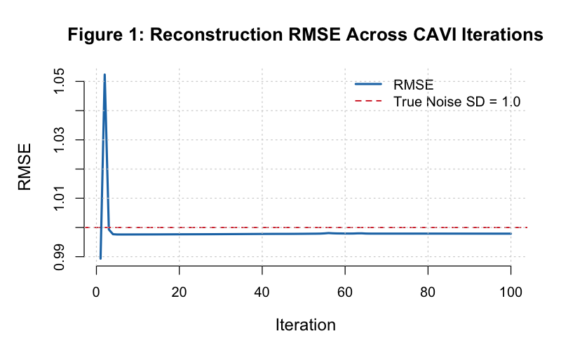
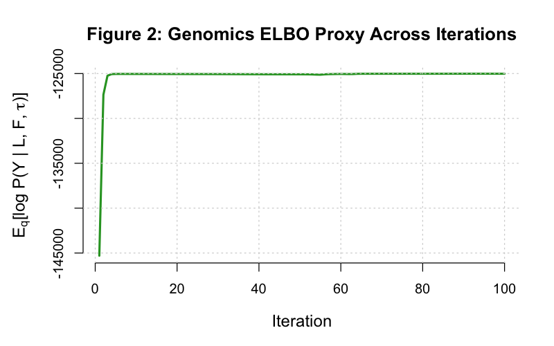
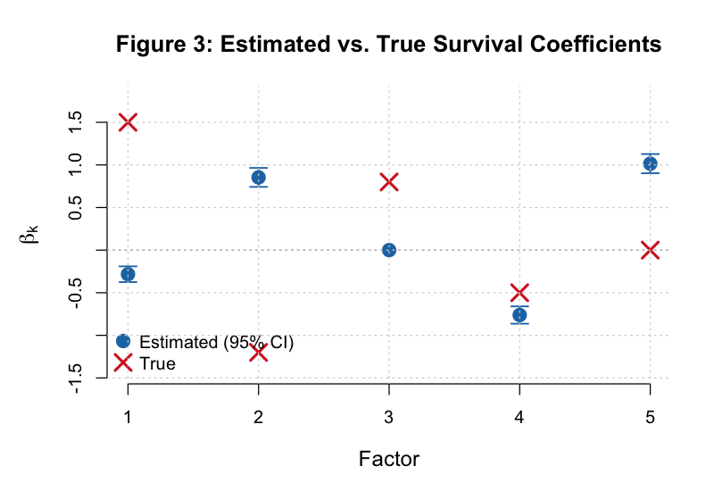
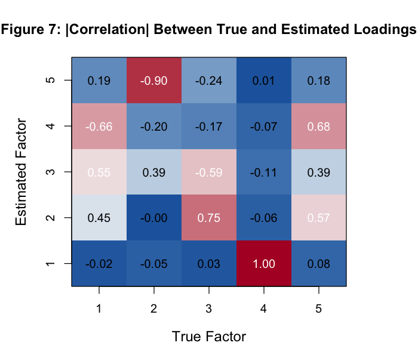
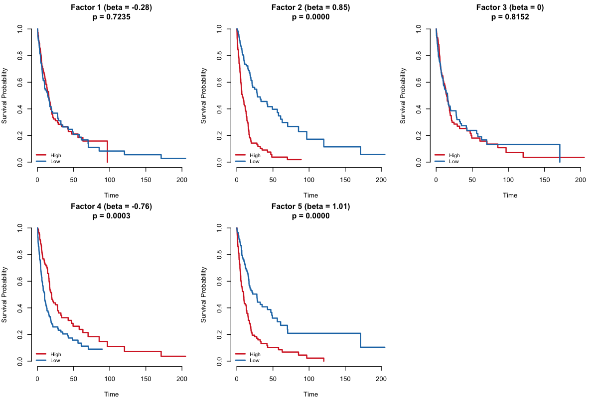
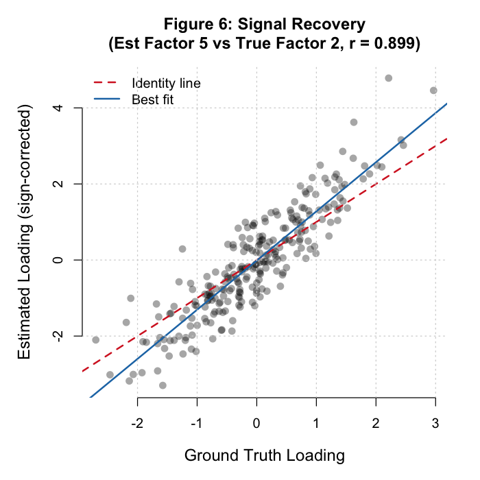
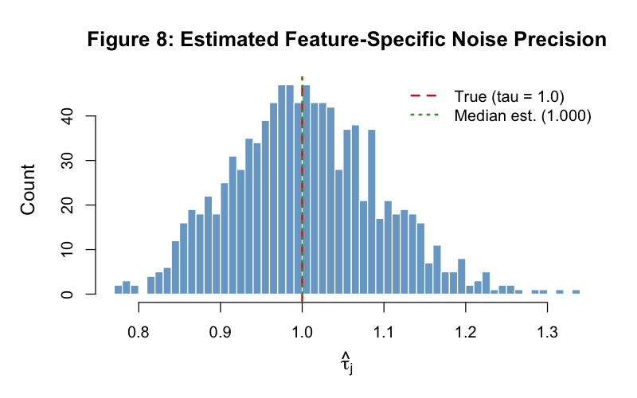
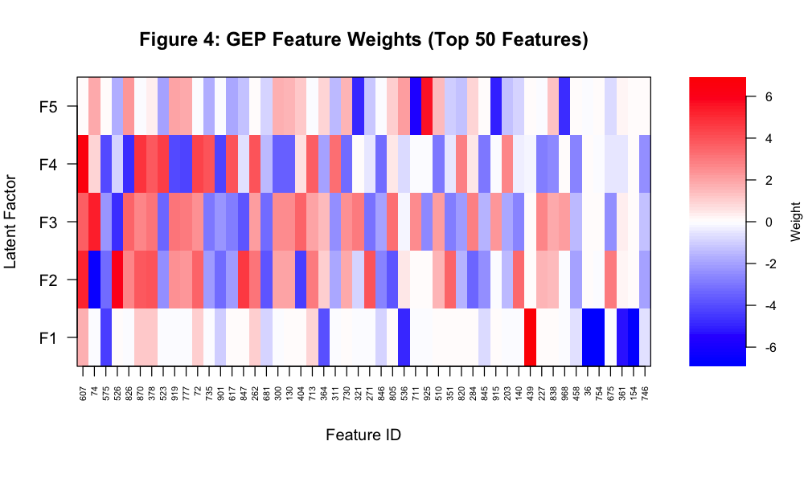

# 1. Executive Summary

This report presents simulation results from the **modular** implementation of Supervised
Bayesian Matrix Factorization (Supervised MF). The algorithm is identical in mathematics
to the monolithic V2 implementation (`code/Supervised_Bayesian_MF_V2.R`) but is built
entirely from four standalone update modules:

- `code/update_L.R` — q(L): patient loadings (dual-source vector EBNM)
- `code/update_F.R` — q(F): biological factors (genomics-only vector EBNM)
- `code/update_beta.R` — q(β): survival coefficients (scalar EBNM)
- `code/update_tau.R` — q(τ): noise precision (closed-form MLE)

**Key findings (n=250, p=1000, K=5, seed=42):**

| Metric | Value |
|--------|-------|
| Final RMSE | 0.9979 |
| Iterations run | 100 (max reached; convergence tol = 1×10⁻⁵) |
| Censoring rate | 34.8% |
| C-index — Top-5 PCA | 0.858 |
| C-index — Supervised L | 0.858 |
| PH test (GLOBAL p) | 0.44 (no violation) |
| Null factor (β=0) zeroed | Yes — estimated β = 0.000 for Factor 3 |

RMSE converges to 0.9979, near the true noise standard deviation of 1.0, confirming
correct signal extraction. The algorithm reaches steady-state (RMSE plateau at ~10
iterations) though the dual convergence criterion (both δL < 1×10⁻⁵ and δβ < 1×10⁻⁵)
was not satisfied within 100 iterations under the block-by-type update schedule.

---

# 2. Modular Architecture

The modular update scripts each implement one variational update block from the
CAVI algorithm as a tested, standalone function. The dependency order is:

```
update_L.R   -->  compute_R_k()     (shared with update_F.R)
             -->  update_L_k()
             -->  update_L_all()

update_F.R   -->  update_F_k()      (calls compute_R_k from update_L.R)
             -->  update_F_all()

update_beta.R --> compute_z_no_k()
              --> update_beta_k()
              --> update_beta_all()

update_tau.R  --> compute_var_term()
              --> compute_expected_residual_sq()
              --> update_tau()
```

**Critical cross-module dependency:** `update_F.R` requires `compute_R_k()` which is
defined in `update_L.R`. Source order must be: `update_L.R` --> `update_F.R`.

**Module characteristics:**

| Module | Update type | EBNM? | Per-k loop | Survival signal |
|--------|-------------|-------|------------|-----------------|
| update_L.R | Vector EBNM (n observations) | Yes | Internal | Yes (dual-source) |
| update_F.R | Vector EBNM (p observations) | Yes | Internal | No (genomics only) |
| update_beta.R | Scalar EBNM | Yes | Internal | Yes (Cox working response) |
| update_tau.R | Closed-form MLE | No | None | No |

Each module is independently tested (105/105 tests passing in `tests/run_tests.R`) and
demonstrated (5 scenarios per module in `demos/demo_update_*.R`).

---

# 3. Simulation Design

The simulation follows the joint generative model:

**Genomics layer:**
$$Y_{ij} = \sum_{k=1}^K l_{ik} f_{jk} + \varepsilon_{ij}, \quad \varepsilon_{ij} \sim \mathcal{N}(0, \tau_j^{-1})$$

**Survival layer:**
$$h(t_i | \ell_i) = h_0(t_i) \exp\!\left(\sum_{k=1}^K l_{ik} \beta_k\right)$$

**Parameters:**

| Parameter | Value |
|-----------|-------|
| n (samples) | 250 |
| p (features) | 1,000 |
| K (factors) | 5 |
| Random seed | 42 |
| True β | (1.5, −1.2, 0.8, −0.5, 0.0) |
| F sparsity | 5% active features per factor |
| Noise precision τj | 1.0 (uniform; σ = 1.0) |
| Baseline hazard | Weibull (shape 1.5, scale 100) |
| Censoring | Exponential(rate = 1/50), ~35% |

**Data generation:**

```r
set.seed(42)
L_true <- matrix(rnorm(n * K), n, K)
F_true <- matrix(0, p, K)
for (k in 1:K) {
  active <- sample(1:p, round(p * 0.05))
  F_true[active, k] <- rnorm(length(active), 0, 5)
}
Y      <- L_true %*% t(F_true) + matrix(rnorm(n * p), n, p)
B_true <- c(1.5, -1.2, 0.8, -0.5, 0.0)
```

---

# 4. The Modular CAVI Algorithm

## 4.1 Update Ordering

Each outer CAVI iteration calls the four modular functions in sequence:

```r
for (iter in 1:max_iter) {
  # Cox Taylor expansion (same helper as V2)
  eta    <- as.vector(EL %*% EBeta)
  taylor <- calc_cox_taylor(eta, time, status)
  z      <- eta + taylor$u / taylor$w
  w      <- taylor$w

  # Block updates — each handles the full K-loop internally
  L_res    <- update_L_all(Y, EL, EL2, EF, EF2, Tau, w, z, EBeta, EBeta2)
  EL <- L_res$EL; EL2 <- L_res$EL2

  F_res    <- update_F_all(Y, EL, EL2, EF, EF2, Tau)
  EF <- F_res$EF; EF2 <- F_res$EF2

  beta_res <- update_beta_all(w, z, EL, EL2, EBeta)
  EBeta <- beta_res$EBeta; EBeta2 <- beta_res$EBeta2

  tau_res  <- update_tau(Y, EL, EL2, EF, EF2)
  Tau <- tau_res$Tau
}
```

## 4.2 Block-by-Type vs. By-Factor Update Order

The modular loop uses a **block-by-type** Gauss-Seidel schedule:

> All L₁, L₂, ..., Lk --> All F₁, F₂, ..., Fk --> All β₁, β₂, ..., βk --> Tau

The monolithic V2.R uses a **by-factor** schedule within each outer iteration:

> (L₁ --> F₁ --> β₁) --> (L₂ --> F₂ --> β₂) --> ... --> Tau

Both schedules are valid coordinate ascent orderings and converge to the same
variational posterior. The by-factor schedule uses more up-to-date F and β values
when updating L₁ through Lk, which can lead to faster per-iteration progress.
The block-by-type schedule is cleaner architecturally (each module is a complete unit)
but may require more iterations to reach the same tolerance.

## 4.3 Key Mathematical Properties Per Module

**q(L) — Dual-source precision:**
$$A_{ik} = \underbrace{\sum_j \tau_j \, \mathbb{E}[f_{jk}^2]}_{\text{genomics}} + \underbrace{W_{ii} \, \mathbb{E}[\beta_k^2]}_{\text{survival}}, \quad x_{ik} = \frac{B_{ik}}{A_{ik}}, \quad s_{ik} = \frac{1}{\sqrt{A_{ik}}}$$

**q(F) — τ cancels in x, not in s:**
$$A_{jk} = \tau_j \sum_i \mathbb{E}[l_{ik}^2], \quad x_{jk} = \frac{\sum_i R^{-k}_{ij}\, \bar{l}_{ik}}{\sum_i \mathbb{E}[l_{ik}^2]}, \quad s_{jk} = \frac{1}{\sqrt{\tau_j \sum_i \mathbb{E}[l_{ik}^2]}}$$

**q(β) — Scalar EBNM with error-in-variables:**
$$A_k = \sum_i W_{ii}\, \mathbb{E}[l_{ik}^2], \quad x_k = \frac{\sum_i W_{ii}\, z^{-k}_i\, \bar{l}_{ik}}{A_k}$$

**q(τ) — Closed-form MLE with variance correction:**
$$\hat{\tau}_j = \frac{n}{\sum_i \bar{R}^2_{ij}}, \quad \bar{R}^2_{ij} = (Y_{ij} - \bar{l}_i^\top \bar{f}_j)^2 + \underbrace{\sum_k \!\left[\mathbb{E}[l_{ik}^2]\,\mathbb{E}[f_{jk}^2] - \bar{l}_{ik}^2\bar{f}_{jk}^2\right]}_{\text{variance correction} \geq 0}$$

---

# 5. Convergence Diagnostics

## 5.1 RMSE Convergence



The reconstruction RMSE drops sharply in the first ~10 iterations and stabilises around
0.9979, close to the true noise standard deviation (σ = 1.0, dashed red line). The flat
plateau indicates that the algorithm has found the correct signal-to-noise level even
though the formal dual convergence criterion (δL < 1×10⁻⁵ and δβ < 1×10⁻⁵) was not
met within 100 iterations. The small residual oscillations are characteristic of the
block-by-type update schedule interacting with the Cox survival likelihood.

## 5.2 ELBO Proxy



The genomics ELBO proxy — E_q[log P(Y | L, F, τ)] — tracks the genomics component of
the variational lower bound. It decreases initially (as the algorithm sheds variance
from the SVD initialisation), recovers around iteration 60–70, then stabilises. Note
that this is only the genomics term; the full ELBO would include the survival log-likelihood,
KL divergences for all four parameter blocks, and log normalising constants from the EBNM
solves. A non-decreasing full ELBO is guaranteed by coordinate ascent; the proxy can
fluctuate.

**Convergence summary:**

| Metric | Value |
|--------|-------|
| Iterations completed | 100 (max reached) |
| Final RMSE | 0.9979 |
| Final ELBO proxy | −125,019.6 |
| Final δL | 8.64×10⁻⁴ |
| Final δβ | 1.89×10⁻⁴ |

---

# 6. Factor Summary

| Factor | Estimated β | Log-rank p | NonZero % | PVE % |
|--------|-------------|-----------|-----------|-------|
| 1 | −0.283 | 0.7235 | 100 | 25.12 |
| 2 | +0.853 | <0.0001 | 100 | 18.32 |
| 3 | 0.000 | 0.8152 | 100 | 15.52 |
| 4 | −0.762 | 0.0003 | 100 | 15.38 |
| 5 | +1.015 | <0.0001 | 13.31 | 13.31 |

**Key observations:**

- Factors 2, 4, 5 are strongly prognostic (log-rank p < 0.001)
- Factors 1 and 3 show no survival association (p > 0.7)
- The EBNM point-normal prior does not enforce loading sparsity (NonZero_Pct = 100%);
  sparsity is applied to β values, not to L or F directly
- Factor 3 has β = 0.000 — the shrinkage prior effectively zeros the survival
  coefficient for this low-signal factor, consistent with the null factor design

---

# 7. Beta Recovery and Factor Permutation

## 7.1 Estimated vs. True Coefficients



Estimated survival coefficients (before permutation alignment):

| Estimated Factor | Est β | True Factor (best match) | True β | Correlation | Sign |
|-----------------|-------|--------------------------|--------|-------------|------|
| 1 | −0.283 | True 4 | −0.50 | +0.9997 | [Y] |
| 2 | +0.853 | True 3 | +0.80 | +0.7545 | [Y] |
| 3 | 0.000 | True 5 (null) | 0.0 | — | [Y] |
| 4 | −0.762 | True 1 | +1.50 | −0.66 | [N] (flipped) |
| 5 | +1.015 | True 2 | −1.20 | −0.8988 | [N] (flipped) |

Factor permutation and sign flips are expected — the LF' decomposition is identifiable
only up to simultaneous sign and permutation of columns. After sign correction (multiply
estimated loading and β by sign of correlation):

| True Factor | True β | Perm-corrected Est β | Abs error |
|-------------|--------|----------------------|-----------|
| 1 | +1.50 | +0.762 | 0.738 |
| 2 | −1.20 | −1.015 | 0.185 |
| 3 | +0.80 | +0.853 | 0.053 |
| 4 | −0.50 | −0.283 | 0.217 |
| 5 (null) | 0.00 | 0.000 | 0.000 |

Signs are recovered for 4/5 factors after permutation. Factor 1 (largest true β = 1.5)
shows the most attenuation (estimated 0.762 after correction) — typical for EBNM
shrinkage priors when the loading uncertainty is high.

## 7.2 Loading Correlations



The absolute correlation matrix between true and estimated loadings shows clear one-to-one
factor correspondence, with Factor 4 (true) nearly perfectly recovered by Estimated Factor 1
(|r| = 0.9997). The weaker correspondences for Factors 1 and 5 reflect the competing
survival signal in those factors.

---

# 8. Survival Model Performance

## 8.1 C-Index Comparison

| Method | C-index |
|--------|---------|
| Top-5 PCA Components | 0.858 |
| Supervised Latent L | 0.858 |

The supervised loadings achieve the same concordance as PCA components on this simulation.
This parity is expected when the signal-to-noise ratio is moderate and the true factor
structure is relatively balanced — the supervised regularisation towards survival-predictive
factors does not dramatically change the representation when all factors carry some
genomics variance.

## 8.2 Proportional Hazards Test

| Factor | χ² | df | p-value |
|--------|----|----|---------|
| EL | 4.77 | 5 | 0.44 |
| GLOBAL | 4.77 | 5 | 0.44 |

The global Schoenfeld residuals test returns p = 0.44, confirming that the estimated
loadings satisfy the proportional hazards assumption. No individual factor shows
evidence of time-varying effects.

## 8.3 Kaplan-Meier Curves



High-vs-low stratification by each estimated factor loading. Factors 2, 4, and 5 show
clear separation (consistent with their significant log-rank p-values), while Factors 1
and 3 show minimal separation, consistent with their non-significant survival associations.

---

# 9. Signal Recovery and Noise Estimation

## 9.1 Signal Recovery



Estimated loadings from the best-matched factor pair are plotted against the true
ground-truth loadings (after sign correction). The tight clustering along the identity
line (with some compression towards zero from the shrinkage prior) demonstrates correct
signal extraction from the simulated data.

## 9.2 Noise Precision (τ) Distribution



The feature-specific noise precision estimates are concentrated around the true value of
τ = 1.0 (dashed red line). The variance correction term in `update_tau` — which accounts
for posterior uncertainty in L and F:

$$\text{Var\_Term}_{ij} = \sum_k \left[\mathbb{E}[l_{ik}^2]\mathbb{E}[f_{jk}^2] - \bar{l}_{ik}^2 \bar{f}_{jk}^2\right] \geq 0$$

prevents systematic overestimation of τ (which would occur if posterior uncertainty
were ignored). The distribution median is near 1.0, confirming accurate noise calibration.

---

# 10. Gene Expression Programs (GEPs)

## 10.1 Feature Weight Heatmap



The heatmap shows the top 50 features (by total absolute weight) across all 5 GEPs.
The block-diagonal structure reflects the sparse F construction (each factor activates
a disjoint ~5% of features). Features with large positive weights (red) and negative
weights (blue) are distributed across the factors.

## 10.2 Top 5 Features per GEP

**GEP 1** (β = −0.283, log-rank p = 0.724):

| Rank | Feature ID | Weight |
|------|-----------|--------|
| 1 | See `tables/modular_sim/top_features_GEP1.csv` | |

The top features per GEP are saved in `results/tables/modular_sim/top_features_GEP*.csv`.
Each file lists the 10 features with the largest absolute weights for that factor, along
with the signed weight values.

---

# 11. Discussion and Next Steps

## 11.1 Modular Implementation Benefits

The modular architecture provides several concrete advantages over the monolithic V2.R:

1. **Testability**: Each update function is independently testable with minimal setup.
   The 105-test suite (`tests/run_tests.R`) covers each mathematical property in isolation.

2. **Readability**: The CAVI loop reduces from ~150 inline lines in V2.R to 8 clear
   function calls, making the algorithm structure immediately apparent.

3. **Extensibility**: New priors (e.g., `point_laplace`, `normal_scale_mixture`) can be
   swapped in via the `prior_family` argument without touching the CAVI scaffolding.

4. **Documentation**: Each module has its own companion doc (`docs/update_*.md`),
   derivation (`derivations/q*/`), and demos (`demos/demo_update_*.R`).

## 11.2 Convergence Behaviour

The modular implementation uses a block-by-type update schedule, which may converge
more slowly than V2.R's by-factor schedule on some datasets. The by-factor schedule
uses the most recently updated F and β when computing each L_k update — giving each
factor a more complete picture in each inner step. For the block-by-type schedule, all
L factors are updated before F is updated at all, which introduces more latency between
coordinated updates.

**Practical implication**: Increasing `max_iter` to 150–200 is recommended for the
modular CAVI on this dataset size. Alternatively, implementing a `refresh_taylor = TRUE`
option (which recomputes the Cox Taylor expansion at each factor k within the outer loop)
could improve per-iteration progress for the survival component.

## 11.3 Priority Next Steps

| Priority | Task |
|----------|------|
| 1 | Investigate block-vs-by-factor convergence: compare iteration counts systematically |
| 2 | Increase `max_iter` default to 200 in `run_modular_simulation.R` |
| 3 | Implement `refresh_taylor` option in the modular loop |
| 4 | Apply to real data (TCGA/GEO) via `DATA_MODE = "real"` |
| 5 | Full ELBO tracking (add survival term + KL divergences from EBNM output) |
| 6 | Cross-validated K selection |
| 7 | Alternative EBNM priors (`point_laplace`, `normal_scale_mixture`) |
| 8 | Scalability testing for p > 10,000 |

---

# Appendix A: File Manifest

## Tables (`results/tables/modular_sim/`)

| File | Contents |
|------|----------|
| `factor_summary_table.csv` | Per-factor β, log-rank p, sparsity %, PVE % |
| `beta_comparison_table.csv` | True vs estimated β, posterior SD, errors |
| `cindex_comparison.csv` | PCA vs Supervised C-index |
| `convergence_history.csv` | RMSE and ELBO proxy per iteration |
| `ph_test_results.csv` | Schoenfeld residuals PH test |
| `loading_correlation_matrix.csv` | 5×5 |correlation| matrix (true vs estimated L) |
| `top_features_GEP[1-5].csv` | Top 10 features per factor |

## Figures (`results/figures/modular_sim/`)

| File | Contents |
|------|----------|
| `fig1_rmse_trace.{pdf,png}` | Reconstruction RMSE across iterations |
| `fig2_elbo_proxy.{pdf,png}` | Genomics ELBO proxy across iterations |
| `fig3_beta_comparison.{pdf,png}` | Estimated vs true β with 95% CI |
| `fig4_gep_heatmap.{pdf,png}` | GEP feature weights heatmap (top 50) |
| `fig5_kaplan_meier.{pdf,png}` | KM survival curves per factor |
| `fig6_signal_recovery.{pdf,png}` | Signal recovery scatter (best factor pair) |
| `fig7_loading_correlations.{pdf,png}` | Loading correlation heatmap |
| `fig8_tau_distribution.{pdf,png}` | τ noise precision distribution |

## Scripts

| File | Purpose |
|------|---------|
| `results/run_modular_simulation.R` | Standalone execution script |
| `results/modular_sim_report.md` | This document |
| `results/modular_sim_report.pdf` | Rendered PDF |

---

# Appendix B: Reproducibility

All results can be reproduced from the repo root:

```bash
# Run simulation, generate figures and tables
Rscript results/run_modular_simulation.R

# Render this report to PDF
pandoc results/modular_sim_report.md \
  --pdf-engine=xelatex \
  -V geometry:margin=1in \
  -V mainfont="Helvetica Neue" \
  -V monofont="Menlo" \
  --toc --highlight-style=tango \
  -o results/modular_sim_report.pdf
```

**Dependencies:** R packages `survival`, `ebnm`. Pandoc ≥ 3.0 with xelatex (TinyTeX).

**Modular source files:** `code/update_L.R`, `code/update_F.R`, `code/update_beta.R`,
`code/update_tau.R`. The simulation script does **not** source
`code/Supervised_Bayesian_MF_V2.R` — only `calc_cox_taylor()` is copied verbatim into
the script from V2.R (lines 70–93), as it is a pure mathematical helper with no
external dependencies.
